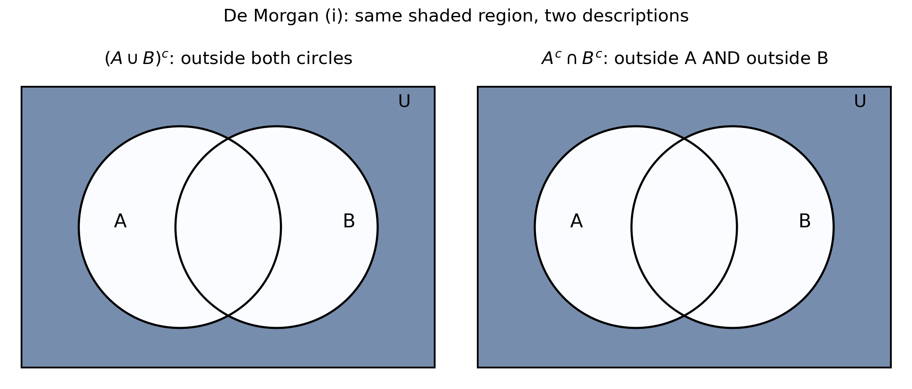
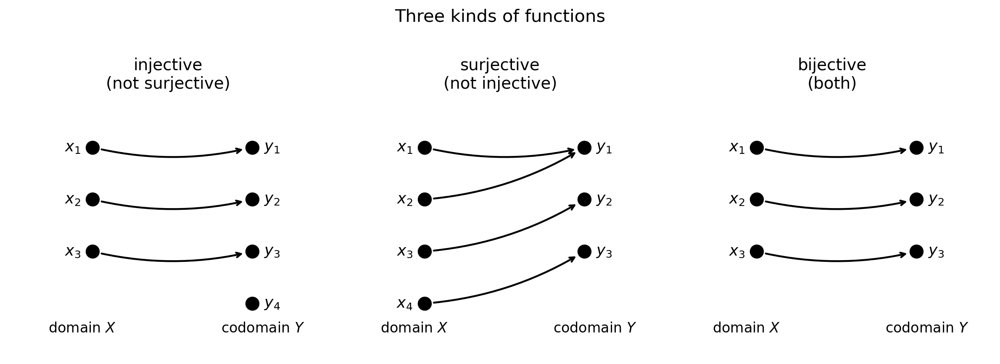

# Chapter 1 — Sets, functions, and mathematical preliminaries

## 1.1 What this chapter is for

Everything in this book is built out of two things: $sets$ of numbers and $functions$ that map one set to another.

- A dataset is a $set$ of points, each point living in $\mathbb{R}^d$ (a $d$-dimensional vector).
- A model is a $function$ $f: \mathbb{R}^d \to \mathbb{R}$: it takes a data point and returns a prediction.
- A loss is also a $function$: it takes the model's parameters and returns one real number measuring how bad the model is. Training a model means minimizing that function.
- The sentences in later chapters ("for every $\epsilon > 0$ there exists...", "if $f$ is differentiable then...") are written in the $logic$ of $quantifiers$ and $implications$ covered at the end of this chapter.

So this chapter collects the vocabulary the rest of the book speaks. Nothing here is decoration; every idea below is used again.

## 1.2 The number sets and intervals

**Def.** The standard $number$ $sets$ are:

$$\mathbb{N} = \{0, 1, 2, 3, \dots\} \quad \text{(natural numbers, includes 0)}$$

$$\mathbb{Z} = \{\dots, -2, -1, 0, 1, 2, \dots\} \quad \text{(integers)}$$

$$\mathbb{Q} = \left\{\frac{p}{q} : p, q \in \mathbb{Z},\ q \ne 0\right\} \quad \text{(rational numbers)}$$

$$\mathbb{R} = \text{all rationals plus irrationals like } \sqrt{2}, \pi \quad \text{(real numbers)}$$

They nest inside each other:

$$\mathbb{N} \subseteq \mathbb{Z} \subseteq \mathbb{Q} \subseteq \mathbb{R}.$$

Two more sets appear constantly in ML (this book follows the MLF convention):

- $\mathbb{R}_+ = \{x \in \mathbb{R} : x \ge 0\}$, the non-negative reals (note: $0$ is included).
- $\mathbb{Z}_+ = \{0, 1, 2, \dots\}$, the non-negative integers.

Note: In this book $\mathbb{R}_+$ and $\mathbb{Z}_+$ include $0$. Some other books exclude it; watch for that when reading elsewhere.

Intervals carve out pieces of $\mathbb{R}$:

- $Closed$ $interval$: $[a, b] = \{x \in \mathbb{R} : a \le x \le b\}$ — endpoints included.
- $Open$ $interval$: $(a, b) = \{x \in \mathbb{R} : a < x < b\}$ — endpoints excluded.

Square brackets $[\ ]$ mean "include the endpoint"; round brackets $(\ )$ mean "exclude it".

**Basically, ...** $\mathbb{R}$ is the whole number line. An interval is just a segment of that line, and the bracket style tells you whether the cut points themselves are in the segment.

## 1.3 Sets: elements, cardinality, subsets

**Def.** A $set$ = a collection of well-defined items. The items are called $elements$.

- Write $x \in S$ for "$x$ is an element of $S$".
- $Order$ does not matter: $\{1, 2, 3\} = \{3, 1, 2\}$.
- $Duplicates$ do not matter: $\{1, 1, 2\} = \{1, 2\}$.

**Def.** The $cardinality$ of a set $S$, written $|S|$, = the number of elements in $S$.

i) $S = \{1, 2, 5, 7, 9, 300\}$ has $|S| = 6$.
ii) $A = \{\text{Srikanth}, \text{Keerthana}, \text{Balloon}, \text{Cell phone}, \pi\}$ has $|A| = 5$.

**Def.** $X$ is a $subset$ of $Y$, written $X \subseteq Y$, = every element of $X$ is also an element of $Y$.

i) $\{1, 2, 5\} \subseteq \{0, 1, 2, 5, 7\}$.
ii) $\mathbb{N} \subseteq \mathbb{Z} \subseteq \mathbb{Q} \subseteq \mathbb{R}$.

**Def.** $X$ is a $proper$ $subset$ of $Y$, written $X \subset Y$, = $X \subseteq Y$ but $X \ne Y$.

i) $\{1, 2, 5\} \subset \{0, 1, 2, 5, 7\}$ (the second set has extra elements).
ii) $\{4, 16, 32, 64\}$ is **not** a proper subset of $\{64, 16, 32, 4\}$ — the two sets are equal.

**Basically, ...** A set is a bag of distinct things. A subset is a smaller bag whose contents all came from the bigger bag. "Proper" just means strictly smaller.

## 1.4 Building sets: set-builder notation

Instead of listing elements, describe the rule that picks them:

$$\{x \in S : \text{condition on } x\} = \text{"all } x \text{ in } S \text{ satisfying the condition"}.$$

i) $\{x \in \mathbb{R} : a \le x \le b\}$ is the closed interval $[a, b]$.
ii) $\{x \in \mathbb{R}^d : x_i \in [a, b] \text{ for all } i = 1, \dots, d\}$ is the $d$-dimensional box $[a, b]^d$.

Read "$:$" or "$\mid$" as "such that". This is how almost every set in this book is written, so get comfortable reading it left to right: "the set of all $x$ in $S$ such that ...".

**Basically, ...** Listing $\{2, 4, 6, 8, \dots\}$ gets old fast. Set-builder notation says the recipe instead of the ingredients: "all $x$ from here that pass this test".

## 1.5 Set operations, Venn diagrams, De Morgan

Fix a $universe$ $U$: the big set everything lives in. For sets $A, B \subseteq U$:

- $Union$: $A \cup B = \{x : x \in A \text{ or } x \in B\}$ — elements in either.
- $Intersection$: $A \cap B = \{x : x \in A \text{ and } x \in B\}$ — elements in both.
- $Complement$: $A^c = \{x \in U : x \notin A\}$ — everything in the universe except $A$. Also written $U \setminus A$.
- $Set$ $difference$: $A \setminus B = \{x : x \in A \text{ and } x \notin B\}$.

A $Venn$ $diagram$ draws sets as overlapping regions inside a rectangle (the universe). Shading a region shows which set an expression describes. Two expressions that shade the same region are the same set — this is how you check identities visually.

The two big identities are $De$ $Morgan's$ $laws$:

$$(A \cup B)^c = A^c \cap B^c \qquad\text{and}\qquad (A \cap B)^c = A^c \cup B^c.$$

In words: "not in (either one)" is the same as "in neither one"; "not in (both)" is the same as "missing from at least one". The Venn picture below shows the first law: both sides shade exactly the region outside both circles.

<!-- Source: original illustration drawn for this chapter with matplotlib; no external source -->

**Basically, ...** De Morgan is about flipping "and/or" when a "not" passes through. "NOT (tall AND dark)" = "short OR light". Same flip works for sets.

## 1.6 Cartesian products and relations

**Def.** The $Cartesian$ $product$ of non-empty sets $X$ and $Y$ is

$$X \times Y = \{(x, y) : x \in X,\ y \in Y\},$$

the set of all $ordered$ $pairs$. Order matters: $(a, 1) \ne (1, a)$.

i) If $A = \{a, b\}$ and $B = \{1, 2, 3\}$, then $A \times B = \{(a,1), (a,2), (a,3), (b,1), (b,2), (b,3)\}$.
ii) $\mathbb{R}^d = \underbrace{\mathbb{R} \times \cdots \times \mathbb{R}}_{d \text{ times}}$ is the set of $d$-dimensional vectors; e.g. $(1, 2, 3.3) \in \mathbb{R}^3$.

**Def.** A $relation$ $R$ between $X$ and $Y$ = any collection of ordered pairs with one element from each set, i.e. $R \subseteq X \times Y$.

i) With $A, B$ as above, $R_1 = \{(a,1), (b,2), (b,3)\}$, $R_2 = \{(a,2), (b,1)\}$ are relations from $A$ to $B$.

A relation is just "some arrows drawn from $X$ to $Y$" — possibly several arrows out of one element, possibly none. Functions (next section) are the special relations with exactly one arrow per element.

**Basically, ...** $X \times Y$ is every possible pairing of an $x$ with a $y$ — the full menu. A relation is whatever subset of that menu you actually choose.

Relations on a single set $S$ (so $R \subseteq S \times S$) can have three useful $properties$:

- $Reflexive$: every element relates to itself: $(x, x) \in R$ for all $x \in S$.
- $Symmetric$: arrows go both ways: $(x, y) \in R \Rightarrow (y, x) \in R$.
- $Transitive$: arrows chain: $(x, y) \in R$ and $(y, z) \in R \Rightarrow (x, z) \in R$.

**Def.** An $equivalence$ $relation$ = a relation that is reflexive, symmetric, and transitive.

**Basically, ...** An equivalence relation is a mathematically strict way of saying "these things are the same for our purposes" — it groups elements into clumps where everything in a clump is mutually interchangeable. (Equality itself is the model example.)

## 1.7 Functions: the core definition

**Def.** A $function$ $f: X \to Y$ = a rule assigning to each $x \in X$ exactly one $y \in Y$.

Three names, never mix them up:

- $Domain$ = the set of allowed inputs ($X$).
- $Codomain$ = the set of possible outputs ($Y$) — declared up front.
- $Range$ = the outputs that actually occur: $\{f(x) : x \in X\}$ — always a subset of the codomain.

As a relation: a function is a relation with no two pairs sharing the same first element.

The $graph$ of $f: \mathbb{R}^d \to \mathbb{R}$ is the set $G_f = \{(x, f(x)) : x \in \mathbb{R}^d\}$ — input glued to its output. For $d = 1$ this is the familiar curve in the plane.

$Vertical$ $line$ $test$: a curve in the plane is the graph of a function iff every vertical line meets it at most once. (Two hits = one input with two outputs = not a function.)

**Basically, ...** A function is a machine with one input slot and one output slot: every input you are allowed to feed it produces exactly one output. Domain = what you may feed it; range = what can come out.

## 1.8 Three important kinds of functions

**Def.** Let $f: X \to Y$.

- $Injective$ ($one$-$one$): different inputs give different outputs. Formally, $f(x_1) = f(x_2) \Rightarrow x_1 = x_2$.
- $Surjective$ ($onto$): every $y \in Y$ gets hit, i.e. $range = codomain$.
- $Bijective$: both injective and surjective — a perfect one-to-one pairing.

<!-- Source: original illustration drawn for this chapter with matplotlib; no external source -->

$Horizontal$ $line$ $test$: $f$ is one-one iff every horizontal line meets its graph at most once.

One handy fact: a $strictly$ $increasing$ $function$ ($x_1 < x_2 \Rightarrow f(x_1) < f(x_2)$) or a $strictly$ $decreasing$ $function$ ($x_1 < x_2 \Rightarrow f(x_1) > f(x_2)$) is always one-one: it never takes the same value twice, so distinct inputs always give distinct outputs.

Note: the non-strict "$\le$" versions of these definitions allow flat stretches — a constant function satisfies $x_1 \le x_2 \Rightarrow f(x_1) \le f(x_2)$ but is not one-one. Strictness is what rules out repeats.

Note: "one-one" and "injective" mean the same thing; "onto" and "surjective" mean the same thing.

**Basically, ...** Injective = no two inputs share an output (no collisions). Surjective = no output is left unused (full coverage). Bijective = perfect pairing, every input matched to a unique output and nothing left over.

## 1.9 Composition of functions

**Def.** The $composition$ $f \circ g$ = "apply $g$ first, then $f$":

$$(f \circ g)(x) = f(g(x)).$$

Read $f \circ g$ as "$f$ after $g$". Order matters: $f \circ g$ and $g \circ f$ are usually different functions.

$Domain$ $rules$ (both must hold for $x$ to be allowed into $f \circ g$):

i) $x$ is in the domain of $g$;
ii) $g(x)$ is in the domain of $f$.

ML pointer: a neural network is a long composition $f_3 \circ f_2 \circ f_1$ of simple functions (layers). Every "stack" you meet later is composition wearing a costume.

**Basically, ...** Composition is piping: the output of one machine becomes the input of the next. If the first machine's output doesn't fit the second machine's input slot, the pipe is broken there.

## 1.10 Inverse functions

**Def.** If $f$ is one-one, its $inverse$ $f^{-1}$ = the function that undoes it:

$$f^{-1}(f(x)) = x \quad \text{for all } x \in \text{domain}(f),$$
$$f(f^{-1}(y)) = y \quad \text{for all } y \in \text{range}(f).$$

So $f^{-1}$ exists exactly when $f$ is one-one (a bijection between its domain and its range).

Three warnings:

i) $f^{-1} \ne \frac{1}{f}$. The "$-1$" is not an exponent; it means "undo".
ii) The domain of $f^{-1}$ is the range of $f$, and the range of $f^{-1}$ is the domain of $f$ — inputs and outputs swap.
iii) The graph of $f^{-1}$ is the mirror image of the graph of $f$ across the line $y = x$: a point $(a, f(a))$ on $f$ becomes $(f(a), a)$ on $f^{-1}$.

**Basically, ...** The inverse is the "reverse gear" of a function: it takes you from output back to the input that produced it. Reverse gear only exists if the function never merged two different inputs into one output (one-one) — otherwise reversing is ambiguous.

## 1.11 Logic: quantifiers, implies, equivalent

Later chapters state definitions and theorems in a compressed logical shorthand. Four symbols do most of the work:

| Symbol | Read as | Meaning |
|---|---|---|
| $\forall$ | "for all" | the claim holds for every element |
| $\exists$ | "there exists" | the claim holds for at least one element |
| $\Rightarrow$ | "implies" | if the left side is true, the right side must be true |
| $\Leftrightarrow$ | "is equivalent to" | each side implies the other |

Examples:

i) $\forall x \in \mathbb{R},\ x^2 \ge 0$ reads "for all real $x$, $x^2$ is non-negative".
ii) $\exists n \in \mathbb{N}$ such that $n > 100$ reads "there exists a natural number bigger than 100" (e.g. $n = 101$).
iii) $x > 2 \Rightarrow x > 1$: being bigger than 2 implies being bigger than 1. (The reverse implication is false.)
iv) $x \in A \cap B \Leftrightarrow (x \in A \text{ and } x \in B)$: the two sides say exactly the same thing.

Note: "$\Rightarrow$" is one-directional; "$\Leftrightarrow$" is both directions at once. Confusing them is one of the most common reading errors in math — always check which arrow is meant.

**Basically, ...** $\forall$ = "every single one, no exceptions". $\exists$ = "at least one exists somewhere". $\Rightarrow$ = "this forces that". $\Leftrightarrow$ = "these are two names for the same fact".

## 1.12 A note on proof techniques (not covered here)

You will sometimes see the words $direct$ $proof$, $proof$ $by$ $contrapositive$, $proof$ $by$ $contradiction$, and $proof$ $by$ $induction$ named in mathematical writing. This chapter deliberately does not teach them: the source materials for this chapter (Maths 1 Vol. 1; MLF Week 2) do not develop proof techniques, and this book does not invent content its sources lack. Wherever a later chapter needs a proof idea, it will be introduced at the point of use.

## 1.13 Worked example set

**eg 1 — Subsets and cardinality.**
Let $A = \{2, 4, 6, 8\}$ and $B = \{1, 2, 3, 4, 5, 6, 7, 8\}$.

Step 1: Check every element of $A$: $2 \in B$, $4 \in B$, $6 \in B$, $8 \in B$. So $A \subseteq B$.

Step 2: Is $A = B$? No — e.g. $1 \in B$ but $1 \notin A$. So $A \subset B$ (proper).

Step 3: $|A| = 4$, $|B| = 8$.

**eg 2 — Union and intersection of intervals.**
Let $A = [2, 5]$ and $B = [4, 7]$.

$A \cup B$: $x$ is in $A$ or in $B$, i.e. $2 \le x \le 5$ or $4 \le x \le 7$. Since the intervals overlap ($4 \le 5$), together they cover $2 \le x \le 7$. So $A \cup B = [2, 7]$.

$A \cap B$: $x$ is in both, i.e. $2 \le x \le 5$ and $4 \le x \le 7$. Both hold exactly when $4 \le x \le 5$. So $A \cap B = [4, 5]$.

**eg 3 — Verify De Morgan's first law with intervals.**
Take universe $U = [0, 10]$, $A = [2, 5]$, $B = [4, 7]$.

Left side: $(A \cup B)^c$. From eg 2, $A \cup B = [2, 7]$. Removing $[2, 7]$ from $[0, 10]$ leaves $[0, 2) \cup (7, 10]$. (The endpoints 2 and 7 are excluded because they belong to $A \cup B$.)

Right side: $A^c \cap B^c$.

$A^c = [0, 2) \cup (5, 10]$ (everything in $[0,10]$ except $[2,5]$).

$B^c = [0, 4) \cup (7, 10]$ (everything in $[0,10]$ except $[4,7]$).

Intersect: $x$ must be in both. Below 2: $[0, 2)$ qualifies for both. Between 2 and 4: in $B^c$ but not in $A^c$. Between 4 and 5: in neither. Between 5 and 7: in $A^c$ but not in $B^c$. Above 7: $(7, 10]$ qualifies for both. So $A^c \cap B^c = [0, 2) \cup (7, 10]$.

Both sides equal $[0, 2) \cup (7, 10]$. Verified.

**eg 4 — Relation vs function.**
Let $X = \{a, b\}$, $Y = \{1, 2, 3\}$. Then $X \times Y = \{(a,1), (a,2), (a,3), (b,1), (b,2), (b,3)\}$.

Consider $R_1 = \{(a, 1), (b, 2), (b, 3)\}$ and $R_2 = \{(a, 1), (a, 2)\}$.

$R_1$: $b$ is paired with two different outputs ($2$ and $3$), so $R_1$ is **not** a function.

$R_2$: $a$ is paired with two different outputs ($1$ and $2$), so $R_2$ is **not** a function either.

Take instead $R_3 = \{(a, 1), (b, 2)\}$: each of $a, b$ appears exactly once as a first element. So $R_3$ **is** a function, with domain $\{a, b\}$ and range $\{1, 2\}$.

**eg 5 — Checking relation properties.**
On $S = \{1, 2, 3\}$, let $R = \{(1,1), (2,2), (3,3), (1,2), (2,1)\}$.

Reflexive? Need $(1,1), (2,2), (3,3)$ — all present. Yes.

Symmetric? Check each pair: $(1,2) \in R$ and $(2,1) \in R$. Diagonals are symmetric with themselves. Yes.

Transitive? Check all chains: $(1,2), (2,1) \in R \Rightarrow$ need $(1,1) \in R$ — present. $(2,1), (1,2) \in R \Rightarrow$ need $(2,2) \in R$ — present. All other chains involve only diagonals. Yes.

Reflexive + symmetric + transitive $\Rightarrow$ $R$ is an equivalence relation.

**eg 6 — Domain and range; a non-surjective function.**
Let $f: \mathbb{R} \to \mathbb{R}$, $f(x) = x^2$.

Range: $x^2 \ge 0$ for all real $x$, and every $y \ge 0$ is hit (take $x = \sqrt{y}$). So range $= [0, \infty)$.

Surjective? Codomain is $\mathbb{R}$ but range is $[0, \infty) \ne \mathbb{R}$ (e.g. $-1$ is never hit). So $f$ is **not** surjective.

Injective? $f(2) = 4 = f(-2)$ but $2 \ne -2$. So $f$ is **not** injective either.

**eg 7 — Classifying three functions.**
i) $f: \mathbb{R} \to \mathbb{R}$, $f(x) = 2x + 1$.

Injective: $f(x_1) = f(x_2) \Rightarrow 2x_1 + 1 = 2x_2 + 1 \Rightarrow x_1 = x_2$. Yes.

Surjective: for any $y \in \mathbb{R}$, take $x = \frac{y-1}{2}$; then $f(x) = y$. Yes. So $f$ is bijective.

ii) $f: \mathbb{R} \to \mathbb{R}$, $f(x) = x^2$. Neither injective nor surjective (eg 6).

iii) $f: \mathbb{R} \to \mathbb{R}$, $f(x) = x^3$.

Injective: $f$ is strictly increasing ($x_1 < x_2 \Rightarrow x_1^3 < x_2^3$), and an increasing function is one-one. Yes.

Surjective: for any $y \in \mathbb{R}$, $x = y^{1/3} \in \mathbb{R}$ satisfies $f(x) = y$. Yes. So $f$ is bijective.

**eg 8 — Composition, both orders.**
Let $f(x) = 3x - 4$ and $g(x) = x^2$.

$(f \circ g)(x) = f(g(x)) = f(x^2) = 3x^2 - 4$.

$(g \circ f)(x) = g(f(x)) = g(3x - 4) = (3x - 4)^2 = 9x^2 - 24x + 16$.

Note $(f \circ g)(x) \ne (g \circ f)(x)$ — order matters.

**eg 9 — Domain of a composition.**
Let $f(x) = \frac{3}{x - 1}$ and $g(x) = \frac{3}{x}$.

Step 1: $(f \circ g)(x) = f(g(x)) = \frac{3}{g(x) - 1} = \frac{3}{\frac{3}{x} - 1} = \frac{3x}{3 - x}$.

Step 2: Domain rule i): $x$ must be in domain($g$), so $x \ne 0$.

Step 3: Domain rule ii): $g(x)$ must be in domain($f$), i.e. $g(x) \ne 1$, so $\frac{3}{x} \ne 1$, giving $x \ne 3$.

Step 4: Domain of $f \circ g$ is $\mathbb{R} \setminus \{0, 3\}$.

**eg 10 — Finding and verifying an inverse.**
Let $f: \mathbb{R} \to \mathbb{R}$, $f(x) = 2x + 3$. (Increasing, hence one-one, so $f^{-1}$ exists.)

Step 1: Set $y = 2x + 3$ and solve for $x$: $x = \frac{y - 3}{2}$. So $f^{-1}(y) = \frac{y - 3}{2}$, i.e. $f^{-1}(x) = \frac{x - 3}{2}$.

Step 2: Verify $f^{-1}(f(x)) = \frac{(2x + 3) - 3}{2} = \frac{2x}{2} = x$. ✓

Step 3: Verify $f(f^{-1}(x)) = 2\left(\frac{x - 3}{2}\right) + 3 = (x - 3) + 3 = x$. ✓

**eg 11 — Reading quantifier statements.**
i) "$\forall x \in \mathbb{R},\ x^2 \ge 0$" reads: "for every real number $x$, $x^2$ is at least 0." (True.)

ii) Formalize "some natural number exceeds 100": $\exists n \in \mathbb{N}$ such that $n > 100$. (True: $n = 101$ works.)

iii) "$x \in A \cap B \Leftrightarrow x \in A$ and $x \in B$" reads: "$x$ is in the intersection exactly when $x$ is in $A$ and also in $B$." The $\Leftrightarrow$ says the two sides are interchangeable.

## 1.14 Problem set

Full worked solutions are in the companion solutions volume (`solutions/01-sets-functions-preliminaries.md`).

1. Let $A = \{x \in \mathbb{N} : x < 5\}$. List the elements of $A$ and give $|A|$.
2. Decide whether each statement is true or false, with one line of justification:
   i) $\{4, 16\} \subseteq \{16, 4, 32\}$;
   ii) $\{4, 16\} \subset \{16, 4\}$;
   iii) $\{4, 16, 32\} \subset \{16, 4, 32\}$.
3. Take universe $U = [0, 10]$, $A = [2, 5]$, $B = [4, 7]$. Compute $A \cap B$, $A^c$, and $B^c$, and use them to verify De Morgan's second law $(A \cap B)^c = A^c \cup B^c$.
4. Let $A = \{1, 2\}$ and $B = \{x, y\}$. List all elements of $A \times B$ and count them.
5. Let $X = \{1, 2, 3\}$, $Y = \{2, 3\}$, $R_1 = \{(1, 2), (2, 3), (3, 3)\}$, $R_2 = \{(1, 2), (1, 3), (2, 2)\}$.
   i) Which of $R_1, R_2$ is a function from $X$ to $Y$? Why does the other fail?
   ii) For the one that is a function, state its domain and its range.
6. For each function, decide injective / surjective / bijective / neither:
   i) $f: \mathbb{R} \to \mathbb{R}$, $f(x) = x^2 + 1$;
   ii) $f: \mathbb{R} \to \mathbb{R}$, $f(x) = 5x - 7$;
   iii) $f: \mathbb{N} \to \mathbb{N}$, $f(n) = n + 1$.
7. Find the domain of each (as a subset of $\mathbb{R}$):
   i) $f(x) = \dfrac{1}{x - 2}$;
   ii) $g(x) = \sqrt{x + 1}$;
   iii) $h(x) = \dfrac{1}{\sqrt{x - 1}}$.
8. Let $f(x) = x + 1$ and $g(x) = 2x$. Find $(f \circ g)(x)$, $(g \circ f)(x)$, and $(f \circ f)(x)$. Are any two of them equal?
9. Let $f(x) = \sqrt{x}$ and $g(x) = x - 5$. Find $(f \circ g)(x)$ and its domain, checking both domain rules.
10. Let $f: \mathbb{R} \to \mathbb{R}$, $f(x) = \dfrac{x + 1}{3}$. Find $f^{-1}$ and verify both $f^{-1}(f(x)) = x$ and $f(f^{-1}(x)) = x$.
11. On $S = \{1, 2, 3\}$, let $R = \{(1,1), (2,2), (3,3), (1,3), (3,1)\}$. Is $R$ reflexive? Symmetric? Transitive? Is it an equivalence relation?
12. i) Write "every integer is a rational number" as a quantified statement using $\forall$.
    ii) True or false: $\exists x \in \mathbb{R}$ such that $x^2 = -1$. Justify in one line.

## 1.15 Where this goes next

- $\mathbb{R}^d$ and Cartesian products return in Chapter 2 (vectors and matrices): a dataset is a subset of $\mathbb{R}^d$.
- Functions $f: \mathbb{R}^d \to \mathbb{R}$, domains, and composition are the language of Chapters 8–10 (calculus and optimization); the loss functions of Chapters 23 and 31 are exactly such functions.
- Quantifiers ($\forall$, $\exists$) and implication ($\Rightarrow$) reappear in every limit, continuity, and convergence definition from Chapter 8 onward.
- Bijectivity and inverses return with matrix inverses (Chapter 3) and change-of-variables ideas later.
