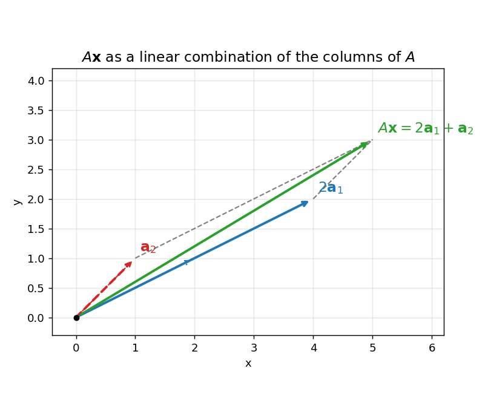

# 2. Vectors and matrices

Everything in deep learning is vectors and matrices. A $dataset$ is a matrix, one row per $data$ $point$. A $data$ $point$ is a vector — its $features$ listed in order. A $neural$ $network$ $layer$ is a matrix multiplying a vector, plus a vector $bias$. So this chapter is the vocabulary of the whole subject. Read it slowly; the rest of the book keeps pointing back here.

## 2.1 A vector = a list of numbers

A $vector$ = an ordered list of numbers. The numbers are called $components$ (also $coordinates$ or $entries$).

i) A $row$ $vector$: $(3, 2)$, $(1, 2, 3.3)$.
ii) A $column$ $vector$: $\begin{pmatrix} 3 \\ 2 \end{pmatrix}$, $\begin{pmatrix} 5 \\ -1 \\ 4 \end{pmatrix}$.
iii) From Chapter 1 (\S 1.6): a vector with $n$ real entries is an element of $\mathbb{R}^n$ — a point of $n$-dimensional space. Vectors with $n$ entries = vectors in $\mathbb{R}^n$ = points in $\mathbb{R}^n$.

Why lists? Real data arrives as tables, and a vector is just a row or a column of a table:

- The cricket row $(64.35, 31.92, 33.30, 26.00, 49.87)$ = V. Kohli, Dhoni, Rohit, Rahul, Dhawan's averages vs South Africa — five numbers, one vector.
- A grocery-shop column: $(150, 50, 35, 70, 25)$ = stock (in kg/L/packets/bars) of rice, dal, oil, biscuits, soap.

Note: $order$ matters in a vector. $(3, 2) \ne (2, 3)$ — same reason $(a, 1) \ne (1, a)$ in \S 1.6.

**Basically, ...** A vector is a shopping list with a fixed order. "(3 kg rice, 2 kg dal)" tells you everything; shuffling it to "(2 kg rice, 3 kg dal)" changes the meaning. ML just calls these lists "vectors" and the items "features".

## 2.2 The geometric view: arrows

For $\mathbb{R}^2$ and $\mathbb{R}^3$ we can draw vectors. The vector $(a, b)$ is drawn as an $arrow$ from the $origin$ $(0, 0)$ to the point $(a, b)$.

- The $length$ of the arrow = the vector's $magnitude$ (size).
- The $arrowhead$ points in the vector's $direction$.

Two ways to see the same vector:

i) As a $point$: $(3, 2)$ is the location "3 right, 2 up".
ii) As a $direction$: $(3, 2)$ is the instruction "go 3 right, 2 up".

A vector has magnitude and direction but $no$ $position$: sliding it parallel to itself (same length, same direction) does not change it. Two arrows drawn in different places are the same vector as long as their lengths and directions match.

Note: the standard $unit$ $vectors$ $\hat{\mathbf{i}} = (1, 0)$ and $\hat{\mathbf{j}} = (0, 1)$ are arrows of length 1 along the axes. Any $(a, b)$ = $a\hat{\mathbf{i}} + b\hat{\mathbf{j}}$; e.g. $(1, 2) = 1\hat{\mathbf{i}} + 2\hat{\mathbf{j}}$. (What "length 1" means is in \S 2.4.)

**Basically, ...** A vector is an arrow. Length says how far, the tip says which way, and where you draw it on the page doesn't matter — only the push it represents.

## 2.3 Addition, subtraction, scalar multiplication

Vector $addition$ = add the matching entries ($coordinatewise$). You can only add vectors of the same length.

**Def.** $(a_1, \ldots, a_n) + (b_1, \ldots, b_n) = (a_1 + b_1, \ldots, a_n + b_n)$.

**eg.** Arun buys $(3, 2)$ (3 kg rice, 2 kg dal), Neela buys $(5, 6)$. Together:
$$(3, 2) + (5, 6) = (3 + 5,\ 2 + 6) = (8, 8).$$
8 kg rice, 8 kg dal — nothing more than adding two lists entry by entry.

**eg.** The grocery stock-take. Stock plus new stock, minus three buyers' purchases:
$$\begin{aligned}
&(150, 50, 35, 70, 25) + (-8, -8, -4, -10, -4) + (-12, -5, -7, -10, -2) \\
&\qquad + (-3, -2, -5, -5, -1) + (100, 75, 30, 80, 30).
\end{aligned}$$
Add each column: rice $150 - 8 - 12 - 3 + 100 = 227$; dal $50 - 8 - 5 - 2 + 75 = 110$; oil $35 - 4 - 7 - 5 + 30 = 49$; biscuits $70 - 10 - 10 - 5 + 80 = 125$; soap $25 - 4 - 2 - 1 + 30 = 48$.
$$= (227, 110, 49, 125, 48).$$

$Scalar$ $multiplication$ = multiply every entry by one number (the $scalar$). It stretches (or shrinks, or flips) the arrow without changing its direction — unless the scalar is negative, which reverses it.

**Def.** $c(a_1, \ldots, a_n) = (ca_1, \ldots, ca_n)$ for any scalar $c \in \mathbb{R}$.

**eg.** Buyer A repeats yesterday's purchase exactly:
$$2(8, 8, 4, 10, 4) = (16, 16, 8, 20, 8).$$

Vector $subtraction$ = add the negative: $\mathbf{u} - \mathbf{v} = \mathbf{u} + (-1)\mathbf{v}$, done coordinatewise.
**eg.** $(5, 6) - (3, 2) = (5 - 3,\ 6 - 2) = (2, 4)$.

The $zero$ $vector$ $\mathbf{0} = (0, 0, \ldots, 0)$ = adding nothing. It satisfies $\mathbf{v} + \mathbf{0} = \mathbf{v}$ for every $\mathbf{v}$.

Geometrically, addition has two equivalent pictures:

i) $Head$-$to$-$tail$: put the tail of the second arrow at the head of the first; the sum is the arrow from the very start to the very end.
ii) $Parallelogram$ $law$: put both tails at the origin; the sum is the diagonal of the parallelogram they span.

<!-- Source: https://d2l.ai/_images/vec-add.svg (Dive into Deep Learning, d2l.ai); reused here only as illustration for head-to-tail vector addition -->

**eg.** $(1, 2) + (2, 1) = (3, 3)$ — the diagonal of the parallelogram with sides $(1, 2)$ and $(2, 1)$ lands on $(3, 3)$.

Note: $-\mathbf{v}$ is the arrow of $\mathbf{v}$ reversed, and $\mathbf{u} - \mathbf{v}$ is the direction from the tip of $\mathbf{v}$ to the tip of $\mathbf{u}$. Check: $\mathbf{v} + (\mathbf{u} - \mathbf{v}) = \mathbf{u}$.

**Basically, ...** Adding vectors = adding the lists item by item. On paper, it is walking: follow the first arrow, then follow the second from where you landed — where you finish is the sum. Scaling = making the arrow longer or shorter (a negative number also flips it around).

## 2.4 Magnitude (norm) and unit vectors

The $magnitude$ (or $length$, or $norm$) of a vector, written $\lVert \mathbf{v} \rVert$, is the length of its arrow. For $(3, 4)$ in $\mathbb{R}^2$, Pythagoras gives $\lVert (3, 4) \rVert = \sqrt{3^2 + 4^2} = \sqrt{25} = 5$.

**Def.** For $\mathbf{v} = (v_1, \ldots, v_n) \in \mathbb{R}^n$,
$$\lVert \mathbf{v} \rVert = \sqrt{v_1^2 + v_2^2 + \cdots + v_n^2}.$$

**eg.** $\lVert (1, 2, 2) \rVert = \sqrt{1 + 4 + 4} = \sqrt{9} = 3$.

A $unit$ $vector$ = a vector of length 1. To make any nonzero $\mathbf{v}$ into a unit vector pointing the same way, divide by its length: $\hat{\mathbf{v}} = \mathbf{v} / \lVert \mathbf{v} \rVert$.

**eg.** $\mathbf{v} = (3, 4)$ has $\lVert \mathbf{v} \rVert = 5$, so $\hat{\mathbf{v}} = (3/5, 4/5)$. Check: $\lVert \hat{\mathbf{v}} \rVert = \sqrt{9/25 + 16/25} = \sqrt{1} = 1$. ✓

Note: norms are never negative, and $\lVert c\mathbf{v} \rVert = |c| \, \lVert \mathbf{v} \rVert$.

**Basically, ...** The norm is just "how long is the arrow" — the straight-line distance from the origin to the point, computed by Pythagoras in however many dimensions you have. A unit vector is the same arrow shrunk to length 1: pure direction, no size.

## 2.5 The dot product

The $dot$ $product$ takes two vectors and returns a single number (a $scalar$). It is the bridge between algebra and geometry in this chapter.

**Def.** For $\mathbf{u} = (u_1, \ldots, u_n)$, $\mathbf{v} = (v_1, \ldots, v_n)$ in $\mathbb{R}^n$,
$$\mathbf{u} \cdot \mathbf{v} = u_1 v_1 + u_2 v_2 + \cdots + u_n v_n.$$

**eg.** $(2, 4) \cdot (3, 5) = 2 \times 3 + 4 \times 5 = 6 + 20 = 26$.
**eg.** $(1, 2, 3) \cdot (2, 0, 1) = 1 \times 2 + 2 \times 0 + 3 \times 1 = 2 + 0 + 3 = 5$.

Three facts that make the dot product earn its keep:

i) $Length$ $from$ $dot$ $product$: $\mathbf{v} \cdot \mathbf{v} = v_1^2 + \cdots + v_n^2 = \lVert \mathbf{v} \rVert^2$, so
$$\lVert \mathbf{v} \rVert = \sqrt{\mathbf{v} \cdot \mathbf{v}}.$$
**eg.** $(3, 4) \cdot (3, 4) = 9 + 16 = 25$, and $\sqrt{25} = 5 = \lVert (3, 4) \rVert$. ✓

ii) $Symmetry$: $\mathbf{u} \cdot \mathbf{v} = \mathbf{v} \cdot \mathbf{u}$ — order does not matter.

iii) $Angle$: if $\theta$ is the angle between nonzero $\mathbf{u}$ and $\mathbf{v}$,
$$\mathbf{u} \cdot \mathbf{v} = \lVert \mathbf{u} \rVert \, \lVert \mathbf{v} \rVert \cos\theta, \qquad \text{so} \qquad \cos\theta = \frac{\mathbf{u} \cdot \mathbf{v}}{\lVert \mathbf{u} \rVert \, \lVert \mathbf{v} \rVert}.$$

**eg (angle, full steps).** Find the angle between $\mathbf{u} = (1, 0)$ and $\mathbf{v} = (1, 1)$.
$$\mathbf{u} \cdot \mathbf{v} = 1 \times 1 + 0 \times 1 = 1,$$
$$\lVert \mathbf{u} \rVert = \sqrt{1 + 0} = 1, \qquad \lVert \mathbf{v} \rVert = \sqrt{1 + 1} = \sqrt{2},$$
$$\cos\theta = \frac{1}{1 \cdot \sqrt{2}} = \frac{1}{\sqrt{2}} \;\Rightarrow\; \theta = 45^\circ.$$
Exactly what the picture says: $(1, 1)$ points diagonally between the axes.

**eg (angle, full steps).** $\mathbf{a} = (4, 3)$, $\mathbf{b} = (-4, 3)$.
$$\mathbf{a} \cdot \mathbf{b} = 4 \times (-4) + 3 \times 3 = -16 + 9 = -7,$$
$$\lVert \mathbf{a} \rVert = 5, \qquad \lVert \mathbf{b} \rVert = \sqrt{16 + 9} = 5,$$
$$\cos\theta = \frac{-7}{5 \times 5} = \frac{-7}{25} = -0.28 \;\Rightarrow\; \theta = \cos^{-1}(-0.28) \approx 106.3^\circ.$$
The negative dot product means the angle is obtuse — the vectors lean away from each other.

Note (ML): $\cos\theta = \dfrac{\mathbf{u} \cdot \mathbf{v}}{\lVert \mathbf{u} \rVert \, \lVert \mathbf{v} \rVert}$ is called $cosine$ $similarity$. It is $1$ when the vectors point the same way, $-1$ when they point opposite, and $0$ when they are at right angles. In ML, two document or image vectors with cosine similarity near 1 "say the same thing" even if one is longer (brighter image, longer document) — the angle ignores length. This is why dot products show up in attention and recommendation: they measure agreement.

Note (preview): $\lVert \mathbf{v} \rVert \cos\theta$ is the length of the $projection$ of $\mathbf{v}$ onto the direction of $\mathbf{u}$ — how much of $\mathbf{v}$ lies along $\mathbf{u}$. The full projection story waits in Chapter 5.

**Basically, ...** The dot product = multiply matching entries, then add. That's the whole computation. What it tells you: how much two arrows agree. Big positive = pointing together; zero = at right angles; negative = pointing apart. ML uses it as a "similarity score" between two feature vectors.

## 2.6 Linear combinations

A $linear$ $combination$ = scale some vectors, then add them. One operation, two ingredients (scaling + adding).

**Def.** Let $\mathbf{v}_1, \ldots, \mathbf{v}_k$ be vectors and $\alpha_1, \ldots, \alpha_k$ scalars. Then
$$\alpha_1 \mathbf{v}_1 + \alpha_2 \mathbf{v}_2 + \cdots + \alpha_k \mathbf{v}_k$$
is a $linear$ $combination$ of the $\mathbf{v}_i$ with $coefficients$ $\alpha_i$. The result is again a vector.

**eg.** $2(1, 2) + 3(2, 1)$: scale first, $2(1, 2) = (2, 4)$ and $3(2, 1) = (6, 3)$; then add, $(2, 4) + (6, 3) = (8, 7)$.
**eg.** $(4, 5) = 2(1, 2) + 1(2, 1)$: check, $2(1, 2) + (2, 1) = (2 + 2,\ 4 + 1) = (4, 5)$. ✓

Note: vector addition is the linear combination $1\mathbf{v}_1 + 1\mathbf{v}_2$; scalar multiplication is $c\mathbf{v}$. Everything in \S 2.3 is a special case of this one idea.

**Basically, ...** A linear combination is a recipe: "take twice of this arrow and three times of that arrow, add them up." The numbers in front (coefficients) say how much of each ingredient. This single idea quietly powers all of matrix multiplication in \S 2.10.

## 2.7 What is a matrix?

A $matrix$ = a rectangular array of numbers, arranged in $rows$ and $columns$. (Plural: $matrices$.)

i) An $m \times n$ $matrix$ has $m$ rows and $n$ columns. Read "$m$ by $n$".
ii) The $(i, j)$-$th$ $entry$ $A_{ij}$ is the number in row $i$, column $j$. Rows and columns are numbered from 1.

**eg.**
$$A = \begin{pmatrix} 1 & 2 & 3 \\ 2 & 3 & 4 \end{pmatrix}$$
is a $2 \times 3$ matrix. Its $(1, 2)$-th entry is $A_{12} = 2$ and its $(2, 3)$-th entry is $A_{23} = 4$.

Two ML faces of a matrix:

i) A matrix is a $table$ $of$ $data$: stack data vectors as rows. One row = one data point, one column = one feature. The cricket table of \S 2.1 is a $6 \times 5$ matrix.
ii) A matrix is a $machine$ that transforms vectors: $m \times n$ matrix times an $n$-vector gives an $m$-vector (\S 2.10). A neural layer $\mathbf{y} = W\mathbf{x} + \mathbf{b}$ is exactly this.

**Basically, ...** A matrix is a table of numbers with an address system: row $i$, column $j$ picks out one cell. ML reads a matrix two ways — as a pile of data (rows = examples) and as a machine that converts one vector into another.

## 2.8 Special matrices

- $Square$ $matrix$ = number of rows = number of columns ($n \times n$).
- The $i$-th $diagonal$ $entry$ of a square matrix is $A_{ii}$; the $diagonal$ is the set of all of them.
**eg.** In $\begin{pmatrix} 0.3 & 5 & -7 \\ 2.8 & 0 & 1 \\ 0 & -2.5 & -1 \end{pmatrix}$ the diagonal entries are $0.3$, $0$, $-1$.

- $Zero$ $matrix$ = every entry is $0$. Written $0$ (or $0_{m \times n}$ when the shape matters).
- $Diagonal$ $matrix$ = square, everything off the diagonal is $0$.
**eg.** $\begin{pmatrix} 1 & 0 & 0 \\ 0 & -3 & 0 \\ 0 & 0 & 4.2 \end{pmatrix}$ is diagonal.
- $Scalar$ $matrix$ = diagonal, and all diagonal entries are equal.
**eg.** $\begin{pmatrix} -3 & 0 & 0 \\ 0 & -3 & 0 \\ 0 & 0 & -3 \end{pmatrix}$ is scalar.
- $Identity$ $matrix$ $I$ = scalar matrix with all diagonal entries $1$ — the "do nothing" matrix.
$$I_3 = \begin{pmatrix} 1 & 0 & 0 \\ 0 & 1 & 0 \\ 0 & 0 & 1 \end{pmatrix}.$$

- $Transpose$ $A^T$ = flip rows and columns: $(A^T)_{ij} = A_{ji}$.
**eg.** $\begin{pmatrix} 1 & 2 & 3 \\ 4 & 5 & 6 \end{pmatrix}^T = \begin{pmatrix} 1 & 4 \\ 2 & 5 \\ 3 & 6 \end{pmatrix}$. A row vector's transpose is a column vector and vice versa.
- $Symmetric$ $matrix$ = square matrix equal to its own transpose: $A^T = A$ (mirror across the diagonal).
**eg.** $\begin{pmatrix} 2 & 1 \\ 1 & 3 \end{pmatrix}$ is symmetric; $\begin{pmatrix} 1 & 2 \\ 3 & 4 \end{pmatrix}$ is not ($2 \ne 3$ off the diagonal).

**Basically, ...** Special matrices are the greatest hits: the zero matrix (all zeros), the identity (1s on the diagonal — multiplying by it changes nothing, like $\times 1$), and the transpose (rotate the table so rows become columns). Symmetric = the table looks the same after that flip.

## 2.9 Matrix addition and scalar multiplication

Exactly like vectors, done $entrywise$. Addition needs the same shape on both sides.

**Def.** For $m \times n$ matrices $A, B$: $(A + B)_{ij} = A_{ij} + B_{ij}$. For a scalar $c$: $(cA)_{ij} = c \, A_{ij}$.

**eg.**
$$\begin{pmatrix} 2 & -1 & 0 \\ 3 & 4 & 5 \end{pmatrix} + \begin{pmatrix} 1 & 3 & -2 \\ 0 & -4 & 1 \end{pmatrix} = \begin{pmatrix} 2+1 & -1+3 & 0-2 \\ 3+0 & 4-4 & 5+1 \end{pmatrix} = \begin{pmatrix} 3 & 2 & -2 \\ 3 & 0 & 6 \end{pmatrix}.$$

**eg.**
$$3\begin{pmatrix} 1 & 2 & 3 \\ 4 & 5 & 6 \end{pmatrix} = \begin{pmatrix} 3 & 6 & 9 \\ 12 & 15 & 18 \end{pmatrix}.$$

Note: $A + B = B + A$ (addition commutes), and $\lambda(A + B) = \lambda A + \lambda B$. Adding a $2 \times 3$ matrix to a $3 \times 2$ matrix is simply not defined — the entries would not line up.

**Basically, ...** Matrix addition = lay the tables on top of each other and add cell by cell. Scaling = multiply every cell by one number. Same as vectors, because a matrix is just vectors stacked.

## 2.10 Matrix multiplication: the heart of the chapter

Matrix multiplication looks odd at first. It is $not$ entrywise — and that is deliberate: it is built so that multiplying matrices composes the machines of \S 2.7.

$Compatibility$: $A_{m \times n} B_{n \times p} = (AB)_{m \times p}$. The inner dimensions must match (columns of $A$ = rows of $B$); the result takes the outer ones.

**Def (row-times-column).** $(AB)_{ij} = \sum_{k=1}^{n} A_{ik} B_{kj}$ = row $i$ of $A$ dotted with column $j$ of $B$.

**eg (fully worked).** Multiply $A = \begin{pmatrix} 1 & 2 \\ 3 & 4 \end{pmatrix}$ by $B = \begin{pmatrix} 1 & 2 & 3 \\ 3 & 4 & 5 \end{pmatrix}$. $A$ is $2 \times 2$, $B$ is $2 \times 3$; the inner 2s match, so $AB$ is $2 \times 3$. Six dot products:

- $(AB)_{11}$ = row 1 of $A$ $\cdot$ col 1 of $B$ = $(1, 2) \cdot (1, 3) = 1 + 6 = 7$
- $(AB)_{12}$ = row 1 of $A$ $\cdot$ col 2 of $B$ = $(1, 2) \cdot (2, 4) = 2 + 8 = 10$
- $(AB)_{13}$ = row 1 of $A$ $\cdot$ col 3 of $B$ = $(1, 2) \cdot (3, 5) = 3 + 10 = 13$
- $(AB)_{21}$ = row 2 of $A$ $\cdot$ col 1 of $B$ = $(3, 4) \cdot (1, 3) = 3 + 12 = 15$
- $(AB)_{22}$ = row 2 of $A$ $\cdot$ col 2 of $B$ = $(3, 4) \cdot (2, 4) = 6 + 16 = 22$
- $(AB)_{23}$ = row 2 of $A$ $\cdot$ col 3 of $B$ = $(3, 4) \cdot (3, 5) = 9 + 20 = 29$

$$\begin{pmatrix} 1 & 2 \\ 3 & 4 \end{pmatrix}\begin{pmatrix} 1 & 2 & 3 \\ 3 & 4 & 5 \end{pmatrix} = \begin{pmatrix} 7 & 10 & 13 \\ 15 & 22 & 29 \end{pmatrix}.$$

**eg (matrix times vector).** $\begin{pmatrix} 1 & 2 \\ 3 & 4 \end{pmatrix}\begin{pmatrix} 5 \\ 6 \end{pmatrix}$: row 1 $\cdot$ $(5,6)$ = $5 + 12 = 17$; row 2 $\cdot$ $(5,6)$ = $15 + 24 = 39$. Result: $\begin{pmatrix} 17 \\ 39 \end{pmatrix}$.

There is a second view of the same computation, and it is the more useful one in ML.

**The columns view.** Write $A$ as its columns $[\mathbf{a}_1 \;\; \mathbf{a}_2 \;\; \cdots \;\; \mathbf{a}_n]$. Then
$$A\mathbf{x} = x_1 \mathbf{a}_1 + x_2 \mathbf{a}_2 + \cdots + x_n \mathbf{a}_n$$
— a $linear$ $combination$ of the columns of $A$, with the entries of $\mathbf{x}$ as coefficients.

**eg (same product, columns view).** Columns of $\begin{pmatrix} 1 & 2 \\ 3 & 4 \end{pmatrix}$ are $\mathbf{a}_1 = (1, 3)$, $\mathbf{a}_2 = (2, 4)$. Then
$$\begin{pmatrix} 1 & 2 \\ 3 & 4 \end{pmatrix}\begin{pmatrix} 5 \\ 6 \end{pmatrix} = 5\mathbf{a}_1 + 6\mathbf{a}_2 = 5(1, 3) + 6(2, 4) = (5 + 12,\ 15 + 24) = (17, 39).$$
Same $(17, 39)$ as the row-times-column computation above. ✓ Two views, one answer.

<!-- Source: original illustration drawn for this chapter with matplotlib; no external source -->

Two handy special cases:

i) Multiplying by a scalar matrix = scalar multiplication: $\begin{pmatrix} c & 0 & 0 \\ 0 & c & 0 \\ 0 & 0 & c \end{pmatrix}\begin{pmatrix} 1 & 2 \\ 3 & 4 \\ 5 & 6 \end{pmatrix} = \begin{pmatrix} c & 2c \\ 3c & 4c \\ 5c & 6c \end{pmatrix} = c\begin{pmatrix} 1 & 2 \\ 3 & 4 \\ 5 & 6 \end{pmatrix}$.
ii) Multiplying by the identity changes nothing: $IA = A = AI$ (with the right-sized $I$ on each side).

**Basically, ...** Matrix multiplication = every row of the left table dotted with every column of the right table. And the ML-flavoured re-read: $A\mathbf{x}$ is a recipe — "take $x_1$ of column 1, $x_2$ of column 2, ..." and add. The columns of $A$ are the ingredients; the entries of $\mathbf{x}$ are how much of each.

## 2.11 The basic rules (and one famous non-rule)

For matrices of compatible shapes:

i) $(A + B) + C = A + (B + C)$ ($associativity$ of addition).
ii) $(AB)C = A(BC)$ ($associativity$ of multiplication) — brackets don't matter in a product chain, which is why $ABC$ is unambiguous.
iii) $A + B = B + A$ ($commutativity$ of addition).
iv) $A(B + C) = AB + AC$ and $(A + B)C = AC + BC$ ($distributivity$).
v) $\lambda(AB) = (\lambda A)B = A(\lambda B)$ — scalars slide freely through a product.

vi) The famous non-rule: in general $AB \ne BA$ (when both even make sense). Multiplication does $not$ commute.
**eg (counterexample, full steps).** $A = \begin{pmatrix} 1 & 2 \\ 3 & 4 \end{pmatrix}$, $B = \begin{pmatrix} 1 & 0 \\ 0 & 0 \end{pmatrix}$:
$$AB = \begin{pmatrix} 1\cdot1 + 2\cdot0 & 1\cdot0 + 2\cdot0 \\ 3\cdot1 + 4\cdot0 & 3\cdot0 + 4\cdot0 \end{pmatrix} = \begin{pmatrix} 1 & 0 \\ 3 & 0 \end{pmatrix},$$
$$BA = \begin{pmatrix} 1\cdot1 + 0\cdot3 & 1\cdot2 + 0\cdot4 \\ 0\cdot1 + 0\cdot3 & 0\cdot2 + 0\cdot4 \end{pmatrix} = \begin{pmatrix} 1 & 2 \\ 0 & 0 \end{pmatrix}.$$
$AB \ne BA$ — same ingredients, different order, different answer.

**Basically, ...** Addition of matrices behaves like addition of numbers. Multiplication keeps associativity and distributivity — but forgets commutativity: order matters. "Rotate then stretch" is not "stretch then rotate". (In ML this is why $W_2(W_1\mathbf{x})$ means apply $W_1$ first.)

## Problem set

1. Compute $(5, -2, 4) + 3(1, 0, -1) - (2, 3, 0)$.
2. Let $\mathbf{u} = (6, 8)$. Find $\lVert \mathbf{u} \rVert$ and the unit vector pointing in the same direction as $\mathbf{u}$.
3. Compute the dot product of $(3, -1, 2)$ and $(-2, 4, 5)$. What does the answer say about the angle between them?
4. Find the angle between $(1, 2)$ and $(2, 1)$, in degrees.
5. Write $(7, 5)$ as a linear combination of $(1, 2)$ and $(2, 1)$, i.e. find scalars $a, b$ with $(7, 5) = a(1, 2) + b(2, 1)$.
6. For $A = \begin{pmatrix} 2 & 0 & -1 \\ 1 & 3 & 4 \end{pmatrix}$: what is its shape? What is the $(2, 1)$-th entry? Is $A$ square? Is it diagonal?
7. With $A = \begin{pmatrix} 1 & -2 \\ 0 & 3 \end{pmatrix}$ and $B = \begin{pmatrix} 4 & 1 \\ 2 & -1 \end{pmatrix}$, compute $A + B$ and $2A - B$.
8. Multiply $\begin{pmatrix} 2 & -1 \\ 0 & 3 \\ 1 & 1 \end{pmatrix}\begin{pmatrix} 1 & 2 \\ 3 & -1 \end{pmatrix}$, showing each entry's computation.
9. For $A = \begin{pmatrix} 0 & 1 \\ 1 & 0 \end{pmatrix}$ and $B = \begin{pmatrix} 2 & 0 \\ 0 & 3 \end{pmatrix}$, compute $AB$ and $BA$. Are they equal?
10. Let $\mathbf{v} = (5, 6)$ and $A = \begin{pmatrix} 1 & 2 \\ 3 & 4 \end{pmatrix}$. Compute $A\mathbf{v}$ two ways — row-times-column and as a linear combination of the columns of $A$ — and confirm both give the same vector.
11. True or false, with a reason: "If $A$ is $m \times n$ and $B$ is $n \times p$, then $AB$ is defined and has shape $p \times m$."
12. Is $\begin{pmatrix} 2 & -1 \\ -1 & 2 \end{pmatrix}$ symmetric? Is the transpose of a row vector a column vector?

## Where this goes next

This chapter gave you the objects and the operations. The coming chapters put them to work:

- **Chapter 3 (linear systems):** the $Ax = \mathbf{b}$ in \S 2.10's columns view — "which recipe of columns makes $\mathbf{b}$?" — becomes solving systems of linear equations.
- **Chapter 4 (vector spaces):** the loose facts about adding and scaling vectors (\S 2.3, \S 2.6) get their proper home: the axioms every vector space obeys.
- **Chapter 5 (orthogonality):** the dot product's zero (\S 2.5) gets a name — $orthogonal$ — plus projections and the geometry they unlock.
