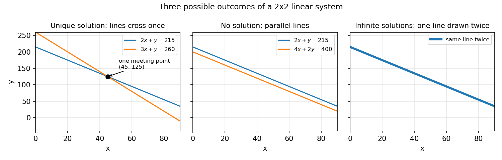

# 3. Linear systems, determinants, inverses

## 3.1 What this chapter is for

Most of machine learning is, quietly, the business of solving $A\mathbf{x} = \mathbf{b}$.

- Fitting a line through data points (Chapter 5) ends in a system of equations — the $normal$ $equations$ $(A^T A)\mathbf{x} = A^T\mathbf{b}$.
- A neural network layer computes $\mathbf{y} = W\mathbf{x} + \mathbf{b}$; asking "which input produced this output?" is solving a linear system.
- Every optimizer step solves (approximately) a linear system built from derivatives.

So this chapter answers three questions about $A\mathbf{x} = \mathbf{b}$: does a solution exist, is it unique, and how do we compute it? The tools are $Gaussian$ $elimination$ (the practical workhorse), the $matrix$ $inverse$ (the clean way to think about the answer), and the $determinant$ (the one number that detects whether an inverse exists).

## 3.2 Linear equations and systems of linear equations

**Def.** A $linear$ $equation$ in the $variables$ (or $unknowns$) $x_1, x_2, \dots, x_n$ = an equation of the form

$$a_1 x_1 + a_2 x_2 + \cdots + a_n x_n = b,$$

where the $coefficients$ $a_1, a_2, \dots, a_n$ and the right-hand side $b$ are real numbers.

i) $2x + 3y + 5z = -9$ is linear: the variables are $x, y, z$ and the coefficients are $2, 3, 5$.
ii) $x^2 + y = 1$ is **not** linear (the $x^2$ breaks it); $xy = 4$ is **not** linear (a product of two variables breaks it).

**Def.** A $system$ $of$ $linear$ $equations$ = a collection of one or more linear equations involving the same set of variables.

**Def.** A $solution$ = an assignment of values to the variables that makes every equation in the system true at the same time.

**eg.** Consider
$$x + 2y + z = 8, \qquad 2x + y + z = 7, \qquad x + y + 2z = 9.$$
Claim: $(x, y, z) = (1, 2, 3)$ is a solution. Check each equation:
- $1 + 2(2) + 3 = 1 + 4 + 3 = 8$ ✓
- $2(1) + 2 + 3 = 2 + 2 + 3 = 7$ ✓
- $1 + 2 + 2(3) = 1 + 2 + 6 = 9$ ✓

All three hold simultaneously, so $(1, 2, 3)$ is indeed a solution.

The general shape — $m$ equations in $n$ unknowns — is:

$$\begin{aligned}
a_{11}x_1 + a_{12}x_2 + \cdots + a_{1n}x_n &= b_1 \\
a_{21}x_1 + a_{22}x_2 + \cdots + a_{2n}x_n &= b_2 \\
&\ \vdots \\
a_{m1}x_1 + a_{m2}x_2 + \cdots + a_{mn}x_n &= b_m
\end{aligned}$$

**Basically, ...** A linear equation is a flat recipe: each variable appears plain, multiplied by one number, everything added up — no squares, no products of variables. A system is several such recipes that must all balance at once, and a solution is one set of values that balances every one of them.

## 3.3 The matrix form $A\mathbf{x} = \mathbf{b}$, and the three possible outcomes

Writing the general system above with matrices compresses it to one line.

**Def.** The $matrix$ $form$ of a linear system is $A\mathbf{x} = \mathbf{b}$, where:

- $A$ is the $m \times n$ $coefficient$ $matrix$ (the $a_{ij}$ arranged in a table),
- $\mathbf{x} = (x_1, \dots, x_n)^T$ is the column vector of unknowns,
- $\mathbf{b} = (b_1, \dots, b_m)^T$ is the column vector of right-hand sides.

**eg.** The system of §3.2 in matrix form:

$$\begin{pmatrix} 1 & 2 & 1 \\ 2 & 1 & 1 \\ 1 & 1 & 2 \end{pmatrix}
\begin{pmatrix} x \\ y \\ z \end{pmatrix} =
\begin{pmatrix} 8 \\ 7 \\ 9 \end{pmatrix},$$

so $A = \begin{pmatrix} 1 & 2 & 1 \\ 2 & 1 & 1 \\ 1 & 1 & 2 \end{pmatrix}$ ($3 \times 3$), $\mathbf{x} = (x, y, z)^T$, $\mathbf{b} = (8, 7, 9)^T$.

**Def.** The $augmented$ $matrix$, written $[A \mid \mathbf{b}]$, = the coefficient matrix with $\mathbf{b}$ glued on as one extra last column. It carries the whole system in one table.

Now recall the columns view from §2.10: if $\mathbf{a}_1, \dots, \mathbf{a}_n$ are the columns of $A$, then

$$A\mathbf{x} = x_1\mathbf{a}_1 + x_2\mathbf{a}_2 + \cdots + x_n\mathbf{a}_n.$$

So solving $A\mathbf{x} = \mathbf{b}$ is asking: **"which recipe of the columns of $A$ makes $\mathbf{b}$?"** The unknowns $x_i$ are the amounts of each column-ingredient.

There are exactly three possible answers to that question:

i) a $unique$ $solution$ — exactly one recipe works;
ii) $no$ $solution$ — no recipe can make $\mathbf{b}$ (the system is $inconsistent$);
iii) $infinitely$ $many$ $solutions$ — whole families of recipes work.

**eg (unique solution).**
$$\begin{aligned}
2x + y &= 215 \\
3x + y &= 260
\end{aligned}$$
Subtract the first equation from the second: $(3x + y) - (2x + y) = 260 - 215$, so $x = 45$. Then $y = 215 - 2(45) = 215 - 90 = 125$. Check: $3(45) + 125 = 135 + 125 = 260$ ✓. One solution: $(45, 125)$.

**eg (infinitely many solutions).**
$$\begin{aligned}
2x + y &= 215 \\
4x + 2y &= 430
\end{aligned}$$
The second equation is just twice the first ($2 \times (2x + y) = 2 \times 215$). It adds no new information: every $(x, y)$ on the line $y = 215 - 2x$ satisfies both. E.g. $x = 100$ gives $y = 15$, and $4(100) + 2(15) = 430$ ✓.

**eg (no solution).**
$$\begin{aligned}
2x + y &= 215 \\
4x + 2y &= 400
\end{aligned}$$
Twice the first equation demands $4x + 2y = 430$, but the second demands $4x + 2y = 400$. Both cannot hold: $430 \ne 400$. No $(x, y)$ satisfies both.

The geometry: with two variables, each equation is a line in $\mathbb{R}^2$, so two equations = two lines. The three cases are exactly the three ways two lines can relate:

<!-- Source: original illustration drawn for this chapter with matplotlib; no external source -->

With three variables each equation is a plane in $\mathbb{R}^3$; the same three outcomes occur (intersecting at one point / the same plane twice / parallel planes).

**Basically, ...** Two equations in two unknowns = two lines drawn on paper. Either they cross at exactly one point (one answer), they are the same line drawn twice (infinite answers — every point on it), or they run parallel forever and never meet (no answer). All the machinery in this chapter is just a reliable way to decide which of these three you are looking at, and to find the point — or points — when they exist.

## 3.4 Elementary row operations and echelon forms

The strategy for solving: reshape the augmented matrix into a simpler system with the same solutions, using moves that never change the solution set.

**Def.** The three $elementary$ $row$ $operations$ on a matrix are:

1. $R_i \leftrightarrow R_j$: interchange two rows (reorder two equations — harmless).
2. $R_i \leftarrow cR_i$ with $c \ne 0$: multiply a row by a nonzero constant (scale both sides of an equation — harmless).
3. $R_i \leftarrow R_i + cR_j$: add a multiple of one row to another (combine two equations — harmless).

Applying any of these to $[A \mid \mathbf{b}]$ leaves the solution set of $A\mathbf{x} = \mathbf{b}$ unchanged.

The target shape is a staircase.

**Def.** A matrix is in $row$ $echelon$ $form$ ($REF$) if:

i) the first nonzero entry of each nonzero row (its $leading$ $entry$ or $pivot$) sits in a column strictly to the right of the leading entry of the row above;
ii) all-zero rows, if any, sit at the bottom.

It is in $reduced$ $row$ $echelon$ $form$ ($RREF$) if, in addition:

iii) every leading entry equals $1$;
iv) each leading $1$ is the only nonzero entry in its column.

**eg.**
$$A_{\text{ref}} = \begin{pmatrix} 1 & 2 & 3 & 4 \\ 0 & 0 & 1 & 3 \\ 0 & 0 & 0 & 1 \end{pmatrix}$$
is in REF: leading entries at columns 1, 3, 4 form a staircase. It is **not** RREF: the leading $1$ in column 3 has a $3$ above it.

$$A_{\text{rref}} = \begin{pmatrix} 1 & 2 & 0 & 0 \\ 0 & 0 & 1 & 0 \\ 0 & 0 & 0 & 1 \end{pmatrix}$$
is in RREF: leading $1$s at columns 1, 3, 4, each alone in its column.

$$\begin{pmatrix} 0 & 1 & 2 \\ 1 & 0 & 3 \end{pmatrix}$$
is not even REF: the staircase runs the wrong way (row 1 leads in column 2, row 2 in column 1).

Note: the source slides bundle conditions (i)–(iv) into a single "(Reduced)Row echelon form" definition, requiring leading entries to be $1$ from the start. This chapter uses the standard split: REF = staircase only, RREF = staircase + clean leading $1$s.

**Basically, ...** Echelon form is "stairs of equations": each equation starts further right than the one above, and dead all-zero rows get swept to the bottom. Reduced means the stairs are extra tidy — every step starts with a clean $1$ and nothing else in its column. Once the system looks like stairs, the answers are easy to read off.

## 3.5 Gaussian elimination and back-substitution

**Def.** $Gaussian$ $elimination$ = the procedure:

1. Form the augmented matrix $[A \mid \mathbf{b}]$.
2. Apply elementary row operations until the left block is in (reduced) row echelon form: $[A \mid \mathbf{b}] \to [R \mid \mathbf{c}]$.
3. Solve $R\mathbf{x} = \mathbf{c}$ — its solutions are exactly the solutions of $A\mathbf{x} = \mathbf{b}$.

Reading the answer off $[R \mid \mathbf{c}]$:

- If some row reads $0 = c_i$ with $c_i \ne 0$ (a zero row of $R$ paired with a nonzero entry of $\mathbf{c}$), the system has **no solution** — that row demands $0 = c_i$, impossible.
- Otherwise: a variable $x_i$ is $dependent$ if its column contains a leading $1$, and $independent$ ($free$) if not. Give each independent variable any value you like; then each dependent variable is forced by the unique row in which it leads. Every solution arises this way.

**eg (full $3 \times 3$ elimination).** Solve
$$\begin{aligned}
2x + y - z &= 1 \\
x + y + z &= 6 \\
3x - y + z &= 4.
\end{aligned}$$

Step 1 — augmented matrix:
$$\left[\begin{array}{rrr|r}
2 & 1 & -1 & 1 \\
1 & 1 & 1 & 6 \\
3 & -1 & 1 & 4
\end{array}\right]$$

Step 2 — $R_1 \leftrightarrow R_2$ (get a $1$ in the top-left):
$$\left[\begin{array}{rrr|r}
1 & 1 & 1 & 6 \\
2 & 1 & -1 & 1 \\
3 & -1 & 1 & 4
\end{array}\right]$$

Step 3 — $R_2 \leftarrow R_2 - 2R_1$: $[2-2,\ 1-2,\ -1-2 \mid 1-12] = [0,\ -1,\ -3 \mid -11]$:
$$\left[\begin{array}{rrr|r}
1 & 1 & 1 & 6 \\
0 & -1 & -3 & -11 \\
3 & -1 & 1 & 4
\end{array}\right]$$

Step 4 — $R_3 \leftarrow R_3 - 3R_1$: $[3-3,\ -1-3,\ 1-3 \mid 4-18] = [0,\ -4,\ -2 \mid -14]$:
$$\left[\begin{array}{rrr|r}
1 & 1 & 1 & 6 \\
0 & -1 & -3 & -11 \\
0 & -4 & -2 & -14
\end{array}\right]$$

Step 5 — $R_2 \leftarrow -R_2$ (leading $1$ in row 2):
$$\left[\begin{array}{rrr|r}
1 & 1 & 1 & 6 \\
0 & 1 & 3 & 11 \\
0 & -4 & -2 & -14
\end{array}\right]$$

Step 6 — $R_3 \leftarrow R_3 + 4R_2$: $[0,\ -4+4,\ -2+12 \mid -14+44] = [0,\ 0,\ 10 \mid 30]$:
$$\left[\begin{array}{rrr|r}
1 & 1 & 1 & 6 \\
0 & 1 & 3 & 11 \\
0 & 0 & 10 & 30
\end{array}\right] \quad \text{(row echelon form)}$$

Step 7 — $R_3 \leftarrow R_3/10$: $z = 3$.

Step 8 — $back$-$substitution$ (solve bottom-up). From row 2: $y + 3z = 11$, so $y = 11 - 3(3) = 11 - 9 = 2$. From row 1: $x + y + z = 6$, so $x = 6 - 2 - 3 = 1$.

Solution: $(x, y, z) = (1, 2, 3)$. Verify: $2(1) + 2 - 3 = 1$ ✓; $1 + 2 + 3 = 6$ ✓; $3(1) - 2 + 3 = 4$ ✓.

**eg (reading RREF: infinitely many solutions).**
$$\left[\begin{array}{rrr|r}
1 & 0 & 2 & 5 \\
0 & 1 & -1 & 3
\end{array}\right]$$
reads $x + 2z = 5$, $y - z = 3$. Leading $1$s sit in columns 1 and 2, so $x, y$ are dependent; column 3 has none, so $z$ is independent. Set $z = t$ (any real number): then $x = 5 - 2t$, $y = 3 + t$. Infinitely many solutions, one per value of $t$. Check $t = 0$: $(5, 3, 0)$ gives $5 + 0 = 5$ ✓ and $3 - 0 = 3$ ✓.

**eg (reading RREF: no solution).**
$$\left[\begin{array}{rr|r}
1 & 2 & 4 \\
0 & 0 & 7
\end{array}\right]$$
reads $x + 2y = 4$ and $0 = 7$. The second row is impossible, so the system has no solution.

**Basically, ...** Gaussian elimination is "tidy the equations, then read the answers." You combine and scale equations until they form stairs; the bottom stair tells you the last variable, and you climb back up substituting. If a stair ever says $0 = 7$, there is no answer; if some variable never gets a stair of its own, it is free and you get infinitely many answers.

## 3.6 The matrix inverse

Recall §1.10: a one-one function $f$ has an inverse $f^{-1}$ that undoes it — $f^{-1}(f(x)) = x$. A (square) matrix is a machine that transforms vectors; its inverse, when it exists, is the machine that reverses the transformation.

**Def.** Let $A$ be an $n \times n$ matrix. Its $inverse$, written $A^{-1}$, = the $n \times n$ matrix satisfying

$$AA^{-1} = A^{-1}A = I.$$

Only square matrices can have inverses, and not every square matrix does.

For $2 \times 2$ matrices there is a direct formula. With $\det(A) = ad - bc$:

$$A = \begin{pmatrix} a & b \\ c & d \end{pmatrix}, \qquad
A^{-1} = \frac{1}{ad - bc}\begin{pmatrix} d & -b \\ -c & a \end{pmatrix}
\quad \text{provided } ad - bc \ne 0.$$

Mnemonic: swap the diagonal entries, flip the signs of the off-diagonal entries, divide everything by the determinant.

**eg.** $A = \begin{pmatrix} 2 & 1 \\ 1 & 1 \end{pmatrix}$. $\det(A) = 2(1) - 1(1) = 1 \ne 0$, so
$$A^{-1} = \frac{1}{1}\begin{pmatrix} 1 & -1 \\ -1 & 2 \end{pmatrix}
= \begin{pmatrix} 1 & -1 \\ -1 & 2 \end{pmatrix}.$$
Verify $AA^{-1} = I$:
$$\begin{pmatrix} 2 & 1 \\ 1 & 1 \end{pmatrix}
\begin{pmatrix} 1 & -1 \\ -1 & 2 \end{pmatrix}
= \begin{pmatrix} 2(1)+1(-1) & 2(-1)+1(2) \\ 1(1)+1(-1) & 1(-1)+1(2) \end{pmatrix}
= \begin{pmatrix} 1 & 0 \\ 0 & 1 \end{pmatrix}.$$
✓ The undo machine works.

If $A^{-1}$ exists, solving $A\mathbf{x} = \mathbf{b}$ is one step: multiply both sides on the left by $A^{-1}$:

$$A\mathbf{x} = \mathbf{b} \quad\Rightarrow\quad \mathbf{x} = A^{-1}\mathbf{b}.$$

Note (one honest line): forming $A^{-1}$ costs roughly three times the arithmetic of plain elimination and rounds worse, so nobody solves $A\mathbf{x} = \mathbf{b}$ by inverting in practice — elimination (and fancier factorizations) is the workhorse; the inverse is the clean way to *think* about the solution.

When does the inverse fail to exist? A matrix with no inverse is called $singular$. Preview of §3.7: $A$ is singular exactly when $\det(A) = 0$.

**eg (singular matrix).** $S = \begin{pmatrix} 2 & 4 \\ 1 & 2 \end{pmatrix}$ has $\det(S) = 2(2) - 4(1) = 0$ — no inverse exists. Notice why: row 1 is $2 \times$ row 2, so the two rows carry the same information; $S$ squashes distinct vectors together and cannot be undone.

Two facts worth filing: $\det(A^{-1}) = \dfrac{1}{\det(A)}$, and for larger matrices $A^{-1}$ is found by row-reducing $[A \mid I]$ to $[I \mid A^{-1}]$ — elimination again, solving $A\mathbf{x} = \mathbf{e}_i$ for each column.

Note ($homogeneous$ $systems$): $A\mathbf{x} = \mathbf{0}$ always has the $trivial$ $solution$ $\mathbf{x} = \mathbf{0}$. If $A$ is invertible it is the *only* solution ($\mathbf{x} = A^{-1}\mathbf{0} = \mathbf{0}$); if $\det(A) = 0$ there are infinitely many others. And if there are more unknowns than equations, a nonzero solution is guaranteed.

**Basically, ...** The inverse is the "undo button" for a matrix: whatever $A$ does to a vector, $A^{-1}$ reverses. Just like functions in §1.10, undoing only works when nothing got merged — a matrix that squashes two different vectors into one (determinant zero) cannot be undone, so it has no inverse.

## 3.7 Determinants

**Def.** The $determinant$ of a square matrix $A$, written $\det(A)$ or $|A|$, = a single number computed from the entries of $A$. Only square matrices have determinants. It is the test for invertibility ($\det(A) \ne 0 \Leftrightarrow A$ invertible) and appears in solution formulas.

$1 \times 1$: $\det([a]) = a$.

$2 \times 2$:
$$\det\begin{pmatrix} a & b \\ c & d \end{pmatrix} = ad - bc.$$

**eg.** $\det\begin{pmatrix} 2 & 3 \\ 6 & 10 \end{pmatrix} = 2(10) - 3(6) = 20 - 18 = 2.$

For $3 \times 3$ and beyond, the determinant is built recursively. The $(i, j)$-th $minor$ $M_{ij}$ = the determinant of the submatrix left after deleting row $i$ and column $j$; the $(i, j)$-th $cofactor$ is $C_{ij} = (-1)^{i+j}M_{ij}$ (the sign follows a checkerboard: $\begin{smallmatrix} + & - & + \\ - & + & - \\ + & - & + \end{smallmatrix}$). Expanding along the first row:

$$\det(A) = a_{11}C_{11} + a_{12}C_{12} + a_{13}C_{13}.$$

In fact you may expand along *any* row or column — pick the one with the most zeros.

**eg ($3 \times 3$, full steps).** $A = \begin{pmatrix} 2 & 4 & 1 \\ 3 & 8 & 7 \\ 5 & 6 & 9 \end{pmatrix}$, expanding along row 1:

$$\begin{aligned}
\det(A) &= 2\det\begin{pmatrix} 8 & 7 \\ 6 & 9 \end{pmatrix}
- 4\det\begin{pmatrix} 3 & 7 \\ 5 & 9 \end{pmatrix}
+ 1\det\begin{pmatrix} 3 & 8 \\ 5 & 6 \end{pmatrix} \\
&= 2(72 - 42) - 4(27 - 35) + (18 - 40) \\
&= 2(30) - 4(-8) + (-22) \\
&= 60 + 32 - 22 = 70.
\end{aligned}$$

**eg ($triangular$ shortcut).** For an upper (or lower) triangular matrix the determinant is just the product of the diagonal entries:
$$\det\begin{pmatrix} 2 & 4 & 3 \\ 0 & 8 & 7 \\ 0 & 0 & 9 \end{pmatrix} = 2 \cdot 8 \cdot 9 = 144.$$

Geometric meaning (one paragraph): $|\det(A)|$ is the factor by which the linear map $\mathbf{x} \mapsto A\mathbf{x}$ scales areas ($2 \times 2$) or volumes ($3 \times 3$) — the unit square becomes a parallelogram of area $|\det(A)|$, the unit cube a parallelepiped of volume $|\det(A)|$. The sign records $orientation$: $\det(A) > 0$ preserves it, $\det(A) < 0$ flips it (a mirror). $\det(A) = 0$ means the map flattens space — area collapses to zero — which is exactly why a singular matrix cannot be undone.

**eg.** $A = \begin{pmatrix} 2 & 0 \\ 0 & 2 \end{pmatrix}$ has $\det(A) = 4$: it doubles every length, so the unit square (area $1$) becomes a $2 \times 2$ square (area $4$).

**Basically, ...** The determinant is one number that says "how much does this matrix stretch space?" A determinant of $4$ means every area becomes $4$ times bigger; a determinant of $0$ means the matrix flattens everything into something with no area at all — which is exactly why such a matrix can't be undone.

The properties we will reuse later:

i) $\det(AB) = \det(A)\det(B)$ — determinants multiply across products.
ii) $\det(A^T) = \det(A)$ — transposing changes nothing.
iii) $\det(I) = 1$ and $\det(A^{-1}) = \dfrac{1}{\det(A)}$.
iv) Swapping two rows (or two columns) flips the sign.
v) Adding a multiple of one row to another leaves the determinant unchanged.
vi) Multiplying a row by $t$ multiplies the determinant by $t$.
vii) A zero row or column, two identical rows, or one row that is a combination of the others gives $\det = 0$.
viii) Determinants can be computed by row reduction: reduce to triangular form, tracking how each operation changed the value:

| Operation | Effect on $\det$ |
|---|---|
| $R_i \leftrightarrow R_j$ (swap) | sign flips |
| $R_i \leftarrow cR_i$ (scale) | multiplied by $c$ |
| $R_i \leftarrow R_i + cR_j$ (add multiple) | unchanged |

**eg.** $\det\begin{pmatrix} 1 & 2 \\ 3 & 4 \end{pmatrix}$ via row reduction: $R_2 \leftarrow R_2 - 3R_1$ (type 3, det unchanged) gives $\begin{pmatrix} 1 & 2 \\ 0 & -2 \end{pmatrix}$, triangular, so $\det = 1 \cdot (-2) = -2$. Direct check: $1(4) - 2(3) = -2$ ✓.

## 3.8 Cramer's rule

When $A$ is invertible ($\det(A) \ne 0$), each unknown has a closed-form expression in determinants. Let $A_i$ be the matrix formed by replacing column $i$ of $A$ with $\mathbf{b}$. Then:

$$x_i = \frac{\det(A_i)}{\det(A)} \qquad i = 1, \dots, n.$$

This is $Cramer's$ $rule$. It needs $\det(A) \ne 0$ (division by zero is not allowed), and it is mostly a theoretical tool: each $x_i$ costs a full determinant, so for large systems it is far more work than elimination.

**eg.** Solve $2x + y = 7$, $x + 3y = 11$.
$A = \begin{pmatrix} 2 & 1 \\ 1 & 3 \end{pmatrix}$, $\det(A) = 2(3) - 1(1) = 5$.
$A_1 = \begin{pmatrix} 7 & 1 \\ 11 & 3 \end{pmatrix}$ (column 1 replaced by $\mathbf{b}$): $\det(A_1) = 7(3) - 1(11) = 21 - 11 = 10$, so $x = 10/5 = 2$.
$A_2 = \begin{pmatrix} 2 & 7 \\ 1 & 11 \end{pmatrix}$ (column 2 replaced by $\mathbf{b}$): $\det(A_2) = 2(11) - 7(1) = 22 - 7 = 15$, so $y = 15/5 = 3$.
Check: $2(2) + 3 = 7$ ✓; $2 + 3(3) = 11$ ✓.

**Basically, ...** Cramer's rule solves the system with pure determinants: each variable is a ratio of two determinants — swap in the answer column, take the determinant, divide. Elegant on paper, impractical at scale: it needs $n + 1$ determinants, each of which is itself expensive to compute.

## 3.9 Worked example set

**eg 1 — $3 \times 3$ determinant by cofactor expansion.**
Compute $\det(A)$ for $A = \begin{pmatrix} 2 & 4 & 1 \\ 3 & 8 & 7 \\ 5 & 6 & 9 \end{pmatrix}$.

Step 1: Expand along row 1 (signs $+$, $-$, $+$):
$$\det(A) = 2 \cdot M_{11} - 4 \cdot M_{12} + 1 \cdot M_{13}.$$

Step 2: Minors (delete the row and column of each entry):
- $M_{11} = \det\begin{pmatrix} 8 & 7 \\ 6 & 9 \end{pmatrix} = 8(9) - 7(6) = 72 - 42 = 30$.
- $M_{12} = \det\begin{pmatrix} 3 & 7 \\ 5 & 9 \end{pmatrix} = 3(9) - 7(5) = 27 - 35 = -8$.
- $M_{13} = \det\begin{pmatrix} 3 & 8 \\ 5 & 6 \end{pmatrix} = 3(6) - 8(5) = 18 - 40 = -22$.

Step 3: Combine: $\det(A) = 2(30) - 4(-8) + 1(-22) = 60 + 32 - 22 = 70$.

**eg 2 — Inverse and $\mathbf{x} = A^{-1}\mathbf{b}$, full steps.**
Solve $\begin{pmatrix} 2 & 1 \\ 1 & 1 \end{pmatrix}\begin{pmatrix} x \\ y \end{pmatrix} = \begin{pmatrix} 5 \\ 3 \end{pmatrix}$ via the inverse.

Step 1: $\det(A) = 2(1) - 1(1) = 1 \ne 0$, so $A^{-1}$ exists.

Step 2: $A^{-1} = \dfrac{1}{1}\begin{pmatrix} 1 & -1 \\ -1 & 2 \end{pmatrix} = \begin{pmatrix} 1 & -1 \\ -1 & 2 \end{pmatrix}$ (swap diagonal, negate off-diagonal).

Step 3: $\begin{pmatrix} x \\ y \end{pmatrix} = A^{-1}\mathbf{b} = \begin{pmatrix} 1 & -1 \\ -1 & 2 \end{pmatrix}\begin{pmatrix} 5 \\ 3 \end{pmatrix} = \begin{pmatrix} 1(5) + (-1)(3) \\ (-1)(5) + 2(3) \end{pmatrix} = \begin{pmatrix} 2 \\ 1 \end{pmatrix}$.

Step 4: Verify in the original system: $2(2) + 1 = 5$ ✓; $2 + 1 = 3$ ✓.

**eg 3 — Reading infinitely many solutions from RREF.**
The augmented matrix of a system reduces to
$$\left[\begin{array}{rrr|r}
1 & 0 & 2 & 5 \\
0 & 1 & -1 & 3 \\
0 & 0 & 0 & 0
\end{array}\right].$$

Step 1: No row reads $0 = \text{nonzero}$ (the zero row pairs with $0$), so solutions exist.

Step 2: Leading $1$s are in columns 1 and 2 → $x, y$ dependent; column 3 → $z$ independent.

Step 3: Set $z = t$. The rows read $x + 2z = 5$ and $y - z = 3$, so $x = 5 - 2t$, $y = 3 + t$.

Step 4: Solution family: $(x, y, z) = (5 - 2t,\ 3 + t,\ t)$ for any $t \in \mathbb{R}$.

**eg 4 — Spotting "no solution" early.**
Augmented matrix:
$$\left[\begin{array}{rr|r}
1 & 2 & 4 \\
2 & 4 & 10
\end{array}\right].$$
$R_2 \leftarrow R_2 - 2R_1$: $[2-2,\ 4-4 \mid 10-8] = [0,\ 0 \mid 2]$. The second row reads $0 = 2$ — impossible. No solution. (Geometrically: $x + 2y = 4$ and $x + 2y = 5$ are parallel lines.)

**eg 5 — A singular system has no inverse to save it.**
$A = \begin{pmatrix} 3 & 6 \\ 1 & 2 \end{pmatrix}$, $\mathbf{b} = \begin{pmatrix} 9 \\ 4 \end{pmatrix}$.

Step 1: $\det(A) = 3(2) - 6(1) = 0$. Singular: no inverse, and neither $\mathbf{x} = A^{-1}\mathbf{b}$ nor Cramer's rule applies.

Step 2: Eliminate anyway: $R_2 \leftarrow 3R_2 - R_1$ gives $[3-3,\ 6-6 \mid 12-9] = [0,\ 0 \mid 3]$, i.e. $0 = 3$. No solution.

Step 3: Moral: $\det(A) = 0$ does not automatically mean "no solution" — with $\mathbf{b} = (9, 3)^T$ the same $A$ would give $0 = 0$ and infinitely many solutions. Zero determinant means "elimination must decide"; the inverse simply does not exist to decide it.

## 3.10 Problem set

Full worked solutions are in the companion solutions volume (`solutions/03-linear-systems-determinants-inverses.md`).

1. Write the system $3x + 2y = 12$, $x - y = 1$ in the form $A\mathbf{x} = \mathbf{b}$ (state $A$, $\mathbf{x}$, $\mathbf{b}$) and give its augmented matrix $[A \mid \mathbf{b}]$.
2. Solve by Gaussian elimination, showing every row operation:
   $$x + y + z = 5, \qquad 2x - y + 3z = 17, \qquad x + 2y - z = -4.$$
3. For each system, say whether it has a unique solution, no solution, or infinitely many solutions — and give the solution(s):
   i) $x + 2y = 4$, $3x + 6y = 12$;
   ii) $x + 2y = 4$, $3x + 6y = 10$;
   iii) $x + 2y = 4$, $x - y = 1$.
4. Let $A = \begin{pmatrix} 3 & 1 \\ 2 & 1 \end{pmatrix}$.
   i) Compute $A^{-1}$ using the $2 \times 2$ formula, and verify $AA^{-1} = I$.
   ii) Use it to solve $A\begin{pmatrix} x \\ y \end{pmatrix} = \begin{pmatrix} 5 \\ 3 \end{pmatrix}$.
5. Explain in two lines why $A = \begin{pmatrix} 2 & 4 \\ 1 & 2 \end{pmatrix}$ has no inverse.
6. Compute:
   i) $\det\begin{pmatrix} 5 & -2 \\ 3 & 4 \end{pmatrix}$;
   ii) $\det\begin{pmatrix} 1 & 2 & 3 \\ 0 & 4 & 5 \\ 1 & 0 & 6 \end{pmatrix}$ (expand along a row or column of your choice);
   iii) $\det\begin{pmatrix} 3 & 1 & 2 \\ 0 & -2 & 5 \\ 0 & 0 & 4 \end{pmatrix}$ (use the triangular shortcut).
7. If $A$ is $3 \times 3$ with $\det(A) = 5$, what is $\det(2A)$? Justify using the row-scaling property.
8. Use Cramer's rule to solve $2x + y = 7$, $x + 3y = 11$. (Compare with §3.8.)
9. Describe all solutions of the homogeneous system $x + 2y = 0$, $3x + 6y = 0$. Why must there be infinitely many?
10. True or false, with a one-line reason:
    i) A matrix with a zero row has determinant $0$.
    ii) If $\det(A) \ne 0$ then $A\mathbf{x} = \mathbf{b}$ has exactly one solution.
    iii) Swapping two rows of a matrix changes the sign of its determinant.
    iv) $\det(A + B) = \det(A) + \det(B)$ for all square $A, B$.
11. The RREF of an augmented matrix is $\left[\begin{array}{rrr|r} 1 & 2 & 0 & 4 \\ 0 & 0 & 1 & 3 \end{array}\right]$. Identify the dependent and independent variables and write down all solutions.

## 3.11 Where this goes next

- **Chapter 4 (vector spaces):** "When does $A\mathbf{x} = \mathbf{b}$ have solutions?" gets its proper answer: $\mathbf{b}$ must lie in the $span$ of the columns of $A$ (the $column$ $space$), and the solutions of $A\mathbf{x} = \mathbf{0}$ form the $null$ $space$. Unique / none / infinite stops being a list and becomes geometry.
- **Chapter 5 (least squares):** real data gives a tall $A$ (more equations than unknowns) — no inverse exists, and usually no exact solution either. The best-fit answer solves the $normal$ $equations$ $(A^T A)\mathbf{x} = A^T\mathbf{b}$, where the inverse (of $A^T A$) finally earns its keep.
- Determinants return later with change-of-variables: when a transformation stretches space, probability densities must be reweighted by exactly $|\det|$ — the scaling factor of §3.7 doing real work.
