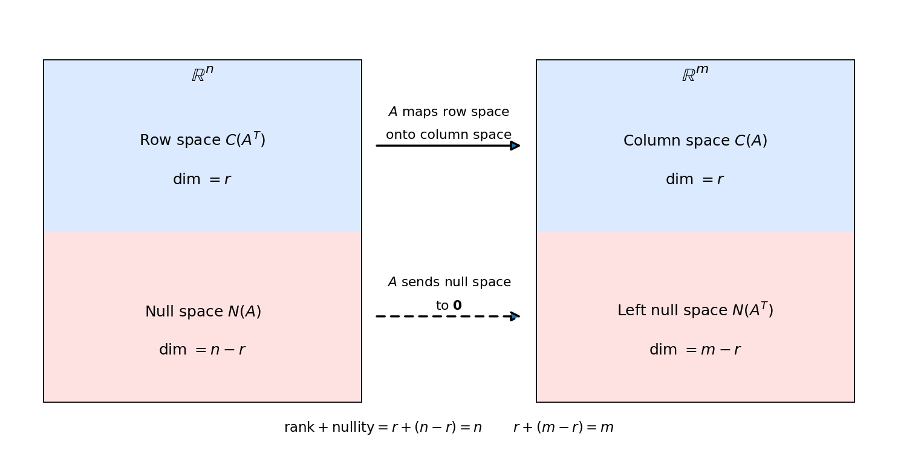

# 4. Vector spaces and the four fundamental subspaces

Chapter 3 asked "when does $Ax = \mathbf{b}$ have a solution?" and answered it with elimination, dependent and independent variables, and the three possible outcomes. This chapter gives those answers their proper home: $vector$ $spaces$. The set of all $\mathbf{x}$ with $Ax = \mathbf{0}$, the set of all $\mathbf{b}$ for which $Ax = \mathbf{b}$ is solvable — both are $subspaces$. And every $m \times n$ matrix carries not one but four of them, tied together by one number: the $rank$.

## 4.1 What is a vector space?

The idea: a set where you can add things and scale things, and the results always stay inside the set, with the familiar arithmetic rules behaving.

**Def.** A $vector$ $space$ = a nonempty set $V$ with two operations — $addition$ ($+$: $V \times V \to V$) and $scalar$ $multiplication$ ($\cdot$: $\mathbb{R} \times V \to V$) — satisfying, for all $\mathbf{u}, \mathbf{v}, \mathbf{w} \in V$ and all scalars $a, b$:

i) $closure$: $\mathbf{u} + \mathbf{v} \in V$ and $a\mathbf{u} \in V$ — the operations never leave the set;
ii) there is a $zero$ $vector$ $\mathbf{0}$ with $\mathbf{u} + \mathbf{0} = \mathbf{u}$;
iii) every $\mathbf{u}$ has a $negative$ $-\mathbf{u}$ with $\mathbf{u} + (-\mathbf{u}) = \mathbf{0}$;
iv) addition behaves: $\mathbf{u} + \mathbf{v} = \mathbf{v} + \mathbf{u}$ and $(\mathbf{u} + \mathbf{v}) + \mathbf{w} = \mathbf{u} + (\mathbf{v} + \mathbf{w})$;
v) scaling behaves: $a(\mathbf{u} + \mathbf{v}) = a\mathbf{u} + a\mathbf{v}$, $(a + b)\mathbf{u} = a\mathbf{u} + b\mathbf{u}$, and $1\mathbf{u} = \mathbf{u}$.

A $vector$ = an element of a vector space. (It is standard to write $a\mathbf{u}$ instead of $a \cdot \mathbf{u}$.)

**eg (the working example).** $\mathbb{R}^n$ with the coordinatewise addition and scaling of §2.3 is a vector space. Its zero vector is $(0, \ldots, 0)$; the negative of $(v_1, \ldots, v_n)$ is $(-v_1, \ldots, -v_n)$.

**eg (vectors need not be lists).** The set $M_{2 \times 3}(\mathbb{R})$ of all $2 \times 3$ matrices of real numbers is a vector space, with matrix addition and scalar multiplication (§2.9). Its zero vector is the $2 \times 3$ zero matrix. So "vectors" are any objects with a good addition and scaling.

Note: the real number $0$ and the zero vector $\mathbf{0}$ share a symbol; the context tells you which one is meant.

**Basically, ...** A vector space = a collection where "add two things" and "stretch one thing" always give you back something in the collection, and all the usual arithmetic rules hold. $\mathbb{R}^n$ is the main one in this book — but even plain matrices qualify as vectors.

## 4.2 Subspaces: spaces inside spaces

**Def.** A $subspace$ = a nonempty subset $W$ of a vector space $V$ that is itself a vector space under the same operations.

You never need to check every axiom to prove something is a subspace — two checks are enough.

**Def (the $subspace$ $test$).** A nonempty $W \subseteq V$ is a subspace iff:

i) it is $closed$ $under$ $addition$: $\mathbf{w}_1, \mathbf{w}_2 \in W \Rightarrow \mathbf{w}_1 + \mathbf{w}_2 \in W$;
ii) it is $closed$ $under$ $scaling$: $\mathbf{w} \in W$, $c \in \mathbb{R} \Rightarrow c\mathbf{w} \in W$.

Shortcut: if $\mathbf{0} \notin W$, it fails at once — since $0\mathbf{w} = \mathbf{0}$ must stay in $W$ by (ii).

**eg (subspace).** The $x$-axis $W = \{(x, 0) : x \in \mathbb{R}\}$ in $\mathbb{R}^2$. Addition: $(x_1, 0) + (x_2, 0) = (x_1 + x_2, 0) \in W$. Scaling: $c(x, 0) = (cx, 0) \in W$. Verdict: subspace.

**eg (not a subspace).** The line $y = x + 1$ in $\mathbb{R}^2$: it misses the origin, $(0, 0) \notin W$. Verdict: not a subspace.

**eg (not a subspace).** The first quadrant $\{(x, y) : x \ge 0,\ y \ge 0\}$: closed under addition, but $(-1)(1, 1) = (-1, -1)$ escapes it. Verdict: not a subspace — scaling by negatives breaks it.

**eg (subspace).** Every $V$ has two $trivial$ $subspaces$: $V$ itself, and $\{\mathbf{0}\}$ (the zero vector alone). Check $\{\mathbf{0}\}$: $\mathbf{0} + \mathbf{0} = \mathbf{0}$ and $c\mathbf{0} = \mathbf{0}$. Verdict: subspace.

**Basically, ...** A subspace = a flat piece through the origin that is "sealed": add or stretch anything inside and you stay inside. A line through the origin qualifies; a line that misses the origin, or a quadrant, does not.

## 4.3 Span: everything a set can reach

**Def.** The $span$ of a set $S$ = the set of all (finite) $linear$ $combinations$ of elements of $S$:
$$\operatorname{span}(S) = \left\{ \sum_{i=1}^{k} \alpha_i \mathbf{v}_i : \mathbf{v}_i \in S,\ \alpha_i \in \mathbb{R} \right\}.$$
$S$ is a $spanning$ $set$ for $V$ if $\operatorname{span}(S) = V$.

Note: $\operatorname{span}(S)$ is always a subspace — adding two combinations gives a combination, and scaling one gives a combination, so the subspace test passes.

**eg (full steps).** $S = \{(1, 1, 0), (1, 0, 0)\} \subset \mathbb{R}^3$:
$$\operatorname{span}(S) = \{a(1, 1, 0) + b(1, 0, 0) : a, b \in \mathbb{R}\} = \{(a + b,\ a,\ 0) : a, b \in \mathbb{R}\}.$$
Write $c = a + b$: then every vector is $(c, a, 0)$ with $c, a$ free — exactly the $xy$-plane (all vectors with third coordinate $0$).

**eg.** $\operatorname{span}\{(1, 0)\} = \{(a, 0) : a \in \mathbb{R}\}$ = the $x$-axis in $\mathbb{R}^2$. And $\{(1, 0), (0, 1)\}$ spans all of $\mathbb{R}^2$, since any $(x, y) = x(1, 0) + y(0, 1)$.

**Basically, ...** The span of a set = "everything you can cook from these ingredients." One nonzero vector in $\mathbb{R}^2$ cooks a whole line; two non-parallel ones cook a whole plane; $(1, 0)$ and $(0, 1)$ cook all of $\mathbb{R}^2$.

## 4.4 Linear independence and dependence

The key question about any set of vectors: is anyone redundant?

**Def.** $\{\mathbf{v}_1, \ldots, \mathbf{v}_k\}$ is $linearly$ $dependent$ if the zero vector can be written as a linear combination with $not$ $all$ $coefficients$ $zero$:
$$\alpha_1 \mathbf{v}_1 + \cdots + \alpha_k \mathbf{v}_k = \mathbf{0} \quad \text{with some } \alpha_i \ne 0.$$
It is $linearly$ $independent$ if the only way to make $\mathbf{0}$ is $\alpha_1 = \cdots = \alpha_k = 0$.

The intuition: dependent = some vector is a combination of the others (redundant); independent = no vector can be built from the rest. Two vectors on the same line, or three vectors on the same plane, are always dependent.

**eg (independence, full steps).** Test $\{(1, 1), (1, -1)\}$. Set
$$a(1, 1) + b(1, -1) = (0, 0).$$
That reads $a + b = 0$ and $a - b = 0$. Adding the two equations: $2a = 0 \Rightarrow a = 0$; then $b = 0$. Only the trivial coefficients work — the set is $independent$.

**eg (dependence, full steps).** Test $\{(1, 2, 4), (2, -1, 2), (5, 0, 8)\}$. Set
$$a(1, 2, 4) + b(2, -1, 2) + c(5, 0, 8) = (0, 0, 0),$$
which reads
$$\begin{aligned}
a + 2b + 5c &= 0 \\
2a - b &= 0 \\
4a + 2b + 8c &= 0.
\end{aligned}$$
Try $a = -1,\ b = -2,\ c = 1$: first, $-1 - 4 + 5 = 0$ ✓; second, $-2 + 2 = 0$ ✓; third, $-4 - 4 + 8 = 0$ ✓. Nonzero coefficients make $\mathbf{0}$ — the set is $dependent$. In fact the third vector was redundant all along: $(5, 0, 8) = (1, 2, 4) + 2(2, -1, 2)$ — check $(1 + 4,\ 2 - 2,\ 4 + 4) = (5, 0, 8)$ ✓.

Note: any set containing the zero vector is dependent at once: $1\cdot\mathbf{0} + 0\cdot(\text{the rest}) = \mathbf{0}$ uses the nonzero coefficient $1$.

**Basically, ...** Independence = "nobody here is a copy of the others." To test: try to build the zero vector from the set. If the only recipe is "use zero of everything," it is independent. If you find any real recipe with nonzero amounts, it is dependent — and one vector is secretly a mix of the rest.

## 4.5 Basis and dimension

**Def.** A $basis$ of $V$ = a set that is linearly independent **and** spans $V$. It is the smallest set that still describes the whole space — no redundancies, nothing missing.

**Def.** The $dimension$ of $V$, $\dim(V)$, = the number of vectors in a basis. (Every basis of the same space has the same size.)

**eg.** The $standard$ $basis$ of $\mathbb{R}^n$: $\mathbf{e}_1 = (1, 0, \ldots, 0)$, $\mathbf{e}_2 = (0, 1, \ldots, 0)$, and so on. Independent (each brings a coordinate no other has), and spanning, since any $(v_1, \ldots, v_n) = v_1\mathbf{e}_1 + \cdots + v_n\mathbf{e}_n$. So $\dim(\mathbb{R}^n) = n$.

**eg (finding a basis, full steps).** Let $W = \operatorname{span}\{(1, 0, 0), (0, 1, 0), (3, 5, 0)\}$ in $\mathbb{R}^3$. The third vector is redundant:
$$(3, 5, 0) = 3(1, 0, 0) + 5(0, 1, 0) \quad \text{— check: } (3 + 0,\ 0 + 5,\ 0) = (3, 5, 0) \text{ ✓}$$
Drop it. The remaining $\{(1, 0, 0), (0, 1, 0)\}$ are independent (neither is a multiple of the other) and still span $W$ (every vector of $W$ was a combination of all three, hence of these two). So it is a basis, and $\dim(W) = 2$ — a plane inside $\mathbb{R}^3$.

**Basically, ...** A basis = the "skeleton crew" of a space: enough vectors to reach everywhere, but nobody redundant. The dimension = how many crew members. A line has dimension 1, a plane 2, all of $\mathbb{R}^3$ has 3.

## 4.6 The column space $C(A)$: where $Ax = \mathbf{b}$ can land

Back to Chapter 3's question: for which $\mathbf{b}$ does $Ax = \mathbf{b}$ have a solution? Write $A = [\mathbf{u}_1 \ \cdots \ \mathbf{u}_n]$ with columns $\mathbf{u}_i$. By the columns view (§2.10),
$$A\mathbf{x} = x_1\mathbf{u}_1 + \cdots + x_n\mathbf{u}_n.$$

**Def.** The $column$ $space$ $C(A)$ = the span of the columns of $A$:
$$C(A) = \operatorname{span}(\mathbf{u}_1, \ldots, \mathbf{u}_n) = \{\text{all linear combinations of the columns}\}.$$
It is a subspace of $\mathbb{R}^m$ (each column has $m$ entries).

The payoff, straight from the definition: **$Ax = \mathbf{b}$ is solvable iff $\mathbf{b} \in C(A)$** — solving is asking "which recipe of columns makes $\mathbf{b}$?", and $\mathbf{b}$ must be reachable by some recipe.

**eg (the lecture's example).**
$$A = \begin{pmatrix} 1 & 1 & 2 \\ 2 & 1 & 3 \\ 3 & 1 & 4 \\ 4 & 1 & 5 \end{pmatrix} \qquad (4 \times 3).$$
Spot the redundancy: column 3 = column 1 + column 2. Check: $(1+1,\ 2+1,\ 3+1,\ 4+1) = (2, 3, 4, 5)$ ✓. So
$$C(A) = \operatorname{span}(\text{col 1},\ \text{col 2}) = \operatorname{span}\left\{\begin{pmatrix}1\\2\\3\\4\end{pmatrix}, \begin{pmatrix}1\\1\\1\\1\end{pmatrix}\right\},$$
a two-dimensional subspace of $\mathbb{R}^4$ (a plane inside 4-D space). Not every $\mathbf{b} \in \mathbb{R}^4$ lies in it — no surprise, since $Ax = \mathbf{b}$ is 4 equations in 3 unknowns.

**Basically, ...** The column space = every output the machine $A$ can ever produce. Asking "does $Ax = \mathbf{b}$ have a solution?" = asking "is $\mathbf{b}$ on the menu?" If $\mathbf{b}$ is off the menu (outside the column space), no solution exists — no recipe of columns can make it.

## 4.7 The null space $N(A)$: everything $A$ kills

**Def.** The $null$ $space$ $N(A)$ = the set of all $\mathbf{x}$ with $A\mathbf{x} = \mathbf{0}$:
$$N(A) = \{\mathbf{x} \mid A\mathbf{x} = \mathbf{0}\}.$$
It is a subspace of $\mathbb{R}^n$. Why? Take $\mathbf{x}_1, \mathbf{x}_2 \in N(A)$: then $A\mathbf{x}_1 = \mathbf{0}$ and $A\mathbf{x}_2 = \mathbf{0}$, so
$$A(\mathbf{x}_1 + \mathbf{x}_2) = A\mathbf{x}_1 + A\mathbf{x}_2 = \mathbf{0} + \mathbf{0} = \mathbf{0}$$
— closed under addition. And $A(\alpha\mathbf{x}) = \alpha A\mathbf{x} = \mathbf{0}$ — closed under scaling. Both halves of the subspace test (§4.2) pass.

**eg (same $A$ as §4.6).** Find $\mathbf{x}$ with $A\mathbf{x} = \mathbf{0}$: a combination of the columns that makes the zero vector. Since col 3 = col 1 + col 2,
$$1\cdot\text{col 1} + 1\cdot\text{col 2} - 1\cdot\text{col 3} = \mathbf{0},$$
so $\mathbf{x} = (1, 1, -1)^T \in N(A)$. Check: $A\mathbf{x} = (1+1-2,\ 2+1-3,\ 3+1-4,\ 4+1-5)^T = (0, 0, 0, 0)^T$ ✓. So
$$N(A) = \{t(1, 1, -1)^T : t \in \mathbb{R}\},$$
a line in $\mathbb{R}^3$.

Note (the two extreme cases). i) If $A$ is $invertible$: $N(A) = \{\mathbf{0}\}$ only, $C(A)$ is the whole space, and $Ax = \mathbf{b}$ has the unique solution $\mathbf{x} = A^{-1}\mathbf{b}$ (§3.6). ii) Otherwise $N(A)$ holds some nonzero $\mathbf{x}_n$, and every solution of $Ax = \mathbf{b}$ looks like $\mathbf{x} = \mathbf{x}_p + \mathbf{x}_n$ with $A\mathbf{x}_p = \mathbf{b}$ and $A\mathbf{x}_n = \mathbf{0}$ — one particular solution plus anything the machine kills. Check: $A(\mathbf{x}_p + \mathbf{x}_n) = \mathbf{b} + \mathbf{0} = \mathbf{b}$ ✓.

**Basically, ...** The null space = the directions the machine $A$ squashes flat to zero. If nothing nonzero gets squashed ($N(A) = \{\mathbf{0}\}$), each output comes from exactly one input — unique solutions. If some direction does get squashed, you can slide along it without changing the output — infinitely many solutions.

## 4.8 Reading bases off the RREF: rank and nullity

Gaussian elimination (§3.5) doesn't just solve $Ax = \mathbf{b}$ — its pivot positions hand you bases for $C(A)$ and $N(A)$.

**eg (full elimination).**
$$A = \begin{pmatrix} 1 & 2 & 2 & 2 \\ 2 & 4 & 6 & 8 \\ 3 & 6 & 8 & 10 \end{pmatrix}.$$
Eliminate: $R_2 \leftarrow R_2 - 2R_1$ gives $[0,\ 0,\ 2,\ 4]$; $R_3 \leftarrow R_3 - 3R_1$ gives $[0,\ 0,\ 2,\ 4]$; then $R_3 \leftarrow R_3 - R_2$ gives $[0,\ 0,\ 0,\ 0]$:
$$U = \begin{pmatrix} 1 & 2 & 2 & 2 \\ 0 & 0 & 2 & 4 \\ 0 & 0 & 0 & 0 \end{pmatrix}.$$
Pivots sit in columns 1 and 3 — the $pivot$ $columns$; $x_2$ and $x_4$ are the $free$ $variables$.

i) $C(A)$: the columns of the *original* $A$ in the pivot positions form a basis:
$$C(A) = \operatorname{span}\left\{\begin{pmatrix}1\\2\\3\end{pmatrix}, \begin{pmatrix}2\\6\\8\end{pmatrix}\right\}, \qquad \dim C(A) = 2.$$

ii) $N(A)$: solve $U\mathbf{x} = \mathbf{0}$ — $x_1 + 2x_2 + 2x_3 + 2x_4 = 0$ and $2x_3 + 4x_4 = 0$, so $x_3 = -2x_4$. Give each free variable its turn:
- Set $x_2 = 1,\ x_4 = 0$: then $x_3 = 0$ and $x_1 = -2(1) - 2(0) - 2(0) = -2$, so $\mathbf{u} = (-2, 1, 0, 0)^T \in N(A)$.
- Set $x_2 = 0,\ x_4 = 1$: then $x_3 = -2$ and $x_1 = -2(0) - 2(-2) - 2(1) = 2$, so $\mathbf{v} = (2, 0, -2, 1)^T \in N(A)$.

Verify against the original $A$: $A\mathbf{u} = (-2+2,\ -4+4,\ -6+6)^T = \mathbf{0}$ ✓; $A\mathbf{v} = (2-4+2,\ 4-12+8,\ 6-16+10)^T = \mathbf{0}$ ✓. Every solution is a combination of $\mathbf{u}$ and $\mathbf{v}$:
$$N(A) = \operatorname{span}(\mathbf{u}, \mathbf{v}), \qquad \dim N(A) = 2.$$

**Def.** The $rank$ of $A$ = the number of pivot columns = $\dim C(A)$. The $nullity$ of $A$ = the number of free variables = $\dim N(A)$.

Here $\operatorname{rank}(A) = 2$ and $\operatorname{nullity}(A) = 2$. Every column is either a pivot column or a free column, so for an $m \times n$ matrix:

**The $rank$-$nullity$ $theorem$.** $\operatorname{rank}(A) + \operatorname{nullity}(A) = n$ (the number of columns). In subspace language: $\dim C(A) + \dim N(A) = n$.

**Basically, ...** Elimination sorts the columns into two teams: pivot columns (the independent crew — they span the column space, and their count is the rank) and free columns (each one spawns a null-space direction — their count is the nullity). Every column joins exactly one team, so rank + nullity = number of columns. The free variables of §3.5 were null-space basis vectors all along: one basis vector per free variable.

## 4.9 The other two: row space and left null space

Everything so far came from $A$. Transpose it, and you get two more subspaces.

**Def.** The $row$ $space$ of $A$ = the column space of $A^T$ — the span of the *rows* of $A$. (The lecture calls it $R(A) = C(A^T)$.) It is a subspace of $\mathbb{R}^n$.

**Def.** The $left$ $null$ $space$ of $A$ = $N(A^T) = \{\mathbf{y} \mid A^T\mathbf{y} = \mathbf{0}\} = \{\mathbf{y} \mid \mathbf{y}^T A = \mathbf{0}\}$ — the combinations of the *rows* of $A$ that make the zero vector. It is a subspace of $\mathbb{R}^m$.

An important fact: $column$ $rank$ = $\dim C(A)$ equals $row$ $rank$ = $\dim C(A^T)$ — both are the rank $r$. Applying rank-nullity to $A^T$ (which is $n \times m$) gives $\dim C(A^T) + \dim N(A^T) = m$, so $\dim N(A^T) = m - r$. The full picture:

| Subspace | Symbol | Lives in | Dimension |
|---|---|---|---|
| Column space | $C(A)$ | $\mathbb{R}^m$ | $r$ |
| Null space | $N(A)$ | $\mathbb{R}^n$ | $n - r$ |
| Row space | $C(A^T)$ | $\mathbb{R}^n$ | $r$ |
| Left null space | $N(A^T)$ | $\mathbb{R}^m$ | $m - r$ |

**eg (left null space).** For the $3 \times 4$ $A$ of §4.8, the row combination $[1\ \ 1\ \ {-1}]$ kills every column:
$$1\cdot(1, 2, 2, 2) + 1\cdot(2, 4, 6, 8) - 1\cdot(3, 6, 8, 10) = (0, 0, 0, 0).$$
Check entry by entry: $1+2-3 = 0$; $2+4-6 = 0$; $2+6-8 = 0$; $2+8-10 = 0$ ✓. So $(1, 1, -1)^T \in N(A^T)$ — a line in $\mathbb{R}^3$, and indeed $\dim N(A^T) = m - r = 3 - 2 = 1$.

**eg (all four at once).** $A = \begin{pmatrix} 1 & 2 \\ 3 & 6 \end{pmatrix}$ ($m = n = 2$):

- $C(A)$ = line through $\begin{pmatrix}1\\3\end{pmatrix}$ (col 2 = 2 · col 1) — $\operatorname{rank}(A) = r = 1$.
- $N(A)$ = line through $\begin{pmatrix}-2\\1\end{pmatrix}$ (from $x + 2y = 0$); check $A\begin{pmatrix}-2\\1\end{pmatrix} = (-2+2,\ -6+6)^T = \mathbf{0}$ ✓ — nullity $= n - r = 1$.
- Row space $C(A^T)$ = line through $\begin{pmatrix}1\\2\end{pmatrix}$ (row 2 = 3 · row 1) — dimension $r = 1$.
- $N(A^T)$ = line through $\begin{pmatrix}-3\\1\end{pmatrix}$ (from $y_1 + 3y_2 = 0$ on $A^T$); check $A^T\begin{pmatrix}-3\\1\end{pmatrix} = (-3+3,\ -6+6)^T = \mathbf{0}$ ✓ — dimension $m - r = 1$.

<!-- Source: original illustration drawn for this chapter with matplotlib; no external source -->

**Basically, ...** A matrix has four natural "clubs": the outputs it can make (column space), the inputs it kills (null space), the independent rows it was built from (row space), and the row-recipes that cancel out (left null space). Their sizes always add up: $r + (n-r) = n$ columns' worth inside $\mathbb{R}^n$, $r + (m-r) = m$ rows' worth inside $\mathbb{R}^m$.

## 4.10 The big payoff: the three outcomes of $Ax = \mathbf{b}$, explained

Chapter 3 met the three outcomes by elimination. The subspaces name them:

i) $No$ $solution$ $\iff$ $\mathbf{b} \notin C(A)$. (The $0 = c_i \ne 0$ row of §3.5 is elimination discovering that $\mathbf{b}$ is off the menu.)
ii) $Unique$ $solution$ $\iff$ $\mathbf{b} \in C(A)$ **and** $N(A) = \{\mathbf{0}\}$ — then $\mathbf{x} = A^{-1}\mathbf{b}$ when $A$ is square invertible. $N(A) = \{\mathbf{0}\}$ means no free variables: every column is a pivot column ($r = n$), so each recipe of columns is the only one.
iii) $Infinitely$ $many$ $solutions$ $\iff$ $\mathbf{b} \in C(A)$ **and** $N(A)$ holds a nonzero vector. Every solution is $\mathbf{x} = \mathbf{x}_p + \mathbf{x}_n$: one particular recipe $\mathbf{x}_p$ ($A\mathbf{x}_p = \mathbf{b}$) plus any direction the machine kills ($A\mathbf{x}_n = \mathbf{0}$).

And §3.5's "independent (free) variables" are exactly the null space made concrete: each free variable contributes one basis vector of $N(A)$, so
$$\text{(number of free variables)} = \operatorname{nullity}(A) = \dim N(A).$$
"Infinitely many solutions" in Chapter 3 = "some variable is free" = "the null space is bigger than $\{\mathbf{0}\}$" here.

**Basically, ...** Chapter 3 gave you the *procedure* (eliminate, count free variables); this chapter gives you the *meaning*. Solvable = "$\mathbf{b}$ is in the column space." Unique = "nothing gets killed." Infinite = "something gets killed, so you can slide along it." The free variables of §3.5 were null-space basis vectors all along.

## Problem set

1. One-line verdict for each: is it a subspace of the stated space? (a) The line $y = 3x$ in $\mathbb{R}^2$. (b) The first quadrant $\{(x, y) : x \ge 0,\ y \ge 0\}$ in $\mathbb{R}^2$. (c) $\{(0, 0, 0)\}$ in $\mathbb{R}^3$. (d) The line $y = x + 1$ in $\mathbb{R}^2$.
2. Describe $\operatorname{span}\{(1, 1)\}$ in $\mathbb{R}^2$ and $\operatorname{span}\{(1, 1, 1)\}$ in $\mathbb{R}^3$ geometrically, with parametric descriptions.
3. Test $\{(1, 2), (-1, 2)\}$ for linear independence, showing all steps.
4. Find a basis and the dimension for $W = \operatorname{span}\{(1, 1, 0), (1, 0, 0), (2, 1, 0)\}$ in $\mathbb{R}^3$.
5. $A$ is $5 \times 7$ with $\operatorname{rank}(A) = 4$. Find $\operatorname{nullity}(A)$, $\dim C(A^T)$, and $\dim N(A^T)$.
6. Explain why the columns of $A$ are linearly independent iff $N(A) = \{\mathbf{0}\}$.
7. For $A = \begin{pmatrix} 1 & 2 \\ 3 & 6 \end{pmatrix}$, describe exactly which $\mathbf{b} = (b_1, b_2)^T$ make $Ax = \mathbf{b}$ solvable, as a condition on $b_1, b_2$.
8. (The lecture's homework.) Work out the four fundamental subspaces of $A = \begin{pmatrix} 1 & 3 & 3 & 2 \\ 2 & 6 & 9 & 7 \\ -1 & -3 & 3 & 4 \end{pmatrix}$: give a basis and the dimension for each of $C(A)$, $N(A)$, $C(A^T)$, $N(A^T)$, plus $\operatorname{rank}(A)$ and $\operatorname{nullity}(A)$.
9. True or false, with a reason: (a) $\operatorname{rank}(A)$ = number of pivot columns = number of nonzero rows in the RREF of $A$. (b) If $A$ is $m \times n$ with $m < n$, then $Ax = \mathbf{b}$ always has infinitely many solutions. (c) $N(A)$ is always a subspace of $\mathbb{R}^n$.
10. $A$ is $4 \times 4$ and invertible. State the dimension of each of the four fundamental subspaces, and say how many solutions $Ax = \mathbf{b}$ has for any $\mathbf{b}$.

## Where this goes next

- **Chapter 5 (orthogonality):** the four subspaces come in orthogonal pairs — $C(A)$ with $N(A^T)$, and $C(A^T)$ with $N(A)$. That geometry is what makes projections and least squares work.
- **Chapter 6 (eigen-stuff):** eigenvectors live in special subspaces of a square matrix — $N(A - \lambda I)$ for each eigenvalue $\lambda$.
