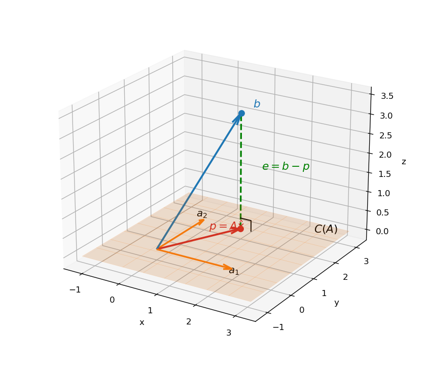

# 5. Orthogonality, projections, least squares

## 5.1 What this chapter is for

Most of machine learning is, quietly, the business of solving $A\mathbf{x} = \mathbf{b}$. Chapter 3 gave three possible outcomes for that system; Chapter 4 named them geometrically: a solution exists iff $\mathbf{b}$ is in the $column$ $space$ $C(A)$ (§4.10).

But real data is uncooperative. You measure more data points than you have unknowns, the measurements carry $noise$, and the tall system $A\mathbf{x} = \mathbf{b}$ has **no** solution — $\mathbf{b}$ is not in $C(A)$. Throwing away equations until it solves is a bad deal: it dumps all the error onto the equations you dropped.

The better deal is the $least$ $squares$ $idea$: keep every equation, and find the $\mathbf{x}$ that makes the total squared miss $\lVert A\mathbf{x} - \mathbf{b} \rVert^2$ as small as possible. The engine that finds it is the $orthogonal$ $projection$ of $\mathbf{b}$ onto $C(A)$. So this chapter answers three questions, in order:

i) What does $orthogonal$ mean — for vectors, and for whole subspaces?
ii) How do we $project$ a vector onto a line, and onto a subspace?
iii) How do projections solve the $least$ $squares$ $problem$?

**Basically, ...** When the target is off the shelf of reachable answers, don't stretch — drop straight down onto the nearest point of the shelf. Orthogonality tells you which direction is "straight down."

## 5.2 Orthogonal vectors

From Chapter 2 (§2.5): for $\mathbf{x}, \mathbf{y} \in \mathbb{R}^n$, the $dot$ $product$ is $\mathbf{x}^T\mathbf{y} = x_1y_1 + \cdots + x_ny_n$, and the $length$ is $\lVert \mathbf{x} \rVert = \sqrt{\mathbf{x}^T\mathbf{x}}$.

**Def.** $\mathbf{x}$ is $orthogonal$ to $\mathbf{y}$ if $\mathbf{x}^T\mathbf{y} = 0$.

This is exactly the $right$ $angle$ from school geometry, and $Pythagoras$ $theorem$ proves it. If $\mathbf{x}$ and $\mathbf{y}$ meet at a right angle, then $\lVert \mathbf{x} + \mathbf{y} \rVert^2 = \lVert \mathbf{x} \rVert^2 + \lVert \mathbf{y} \rVert^2$. Expand the left side:
$$(\mathbf{x} + \mathbf{y})^T(\mathbf{x} + \mathbf{y}) = \mathbf{x}^T\mathbf{x} + \mathbf{y}^T\mathbf{y} + 2\,\mathbf{x}^T\mathbf{y}.$$
The cross term dies iff $\mathbf{x}^T\mathbf{y} = 0$. So: right angle $\iff$ dot product zero.

**eg (full steps).** $(1, 2)$ and $(-2, 1)$: $(1)(−2) + (2)(1) = -2 + 2 = 0$ — orthogonal. Pythagoras check: $\lVert(1,2)\rVert^2 = 5$, $\lVert(-2,1)\rVert^2 = 5$, and their sum is $(-1, 3)$ with $\lVert(-1,3)\rVert^2 = 1 + 9 = 10 = 5 + 5$ ✓.

Two small facts the lecture flags:

i) $\mathbf{0}$ is orthogonal to every $\mathbf{x}$: $\mathbf{0}^T\mathbf{x} = 0$ always.
ii) $Mutually$ $orthogonal$ nonzero vectors are $linearly$ $independent$. Proof: suppose $c_1\mathbf{v}_1 + \cdots + c_k\mathbf{v}_k = \mathbf{0}$. Dot both sides with $\mathbf{v}_1$: everything dies except $c_1\,\mathbf{v}_1^T\mathbf{v}_1 = 0$. Since $\mathbf{v}_1 \ne \mathbf{0}$, $\mathbf{v}_1^T\mathbf{v}_1 > 0$, so $c_1 = 0$. Repeat with $\mathbf{v}_2, \ldots, \mathbf{v}_k$.

**Basically, ...** Orthogonal = at right angles = dot product is zero. That's the whole test, and it's why the zero vector is "perpendicular to everything" (its dot product with anything is 0).

## 5.3 Orthogonal subspaces

**Def.** Two $subspaces$ $U$ and $V$ are $orthogonal$ if $\mathbf{x}^T\mathbf{y} = 0$ for **every** $\mathbf{x} \in U$ and **every** $\mathbf{y} \in V$.

**eg.** $U = \operatorname{span}\{(1,0,0,0), (0,1,0,0)\}$ (the $x_1x_2$-plane in $\mathbb{R}^4$) and $V = \operatorname{span}\{(0,0,1,0), (0,0,0,1)\}$ (the $x_3x_4$-plane): any vector of $U$ has the form $(x_1, x_2, 0, 0)$, any vector of $V$ the form $(0, 0, y_3, y_4)$, and their dot product is always $0$.

Now the payoff from Chapter 4: the four $fundamental$ $subspaces$ pair up orthogonally.

i) $Row$ $space$ $\perp$ $null$ $space$: $C(A^T) \perp N(A)$. Proof: take $\mathbf{x} \in N(A)$, i.e. $A\mathbf{x} = \mathbf{0}$. Row by row, that equation says $(\text{row}_i \text{ of } A)^T\mathbf{x} = 0$ — every row of $A$ is orthogonal to $\mathbf{x}$. Any $linear$ $combination$ of rows is therefore orthogonal to $\mathbf{x}$ too, and linear combinations of rows are exactly the row space.
ii) $Column$ $space$ $\perp$ $left$ $null$ $space$: $C(A) \perp N(A^T)$. This is the same claim applied to $A^T$.

They are not just orthogonal — they are $orthogonal$ $complements$. The dimensions add up to the full space (Chapter 4's table: $r + (n-r) = n$ and $r + (m-r) = m$), so every vector of $\mathbb{R}^n$ splits uniquely into a row-space piece plus a null-space piece, and every vector of $\mathbb{R}^m$ into a column-space piece plus a left-null-space piece. That split $\mathbf{b} = \mathbf{p} + \mathbf{e}$ is exactly what least squares computes.

**eg (the lecture's example, full steps).** $A = \begin{pmatrix} 1 & 2 \\ 2 & 4 \\ 3 & 6 \end{pmatrix}$. Column 2 = 2 · column 1, so $C(A)$ is the line through $(1, 2, 3)^T$ (rank 1). $N(A)$: $x + 2y = 0$ gives the line through $(-2, 1)^T$. The row space: rows are $(1,2)$, $2(1,2)$, $3(1,2)$ — the line through $(1, 2)$ in $\mathbb{R}^2$. Check pair i): $(1, 2) \cdot (-2, 1) = -2 + 2 = 0$ ✓. $N(A^T)$: $\mathbf{y}^TA = \mathbf{0}$ reads $y_1 + 2y_2 + 3y_3 = 0$ — a plane in $\mathbb{R}^3$; pair ii) holds there by the same row argument. Dimension check: $\dim C(A^T) + \dim N(A) = 1 + 1 = 2 = n$; $\dim C(A) + \dim N(A^T) = 1 + 2 = 3 = m$ ✓.

**Basically, ...** The four subspaces from Chapter 4 come in two right-angle pairs: input side ($row$ $space$ ⊥ $null$ $space$) and output side ($column$ $space$ ⊥ $left$ $null$ $space$). Whatever $A$ can reach is perpendicular to whatever kills its transpose.

## 5.4 Orthonormal sets, and the $Q^TQ = I$ fact

**Def.** Vectors are $orthonormal$ if they are $orthogonal$ **and** each has $unit$ $length$.

**eg.** $(1, 0)$ and $(0, 1)$. **eg.** $(\cos\theta, \sin\theta)$ and $(-\sin\theta, \cos\theta)$: dot product $= -\cos\theta\sin\theta + \sin\theta\cos\theta = 0$; each length squared $= \cos^2\theta + \sin^2\theta = 1$ ✓.

Now put orthonormal vectors $\mathbf{q}_1, \ldots, \mathbf{q}_n$ as the columns of a matrix $Q$. Then
$$Q^TQ = I.$$
Why: the $(i, j)$ entry of $Q^TQ$ is $\mathbf{q}_i^T\mathbf{q}_j$, which is $1$ when $i = j$ (unit length) and $0$ when $i \ne j$ (orthogonal). That is the whole content of the identity matrix.

**eg ($Q^TQ = I$, full steps).** $Q = \frac{1}{\sqrt{2}}\begin{pmatrix} 1 & 1 \\ 1 & -1 \end{pmatrix}$, columns $\mathbf{q}_1 = \frac{1}{\sqrt{2}}(1, 1)^T$, $\mathbf{q}_2 = \frac{1}{\sqrt{2}}(1, -1)^T$. Check orthonormality: $\mathbf{q}_1^T\mathbf{q}_2 = \frac{1}{2}(1 - 1) = 0$; $\lVert\mathbf{q}_1\rVert^2 = \frac{1}{2}(1 + 1) = 1$, same for $\mathbf{q}_2$ ✓. Direct multiply:
$$Q^TQ = \frac{1}{2}\begin{pmatrix} 1 & 1 \\ 1 & -1 \end{pmatrix}\begin{pmatrix} 1 & 1 \\ 1 & -1 \end{pmatrix} = \frac{1}{2}\begin{pmatrix} 2 & 0 \\ 0 & 2 \end{pmatrix} = \begin{pmatrix} 1 & 0 \\ 0 & 1 \end{pmatrix} = I.$$

**Basically, ...** Orthonormal = "unit-length directions at right angles to each other." $Q^TQ = I$ is the matrix way of writing exactly that — the columns agree to be perpendicular unit vectors.

## 5.5 Why project? The inconsistent case

Chapter 4 §4.10 gave the verdict: $A\mathbf{x} = \mathbf{b}$ has no solution iff $\mathbf{b} \notin C(A)$. Now suppose that is the situation — for instance

$$2x = b_1, \quad 3x = b_2, \quad 4x = b_3, \qquad\text{or}\qquad x + 2y = 4,\ x + 3y = 5,\ 2x + 4y = 6.$$

Three (or more) equations, fewer unknowns, and in general the data does not line up. The lecture calls these $inconsistent$ $systems$.

You could solve any two of the equations exactly and throw the rest away. The problem: the discarded equations then carry huge errors while the kept ones carry none — an arbitrary, lopsided answer. The reasonable alternative is to **spread the error**: keep every equation and make the total $squared$ $error$ $\lVert A\mathbf{x} - \mathbf{b} \rVert^2$ as small as possible. That is $least$ $squares$, and its geometric form is: find the point $\mathbf{p}$ of $C(A)$ closest to $\mathbf{b}$ — the $projection$ of $\mathbf{b}$ onto the column space.

**Basically, ...** No exact answer exists, so find the nearest reachable one. "Nearest" needs a notion of perpendicular — which is why this whole chapter runs on orthogonality.

## 5.6 Projection onto a line

Start with the simplest case: a line through a vector $\mathbf{a}$. Given $\mathbf{b}$, its $projection$ $\mathbf{p}$ is the point on the line closest to $\mathbf{b}$; the $error$ $\mathbf{e} = \mathbf{b} - \mathbf{p}$ sticks out at a right angle to the line.

Write $\mathbf{p} = \hat{x}\mathbf{a}$ (some scalar multiple of $\mathbf{a}$) and enforce the right angle:
$$\mathbf{a}^T\mathbf{e} = 0 \;\Rightarrow\; \mathbf{a}^T(\mathbf{b} - \hat{x}\mathbf{a}) = 0 \;\Rightarrow\; \hat{x} = \frac{\mathbf{a}^T\mathbf{b}}{\mathbf{a}^T\mathbf{a}}.$$
So the projection is
$$\mathbf{p} = \frac{\mathbf{a}^T\mathbf{b}}{\mathbf{a}^T\mathbf{a}}\,\mathbf{a} = \left(\frac{\mathbf{a}\mathbf{a}^T}{\mathbf{a}^T\mathbf{a}}\right)\mathbf{b}.$$

**eg (full steps).** $\mathbf{b} = (1, 2, 3)^T$, $\mathbf{a} = (1, 1, 1)^T$. $\mathbf{a}^T\mathbf{b} = 1 + 2 + 3 = 6$; $\mathbf{a}^T\mathbf{a} = 1 + 1 + 1 = 3$; $\hat{x} = 6/3 = 2$. $\mathbf{p} = 2(1,1,1)^T = (2, 2, 2)^T$. $\mathbf{e} = \mathbf{b} - \mathbf{p} = (-1, 0, 1)^T$. Check the right angle: $\mathbf{a}^T\mathbf{e} = -1 + 0 + 1 = 0$ ✓.

The $projection$ $matrix$ $P = \dfrac{\mathbf{a}\mathbf{a}^T}{\mathbf{a}^T\mathbf{a}}$ turns any $\mathbf{b}$ into its projection: $\mathbf{p} = P\mathbf{b}$.

**eg (the lecture's $P$, full steps).** $\mathbf{a} = (1, 1, 1)^T$: $P = \frac{1}{3}\begin{pmatrix} 1 & 1 & 1 \\ 1 & 1 & 1 \\ 1 & 1 & 1 \end{pmatrix}$. Apply to $\mathbf{b} = (1, 2, 3)^T$: $P\mathbf{b} = \frac{1}{3}(6, 6, 6)^T = (2, 2, 2)^T$ — same $\mathbf{p}$ as above ✓. Apply to $(1, 0, 0)^T$: $P(1,0,0)^T = (1/3, 1/3, 1/3)^T$ — projecting onto $(1,1,1)$ returns the **average** of the entries.

Three things to notice about $P$ (the lecture checks each):

i) $P^T = P$ — $P$ is $symmetric$ (transpose the formula and it is unchanged).
ii) $P^2 = P$ — projecting twice is the same as projecting once: $P\mathbf{b}$ already lies on the line, so projecting again does nothing.
iii) $C(P)$ is the line through $\mathbf{a}$, $N(P)$ is the plane orthogonal to $\mathbf{a}$, $\operatorname{rank}(P) = 1$.

Also: replacing $\mathbf{a}$ by $2\mathbf{a}$ (same line!) leaves $P$ unchanged — the $4$'s cancel top and bottom. The projection matrix cares about the **line**, not the vector you named it with.

**eg (the mean as a projection).** $x = 1,\ x = 2$ is inconsistent ($A = (1,1)^T$, $\mathbf{b} = (1,2)^T$). $\hat{x} = \frac{\mathbf{a}^T\mathbf{b}}{\mathbf{a}^T\mathbf{a}} = \frac{1 + 2}{2} = \frac{3}{2}$ — the average of the two measurements. Least squares on one unknown is just averaging.

Note (a free theorem): the projection proof gives $Cauchy$–$Schwarz$ almost for free. $\lVert\mathbf{e}\rVert^2 \ge 0$ with $\mathbf{e} = \mathbf{b} - \dfrac{\mathbf{a}^T\mathbf{b}}{\mathbf{a}^T\mathbf{a}}\mathbf{a}$ expands to $\mathbf{b}^T\mathbf{b} - \dfrac{(\mathbf{a}^T\mathbf{b})^2}{\mathbf{a}^T\mathbf{a}} \ge 0$, i.e.
$$|\mathbf{a}^T\mathbf{b}| \le \lVert\mathbf{a}\rVert\,\lVert\mathbf{b}\rVert.$$
Equality holds exactly when $\mathbf{b}$ is already a multiple of $\mathbf{a}$ (so $\mathbf{e} = \mathbf{0}$).

**Basically, ...** Projection = the shadow of $\mathbf{b}$ cast straight down onto the line. $P$ is the shadow machine: feed it any vector, it returns the shadow. Shadows of shadows don't move ($P^2 = P$), and the machine is symmetric ($P^T = P$).

## 5.7 Projection onto a subspace

Now the general case: $A$ is $m \times n$ with more equations than unknowns, and we want the projection $\mathbf{p}$ of $\mathbf{b}$ onto the $column$ $space$ $C(A)$.

The logic is identical to the line case, one dimension up. Write $\mathbf{p} = A\hat{\mathbf{x}}$ (some combination of the columns) and demand the error be orthogonal to the whole space:
$$\mathbf{e} = \mathbf{b} - A\hat{\mathbf{x}} \;\perp\; C(A).$$
The lecture derives what this forces in two ways:

i) $Orthogonal$-$complement$ $route$: $\mathbf{e}$ is orthogonal to every vector of $C(A)$, and §5.3 says the orthogonal complement of $C(A)$ is $N(A^T)$. So $\mathbf{e} \in N(A^T)$, i.e. $A^T\mathbf{e} = \mathbf{0}$.
ii) $First$-$principles$ $route$: write $A = [\mathbf{a}_1 \cdots \mathbf{a}_n]$. $\mathbf{e} \perp C(A)$ means $\mathbf{a}_i^T\mathbf{e} = 0$ for every column; stacking those rows gives $A^T\mathbf{e} = \mathbf{0}$.

Either way, with $\mathbf{e} = \mathbf{b} - A\hat{\mathbf{x}}$:
$$A^T(\mathbf{b} - A\hat{\mathbf{x}}) = \mathbf{0} \quad\Longrightarrow\quad A^TA\hat{\mathbf{x}} = A^T\mathbf{b}.$$
These are the $normal$ $equations$ — the single most important equation of this chapter (and the one Chapter 3 §3.1 previewed). Even when $A\mathbf{x} = \mathbf{b}$ is inconsistent, $A^TA\hat{\mathbf{x}} = A^T\mathbf{b}$ always has a solution.

If the columns of $A$ are $linearly$ $independent$, $A^TA$ is $invertible$ (proof: $A^TA\mathbf{x} = \mathbf{0} \Rightarrow \mathbf{x}^TA^TA\mathbf{x} = \lVert A\mathbf{x} \rVert^2 = 0 \Rightarrow A\mathbf{x} = \mathbf{0} \Rightarrow \mathbf{x} = \mathbf{0}$, so $A^TA$ kills nothing). Then
$$\hat{\mathbf{x}} = (A^TA)^{-1}A^T\mathbf{b}, \qquad \mathbf{p} = A\hat{\mathbf{x}} = \underbrace{A(A^TA)^{-1}A^T}_{P}\mathbf{b}.$$

The general $projection$ $matrix$ is $P = A(A^TA)^{-1}A^T$. Check its two properties:

i) $P^T = P$: transpose reverses the product, $(A^TA)^{-1}$ is symmetric because $A^TA$ is ($(A^TA)^T = A^T(A^T)^T = A^TA$), and everything folds back to $P$.
ii) $P^2 = P$: $A(A^TA)^{-1}\underbrace{A^TA(A^TA)^{-1}}A^T = A(A^TA)^{-1}A^T$ — the middle pair cancels to $I$.

The converse holds too: $P^2 = P$ and $P^T = P$ imply $P$ is the projection matrix onto $C(P)$, because $(\mathbf{b} - P\mathbf{b})^T(P\mathbf{c}) = \mathbf{b}^T(I - P)P\mathbf{c} = \mathbf{b}^T(P - P^2)\mathbf{c} = 0$ — the error is orthogonal to everything in the column space.

Four sanity checks (the lecture's special cases):

- $\mathbf{b} \in C(A)$, say $\mathbf{b} = A\mathbf{x}$: $P\mathbf{b} = A(A^TA)^{-1}A^TA\mathbf{x} = A\mathbf{x} = \mathbf{b}$ — already in the space, projection does nothing.
- $\mathbf{b} \in N(A^T)$: $A^T\mathbf{b} = \mathbf{0} \Rightarrow P\mathbf{b} = \mathbf{0}$ — fully perpendicular, projection kills it.
- $A$ square and invertible: $P = A(A^TA)^{-1}A^T = I$ — the column space is all of $\mathbb{R}^n$, every $\mathbf{b}$ is already there.
- Rank 1 ($A = \mathbf{a}$): $P = \mathbf{a}\mathbf{a}^T/\mathbf{a}^T\mathbf{a}$ — back to §5.6, as it must.

$Orthonormal$-$basis$ $shortcut$: if $\mathbf{q}_1, \ldots, \mathbf{q}_r$ is an orthonormal basis of the subspace, then $Q^TQ = I$ collapses the formula to $P = QQ^T$, and
$$\mathbf{p} = \sum_{i=1}^{r} (\mathbf{q}_i^T\mathbf{b})\,\mathbf{q}_i.$$
Project onto each basis direction (a line projection, §5.6), add the pieces.

**eg (projection onto a plane, full steps — this is the figure below).** $C(A)$ = the $xy$-plane, spanned by the orthonormal $\mathbf{q}_1 = \frac{1}{\sqrt{2}}(1, 1, 0)^T$, $\mathbf{q}_2 = \frac{1}{\sqrt{2}}(1, -1, 0)^T$ (§5.4). Project $\mathbf{b} = (1, 2, 3)^T$:
$$\mathbf{q}_1^T\mathbf{b} = \frac{3}{\sqrt{2}}, \qquad \mathbf{q}_2^T\mathbf{b} = \frac{-1}{\sqrt{2}},$$
$$\mathbf{p} = \frac{3}{\sqrt{2}}\mathbf{q}_1 - \frac{1}{\sqrt{2}}\mathbf{q}_2 = \frac{3}{2}(1,1,0)^T - \frac{1}{2}(1,-1,0)^T = (1, 2, 0)^T.$$
The projection matrix $P = \mathbf{q}_1\mathbf{q}_1^T + \mathbf{q}_2\mathbf{q}_2^T$:
$$P = \frac{1}{2}\begin{pmatrix} 1 & 1 & 0 \\ 1 & 1 & 0 \\ 0 & 0 & 0 \end{pmatrix} + \frac{1}{2}\begin{pmatrix} 1 & -1 & 0 \\ -1 & 1 & 0 \\ 0 & 0 & 0 \end{pmatrix} = \begin{pmatrix} 1 & 0 & 0 \\ 0 & 1 & 0 \\ 0 & 0 & 0 \end{pmatrix}.$$
Check: $P^2 = P$ (diagonal of 0s and 1s), $P^T = P$ ✓; $P\mathbf{b} = (1, 2, 0)^T$ ✓. The error $\mathbf{e} = (0, 0, 3)^T$ is orthogonal to the plane. (With $A = \begin{pmatrix} 2 & 0 \\ 0 & 2 \\ 0 & 0 \end{pmatrix}$, the normal equations give $A^TA = 4I$, $A^T\mathbf{b} = (2, 4)^T$, $\hat{\mathbf{x}} = (1/2, 1)^T$, $A\hat{\mathbf{x}} = (1, 2, 0)^T$ ✓ — same answer, no orthonormal shortcut needed.)

<!-- Source: original illustration drawn for this chapter with matplotlib; no external source -->

**Basically, ...** Projecting onto a subspace = running the line-projection in every basis direction and adding the results. The normal equations $A^TA\hat{\mathbf{x}} = A^T\mathbf{b}$ are the "which combination of columns?" question, answered in one shot.

## 5.8 Least squares: the two routes to the normal equations

The $least$ $squares$ $problem$: $A$ is $m \times n$ with $m > n$ ($tall$ — more equations than unknowns), $\mathbf{b} \notin C(A)$, and we want
$$\hat{\mathbf{x}} = \operatorname*{arg\,min}_{\mathbf{x}} \lVert A\mathbf{x} - \mathbf{b} \rVert^2.$$

**The calculus route** (the lecture's 1-D example). Take $2x = b_1,\ 3x = b_2,\ 4x = b_3$. The squared error:
$$E = (2x - b_1)^2 + (3x - b_2)^2 + (4x - b_3)^2.$$
Set $\frac{dE}{dx} = 0$:
$$2(2x - b_1)\cdot 2 + 2(3x - b_2)\cdot 3 + 2(4x - b_3)\cdot 4 = 0.$$
Drop the common factor 2: $2(2x - b_1) + 3(3x - b_2) + 4(4x - b_3) = 0$, i.e. $(4 + 9 + 16)x = 2b_1 + 3b_2 + 4b_3$. So
$$\hat{x} = \frac{2b_1 + 3b_2 + 4b_3}{29} = \frac{\mathbf{a}^T\mathbf{b}}{\mathbf{a}^T\mathbf{a}}, \qquad \mathbf{a} = (2, 3, 4)^T.$$
This is exactly the §5.6 projection formula. The lecture's bottom line: **taking derivatives and finding the minimum is the same operation as projecting.**

**The geometric route.** The closest point of $C(A)$ to $\mathbf{b}$ is its orthogonal projection $\mathbf{p} = A\hat{\mathbf{x}}$ (§5.7). The error $\mathbf{e} = \mathbf{b} - A\hat{\mathbf{x}}$ is orthogonal to $C(A)$, which forces the normal equations:
$$A^TA\hat{\mathbf{x}} = A^T\mathbf{b}.$$
When the columns of $A$ are linearly independent, $A^TA$ is invertible and
$$\hat{\mathbf{x}} = (A^TA)^{-1}A^T\mathbf{b}.$$

Note: $A^TA$ is always $symmetric$ ($(A^TA)^T = A^TA$); it is invertible exactly when $A$'s columns are independent (§5.7's proof). With dependent columns there are infinitely many least-squares $\hat{\mathbf{x}}$ — the normal equations still have solutions, but no unique one.

Note (ML): least squares **is** the engine of $linear$ $regression$: fitting a line (or plane, or hyperplane) to data points is exactly "minimize $\lVert A\mathbf{x} - \mathbf{b} \rVert^2$," and the normal equations are the training step. The full regression story is Chapter 23; projection matrices resurface in $PCA$ (Chapter 24).

**Basically, ...** No exact answer exists, so take the answer with the smallest total miss. Two ways to say the same thing: (1) calculus — differentiate the squared error, set to zero; (2) geometry — drop $\mathbf{b}$ perpendicularly onto the column space. Both land on $A^TA\hat{\mathbf{x}} = A^T\mathbf{b}$.

## 5.9 Worked example set

**eg (the lecture's least-squares example, recomputed).** Fit the best line $y = \theta' x + \theta''$ through the points $(-1, 1)$, $(1, 1)$, $(2, 3)$:
$$A\boldsymbol{\theta} = \mathbf{b}, \qquad A = \begin{pmatrix} -1 & 1 \\ 1 & 1 \\ 2 & 1 \end{pmatrix},\ \ \boldsymbol{\theta} = \begin{pmatrix} \theta' \\ \theta'' \end{pmatrix},\ \ \mathbf{b} = \begin{pmatrix} 1 \\ 1 \\ 3 \end{pmatrix}.$$

Step 1 — is it even solvable? Eliminate on $[A \mid \mathbf{b}]$:
$$\begin{pmatrix} -1 & 1 & | & 1 \\ 1 & 1 & | & 1 \\ 2 & 1 & | & 3 \end{pmatrix} \xrightarrow[R_3 \gets R_3 + 2R_1]{R_2 \gets R_2 + R_1} \begin{pmatrix} -1 & 1 & | & 1 \\ 0 & 2 & | & 2 \\ 0 & 3 & | & 5 \end{pmatrix} \xrightarrow{R_3 \gets R_3 - \frac{3}{2}R_2} \begin{pmatrix} -1 & 1 & | & 1 \\ 0 & 2 & | & 2 \\ 0 & 0 & | & 2 \end{pmatrix}.$$
Last row: $0 = 2$ — inconsistent, so $\mathbf{b} \notin C(A)$. Least squares it is.

Step 2 — build the normal equations. $A^T = \begin{pmatrix} -1 & 1 & 2 \\ 1 & 1 & 1 \end{pmatrix}$:
$$A^TA = \begin{pmatrix} 1+1+4 & -1+1+2 \\ -1+1+2 & 1+1+1 \end{pmatrix} = \begin{pmatrix} 6 & 2 \\ 2 & 3 \end{pmatrix}, \qquad A^T\mathbf{b} = \begin{pmatrix} -1+1+6 \\ 1+1+3 \end{pmatrix} = \begin{pmatrix} 6 \\ 5 \end{pmatrix}.$$

Step 3 — solve $6\hat{\theta}' + 2\hat{\theta}'' = 6$, $2\hat{\theta}' + 3\hat{\theta}'' = 5$. From the first, $\hat{\theta}'' = 3 - 3\hat{\theta}'$; substitute: $2\hat{\theta}' + 3(3 - 3\hat{\theta}') = 5 \Rightarrow -7\hat{\theta}' = -4$. So
$$\hat{\theta}' = \frac{4}{7}, \qquad \hat{\theta}'' = 3 - \frac{12}{7} = \frac{9}{7}.$$
The best-fit line: $y = \frac{4}{7}x + \frac{9}{7}$.

Step 4 — the projections (fitted values): at $x = -1$: $\frac{4}{7}(-1) + \frac{9}{7} = \frac{5}{7}$; at $x = 1$: $\frac{13}{7}$; at $x = 2$: $\frac{17}{7}$. So $\mathbf{p} = A\hat{\boldsymbol{\theta}} = (5/7,\ 13/7,\ 17/7)^T$ — check row 1: $-\frac{4}{7} + \frac{9}{7} = \frac{5}{7}$ ✓.

Step 5 — the error: $\mathbf{e} = \mathbf{b} - \mathbf{p} = (2/7,\ -6/7,\ 4/7)^T$. Verify $\mathbf{e} \perp C(A)$: against column 1, $(-1)\frac{2}{7} + \frac{-6}{7} + 2\cdot\frac{4}{7} = \frac{-2-6+8}{7} = 0$ ✓; against column 2, $\frac{2}{7} - \frac{6}{7} + \frac{4}{7} = 0$ ✓. So $\mathbf{e} \in N(A^T)$, exactly as §5.7 demands.

Step 6 — the minimum squared error: $\lVert\mathbf{e}\rVert^2 = \frac{4 + 36 + 16}{49} = \frac{56}{49} = \frac{8}{7}$. (Had the three points lain exactly on a line, we would have $\mathbf{e} = \mathbf{0}$ and error $0$ — the "consistent" case.)

**eg (the projection matrix for the same example).** $M = (A^TA)^{-1} = \frac{1}{14}\begin{pmatrix} 3 & -2 \\ -2 & 6 \end{pmatrix}$ (check: $\begin{pmatrix}6&2\\2&3\end{pmatrix}\begin{pmatrix}3&-2\\-2&6\end{pmatrix} = 14I$ ✓). With rows $\mathbf{r}_1 = (-1, 1)$, $\mathbf{r}_2 = (1, 1)$, $\mathbf{r}_3 = (2, 1)$ of $A$, $P_{ij} = \mathbf{r}_i M \mathbf{r}_j^T$:
$$P = \begin{pmatrix} 13/14 & 3/14 & -1/7 \\ 3/14 & 5/14 & 3/7 \\ -1/7 & 3/7 & 5/7 \end{pmatrix}.$$
Verify $P\mathbf{b} = \mathbf{p}$: row 1 gives $\frac{13}{14} + \frac{3}{14} - \frac{3}{7} = \frac{16}{14} - \frac{6}{14} = \frac{10}{14} = \frac{5}{7}$ ✓; row 2 gives $\frac{3}{14} + \frac{5}{14} + \frac{9}{7} = \frac{8}{14} + \frac{18}{14} = \frac{26}{14} = \frac{13}{7}$ ✓; row 3 gives $-\frac{1}{7} + \frac{3}{7} + \frac{15}{7} = \frac{17}{7}$ ✓. Sanity: $\operatorname{tr}(P) = \frac{13}{14} + \frac{5}{14} + \frac{10}{14} = 2$ = number of independent columns = rank of $P$ ✓.

## 5.10 Problem set

1. Orthogonality check, with full steps: (a) Are $(1, 2)$ and $(-2, 1)$ orthogonal? Verify Pythagoras on them. (b) Are $(1, 2, 3)$ and $(2, -1, -1)$ orthogonal?
2. Are $\frac{1}{\sqrt{2}}(1, 1)$ and $\frac{1}{\sqrt{2}}(1, -1)$ orthonormal? Show every step (dot product, both lengths).
3. For $Q = \frac{1}{\sqrt{2}}\begin{pmatrix} 1 & 1 \\ 1 & -1 \end{pmatrix}$: (a) verify $Q^TQ = I$ by direct multiplication; (b) use $P = \mathbf{q}_1\mathbf{q}_1^T$ to project $(3, 1)$ onto the line through $\mathbf{q}_1$, and check the error is orthogonal to $\mathbf{q}_1$.
4. Project $\mathbf{b} = (4, 2)$ onto the line through $\mathbf{a} = (1, 3)$: find $\hat{x}$, $\mathbf{p}$, $\mathbf{e}$, and verify $\mathbf{a}^T\mathbf{e} = 0$.
5. Show that replacing $\mathbf{a}$ by $3\mathbf{a}$ in $P = \dfrac{\mathbf{a}\mathbf{a}^T}{\mathbf{a}^T\mathbf{a}}$ leaves $P$ unchanged (use $\mathbf{a} = (1, 1, 1)^T$ and compute both).
6. For $P = \frac{1}{3}\begin{pmatrix} 1 & 1 & 1 \\ 1 & 1 & 1 \\ 1 & 1 & 1 \end{pmatrix}$: verify $P^2 = P$ and $P^T = P$ by direct multiplication; state $C(P)$, $N(P)$, and $\operatorname{rank}(P)$; compute $P(1, 2, 3)^T$ and $P(1, 0, 0)^T$.
7. $A = \begin{pmatrix} 1 & 1 \\ 1 & 2 \\ 1 & 3 \end{pmatrix}$, $\mathbf{b} = (1, 2, 2)^T$. Compute $A^TA$ and $A^T\mathbf{b}$, solve the normal equations, write the fitted line, compute the residual $\mathbf{e}$, and verify it is orthogonal to both columns of $A$.
8. Solve the least-squares problem $2x = 3,\ 4x = 5,\ 6x = 6$; then check the error vector is orthogonal to $(2, 4, 6)^T$.
9. Prove: if $\mathbf{v}_1, \mathbf{v}_2, \mathbf{v}_3$ are nonzero and pairwise orthogonal, they are linearly independent.
10. True or false, with a reason: (a) $P^2 = P$ alone implies $P$ is an (orthogonal) projection matrix. (b) If the columns of $A$ are dependent, then $A^TA$ is not invertible. (c) The projection of $\mathbf{b}$ onto $C(A)$ does not depend on which basis of $C(A)$ you use.
11. The system $x = 1,\ x = 2$ is inconsistent. Show the least-squares answer is the mean $\hat{x} = 3/2$, and describe the geometry in one line.
12. Solve the least-squares problem $x + y = 1,\ x + 2y = 2,\ x + 3y = 4$: find $\hat{x}, \hat{y}$, the residual vector, and verify the residual is orthogonal to both columns of $A$.

## 5.11 Where this goes next

- **Chapter 6 (eigen-stuff):** $Q^TQ = I$ returns in its nicest form — a $symmetric$ $matrix$ has $orthonormal$ $eigenvectors$, so it diagonalizes as $A = Q\Lambda Q^T$ with a genuine rotation $Q$. Orthogonality is what makes symmetric matrices so well-behaved.
- **Chapter 23 (regression):** least squares grows up into $linear$ $regression$. Fitting a line today becomes fitting hyperplanes to real datasets; the normal equations $A^TA\hat{\mathbf{x}} = A^T\mathbf{b}$ are still the training step, and the residual $\mathbf{e}$ becomes the thing statistics is built on.
- **Chapter 24 (PCA):** projection matrices come back as the tool that drops high-dimensional data onto its most informative directions — $P\mathbf{b}$ keeping the signal, $(I - P)\mathbf{b}$ thrown away as noise.
