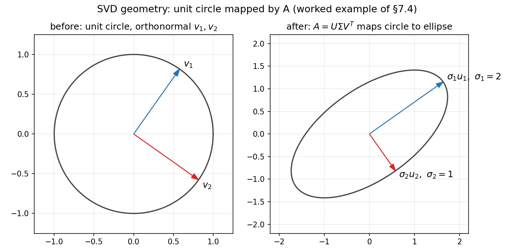

# 7. SVD and positive definite matrices

Chapter 6 ended with a limitation: eigendecomposition wants a *square* matrix with enough independent eigenvectors, and symmetric matrices are the only ones that always cooperate (§6.11). This chapter removes both restrictions. First, the **singular value decomposition** — a factorization that works for *every* matrix, rectangular included. Then **positive definite matrices** — the quadratic-form test that decides whether a stationary point is a minimum, a workhorse of optimization.

## 7.1 Why eigendecomposition is not enough

i) Eigendecomposition $A = S\Lambda S^{-1}$ needs a square $n \times n$ matrix (§6.7).
ii) It needs $n$ independent eigenvectors — defective matrices (§6.10) simply have no such factorization.
iii) Only symmetric matrices are *guaranteed* to cooperate (§6.11).

The SVD drops all of this: *any* real $m \times n$ matrix gets factored, no symmetry, no squareness, no eigenvector-counting required.

## 7.2 The SVD, stated

**Def.** Every real $m \times n$ matrix $A$ can be written as
$$A = U\Sigma V^T$$
where:

i) $U$ is $m \times m$ with **orthonormal** columns ($U^TU = I$);
ii) $V$ is $n \times n$ with **orthonormal** columns ($V^TV = I$);
iii) $\Sigma$ is $m \times n$, all zeros except a diagonal $\sigma_1 \ge \sigma_2 \ge \cdots \ge 0$ down its main diagonal.

Terminology: the $\sigma_i$ are the $singular$ $values$ of $A$. The columns of $V$ are the $right$ $singular$ $vectors$; the columns of $U$ are the $left$ $singular$ $vectors$.

**eg.** For a $2 \times 3$ matrix, the shapes read
$$\begin{bmatrix} * & * & * \\ * & * & * \end{bmatrix}_{2 \times 3} = U_{2 \times 2}\ \Sigma_{2 \times 3}\ V^T_{2 \times 3}, \qquad \Sigma = \begin{bmatrix} \sigma_1 & 0 & 0 \\ 0 & \sigma_2 & 0 \end{bmatrix}.$$
$U$ and $V$ are square and orthogonal; the "diagonal" $\Sigma$ is rectangular, with the singular values sitting on its main diagonal (§7.2's only rectangle-with-a-diagonal).

**Basically, ...** SVD says: every matrix, no matter how lopsided, is just "turn $\rightarrow$ stretch $\rightarrow$ turn". $V^T$ and $U$ are pure rotations/reflections (they never change lengths); all the stretching is done by the diagonal $\Sigma$.

## 7.3 Where $U$, $\Sigma$, $V$ come from: the $A^TA$ bridge

Chapter 6, §6.12(iii) promised this: the eigenvalues of $A^TA$ are the squared singular values. Here is the bridge, built from the lecture's argument.

**Step 0 — $A^TA$ is symmetric.** For *any* $A$, $(A^TA)^T = A^T(A^T)^T = A^TA$. By the spectral theorem (§6.11) it has $n$ real eigenvalues and an orthonormal eigenbasis $\mathbf{x}_1, \ldots, \mathbf{x}_n$ of $\mathbb{R}^n$:
$$A^TA\mathbf{x}_i = \lambda_i\mathbf{x}_i, \qquad \mathbf{x}_i^T\mathbf{x}_j = 0\ (i \ne j), \ \lVert\mathbf{x}_i\rVert = 1.$$

**Step 1 — the eigenvalues are $\ge 0$.** Dotting the eigen equation with $\mathbf{x}_i$:
$$\lambda_i = \mathbf{x}_i^T A^TA\mathbf{x}_i = (A\mathbf{x}_i)^T(A\mathbf{x}_i) = \lVert A\mathbf{x}_i\rVert^2 \ge 0.$$
So order them $\lambda_1 \ge \lambda_2 \ge \cdots \ge \lambda_r > 0 = \lambda_{r+1} = \cdots = \lambda_n$. The $singular$ $values$ are
$$\sigma_i = \sqrt{\lambda_i} \quad (i = 1, \ldots, r),$$
placed as the diagonal of $\Sigma$. (This is why the square root appears: $\Sigma$ will hold $\sigma_i$, and $\sigma_i^2$ are the eigenvalues.)

**Step 2 — $V$ and $U$.** Put the orthonormal $\mathbf{x}_i$ as the columns of $V$. For $i \le r$ define
$$\mathbf{y}_i = \frac{1}{\sigma_i}A\mathbf{x}_i.$$
Then each $\mathbf{y}_i$ is unit length ($\lVert A\mathbf{x}_i\rVert = \sqrt{\lambda_i} = \sigma_i$), and they are mutually orthogonal:
$$\mathbf{y}_i^T\mathbf{y}_j = \frac{1}{\sigma_i\sigma_j}\mathbf{x}_i^TA^TA\mathbf{x}_j = \frac{\lambda_j}{\sigma_i\sigma_j}\mathbf{x}_i^T\mathbf{x}_j = 0 \quad (i \ne j).$$
Extend $\mathbf{y}_1, \ldots, \mathbf{y}_r$ to a full orthonormal basis of $\mathbb{R}^m$ (always possible); these $m$ vectors are the columns of $U$.

**Step 3 — $U\Sigma V^T = A$.** The $(i,j)$ entry of $U^TAV$ is $\mathbf{y}_i^TA\mathbf{x}_j$: it equals $\sigma_j$ when $i = j \le r$ (since $A\mathbf{x}_j = \sigma_j\mathbf{y}_j$) and $0$ otherwise (for $j > r$, $\lambda_j = 0$ gives $A\mathbf{x}_j = \mathbf{0}$). So $U^TAV = \Sigma$, i.e. $A = U\Sigma V^T$.

Note: from the factorization, $AA^T = U\Sigma\Sigma^T U^T$, so the columns of $U$ are orthonormal eigenvectors of the symmetric $AA^T$ — the left side mirrors the right side.

**Basically, ...** $A$ itself may have no eigenvectors at all (try the $90^\circ$ rotation of §6.3). But $A^TA$ is *always* symmetric, so it always has a full set of real eigenvalues and orthonormal eigenvectors. The SVD just reads its ingredients off $A^TA$: take square roots of the eigenvalues to get the stretches, take the eigenvectors as $V$, and push them through $A$ to get $U$.

## 7.4 Worked example: a square but non-diagonalizable $2 \times 2$ matrix

Take $A = \begin{bmatrix} \sqrt{2} & 1 \\ 0 & \sqrt{2} \end{bmatrix}$ (the lecture's example). First a sanity check: $A$ has eigenvalue $\sqrt{2}$ twice, but $A - \sqrt{2}I = \begin{bmatrix} 0 & 1 \\ 0 & 0 \end{bmatrix}$ has only a one-dimensional eigenspace — $A$ is defective, so no eigendecomposition exists (§6.10). The SVD has no such problem.

Step 1 — form $A^TA$ and find its eigenpairs:
$$A^TA = \begin{bmatrix} \sqrt{2} & 0 \\ 1 & \sqrt{2} \end{bmatrix}\begin{bmatrix} \sqrt{2} & 1 \\ 0 & \sqrt{2} \end{bmatrix} = \begin{bmatrix} 2 & \sqrt{2} \\ \sqrt{2} & 3 \end{bmatrix}.$$
Trace $= 5$, determinant $= 6 - 2 = 4$, so the characteristic equation is $\lambda^2 - 5\lambda + 4 = 0$, giving $\lambda_1 = 4$, $\lambda_2 = 1$. Singular values: $\sigma_1 = \sqrt{4} = 2$, $\sigma_2 = \sqrt{1} = 1$.

Eigenvectors. For $\lambda_1 = 4$: $A^TA - 4I = \begin{bmatrix} -2 & \sqrt{2} \\ \sqrt{2} & -1 \end{bmatrix}$, and $\begin{bmatrix} 1 \\ \sqrt{2} \end{bmatrix}$ kills it ($-2 + \sqrt{2}\cdot\sqrt{2} = 0$ ✓). For $\lambda_2 = 1$: $A^TA - I = \begin{bmatrix} 1 & \sqrt{2} \\ \sqrt{2} & 2 \end{bmatrix}$, and $\begin{bmatrix} \sqrt{2} \\ -1 \end{bmatrix}$ kills it ($\sqrt{2} - \sqrt{2} = 0$ ✓). Normalize (both have length $\sqrt{3}$):
$$\mathbf{x}_1 = \frac{1}{\sqrt{3}}\begin{bmatrix} 1 \\ \sqrt{2} \end{bmatrix}, \qquad \mathbf{x}_2 = \frac{1}{\sqrt{3}}\begin{bmatrix} \sqrt{2} \\ -1 \end{bmatrix}, \qquad V = [\mathbf{x}_1\ \mathbf{x}_2] = \frac{1}{\sqrt{3}}\begin{bmatrix} 1 & \sqrt{2} \\ \sqrt{2} & -1 \end{bmatrix}.$$
Sanity check $V^TV = I$: $\mathbf{x}_1^T\mathbf{x}_2 = \frac{1}{3}(\sqrt{2} - \sqrt{2}) = 0$, $\lVert\mathbf{x}_1\rVert^2 = \frac{1}{3}(1 + 2) = 1$, $\lVert\mathbf{x}_2\rVert^2 = \frac{1}{3}(2 + 1) = 1$ ✓.

Step 2 — build $U$ from $\mathbf{y}_i = A\mathbf{x}_i/\sigma_i$:
$$A\mathbf{x}_1 = \frac{1}{\sqrt{3}}\begin{bmatrix} \sqrt{2} & 1 \\ 0 & \sqrt{2} \end{bmatrix}\begin{bmatrix} 1 \\ \sqrt{2} \end{bmatrix} = \frac{1}{\sqrt{3}}\begin{bmatrix} 2\sqrt{2} \\ 2 \end{bmatrix}, \qquad \mathbf{y}_1 = \frac{1}{2}A\mathbf{x}_1 = \begin{bmatrix} \sqrt{2/3} \\ 1/\sqrt{3} \end{bmatrix},$$
$$A\mathbf{x}_2 = \frac{1}{\sqrt{3}}\begin{bmatrix} \sqrt{2} & 1 \\ 0 & \sqrt{2} \end{bmatrix}\begin{bmatrix} \sqrt{2} \\ -1 \end{bmatrix} = \frac{1}{\sqrt{3}}\begin{bmatrix} 1 \\ -\sqrt{2} \end{bmatrix}, \qquad \mathbf{y}_2 = \frac{1}{1}A\mathbf{x}_2 = \begin{bmatrix} 1/\sqrt{3} \\ -\sqrt{2/3} \end{bmatrix}.$$
Check: $\lVert\mathbf{y}_1\rVert^2 = 2/3 + 1/3 = 1$, $\lVert\mathbf{y}_2\rVert^2 = 1/3 + 2/3 = 1$, $\mathbf{y}_1^T\mathbf{y}_2 = \frac{\sqrt{2}}{3} - \frac{\sqrt{2}}{3} = 0$ ✓. So
$$U = \begin{bmatrix} \sqrt{2/3} & 1/\sqrt{3} \\ 1/\sqrt{3} & -\sqrt{2/3} \end{bmatrix}, \qquad \Sigma = \begin{bmatrix} 2 & 0 \\ 0 & 1 \end{bmatrix}.$$

Step 3 — verify $A = U\Sigma V^T$, entry by entry. First $\Sigma V^T = \frac{1}{\sqrt{3}}\begin{bmatrix} 2 & 2\sqrt{2} \\ \sqrt{2} & -1 \end{bmatrix}$. Then:
$$(1,1):\ \frac{1}{\sqrt{3}}\left(\sqrt{\tfrac{2}{3}}\cdot 2 + \tfrac{1}{\sqrt{3}}\cdot\sqrt{2}\right) = \frac{1}{\sqrt{3}}\cdot\frac{3\sqrt{2}}{\sqrt{3}} = \sqrt{2}\ \checkmark$$
$$(1,2):\ \frac{1}{\sqrt{3}}\left(\sqrt{\tfrac{2}{3}}\cdot 2\sqrt{2} + \tfrac{1}{\sqrt{3}}\cdot(-1)\right) = \frac{1}{\sqrt{3}}\left(\frac{4}{\sqrt{3}} - \frac{1}{\sqrt{3}}\right) = 1\ \checkmark$$
$$(2,1):\ \frac{1}{\sqrt{3}}\left(\tfrac{1}{\sqrt{3}}\cdot 2 - \sqrt{\tfrac{2}{3}}\cdot\sqrt{2}\right) = \frac{1}{\sqrt{3}}\left(\frac{2}{\sqrt{3}} - \frac{2}{\sqrt{3}}\right) = 0\ \checkmark$$
$$(2,2):\ \frac{1}{\sqrt{3}}\left(\tfrac{1}{\sqrt{3}}\cdot 2\sqrt{2} + \sqrt{\tfrac{2}{3}}\right) = \frac{1}{\sqrt{3}}\cdot\frac{3\sqrt{2}}{\sqrt{3}} = \sqrt{2}\ \checkmark$$
All four entries of $A = \begin{bmatrix} \sqrt{2} & 1 \\ 0 & \sqrt{2} \end{bmatrix}$ recovered.

Note: here $\det(U) = -\frac{2}{3} - \frac{1}{3} = -1$ — $U$ contains a reflection, not just a rotation. Orthogonal matrices are allowed to flip (§7.6).

**Basically, ...** Even when a matrix is too broken for eigenvectors (defective), $A^TA$ is always well-behaved. The recipe never changes: eigenpairs of $A^TA$ → square-root the eigenvalues → normalize → push through $A$ to get $U$.

## 7.5 Worked example: a rectangular $2 \times 3$ matrix

Take $A = \begin{bmatrix} 1 & 0 & 1 \\ 0 & 1 & 1 \end{bmatrix}$.

Step 1 — $A^TA$. Columns of $A$: $\mathbf{c}_1 = (1,0)^T$, $\mathbf{c}_2 = (0,1)^T$, $\mathbf{c}_3 = (1,1)^T$; entry $(i,j)$ is $\mathbf{c}_i \cdot \mathbf{c}_j$:
$$A^TA = \begin{bmatrix} 1 & 0 & 1 \\ 0 & 1 & 1 \\ 1 & 1 & 2 \end{bmatrix}.$$
$\det(A^TA - \lambda I) = (1-\lambda)\big[(1-\lambda)(2-\lambda) - 1\big] - (1-\lambda) = (1-\lambda)(\lambda^2 - 3\lambda) = \lambda(1-\lambda)(\lambda-3)$.
So $\lambda_1 = 3$, $\lambda_2 = 1$, $\lambda_3 = 0$; singular values $\sigma_1 = \sqrt{3}$, $\sigma_2 = 1$, $\sigma_3 = 0$.

Eigenvectors (normalized): for $\lambda_1 = 3$, $(A^TA - 3I)\mathbf{x} = \mathbf{0}$ gives $x_3 = 2x_1 = 2x_2$, so $\mathbf{x}_1 = \frac{1}{\sqrt{6}}(1,1,2)^T$ (check: $(1+1+4)/6 = 1$ ✓). For $\lambda_2 = 1$: $x_3 = 0$, $x_1 + x_2 = 0$, so $\mathbf{x}_2 = \frac{1}{\sqrt{2}}(1,-1,0)^T$. For $\lambda_3 = 0$: $x_1 + x_3 = 0$, $x_2 + x_3 = 0$, so $\mathbf{x}_3 = \frac{1}{\sqrt{3}}(1,1,-1)^T$. These are mutually orthogonal ✓ (pairwise dot products are $0$).

Step 2 — $U$ from the two *nonzero* singular values:
$$A\mathbf{x}_1 = \frac{1}{\sqrt{6}}A(1,1,2)^T = \frac{1}{\sqrt{6}}(3,3)^T, \qquad \mathbf{u}_1 = \frac{1}{\sqrt{3}}A\mathbf{x}_1 = \left(\tfrac{1}{\sqrt{2}}, \tfrac{1}{\sqrt{2}}\right)^T,$$
$$A\mathbf{x}_2 = \frac{1}{\sqrt{2}}A(1,-1,0)^T = \frac{1}{\sqrt{2}}(1,-1)^T, \qquad \mathbf{u}_2 = \frac{1}{1}A\mathbf{x}_2 = \left(\tfrac{1}{\sqrt{2}}, -\tfrac{1}{\sqrt{2}}\right)^T.$$
$\mathbf{u}_1, \mathbf{u}_2$ are already an orthonormal basis of $\mathbb{R}^2$ — no extension needed.

Step 3 — assemble and verify. With $r = 2$,
$$U = \begin{bmatrix} 1/\sqrt{2} & 1/\sqrt{2} \\ 1/\sqrt{2} & -1/\sqrt{2} \end{bmatrix}, \quad \Sigma = \begin{bmatrix} \sqrt{3} & 0 & 0 \\ 0 & 1 & 0 \end{bmatrix}, \quad V = \begin{bmatrix} 1/\sqrt{6} & 1/\sqrt{2} & 1/\sqrt{3} \\ 1/\sqrt{6} & -1/\sqrt{2} & 1/\sqrt{3} \\ 2/\sqrt{6} & 0 & -1/\sqrt{3} \end{bmatrix}.$$
$\Sigma V^T = \begin{bmatrix} 1/\sqrt{2} & 1/\sqrt{2} & \sqrt{2} \\ 1/\sqrt{2} & -1/\sqrt{2} & 0 \end{bmatrix}$ (since $\sqrt{3}/\sqrt{6} = 1/\sqrt{2}$ and $2\sqrt{3}/\sqrt{6} = \sqrt{2}$). Multiplying by $U$, entry by entry: $(1,1) = \tfrac{1}{2} + \tfrac{1}{2} = 1$ ✓, $(1,2) = \tfrac{1}{2} - \tfrac{1}{2} = 0$ ✓, $(1,3) = \tfrac{1}{\sqrt{2}}\cdot\sqrt{2} = 1$ ✓, $(2,1) = 0$ ✓, $(2,2) = 1$ ✓, $(2,3) = 1$ ✓ — all six entries of $A$ recovered.

Note: $\mathbf{x}_3$ (the null-space direction of $A^TA$) is annihilated: $A\mathbf{x}_3 = \mathbf{0}$, which is why $\sigma_3 = 0$ contributes nothing.

**Reduced (economy) SVD.** The zero column of $\Sigma$ and the third column of $V$ do no work. Dropping them:
$$A = U_r\Sigma_r V_r^T, \qquad U_r = U\ (2 \times 2),\ \Sigma_r = \begin{bmatrix} \sqrt{3} & 0 \\ 0 & 1 \end{bmatrix},\ V_r = [\mathbf{x}_1\ \mathbf{x}_2]\ (3 \times 2).$$
In general: full SVD keeps $U$ $m \times m$, $\Sigma$ $m \times n$, $V$ $n \times n$; reduced SVD keeps only the $r$ nonzero singular values, so $U_r$ is $m \times r$, $\Sigma_r$ is $r \times r$, $V_r$ is $n \times r$.

## 7.6 Geometry of the SVD

Apply $A = U\Sigma V^T$ to a vector $\mathbf{x}$ in three stages: $V^T$ rotates/reflects into the right-singular-vector basis, $\Sigma$ stretches each coordinate by $\sigma_i$, $U$ rotates/reflects into the output basis. Since orthogonal maps preserve shapes up to turning, the *only* distortion $A$ ever causes is pure axis-aligned stretching.

Consequence: $A$ sends the unit sphere to an **ellipsoid** whose semiaxes are $\sigma_i\mathbf{u}_i$ — i.e. $A\mathbf{v}_i = \sigma_i\mathbf{u}_i$, the directions where $A$ acts by pure scaling.

<!-- original illustration drawn by the author with matplotlib (no external source) -->

**Rank.** From the bridge: $\sigma_i = 0 \iff \lambda_i = 0 \iff A\mathbf{x}_i = \mathbf{0}$. So the number of *nonzero* singular values equals $\operatorname{rank}(A)$. In §7.5, $\sigma_3 = 0$ because the two rows of $A$ span only a 2-dimensional space — $\operatorname{rank}(A) = 2$.

**Basically, ...** Every matrix squashes or stretches a ball into an ellipsoid. The SVD reads off the ellipsoid's axes: $\sigma_i$ are the axis lengths, $\mathbf{v}_i$ the input directions that get stretched, $\mathbf{u}_i$ the output directions they land on. Rank is just "how many axes have nonzero length."

## 7.7 Why SVD matters in ML

Eigendecomposition is picky (square, enough eigenvectors). SVD applies to *every* data matrix — and data matrices are almost never square: $m$ samples $\times$ $n$ features.

One more payoff: the SVD is a sum of rank-one pieces,
$$A = \sigma_1\mathbf{u}_1\mathbf{v}_1^T + \sigma_2\mathbf{u}_2\mathbf{v}_2^T + \cdots + \sigma_r\mathbf{u}_r\mathbf{v}_r^T,$$
each term a matrix with a single nonzero singular value. Keeping only the first $k$ terms gives $A_k$, the **best rank-$k$ approximation** of $A$ — the rank-$k$ matrix closest to $A$. Since $\sigma_1 \ge \sigma_2 \ge \cdots$, the dropped tail is the smallest possible error. This is the engine behind dimensionality reduction (keep the big stretches, discard the noise), latent-factor recommendation systems (user–item matrix $\approx$ low-rank structure), and — coming in Chapter 24 — PCA, where the principal components are exactly the right singular vectors of the centered data matrix.

**Basically, ...** Rank-$k$ approximation is lossy compression for matrices: keep the $k$ biggest stretches of the SVD, throw away the rest, and the leftover error is as small as any rank-$k$ matrix can manage.

## 7.8 Positive definiteness: from quadratics to matrices

Before matrices, look at the quadratic function $f(x, y) = ax^2 + 2bxy + cy^2$.

**eg (the motivating case).** Take $f(x,y) = 2x^2 + 4xy + y^2$. Its partials are $f_x = 4x + 4y$, $f_y = 4x + 2y$ — both vanish at $(0,0)$, as they do for *any* quadratic of this form, whatever its coefficients. The question is what kind of stationary point $(0,0)$ is: minimum, maximum, or saddle? Its second partials are $f_{xx} = 4$, $f_{xy} = 4$, $f_{yy} = 2$ — constant, so the same at $(0,0)$ as everywhere. We will come back to this $f$ in §7.10.

**Def.** A function $f$ with $f(0,0) = 0$ that is strictly positive everywhere else is $positive$ $definite$.

Geometric picture: a bowl sitting on the origin, like $f(x,y) = x^2 + y^2$.

i) $f > 0 \Rightarrow a > 0$: evaluate at $(1,0)$; $f(1,0) = a$ must be positive.
ii) $f > 0 \Rightarrow c > 0$: same argument at $(0,1)$.
iii) Complete the square:
$$ax^2 + 2bxy + cy^2 = a\left(x + \tfrac{b}{a}y\right)^2 + \left(c - \tfrac{b^2}{a}\right)y^2.$$
The first term is $\ge 0$; for the whole thing to be $> 0$ at every nonzero $(x,y)$, the second coefficient must be $> 0$ too, i.e. $c - b^2/a > 0$, or $ac > b^2$.

So: $f(x,y) = ax^2 + 2bxy + cy^2$ is positive definite **iff** $a > 0$ and $ac > b^2$.

The other cases: if $ac = b^2$ (with $a > 0$), $f$ is $positive$ $semi$-$definite$ — $\ge 0$, but zero along a whole line, not just at the origin (a flat-bottomed valley). If $a < 0$ with $ac = b^2$, $negative$ $semi$-$definite$. If $ac < b^2$, the origin is a $saddle$ $point$ — up in some directions, down in others.

**eg.** $f(x,y) = x^2 - 10xy + y^2$ is *not* positive definite: $f(1,1) = 1 - 10 + 1 = -8 < 0$, even though $a, c > 0$. **eg.** $f(x,y) = 2xy$: at $(1,1)$ it is $2$, at $(1,-1)$ it is $-2$ — a saddle at the origin.

**Basically, ...** Positive definite means "a bowl": zero at the origin, strictly uphill in every direction. If the bowl is dented so it dips below the origin somewhere, or flat along a line, it's not positive definite anymore.

The matrix connection: with $V = (x,y)^T$ and $A = \begin{bmatrix} a & b \\ b & c \end{bmatrix}$,
$$f(x,y) = V^TAV.$$
Positive definiteness of the *function* becomes a property of the *matrix*.

## 7.9 Positive definite matrices

**Def.** A (real, *symmetric* — assumed from here on) $n \times n$ matrix $A$ is $positive$ $definite$ if
$$\mathbf{x}^TA\mathbf{x} > 0 \quad \text{for every } \mathbf{x} \ne \mathbf{0}.$$
(The symmetry assumption matters: only the symmetric part of a matrix contributes to $\mathbf{x}^TA\mathbf{x}$, so definiteness is defined for symmetric matrices.)

**Theorem (eigenvalue test).** $A$ is positive definite **iff** all its eigenvalues are strictly positive.

*Proof* ($\Rightarrow$). If $A\mathbf{x} = \lambda\mathbf{x}$ with $\mathbf{x} \ne \mathbf{0}$: $\mathbf{x}^TA\mathbf{x} = \lambda\lVert\mathbf{x}\rVert^2 > 0$ by definiteness, and $\lVert\mathbf{x}\rVert^2 > 0$, so $\lambda > 0$.

*Proof* ($\Leftarrow$). By the spectral theorem (§6.11) there is an orthonormal eigenbasis $\mathbf{x}_1, \ldots, \mathbf{x}_n$. Write any $\mathbf{x} = c_1\mathbf{x}_1 + \cdots + c_n\mathbf{x}_n$; then $A\mathbf{x} = c_1\lambda_1\mathbf{x}_1 + \cdots + c_n\lambda_n\mathbf{x}_n$, and orthonormality kills the cross terms:
$$\mathbf{x}^TA\mathbf{x} = c_1^2\lambda_1 + \cdots + c_n^2\lambda_n > 0,$$
since every $\lambda_i > 0$ and at least one $c_i^2 > 0$. ∎

For $2 \times 2$, the quadratic conditions translate directly (with $A = \begin{bmatrix} a & b \\ b & c \end{bmatrix}$): $A$ is positive definite **iff** $a > 0$ and $\det(A) = ac - b^2 > 0$.

**eg (two ways).** $A = \begin{bmatrix} 2 & 1 \\ 1 & 2 \end{bmatrix}$.

Way 1 — the $2 \times 2$ test: $a = 2 > 0$, $\det(A) = 4 - 1 = 3 > 0$. Positive definite ✓.

Way 2 — eigenvalues: $\det(A - \lambda I) = (2-\lambda)^2 - 1 = \lambda^2 - 4\lambda + 3 = 0$ gives $\lambda = 3, 1$, both $> 0$ ✓. Equivalently, $f(x,y) = \mathbf{x}^TA\mathbf{x} = 2x^2 + 2xy + 2y^2 = 2(x + y/2)^2 + \tfrac{3}{2}y^2 > 0$ for $(x,y) \ne (0,0)$.

**eg (not definite).** $B = \begin{bmatrix} 1 & 2 \\ 2 & 1 \end{bmatrix}$: $\det(B) = 1 - 4 = -3 < 0$, so not positive definite. Its eigenvalues are $3$ and $-1$ — mixed signs means the origin is a saddle of $\mathbf{x}^TB\mathbf{x}$: along $(1,1)^T$ the form is $6 > 0$, along $(1,-1)^T$ it is $-2 < 0$.

**Basically, ...** A symmetric matrix is positive definite iff it stretches *every* direction by a positive amount — all its eigenvalues are positive. If even one eigenvalue is negative or zero, some direction goes downhill or stays flat, and the bowl is broken.

## 7.10 Bowls, minima, and a look ahead at optimization

Return to the motivating example $f(x,y) = 2x^2 + 4xy + y^2$ from §7.8. Its second partials ($f_{xx} = 4$, $f_{xy} = 4$, $f_{yy} = 2$) are constant, so the same at the stationary point $(0,0)$ as everywhere. Writing $f = ax^2 + 2bxy + cy^2$ gives $a = 2$, $b = 2$, $c = 1$ — note the $2 \times 2$ test uses the *halved* mixed coefficient ($2bxy = 4xy$, so $b = 2$). Then $\det = ac - b^2 = 2 - 4 = -2 < 0$: the origin is a **saddle**, not a minimum, despite $a > 0$.

The general principle (developed in Chapters 10 and 12): at a stationary point, the matrix of second derivatives — the $Hessian$ — plays the role of $A$ above. Positive definite Hessian $\Rightarrow$ bowl $\Rightarrow$ local minimum; indefinite Hessian $\Rightarrow$ saddle. In ML, that Hessian is exactly what second-order optimizers examine, and covariance matrices (symmetric, always at least positive *semi*-definite since $\mathbf{w}^TC\mathbf{w} = \operatorname{Var}(\mathbf{w}^T\mathbf{x}) \ge 0$) are the other place definiteness shows up constantly.

## 7.11 Where this goes next

- **Chapter 8 (single-variable calculus):** Part I continues with calculus — derivatives as local linear maps, the one-dimensional version of the "bowl" idea.
- **Chapter 10 (optimization):** Hessians and second-order conditions — §7.10's sketch becomes the full minimum/maximum/saddle test for functions of many variables.
- **Chapter 24 (PCA):** the SVD returns as the engine of principal component analysis: the right singular vectors of the centered data matrix are the principal components, and $\sigma_i^2$ the explained variances.

## Problem set

1. Find the SVD of $A = \begin{bmatrix} 2 & 0 \\ 0 & 3 \end{bmatrix}$: compute $A^TA$, its eigenpairs, the singular values, $V$, then $U = AV\Sigma^{-1}$, and verify $A = U\Sigma V^T$.
2. Find the SVD of $A = \begin{bmatrix} 0 & 1 \\ 1 & 0 \end{bmatrix}$. (Hint: $A^TA$ is trivial here.)
3. For the $U$ in §7.4: verify $U^TU = I$ explicitly and compute $\det(U)$. What does the sign of the determinant tell you geometrically?
4. For the rectangular example in §7.5, verify $V^TV = I$ for the three columns $\mathbf{x}_1, \mathbf{x}_2, \mathbf{x}_3$.
5. A matrix has singular values $5, 2, 0$. What is its rank? Explain in one line using §7.6.
6. Write the best rank-1 approximation $A_1 = \sigma_1\mathbf{u}_1\mathbf{v}_1^T$ of the §7.4 matrix $A = \begin{bmatrix} \sqrt{2} & 1 \\ 0 & \sqrt{2} \end{bmatrix}$ as an explicit $2 \times 2$ matrix (entries may involve $\sqrt{2}$), and compare it entry-wise with $A$.
7. Prove $A^TA$ is always positive *semi*-definite, for any real $A$. Conclude its eigenvalues are $\ge 0$ (this is the fact §7.3 started from).
8. Test $A = \begin{bmatrix} 4 & 2 \\ 2 & 3 \end{bmatrix}$ for positive definiteness two ways: (a) the $2 \times 2$ test $a > 0$, $\det(A) > 0$; (b) by finding both eigenvalues.
9. Show $B = \begin{bmatrix} 1 & 2 \\ 2 & 1 \end{bmatrix}$ is not positive definite: find its eigenvalues, and find one nonzero vector $\mathbf{x}$ with $\mathbf{x}^TB\mathbf{x} < 0$.
10. Complete the square for $f(x,y) = x^2 + 4xy + 5y^2$ to show it is positive definite. Write down its coefficient matrix and check the $2 \times 2$ test on it.
11. Let $A$ be symmetric and positive definite. Using the eigenvalue test and the fact that $\det(A)$ is the product of the eigenvalues (§6.4), show $\det(A) > 0$.
