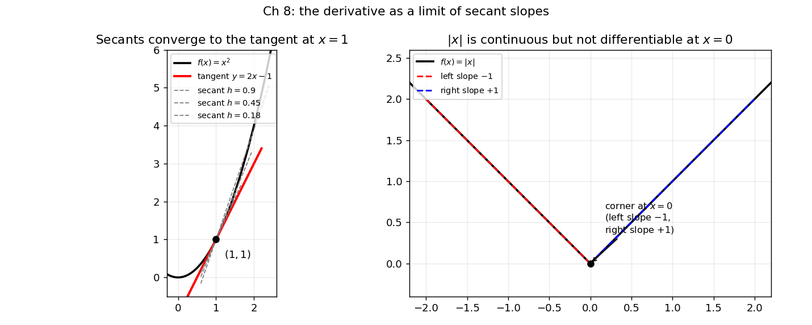

# 8. Single-variable calculus: continuity, differentiability, derivatives

Chapter 7 ended with a one-dimensional sketch: derivatives as local linear maps, and the "bowl" idea that decides minima. This chapter builds that sketch into the full one-variable machinery — limits, continuity, the derivative, and how to *find* maxima and minima. Everything in machine learning is, at bottom, a function you want to minimize (the loss) or a rate at which something changes (the loss with respect to a parameter). This chapter is the instrument panel for reading those functions.

The single-variable story has three acts:

i) **Limits** — what it means for $f(x)$ to "approach" a value.
ii) **Continuity** — no jumps: the limit equals the value.
iii) **Differentiability** — how fast $f$ changes, and where it bottoms out.

## 8.1 Limits: the "approach" idea

Intuitively, we write
$$\lim_{x \to a} f(x) = L$$
to mean: as $x$ gets closer and closer to $a$ (from either side), the values $f(x)$ get closer and closer to $L$. The key question this answers: *what would $f$ equal at $a$ if it behaved nicely there?* — regardless of what $f(a)$ actually is, or whether $f(a)$ is even defined.

**Note:** The limit as $x \to a$ has nothing to do with the value (or existence) of $f(a)$. A limit only looks at $x$ *near* $a$, never *at* $a$.

### 8.1.1 The $\varepsilon$–$\delta$ definition, stated carefully

"Gets closer and closer" is too vague to prove anything with. The formal definition pins down *how close* with two tolerances: $\varepsilon$ (how close the outputs must be to $L$) and $\delta$ (how close the inputs must be to $a$).

**Def.** $\lim_{x \to a} f(x) = L$ means: **for every** $\varepsilon > 0$ **there exists** a $\delta > 0$ such that, for every $x$ in the domain with $0 < |x - a| < \delta$,
$$|f(x) - L| < \varepsilon.$$

Read it with the quantifier shorthand from §1.11:
$$\forall \varepsilon > 0,\ \exists \delta > 0 \text{ such that } \bigl(0 < |x - a| < \delta \;\Rightarrow\; |f(x) - L| < \varepsilon\bigr).$$
The order matters: *first* someone hands you any tolerance $\varepsilon$ on the output ($\forall \varepsilon > 0$); *then* you must produce a window $\delta$ around $a$ ($\exists \delta > 0$) that forces every output inside it to satisfy the tolerance. The $\delta$ is allowed to depend on $\varepsilon$ — smaller tolerance, tighter window. The $0 <$ part says $x = a$ itself is excluded: the limit does not care about $f(a)$.

**Basically, ...** Pick any bullseye size $\varepsilon$ around $L$ on the $y$-axis. The definition promises you can find a (possibly tiny) window $\delta$ around $a$ on the $x$-axis so that the whole graph inside that window — except possibly the point at $a$ itself — lands inside the bullseye.

*Remark on the sources.* The course book builds limits from *sequences*: $\lim_{x \to a} f(x) = L$ iff $f(x_n) \to L$ for every sequence $x_n \to a$. That sequential definition and the $\varepsilon$–$\delta$ one above are equivalent — they certify the same limits. We use $\varepsilon$–$\delta$ here because it is the standard working form (and it is exactly the language the MLF lectures use when they say "as $x$ approaches $a$").

**eg 1 — proving a limit with $\varepsilon$–$\delta$ (full steps).** Claim: $\lim_{x \to 1} x^2 = 1$.

Let $\varepsilon > 0$ be given. We need $\delta > 0$ with $0 < |x - 1| < \delta \Rightarrow |x^2 - 1| < \varepsilon$.

i) Factor the output distance: $|x^2 - 1| = |x - 1|\,|x + 1|$.
ii) Tame the $|x + 1|$ factor: first demand $\delta \le 1$, so $|x - 1| < 1$ gives $0 < x < 2$, hence $|x + 1| = x + 1 < 3$.
iii) Then $|x^2 - 1| = |x - 1|\,|x + 1| < 3|x - 1|$. To make this $< \varepsilon$, it suffices to have $|x - 1| < \varepsilon/3$.
iv) Choose $\delta = \min(1, \varepsilon/3) > 0$. Then $0 < |x - 1| < \delta$ gives $|x^2 - 1| < 3\delta \le 3(\varepsilon/3) = \varepsilon$. ∎

**Basically, ...** An $\varepsilon$–$\delta$ proof is a recipe: "you give me the output tolerance, I hand you back the input window." Step ii) is the standard trick — first lock $x$ into a small fixed neighborhood so the extra factor can't misbehave, then shrink $\delta$ further to hit the tolerance.

### 8.1.2 One-sided limits

$x$ can approach $a$ from the left ($x < a$) or the right ($x > a$). If the two sides disagree, the two-sided limit does not exist.

**Def.** $\lim_{x \to a^-} f(x) = L_1$ (left limit) and $\lim_{x \to a^+} f(x) = L_2$ (right limit) are defined the same way, except $x$ is restricted to $x < a$ (resp. $x > a$). The two-sided limit exists **iff** both one-sided limits exist *and are equal* — and then it equals their common value.

**eg 2 — a limit that does not exist: the floor function.** Let $f(x) = \lfloor x \rfloor$ and $a = -1$. From the left, $x$ is just below $-1$ (e.g. $-1.1$), so $\lfloor x \rfloor = -2$: $\lim_{x \to -1^-} \lfloor x \rfloor = -2$. From the right, $x$ is just above $-1$ (e.g. $-0.9$), so $\lfloor x \rfloor = -1$: $\lim_{x \to -1^+} \lfloor x \rfloor = -1$. The sides disagree, so $\lim_{x \to -1} \lfloor x \rfloor$ does not exist. Verdict: *no limit*.

**eg 3 — limits at infinity.** $\lim_{x \to \infty} \frac{1}{x} = 0$: as $x$ grows larger and larger, $\frac{1}{x}$ hugs $0$ (same for $x \to -\infty$). The idea is identical — only the "approach" is "toward $\infty$" instead of "toward $a$". Verdict: *limit $0$*.

**eg 4 — oscillation kills the limit.** $f(x) = \sin\frac{1}{x}$ on $\mathbb{R} \setminus \{0\}$: as $x \to 0$, the function swings between $-1$ and $1$ faster and faster, never settling. Along $x_n = \frac{1}{\pi/2 + 2\pi n} \to 0$ we get $f(x_n) = 1$ always; along $y_n = \frac{1}{3\pi/2 + 2\pi n} \to 0$ we get $f(y_n) = -1$ always. Verdict: *no limit at $0$* — approaching does not mean settling.

## 8.2 Continuity: no jumps

**Def.** $f$ is **continuous at** $a$ (in its domain) if
$$\lim_{x \to a} f(x) = f(a),$$
i.e. (i) both one-sided limits exist, and (ii) they equal each other *and* the actual value $f(a)$. $f$ is continuous on its domain if it is continuous at every point of it.

Three things must hold: $f(a)$ is defined; the limit exists; the limit equals the value. In words: **continuity means the limit can be found by just plugging in** — the graph has no jump, hole, or break at $a$.

**Basically, ...** A continuous function is one you can draw without lifting the pen. Discontinuous means the pen has to jump.

**eg 5 — $|x|$ is continuous at $0$.** From either side, $|x| \to 0$ as $x \to 0$, and $f(0) = 0$. Left limit = right limit = value. Verdict: *continuous at $0$* (in fact everywhere).

**eg 6 — a jump: discontinuous.** $f(x) = x + 1$ for $-4 \le x < 2$, $f(x) = x^2 - 4$ for $2 \le x \le 3$, at $a = 2$. Left limit: $x + 1 \to 3$ as $x \to 2^-$. Right limit: $x^2 - 4 \to 0$ as $x \to 2^+$. $3 \ne 0$, so condition (ii) fails. Verdict: *not continuous at $x = 2$* — a genuine jump.

**eg 7 — $\lfloor x \rfloor$ fails at every integer.** We saw in eg 2 that the one-sided limits at $-1$ disagree; the same happens at every integer $n$. Verdict: *discontinuous at every integer, continuous everywhere else*.

### 8.2.1 Continuity is preserved by the usual operations

**Theorem.** If $f$ and $g$ are continuous at $a$, then $f \pm g$, $f \cdot g$ are continuous at $a$; if additionally $g(a) \ne 0$, then $f/g$ is continuous at $a$. And composition preserves continuity: if $g$ is continuous at $a$ and $f$ is continuous at $g(a)$, then $f(g(x))$ is continuous at $a$.

**eg 8 — chaining the theorems (full steps).** Is $f(x) = \dfrac{\sin(x^2)}{x^2 - 1}$ continuous at $x = 0$?

i) $x^2$ is continuous at $0$; $\sin$ is continuous at $0 = 0^2$; so $\sin(x^2)$ is continuous at $0$ (composition).
ii) $x^2$ and $1$ are continuous at $0$, so $x^2 - 1$ is continuous at $0$ (difference).
iii) $x^2 - 1$ equals $-1 \ne 0$ at $x = 0$, so the quotient is continuous at $0$. Verdict: *continuous at $0$* — no $\varepsilon$–$\delta$ needed, just the algebra of continuity.

**Basically, ...** Anything you can build out of continuous pieces with $+$, $-$, $\times$, $\div$ (no division by zero), and nesting stays continuous. Polynomials, $\sin$, $\cos$, $e^x$, $\log$ — all continuous wherever they are defined.

### 8.2.2 The intermediate value theorem (one paragraph)

If $f$ is continuous on a closed interval $[a, b]$ and $L$ is any number between $f(a)$ and $f(b)$, then there is some $c \in (a, b)$ with $f(c) = L$. This is the "no lifting the pen" idea made precise: a continuous graph cannot jump over a value on its way from one endpoint to the other. (The course book invokes it only as a hint — e.g. to argue that $x^3 + 5$ attains every real value — but the statement is standard.) **eg.** $f(x) = x^3 + x - 5$ is a continuous polynomial with $f(1) = -3 < 0 < 5 = f(2)$, so some $c \in (1, 2)$ satisfies $f(c) = 0$: a root is *guaranteed* even though we never solved for it.

## 8.3 The derivative: how fast is it changing?

Average rate of change is easy; *instantaneous* rate of change is what calculus is for. The course book opens with a truck: Jalandhar to Trichy, $2900$ km in $72$ hours, so the *average* speed is $\frac{2900}{72} \approx 40.28$ km/h. But the driver was fined for speeding near Nagpur — on one $260$ km stretch covered in $3$ hours his average was $\frac{260}{3} \approx 86.67$ km/h, over the limit. Average speed over a long trip says nothing about the speedometer *at one instant*. To get the instantaneous speed, shrink the time window $\Delta t$ toward $0$:
$$\text{instantaneous speed} = \lim_{\Delta t \to 0} \frac{\text{distance in time } \Delta t}{\Delta t}.$$
That limit is the model for the derivative.

### 8.3.1 Definition: a limit of difference quotients

For $f$ defined on an interval around $a$, the increment of $f$ when we step from $a$ to $a + h$ is $f(a+h) - f(a)$, and the *average* rate of change over that step is the difference quotient
$$\frac{f(a+h) - f(a)}{h}.$$

**Def.** $f$ is **differentiable at** $a$ if the limit
$$f'(a) = \lim_{h \to 0} \frac{f(a+h) - f(a)}{h}$$
exists. The number $f'(a)$ is the **derivative** of $f$ at $a$ — the instantaneous rate of change of $f$ at $a$.

**Basically, ...** The derivative is what the average rate of change *settles down to* as you shrink the measurement window to a point. Speedometer reading = derivative of the odometer.

### 8.3.2 The geometric twin: slope of the tangent line

The same limit has a picture. The secant line through $(a, f(a))$ and $(a+h, f(a+h))$ has slope exactly the difference quotient. As $h \to 0$, the second point slides into the first, and the secant *settles* onto the **tangent line** — the line that "just touches" the graph at $(a, f(a))$ and points in the graph's instantaneous direction.

<!-- Original illustration drawn for this chapter with matplotlib (no external source): secants of x^2 through (1,1) converging to the tangent y=2x-1, and the |x| corner at 0 with its mismatched one-sided slopes. -->

If $f'(a)$ exists, the tangent exists, is unique, and its equation is
$$y - f(a) = f'(a)\,(x - a) \qquad\text{i.e.}\qquad y = f(a) + f'(a)(x - a).$$
Conversely, a non-vertical tangent at $a$ *is* differentiability at $a$. So: **derivative = limit of secant slopes = slope of the tangent line.** Two names for one idea — analytic and geometric.

**eg 9 — from the definition (full steps): $f(x) = x^2$.**
$$f'(x) = \lim_{h \to 0} \frac{(x+h)^2 - x^2}{h} = \lim_{h \to 0} \frac{x^2 + 2xh + h^2 - x^2}{h} = \lim_{h \to 0} \frac{2xh + h^2}{h} = \lim_{h \to 0} (2x + h) = 2x.$$
The $h$ cancels, then $h \to 0$ kills the leftover. At $x = 1$: $f'(1) = 2$ — the tangent slope in the figure.

**eg 10 — from the definition (full steps): $f(x) = \sin x$.**
\begin{align*}
f'(x) &= \lim_{h \to 0} \frac{\sin(x+h) - \sin x}{h} \\
&= \lim_{h \to 0} \frac{\sin x \cos h + \cos x \sin h - \sin x}{h} \\
&= \lim_{h \to 0} \left( \sin x \cdot \frac{\cos h - 1}{h} + \cos x \cdot \frac{\sin h}{h} \right) \\
&= \sin x \cdot 0 + \cos x \cdot 1 = \cos x,
\end{align*}
using the two standard limits $\lim_{h \to 0} \frac{\sin h}{h} = 1$ and $\lim_{h \to 0} \frac{\cos h - 1}{h} = 0$.

**eg 11 — a tangent line (full steps).** Tangent to $f(x) = \cos x$ at $x = \frac{\pi}{3}$:
$f\!\left(\frac{\pi}{3}\right) = \cos\frac{\pi}{3} = \frac{1}{2}$; $f'(x) = -\sin x$, so $f'\!\left(\frac{\pi}{3}\right) = -\sin\frac{\pi}{3} = -\frac{\sqrt{3}}{2}$. The tangent is
$$y = -\frac{\sqrt{3}}{2}\left(x - \frac{\pi}{3}\right) + \frac{1}{2}.$$
Recipe, always: evaluate $f$, evaluate $f'$, plug into $y = f(a) + f'(a)(x - a)$.

## 8.4 Differentiable $\Rightarrow$ continuous (but not conversely)

**Theorem.** If $f$ is differentiable at $a$, then $f$ is continuous at $a$.

*Proof (brief).* Differentiability gives $L = \lim_{h \to 0} \frac{f(a+h) - f(a)}{h}$. Then
$$\lim_{h \to 0} \bigl(f(a+h) - f(a)\bigr) = \lim_{h \to 0} \frac{f(a+h) - f(a)}{h} \cdot h = L \cdot 0 = 0,$$
so $\lim_{h \to 0} f(a+h) = f(a)$: both one-sided limits equal the value. ∎

**Basically, ...** If the graph is smooth enough to have a well-defined slope at $a$, it certainly cannot jump there. Smoothness is *stronger* than no-jumps.

The converse is false, and the counterexample is famous:

**eg 12 — $|x|$ at $0$: continuous, but NOT differentiable (full reasoning).** Continuity at $0$ was eg 5. For differentiability,
$$\frac{f(0+h) - f(0)}{h} = \frac{|h|}{h}.$$
Now $|h| = h$ for $h \ge 0$ and $|h| = -h$ for $h < 0$, so the one-sided limits of the quotient are
$$\lim_{h \to 0^+} \frac{|h|}{h} = \lim_{h \to 0^+} \frac{h}{h} = 1, \qquad \lim_{h \to 0^-} \frac{|h|}{h} = \lim_{h \to 0^-} \frac{-h}{h} = -1.$$
They disagree, so the two-sided limit does not exist: $f'(0)$ does not exist. Geometrically, the graph has a *corner* at $0$ — the left "slope" is $-1$, the right "slope" is $+1$, and no single tangent line fits (right panel of the figure). Verdict: *continuous at $0$, not differentiable at $0$*.

Two more one-line verdicts from the course book: (i) $f(x) = x^{1/3}$ at $0$: the difference quotient is $h^{-2/3}$, which blows up as $h \to 0$ — the tangent would be *vertical*, so no (finite) derivative. Verdict: *not differentiable at $0$*. (ii) $f(x) = \lfloor x \rfloor$ at any integer: not continuous there, hence by the theorem cannot be differentiable. Verdict: *not differentiable at integers*.

**Note (for ML):** differentiability is the ticket that lets gradients exist. The $|x|$ corner is exactly the shape of the ReLU activation at $0$ — a kink where the derivative is ambiguous, and practical ML just picks a one-sided value there. Corners need care; smooth functions do not.

## 8.5 The derivative rules: a toolbox

Computing every derivative from the limit definition would be miserable. These rules reduce differentiation to algebra.

**Power rule.** $(x^n)' = n x^{n-1}$ (for the usual $n$). From eg 9: $(x^2)' = 2x$. Also $(x)' = 1$, $(c)' = 0$ for constant $c$.

**Linearity.** If $f, g$ are differentiable at $a$: $(f \pm g)'(a) = f'(a) \pm g'(a)$, and $(cf)'(a) = c\,f'(a)$ for constant $c$.

**eg 13 — a polynomial (full steps).** $p(x) = 3x^3 - 2x^2 + x - 5$:
$$p'(x) = 3 \cdot 3x^2 - 2 \cdot 2x + 1 \cdot 1 - 0 = 9x^2 - 4x + 1.$$
Term by term, power rule on each, constants die.

**Product rule.** $(fg)'(a) = f'(a)g(a) + f(a)g'(a)$. Mnemonic: differentiate the first, leave the second; leave the first, differentiate the second; add.

**eg 14 — product (full steps).** $h(x) = x^7 \sin x$. Take $f(x) = x^7$, $g(x) = \sin x$; then $f'(x) = 7x^6$, $g'(x) = \cos x$, and
$$h'(x) = f'(x)g(x) + f(x)g'(x) = 7x^6 \sin x + x^7 \cos x.$$

**Quotient rule.** $\left(\frac{f}{g}\right)'(a) = \dfrac{f'(a)g(a) - f(a)g'(a)}{g(a)^2}$, provided $g(a) \ne 0$.

**eg 15 — quotient (full steps).** $h(x) = \tan x = \dfrac{\sin x}{\cos x}$. With $f = \sin x$, $g = \cos x$ ($f' = \cos x$, $g' = -\sin x$):
$$h'(x) = \frac{\cos x \cdot \cos x - \sin x \cdot (-\sin x)}{\cos^2 x} = \frac{\cos^2 x + \sin^2 x}{\cos^2 x} = \frac{1}{\cos^2 x} = \sec^2 x.$$

**Chain rule.** If $f$ and $g$ are differentiable, so is the composition, and
$$\bigl(f(g(x))\bigr)' = f'\bigl(g(x)\bigr) \cdot g'(x).$$
Outer derivative *evaluated at the inner function*, times the inner derivative. The course book states this without proof — it is the workhorse rule, so it gets extra care below.

**eg 16 — chain rule (full steps).** $h(x) = \tan(2x)$: outer $f(u) = \tan u$, inner $g(x) = 2x$. Then $f'(u) = \sec^2 u$, $g'(x) = 2$, so
$$h'(x) = f'(g(x))\,g'(x) = \sec^2(2x) \cdot 2 = 2\sec^2(2x).$$

**eg 17 — chain rule again (full steps).** $h(x) = \sin(x^2)$: outer $f(u) = \sin u$, inner $g(x) = x^2$. Then $f'(u) = \cos u$, $g'(x) = 2x$, so
$$h'(x) = \cos(x^2) \cdot 2x = 2x\cos(x^2).$$
Peel from the outside in: derivative of the outer layer, with the inner layer left untouched inside it, times the derivative of the inner layer.

**Basically, ...** The chain rule is for onions. $h(x) = \sin(x^2)$ is "sine *of* a square". Differentiate the sine (getting cosine), keep the square intact inside it, then multiply by the derivative of the square. Every nested function differentiates layer by layer, outside → in.

**Note — why this rule matters for ML.** A neural network is a long chain of compositions: weights feed activations feed more weights feed the loss. The derivative of the *loss with respect to an early weight* is a chain rule applied dozens of times — that repeated peeling is exactly **backpropagation** (Chapter 42). Master the chain rule here and backprop is bookkeeping, not magic.

A short table of standard derivatives (verify each yourself from the definition or the rules):

| $f(x)$ | $f'(x)$ |
|---|---|
| $x^n$ | $n x^{n-1}$ |
| $\sin(ax)$ | $a\cos(ax)$ |
| $\cos(ax)$ | $-a\sin(ax)$ |
| $e^{ax}$ | $a e^{ax}$ |
| $\ln(ax)$ | $\frac{1}{x}$ |
| $\log_b(ax)$ | $\frac{1}{x \ln b}$ |

## 8.6 Linear approximation: replace the curve by its tangent

Start from the derivative at a point $x^*$:
$$f'(x^*) = \lim_{x \to x^*} \frac{f(x) - f(x^*)}{x - x^*}.$$
When $x$ is *close to* $x^*$, the limit is nearly attained, so
$$f'(x^*) \approx \frac{f(x) - f(x^*)}{x - x^*} \qquad (x \text{ near } x^*).$$
Rearranging,
$$f(x) \;\approx\; f(x^*) + f'(x^*)\,(x - x^*) \qquad (x \text{ near } x^*).$$
The right-hand side is a *linear* function of $x$ (slope $f'(x^*)$, a constant). This is the **linear approximation** — the course book's "best linear approximation", and the MLF lectures' "key expression in first-order calculus". Its graph is exactly the tangent line: the tangent is the *geometric* object, the linear approximation the *functional* one.

**eg 18 — linear approximations (full steps).** $f(x) = x^3$ at $a = 1$: $f(1) = 1$, $f'(x) = 3x^2$, $f'(1) = 3$. So
$$L(x) = 1 + 3(x - 1) = 3x - 2,$$
and $x^3 \approx 3x - 2$ for $x$ near $1$. Check: at $x = 1.1$, $L = 1.3$ vs $1.1^3 = 1.331$ — close.

**eg 19 — a flat one.** $f(x) = \sec x$ at $a = 0$: $f(0) = 1$, $f'(x) = \sec x \tan x$, $f'(0) = 0$. So $L(x) = 1 + 0 \cdot x = 1$: near $0$, $\sec x \approx 1$. (The tangent is horizontal — consistent with §8.7's story.)

The famous small-$x$ approximations all come from this one formula, expanded at $0$:

i) $\sin x \approx x$ near $0$ (since $\sin 0 = 0$, $(\sin)' = \cos$, $\cos 0 = 1$).
ii) $e^x \approx 1 + x$ near $0$ (since $e^0 = 1$, $(e^x)' = e^x$, value $1$ at $0$).
iii) $\ln(1 + x) \approx x$ near $0$ (since $\ln 1 = 0$, derivative $\frac{1}{1+x}$, value $1$ at $0$).
iv) $(1 + x)^r \approx 1 + rx$ near $0$ (since value $1$ at $0$, derivative $r(1+x)^{r-1}$, value $r$ at $0$).

**eg 20 — using the approximation (full steps).** Which is closest to $0.99^7$: $0.95$, $0.93$, $0.91$, $0.90$? Write $0.99^7 = (1 + x)^7$ with $x = -0.01$, close enough to $0$ for the linear approximation: $(1+x)^7 \approx 1 + 7x = 1 + 7(-0.01) = 0.93$. Answer: **$0.93$**. (This is simple interest standing in for compound interest — valid only because the rate is small.)

**On the error.** The approximation is *exact* at $x = x^*$ and degrades as $x$ moves away — the tangent hugs the curve near the touch point and drifts off farther out. Everything above is only trustworthy "around" the expansion point; the formula itself never warns you when you have wandered too far. That is the honest limitation of every first-order method in ML, including the one in Chapter 10.

**Basically, ...** Zoom in close enough on any smooth curve and it looks straight. The linear approximation is that straight line, written down: value at the point, plus slope times how far you walked.

## 8.7 Finding maxima and minima

### 8.7.1 Increasing, decreasing, and turning points

On an interval, $f$ is **increasing** if $x_1 < x_2 \Rightarrow f(x_1) < f(x_2)$, and **decreasing** if $x_1 < x_2 \Rightarrow f(x_1) > f(x_2)$. A point where an increase ends and a decrease begins (or vice versa) is a **turning point**: the first kind is a **local maximum**, the second a **local minimum**.

The derivative reads monotonicity directly: where $f'(x) > 0$ the function climbs ($f$ increasing), where $f'(x) < 0$ it falls ($f$ decreasing). Just as $f'$ checks the monotonicity of $f$, the second derivative $f''$ checks the monotonicity of $f'$.

At a turning point the graph levels out — the tangent, if it exists, is horizontal:

**Theorem.** If $a$ is a turning point and $f'(a)$ exists, then $f'(a) = 0$.

*Idea of proof.* Left of a local max, the difference quotient $\frac{f(a) - f(a-h)}{h} \ge 0$; right of it, $\frac{f(a+h) - f(a)}{h} \le 0$. Both tend to $f'(a)$, which is therefore both $\ge 0$ and $\le 0$: hence $0$. ∎

### 8.7.2 Critical points and the second derivative test

**Def.** $a$ is a **critical point** of $f$ if $f$ is not differentiable at $a$ **or** $f'(a) = 0$. Every turning point is a critical point — so the hunt for maxima/minima starts by solving $f'(x) = 0$ (and listing points of non-differentiability).

But not every critical point turns: a critical point that is neither a max nor a min is a **saddle point** (the course book's example: $f(x) = (x^2 - 4x + 3.8)(x+2)x^3$ has $f'(0) = 0$ at $x = 0$ with no turn there).

**Second derivative test.** Let $f$ be twice differentiable at $c$ with $f'(c) = 0$:
- $f''(c) < 0 \Rightarrow$ local maximum at $c$ ($f'$ falling through $0$: climb then fall).
- $f''(c) > 0 \Rightarrow$ local minimum at $c$ ($f'$ rising through $0$: fall then climb).
- $f''(c) = 0 \Rightarrow$ test inconclusive (could be max, min, or saddle).

The **first derivative test** says the same thing via sign changes of $f'$: $+ \to -$ across $c$ means local max; $- \to +$ means local min; no sign change means saddle.

**eg 21 — max/min of a cubic (full steps).** $f(x) = x^3 - 12x$.

i) $f'(x) = 3x^2 - 12$. Set $= 0$: $3x^2 = 12$, $x^2 = 4$, so critical points $x = 2$ and $x = -2$. ($f$ is a polynomial, differentiable everywhere, so these are all.)
ii) $f''(x) = 6x$. At $x = 2$: $f''(2) = 12 > 0 \Rightarrow$ **local minimum**, value $f(2) = 8 - 24 = -16$. At $x = -2$: $f''(-2) = -12 < 0 \Rightarrow$ **local maximum**, value $f(-2) = -8 + 24 = 16$.
iii) Sanity via $f'$ signs: for $x < -2$, $f' > 0$ (climbing); between $-2$ and $2$, $f' < 0$ (falling); after $2$, $f' > 0$ (climbing again). Climb–fall–climb: max at $-2$, min at $2$. Agrees.

### 8.7.3 Closed intervals and global extrema

On a closed interval $[a, b]$, the endpoints can be extrema too (there is no "other side" to turn from). The **global** (absolute) maximum/minimum of a continuous $f$ on a closed, bounded interval always exists. To find it: list all critical points *inside* the interval plus the two boundary points, evaluate $f$ at each, and take the largest/smallest values.

**eg 22 — endpoints matter (full steps).** $f(x) = x^2$ on $[-1, 1]$: $f'(x) = 2x = 0$ gives critical point $x = 0$, with $f''(0) = 2 > 0$: local minimum, $f(0) = 0$. Boundary values: $f(-1) = 1$, $f(1) = 1$ — both are local (indeed global) maxima on this interval. The interior critical point is the min; the max lives at the boundary.

**eg 23 — global max/min (full steps).** $f(x) = x^3 - 12x$ on $[-3, 3]$. Critical points inside: $\pm 2$ (from eg 21). Evaluate everywhere relevant:
$$f(-3) = -27 + 36 = 9, \quad f(-2) = 16, \quad f(2) = -16, \quad f(3) = 27 - 36 = -9.$$
Global maximum $16$ at $x = -2$; global minimum $-16$ at $x = 2$.

**A word on concavity.** $f'' > 0$ means the graph curves upward like a bowl ($\cup$); $f'' < 0$ means it curves downward ($\cap$). A point where the curvature flips sign is an **inflection point** — the graph changes from bowl-up to bowl-down there (it may or may not be a saddle in the critical-point sense). That is the whole story at the level this chapter needs; the bowl picture returns with the Hessian in Chapter 10.

**Basically, ...** To find the peaks and valleys: (1) solve $f'(x) = 0$ — those are your suspects; (2) check each suspect with $f''$ (or the sign change of $f'$); (3) on a closed interval, also check the endpoints. Suspects, verdicts, boundaries — that is the complete procedure.

## 8.8 Where this goes next

- **Chapter 9 (multivariable calculus):** everything here gains more variables. The derivative becomes the *gradient* (a vector of partial derivatives), the tangent line becomes the *tangent plane*, and the linear approximation becomes the first-order approximation of a surface.
- **Chapter 10 (optimization):** the linear approximation iterated — step a little along the tangent, re-approximate, repeat — is *gradient descent*. The second-derivative test grows into the Hessian test for minima, maxima, and saddles in many dimensions.
- **Chapter 42 (backpropagation):** the chain rule of §8.5, applied layer by layer through a computation graph. Every gradient in deep learning is §8.5 on an industrial scale.

## Problem set

1. Prove with the $\varepsilon$–$\delta$ definition that $\displaystyle\lim_{x \to 2} (2x + 1) = 5$. (State your $\delta$ in terms of $\varepsilon$ and verify the implication.)
2. Let $f(x) = 1$ for $x > 0$, $f(0) = 0$, $f(x) = -1$ for $x < 0$. Find $\lim_{x \to 0^+} f(x)$ and $\lim_{x \to 0^-} f(x)$. Does $\lim_{x \to 0} f(x)$ exist? Is $f$ continuous at $0$?
3. Evaluate $\displaystyle\lim_{x \to \infty} \frac{3x^2 + 1}{2x^2 - x}$.
4. Let $f(x) = \dfrac{x^2 - 9}{x - 3}$ for $x \ne 3$, and $f(3) = 6$. Is $f$ continuous at $x = 3$? Justify with one-sided limits (they coincide here) and the value.
5. Using only the continuity theorems of §8.2.1 (no $\varepsilon$–$\delta$), explain why $g(x) = e^{x^2} \cos x$ is continuous at every real $x$.
6. From the limit definition of the derivative, compute $f'(x)$ for $f(x) = \frac{1}{x}$ ($x \ne 0$). Show every algebraic step.
7. Differentiate: (a) $x^2 e^x$; (b) $\dfrac{x}{x^2 + 1}$. Name the rule used in each part.
8. Use the chain rule to find $h'(x)$ for $h(x) = (2x^3 - 1)^4$. Identify the outer and inner functions.
9. Find the equation of the tangent line to $f(x) = x^3 - 2x$ at $x = 2$.
10. Use $(1 + x)^r \approx 1 + rx$ to approximate $\sqrt{1.02}$. Compute the true value to $4$ decimal places and give the absolute error of the approximation.
11. Find the critical points of $f(x) = x^3 + x^2 - x + 5$ and classify each as a local maximum, local minimum, or neither, using the second derivative test.
12. Find the global maximum and global minimum of $f(x) = x^3 - 3x$ on the closed interval $[-2, 2]$.
