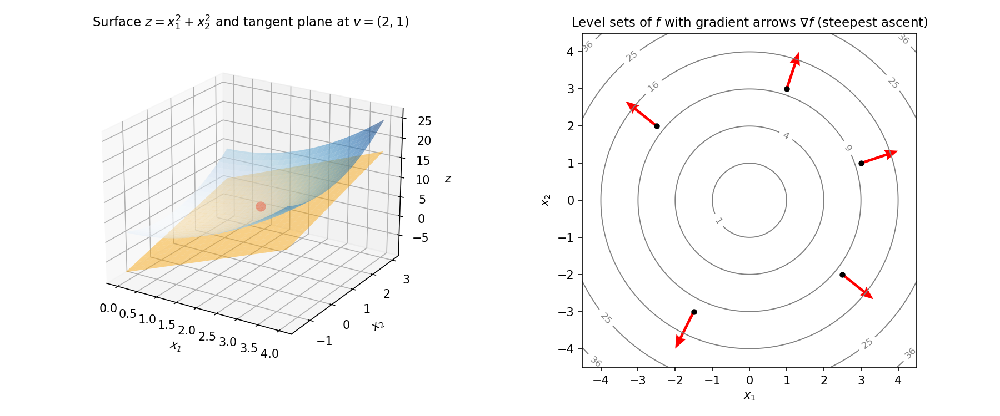

# 9. Multivariable calculus: partial derivatives, gradients, Taylor series

Chapter 8 built the one-variable machinery: derivative, tangent line, linear approximation. Machine learning almost never has one variable — the loss depends on thousands or millions of weights. This chapter replays Chapter 8 with many variables: the derivative becomes a *vector* of partial derivatives (the gradient), the tangent line becomes a *tangent plane*, and the linear approximation grows into Taylor's quadratic approximation.

The chapter has six acts:

i) **Partial derivatives** — differentiate in one direction, freeze the rest.
ii) **The gradient** — package all the partials into one vector.
iii) **Directional derivatives** — rate of change along any direction.
iv) **Linear approximation and tangent planes** — the tangent line → tangent plane upgrade (§8.6's formula, generalized).
v) **The multivariable chain rule** — differentiating through a moving point.
vi) **Taylor series** — first-order (linear) and second-order (quadratic, with the Hessian).

## 9.1 Partial derivatives: freeze everything but one variable

Take $f(x_1, x_2) = x_1^2 + x_2^2$. Ask: "how fast does $f$ change if I nudge *only* $x_1$?" Fix $x_2$ at a constant — then $f$ is an ordinary one-variable function of $x_1$, and the ordinary derivative applies. That is a **partial derivative**.

**Def.** Let $f: \mathbb{R}^d \to \mathbb{R}$ and $\mathbf{v} \in \mathbb{R}^d$. The **partial derivative** of $f$ with respect to $x_i$ at $\mathbf{v}$ is
$$\frac{\partial f}{\partial x_i}(\mathbf{v}) = \lim_{\alpha \to 0} \frac{f(\mathbf{v} + \alpha \mathbf{e}_i) - f(\mathbf{v})}{\alpha},$$
where $\mathbf{e}_i$ is the coordinate vector ($1$ in the $i$-th slot, $0$ elsewhere). Moving along $\mathbf{v} + \alpha \mathbf{e}_i$ changes *only* the $i$-th coordinate, so the limit is exactly the single-variable derivative of §8.3 in that one direction.

The working rule is simpler than the definition: **hold all other variables fixed (treat them as constants) and differentiate with respect to the chosen variable** using the §8.5 rules. Alternative notation: $f_{x_i}$ or $\frac{\partial f}{\partial x_i}$.

**eg 1 — partials of a quadratic (full steps).** $f(x_1, x_2) = x_1^2 + x_2^2$.

i) $\frac{\partial f}{\partial x_1}$: freeze $x_2$. Then $x_2^2$ is a constant, and $\frac{d}{dx_1}x_1^2 = 2x_1$ by the power rule. So $\frac{\partial f}{\partial x_1} = 2x_1$.
ii) $\frac{\partial f}{\partial x_2}$: freeze $x_1$. Then $x_1^2$ is a constant, and $\frac{d}{dx_2}x_2^2 = 2x_2$. So $\frac{\partial f}{\partial x_2} = 2x_2$.

**eg 2 — product + chain in the partials (full steps).** $f(x, y) = x e^{xy}$.

i) $\frac{\partial f}{\partial x}$: freeze $y$. Product rule on $x$ and $e^{xy}$: $\frac{d}{dx}\bigl[e^{xy}\bigr] = y e^{xy}$ (chain rule, $y$ constant). So
$$\frac{\partial f}{\partial x} = 1 \cdot e^{xy} + x \cdot y e^{xy} = e^{xy}(1 + xy).$$
ii) $\frac{\partial f}{\partial y}$: freeze $x$. Then $x$ is a constant factor, and $\frac{d}{dy}\bigl[e^{xy}\bigr] = x e^{xy}$. So
$$\frac{\partial f}{\partial y} = x \cdot x e^{xy} = x^2 e^{xy}.$$
At $(1, 0)$: $\frac{\partial f}{\partial x}(1, 0) = e^0(1 + 0) = 1$, $\frac{\partial f}{\partial y}(1, 0) = 1 \cdot e^0 = 1$.

**eg 3 — quick two-variable partials (full steps).** $f(x, y) = x^2 - xy$.

i) $\frac{\partial f}{\partial x}$: freeze $y$. Derivative of $x^2$ is $2x$; derivative of $xy$ (with $y$ constant) is $y$. So $\frac{\partial f}{\partial x} = 2x - y$.
ii) $\frac{\partial f}{\partial y}$: freeze $x$. Derivative of $x^2$ is $0$; derivative of $-xy$ (with $x$ constant) is $-x$. So $\frac{\partial f}{\partial y} = -x$.

**Basically, ...** A partial derivative is a one-variable derivative with blinkers on: pick the variable you care about, pretend every other variable is just a number, and differentiate normally. The $\partial$ ("curly d") is there to remind you the others are being held still.

**Note:** Partial derivatives are *rates along the coordinate axes only*. Along a diagonal direction, $x$ and $y$ move together — that needs the directional derivative (§9.3).

## 9.2 The gradient: all partials packaged into one vector

At a point $\mathbf{v}$, there are $d$ partial derivatives. Stack them into a column vector and you get the **gradient**:

**Def.** For $f: \mathbb{R}^d \to \mathbb{R}$,
$$\nabla f(\mathbf{v}) = \begin{pmatrix} \frac{\partial f}{\partial x_1}(\mathbf{v}) \\ \frac{\partial f}{\partial x_2}(\mathbf{v}) \\ \vdots \\ \frac{\partial f}{\partial x_d}(\mathbf{v}) \end{pmatrix}.$$
$\nabla$ is read "nabla" or "del". (The row-vector version $\frac{\partial f}{\partial \mathbf{x}}$ is the same package written as a row; the gradient is its transpose, hence a column.)

This is the *computational* interpretation of the gradient: it is the vector that collects every partial derivative. The geometric interpretations — steepest ascent, perpendicular to level sets — come in §9.4–9.5.

**eg 4 — gradient of a quadratic at a point (full steps).** $f(x_1, x_2) = x_1^2 + x_2^2$, at $\mathbf{v} = (6, 2)$. From eg 1: $\frac{\partial f}{\partial x_1} = 2x_1$, $\frac{\partial f}{\partial x_2} = 2x_2$. Evaluate at $(6, 2)$:
$$\nabla f(6, 2) = \begin{pmatrix} 2 \cdot 6 \\ 2 \cdot 2 \end{pmatrix} = \begin{pmatrix} 12 \\ 4 \end{pmatrix}.$$

**eg 5 — a linear function has a constant gradient (full steps).** $f(\mathbf{x}) = x_1 + 2x_2 + 3x_3$.

i) $\frac{\partial f}{\partial x_1}$: freeze $x_2, x_3$; only $x_1$ survives differentiation, giving $1$.
ii) $\frac{\partial f}{\partial x_2} = 2$; $\frac{\partial f}{\partial x_3} = 3$. Hence
$$\nabla f(\mathbf{x}) = \begin{pmatrix} 1 \\ 2 \\ 3 \end{pmatrix} \quad \text{everywhere.}$$
A constant gradient means the function is linear: it climbs at a steady rate everywhere, so its rate of change has nothing new to say at any point.

**Basically, ...** The gradient is the complete first-order report on a function at one point: "here is how fast $f$ changes in each coordinate direction, all at once." One vector, $d$ numbers, no information lost.

**Note (ML):** In training, $f$ is the loss and $\mathbf{x}$ the vector of model weights. $\nabla f$ then says *how each weight nudges the loss* — it is the quantity every training step computes. This chapter builds the object; Chapter 10 uses it.

## 9.3 Directional derivatives: rate of change along any direction

Partials measure change along the axes. What about change along an arbitrary direction $\mathbf{u}$?

**Def.** The **directional derivative** of $f$ at $\mathbf{v}$ along $\mathbf{u}$ is
$$D_{\mathbf{u}} f(\mathbf{v}) = \lim_{\alpha \to 0} \frac{f(\mathbf{v} + \alpha \mathbf{u}) - f(\mathbf{v})}{\alpha}.$$
In words: start at $\mathbf{v}$, walk a tiny step $\alpha$ along $\mathbf{u}$, and measure the rate of change of $f$.

Because $\alpha$ is tiny, $f(\mathbf{v} + \alpha \mathbf{u})$ can be replaced by the linear approximation of §9.6 (valid near $\mathbf{v}$):
$$f(\mathbf{v} + \alpha \mathbf{u}) \approx f(\mathbf{v}) + \nabla f(\mathbf{v})^T (\alpha \mathbf{u}).$$
Plug into the definition: the $f(\mathbf{v})$ cancels, the $\alpha$ cancels, and
$$D_{\mathbf{u}} f(\mathbf{v}) = \nabla f(\mathbf{v})^T \mathbf{u} = \nabla f(\mathbf{v}) \cdot \mathbf{u}.$$
So the directional derivative is just the dot product of the gradient with the direction (§2.5) — a *weighted sum of partials*, weighted by the direction's components. The formula is most meaningful when $\mathbf{u}$ is a **unit vector** ($\lVert \mathbf{u} \rVert = 1$); otherwise the "rate" is polluted by the direction's length.

**eg 6 — directional derivative, normalizing the direction (full steps).** $f(x, y) = x \cos y$, direction $\mathbf{u} = [2, 1]$.

i) Partials: $\frac{\partial f}{\partial x} = \cos y$ ($x$ differentiated, $\cos y$ constant); $\frac{\partial f}{\partial y} = -x \sin y$ ($x$ constant factor, derivative of $\cos y$ is $-\sin y$). So $\nabla f = (\cos y,\ -x \sin y)^T$.
ii) $\mathbf{u}$ is not unit length: $\lVert \mathbf{u} \rVert = \sqrt{2^2 + 1^2} = \sqrt{5}$. Unit direction: $\hat{\mathbf{u}} = \left(\frac{2}{\sqrt{5}}, \frac{1}{\sqrt{5}}\right)$.
iii) $$D_{\hat{\mathbf{u}}} f(x, y) = \nabla f \cdot \hat{\mathbf{u}} = \frac{2}{\sqrt{5}} \cos y - \frac{1}{\sqrt{5}} x \sin y.$$

**eg 7 — directional derivative at a point (full steps).** $f(x, y) = x^2 - xy$ at $(2, -3)$, direction $\mathbf{u} = 0.6\,\mathbf{i} + 0.8\,\mathbf{j}$.

i) From eg 3: $\nabla f(x, y) = (2x - y,\ -x)^T$. At $(2, -3)$: $\nabla f(2, -3) = (2(2) - (-3),\ -2)^T = (7, -2)^T$.
ii) Check $\mathbf{u}$ is unit: $0.6^2 + 0.8^2 = 0.36 + 0.64 = 1$. ✓ (no normalization needed).
iii) $$D_{\mathbf{u}} f(2, -3) = (7, -2) \cdot (0.6, 0.8) = 7(0.6) + (-2)(0.8) = 4.2 - 1.6 = 2.6.$$

**Basically, ...** Stand at $\mathbf{v}$, point your finger along $\mathbf{u}$, and ask "how fast does the ground rise in that direction?" The answer is the gradient dotted with your finger: each partial contributes, weighted by how much your finger leans along its axis.

## 9.4 The gradient is the direction of steepest ascent

Among all directions $\mathbf{u}$ (unit length), which makes $f$ increase fastest? That is: maximize $D_{\mathbf{u}} f(\mathbf{v}) = \nabla f(\mathbf{v})^T \mathbf{u}$ over $\lVert \mathbf{u} \rVert = 1$.

The tool is the **Cauchy–Schwarz inequality**: for vectors $\mathbf{a}, \mathbf{b}$,
$$-\lVert \mathbf{a} \rVert \, \lVert \mathbf{b} \rVert \le \mathbf{a}^T \mathbf{b} \le \lVert \mathbf{a} \rVert \, \lVert \mathbf{b} \rVert,$$
with the upper bound attained exactly when $\mathbf{a}$ is a *positive* scalar multiple of $\mathbf{b}$. Apply it with $\mathbf{a} = \nabla f(\mathbf{v})$ and $\mathbf{b} = \mathbf{u}$ (unit, so $\lVert \mathbf{u} \rVert = 1$):
$$D_{\mathbf{u}} f(\mathbf{v}) = \nabla f(\mathbf{v})^T \mathbf{u} \le \lVert \nabla f(\mathbf{v}) \rVert.$$
The maximum rate of increase equals the gradient's length, and it is attained at
$$\mathbf{u} = \frac{\nabla f(\mathbf{v})}{\lVert \nabla f(\mathbf{v}) \rVert},$$
the unit vector along the gradient. Hence: **the gradient points in the direction of steepest ascent**. Flip the sign: $-\nabla f(\mathbf{v})$ is the direction of steepest descent, and every $\mathbf{u}$ with $\nabla f(\mathbf{v})^T \mathbf{u} < 0$ is a **descent direction** (a direction along which $f$ decreases).

**eg 8 — steepest ascent, verified (full steps).** $f(x_1, x_2) = x_1^2 + x_2^2$ at $(3, 1)$.

i) $\nabla f(3, 1) = (6, 2)^T$ (eg 1 with $2x_1, 2x_2$).
ii) Unit steepest-ascent direction: $\lVert (6, 2) \rVert = \sqrt{36 + 4} = \sqrt{40} = 2\sqrt{10}$, so $\mathbf{u}^* = \frac{(6, 2)}{2\sqrt{10}} = \frac{(3, 1)}{\sqrt{10}}$.
iii) Max rate: $D_{\mathbf{u}^*} f = \nabla f \cdot \mathbf{u}^* = \frac{18 + 2}{\sqrt{10}} = \frac{20}{\sqrt{10}} = \sqrt{40} \approx 6.32 = \lVert \nabla f \rVert$. ✓
iv) Sanity check against a worse direction: along $\mathbf{u} = (1, 0)$, $D = (6, 2) \cdot (1, 0) = 6 < 6.32$. The gradient direction really is fastest. The steepest-descent direction is $-\mathbf{u}^* = \frac{(-3, -1)}{\sqrt{10}}$.

**Basically, ...** If $f$ is a hill and you are standing on it, the gradient is the arrow a compass would draw saying "climb this way for the fastest gain in height." Walk the opposite way to descend fastest. Every direction at right angles to the gradient is locally flat — you neither climb nor fall.

**Note (forward pointer):** This is the entire engine of Chapter 10: gradient descent is just "repeatedly step a little along $-\nabla f$" — the steepest-descent direction re-applied at each new point.

## 9.5 The gradient is perpendicular to the level sets

Draw the curves where $f$ is constant — the **level sets** (contour lines) $\{ \mathbf{x} : f(\mathbf{x}) = c \}$. At any point $\mathbf{v}$, the gradient $\nabla f(\mathbf{v})$ is **perpendicular** to the level set through $\mathbf{v}$.

The easy version to prove: $\nabla f(\mathbf{v})$ is perpendicular to the *linearized* level set $\{ \mathbf{x} : L_{\mathbf{v}}(f)(\mathbf{x}) = f(\mathbf{v}) \}$, where $L_{\mathbf{v}}(f)$ is the linear approximation of §9.6. That set is
$$\{ \mathbf{x} : f(\mathbf{v}) + \nabla f(\mathbf{v})^T(\mathbf{x} - \mathbf{v}) = f(\mathbf{v}) \} = \{ \mathbf{x} : \nabla f(\mathbf{v})^T \mathbf{x} = \nabla f(\mathbf{v})^T \mathbf{v} \},$$
a hyperplane of the form $\mathbf{w}^T \mathbf{x} = b$ — and a hyperplane's normal vector is $\mathbf{w}$ itself (from the lines-and-planes geometry: the vector $\mathbf{w}$ pierces $\mathbf{w}^T \mathbf{x} = b$ at $90^\circ$). Here $\mathbf{w} = \nabla f(\mathbf{v})$. For the true (curved) level set, the same perpendicularity holds at the point of contact — the right panel of the figure shows it directly.

**eg 9 — perpendicularity on a circle (full steps).** $f(x_1, x_2) = x_1^2 + x_2^2$ at $\mathbf{v} = (-6, 2)$.

i) $\nabla f(-6, 2) = (-12, 4)^T$. Level value: $f(-6, 2) = 36 + 4 = 40$, so the level set is the circle $x_1^2 + x_2^2 = 40$.
ii) The circle's tangent at $(-6, 2)$ is perpendicular to the radius vector $(-6, 2)$ (a radius always meets its circle at $90^\circ$).
iii) $\nabla f(-6, 2) = (-12, 4) = 2 \cdot (-6, 2)$ is parallel to the radius, hence perpendicular to the tangent — i.e. perpendicular to the level set at that point. ✓

<!-- Original figure drawn for this chapter with matplotlib (not reused from any external source). -->

**Basically, ...** Contours are the "same height" lines on a map. The gradient arrow always stabs straight through the contour line at right angles, pointing from lower contours toward higher ones — it is the direction that crosses height-lines fastest, which is exactly why it is the steepest way up.

## 9.6 Linear (first-order) approximation and the tangent plane

Recall §8.6: near $x^*$,
$$f(x) \approx f(x^*) + f'(x^*)(x - x^*).$$
The multivariable upgrade keeps the shape and swaps the parts: the slope $f'(x^*)$ becomes the gradient vector, and multiplication becomes the dot product. For $f: \mathbb{R}^d \to \mathbb{R}$, near $\mathbf{v}$:
$$f(\mathbf{x}) \;\approx\; f(\mathbf{v}) + \nabla f(\mathbf{v})^T (\mathbf{x} - \mathbf{v}) \qquad (\mathbf{x} \text{ near } \mathbf{v}).$$
Writing the dot product out:
$$f(\mathbf{x}) \approx f(\mathbf{v}) + \sum_{i=1}^{d} \frac{\partial f}{\partial x_i}(\mathbf{v}) \, (x_i - v_i).$$
Why does this hold? Move along $x_1$ alone: the one-variable linear approximation says the change is $\frac{\partial f}{\partial x_1}(\mathbf{v})(x_1 - v_1)$. Move along $x_2$ alone: the change is $\frac{\partial f}{\partial x_2}(\mathbf{v})(x_2 - v_2)$. If all coordinates move at once, the total change is the *sum* of the individual changes — and that sum is exactly the formula above. This is the **linear approximation** $L_{\mathbf{v}}(f)$: valid when $\mathbf{x}$ is near $\mathbf{v}$, exact at $\mathbf{x} = \mathbf{v}$.

**Tangent line → tangent plane.** In §8.6 the graph of the linear approximation was the tangent *line*. Here the graph of $f: \mathbb{R}^d \to \mathbb{R}$ lives in $\mathbb{R}^{d+1}$, and the graph of $L_{\mathbf{v}}(f)$ — a linear function — is a *plane* (hyperplane) that touches the graph of $f$ at the point $(\mathbf{v}, f(\mathbf{v}))$: the **tangent plane**. Same object as in §8.6, one dimension up (left panel of the figure).

**eg 10 — linear approximation around $(6, 2)$ (full steps).** $f(x_1, x_2) = x_1^2 + x_2^2$, $\mathbf{v} = (6, 2)$.

i) Value: $f(6, 2) = 36 + 4 = 40$.
ii) Gradient at $\mathbf{v}$ (eg 4): $\nabla f(6, 2) = (12, 4)^T$.
iii) $$L(x_1, x_2) = 40 + (12, 4) \cdot (x_1 - 6,\ x_2 - 2) = 40 + 12(x_1 - 6) + 4(x_2 - 2).$$
Simplify: $40 + 12x_1 - 72 + 4x_2 - 8 = 12x_1 + 4x_2 - 40$.
iv) Check: at $(6, 2)$, $L = 72 + 8 - 40 = 40 = f(6, 2)$. ✓ (exact at the expansion point).
v) Numerical check near $\mathbf{v}$: at $(6.1, 2.05)$, $L = 12(6.1) + 4(2.05) - 40 = 73.2 + 8.2 - 40 = 41.4$, while $f = 6.1^2 + 2.05^2 = 37.21 + 4.2025 = 41.4125$. Error $\approx 0.0125$ — the plane hugs the surface near the touch point.

**eg 11 — linearize and estimate (full steps).** $f(x, y) = x e^{xy}$ at $(1, 0)$; approximate $f(1.1, -0.1)$.

i) $f(1, 0) = 1 \cdot e^0 = 1$.
ii) Partials at $(1, 0)$ (eg 2): both equal $1$. So $\nabla f(1, 0) = (1, 1)^T$.
iii) $$L(x, y) = 1 + 1 \cdot (x - 1) + 1 \cdot (y - 0) = x + y.$$
iv) $f(1.1, -0.1) \approx L(1.1, -0.1) = 1.1 - 0.1 = 1.0$. True value: $1.1 \cdot e^{-0.11} \approx 1.1 \times 0.89583 \approx 0.98542$. The plane is a good stand-in this close to $(1, 0)$.

**Basically, ...** Zoom in close enough on any smooth surface and it looks flat. The linear approximation is that flat sheet written down: value at the point, plus (rate in each direction) × (how far you walked in that direction), added up. The gradient is the complete instruction manual for the sheet.

**Note:** Like §8.6's warning — the approximation is *exact* at the expansion point and degrades as you wander away. The formula never tells you when you have walked too far; every first-order method in ML (including Chapter 10's) inherits this honest limitation.

## 9.7 The multivariable chain rule: differentiating through a moving point

§9.3 derived the directional derivative along a *straight line* $\mathbf{v} + \alpha \mathbf{u}$. The same linear-approximation machinery handles a point moving along a *curve*. Let $z = f(x(t), y(t))$: $x$ and $y$ each depend on $t$, and $z$ depends on both. Then
$$\frac{dz}{dt} = \frac{\partial f}{\partial x} \frac{dx}{dt} + \frac{\partial f}{\partial y} \frac{dy}{dt} = \nabla f\bigl(\mathbf{x}(t)\bigr) \cdot \mathbf{x}'(t).$$
Read it as: each moving coordinate contributes its own chain of "how $f$ responds to $x$" × "how $x$ moves with $t$" — exactly the "if both move, add the changes" reasoning of §9.6, now with the changes happening continuously. This is the *scalar prototype* of backpropagation's chain rule: a neural network is a long composition of such steps, and Chapter 42 replays this formula layer by layer in vector form. (The vector/matrix version is not derived here.)

**eg 12 — chain rule along a curve (full steps).** $z = x_1^2 + x_2^2$ with $x_1(t) = 3t$, $x_2(t) = 1 - t$. Find $\frac{dz}{dt}$.

*Method A — substitute first, then differentiate.*
$$z(t) = (3t)^2 + (1 - t)^2 = 9t^2 + 1 - 2t + t^2 = 10t^2 - 2t + 1,$$
$$\frac{dz}{dt} = 20t - 2.$$

*Method B — the chain rule.*
i) $\frac{\partial z}{\partial x_1} = 2x_1 = 6t$; $\frac{dx_1}{dt} = 3$.
ii) $\frac{\partial z}{\partial x_2} = 2x_2 = 2(1 - t)$; $\frac{dx_2}{dt} = -1$.
iii) $$\frac{dz}{dt} = (6t)(3) + \bigl(2(1 - t)\bigr)(-1) = 18t - 2 + 2t = 20t - 2. \quad \checkmark$$
Both routes agree — Method B is the one that scales to long compositions where substitution is impossible.

**Basically, ...** $t$ pulls two levers ($x$ and $y$), and each lever pulls $z$. The total pull on $z$ is (how hard $t$ pulls $x$) × (how hard $x$ pulls $z$), plus the same for $y$. The gradient is the "how hard each lever pulls $z$" part; the curve's velocity is the "how hard $t$ pulls each lever" part.

## 9.8 Taylor series: adding the quadratic term (the Hessian)

§9.6 is the *first-order* (linear) Taylor approximation. Just as Chapter 8's quadratics improved on its line, we can add a quadratic term in many variables. For $f: \mathbb{R}^d \to \mathbb{R}$, near $\mathbf{v}$:
$$f(\mathbf{x}) \;\approx\; f(\mathbf{v}) + \nabla f(\mathbf{v})^T (\mathbf{x} - \mathbf{v}) + \tfrac{1}{2}\, (\mathbf{x} - \mathbf{v})^T \, \mathbf{H}(\mathbf{v}) \, (\mathbf{x} - \mathbf{v}),$$
where $\mathbf{H}$ is the **Hessian matrix** — the $d \times d$ matrix of second-order partial derivatives:
$$\mathbf{H}_{ij} = \frac{\partial^2 f}{\partial x_i \, \partial x_j},$$
i.e. differentiate with respect to $x_j$ first, then $x_i$. The term $\tfrac{1}{2}(\mathbf{x}-\mathbf{v})^T \mathbf{H} (\mathbf{x}-\mathbf{v})$ is a scalar (row × matrix × column), exactly analogous to the $\tfrac{1}{2} f''(a)(x - a)^2$ term of the one-variable Taylor series. For smooth functions the mixed partials agree ($\frac{\partial^2 f}{\partial x \partial y} = \frac{\partial^2 f}{\partial y \partial x}$), so $\mathbf{H}$ is symmetric — check it in the example below.

**eg 13 — Hessian and quadratic approximation (full steps).** $f(x, y) = x^2 - xy$, expanded around $\mathbf{v} = (2, -3)$.

i) First-order pieces (eg 3, eg 7): $f(2, -3) = 4 - (2)(-3) = 10$; $\nabla f(2, -3) = (7, -2)^T$.
ii) Second partials: $\frac{\partial^2 f}{\partial x^2} = \frac{\partial}{\partial x}(2x - y) = 2$; $\frac{\partial^2 f}{\partial x \partial y} = \frac{\partial}{\partial x}(-x) = -1$; $\frac{\partial^2 f}{\partial y \partial x} = \frac{\partial}{\partial y}(2x - y) = -1$; $\frac{\partial^2 f}{\partial y^2} = \frac{\partial}{\partial y}(-x) = 0$. So
$$\mathbf{H} = \begin{pmatrix} 2 & -1 \\ -1 & 0 \end{pmatrix},$$
symmetric, as expected. ✓
iii) Set $\mathbf{u} = (x - 2,\ y + 3)^T$. The quadratic term:
$$\tfrac{1}{2}\, \mathbf{u}^T \mathbf{H} \mathbf{u} = \tfrac{1}{2}\bigl(2(x-2)^2 - 2(x-2)(y+3)\bigr) = (x-2)^2 - (x-2)(y+3).$$
iv) Full quadratic approximation:
$$Q(x, y) = 10 + 7(x-2) - 2(y+3) + (x-2)^2 - (x-2)(y+3).$$
v) Consistency check — expand to verify it reproduces $f$ exactly (it should: $f$ is itself quadratic, and the second-order Taylor of a quadratic is exact):
$$(x-2)^2 - (x-2)(y+3) = x^2 - 4x + 4 - xy - 3x + 2y + 6 = x^2 - xy - 7x + 2y + 10,$$
and $10 + 7(x-2) - 2(y+3) = 7x - 2y - 10$. Adding: $x^2 - xy - 7x + 2y + 10 + 7x - 2y - 10 + 10 = x^2 - xy$. ✓

**Basically, ...** The linear approximation pretends the world is flat; the quadratic term adds the *curvature*. The Hessian is the "curvature report": how the slope itself is changing in every pair of directions. First order tells you which way is downhill; second order tells you how the hill bends — which is exactly the extra information second-order optimizers buy (Chapter 10/12).

**Note:** The quadratic approximation is the best quadratic fit at the point, and it is *exact* for functions that are already quadratic (eg 13's check). For everything else it beats the linear approximation near the point — at the cost of computing $d^2$ second partials instead of $d$ first ones.

## 9.9 Critical points: where the gradient vanishes

From §8.7: at a one-variable turning point, $f'(a) = 0$. The multivariable version: if $f$ is minimized (or maximized) at $\mathbf{v}$, then every partial derivative is $0$ there, i.e.
$$\nabla f(\mathbf{v}) = \mathbf{0}.$$
A point with $\nabla f(\mathbf{v}) = \mathbf{0}$ (the *vector* zero) is a **critical point** — the first-order necessary condition for optimality. But the converse fails: a vanishing gradient also marks maxima and saddle points, so critical points are *candidates* to be checked, not verdicts. (The Hessian-based check that tells minima from maxima from saddles is Chapter 10's.)

**eg 14 — finding a critical point (full steps).** $f(x_1, x_2) = x_1^2 + x_2^2$.

i) $\nabla f(\mathbf{x}) = (2x_1, 2x_2)^T$ (eg 1).
ii) Set $\nabla f(\mathbf{v}) = \mathbf{0}$: $2v_1 = 0$ and $2v_2 = 0$, so $\mathbf{v} = (0, 0)$.
iii) This is the unique critical point — and (from the bowl shape) the global minimum, $f(0, 0) = 0$.

**Basically, ...** A critical point is where the surface goes locally flat in *every* direction at once: every arrow of steepest ascent shrinks to nothing. Peaks, valley bottoms, and mountain passes all look flat if you zoom in close — so "gradient zero" narrows the search to suspects, and the Hessian interrogates them (Chapter 10).

## 9.10 Where this goes next

- **Chapter 10 (optimization):** the gradient becomes an algorithm. Gradient descent iterates the linear approximation of §9.6 — step a little along $-\nabla f$ (the steepest-descent direction of §9.4), re-approximate, repeat. The Hessian of §9.8 grows into the second-derivative test for minima, maxima, and saddles in many dimensions, and into second-order (Newton-style) methods.
- **Chapter 42 (backpropagation):** the chain rule of §9.7, industrialized. Every gradient in deep learning is §9.7 applied layer by layer through a computation graph — "outer derivative at the inner value, times inner derivative" (§8.5), once per layer.

The through-line of the whole chapter: the gradient is the object that turns a many-variable function into something you can *navigate* — it points uphill, its negative points downhill, its length sets the pace, and its vanishing marks the interesting points.

## Problem set

1. Compute the partial derivatives of $f(x, y) = 3x^2y - 5xy^3 + 2x$: find $\frac{\partial f}{\partial x}$ and $\frac{\partial f}{\partial y}$.
2. Let $f(x, y, z) = xy + yz + zx$. Write down $\nabla f$ as a column vector.
3. For $f(x_1, x_2) = \sin x_1 \cos x_2$, compute $\nabla f$ at $\left(\frac{\pi}{2}, 0\right)$. What kind of point is it (see §9.9)?
4. Let $f(x, y) = x^2 - xy$. Compute the directional derivative at $(2, -3)$ along $\mathbf{u} = (4, 3)$ (normalize it first).
5. Find the linear approximation of $f(x, y) = xy + y^2$ at $(1, 2)$, and use it to approximate $f(1.05, 1.9)$.
6. Let $z = e^{xy}$ with $x = t^2$, $y = 1 - t$. Compute $\frac{dz}{dt}$ by the chain rule, and verify by substituting first.
7. For $f(x, y) = 3x + 4y - x^2 - y^2$ at $(1, 1)$: what is the unit direction of steepest ascent, and what is the maximum rate of increase? What is the steepest-descent direction?
8. Compute the Hessian matrix of $f(x, y) = x^3 + y^2 + xy$ at $(1, 2)$. Is it symmetric?
9. Write the second-order Taylor (quadratic) approximation of $f(x, y) = e^{x+y}$ around $(0, 0)$.
10. For $f(x, y) = x^2 + 4y^2$ at $(1, 1)$: (a) compute $\nabla f(1, 1)$; (b) verify it is perpendicular to the level set $f(x, y) = 5$ at that point by dotting it with a tangent direction to the level set.
11. Find all critical points of $f(x, y) = x^2 + y^2 - 2x + 4y$.
12. Show that the directional derivative along the coordinate direction $\mathbf{e}_1 = (1, 0, \ldots, 0)$ is exactly the first partial derivative: $D_{\mathbf{e}_1} f(\mathbf{v}) = \frac{\partial f}{\partial x_1}(\mathbf{v})$.
