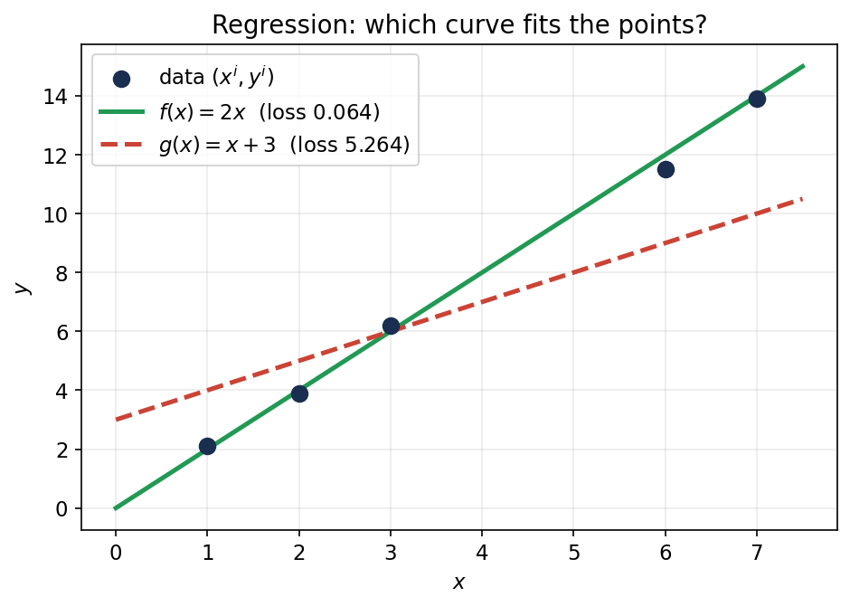

# 22. What is ML: data, models, tasks; supervised vs unsupervised

Chapter 21 closed Part II by explaining *why* averages concentrate and fluctuations look normal. This chapter opens Part III: it turns that machinery into machine learning. Everything here comes from the MLF Week 1 lectures — "Introduction, Terminology and Setup" by Harish Guruprasad Ramaswamy — whose job is to fix the vocabulary (data, model, learning algorithm, task) and sketch the four learning problems this part of the book is about: regression and classification (supervised), dimensionality reduction and density estimation (unsupervised). The algorithms themselves are Chapters 23–25's job; this chapter frames.

## 22.1 What is machine learning?

**Def.** **Machine learning (ML)** = "the study of computer algorithms that improve automatically through experience and by the use of data" (the Wikipedia definition the lecture opens with).

Three phrases do the work: *computer algorithms* (it is a computation problem, not philosophy), *improve automatically through experience* (the system gets better without a human rewriting it), and *by the use of data* (experience = data — past examples, not a textbook of rules).

**Basically, ...** Ordinary software = a human writes the rules; the computer executes them. Machine learning = the computer *derives* the rules from examples. You don't teach it face detection by describing a face in code — you show it a million faces and let it figure out the pattern.

**Note (the ML vs everything-else test).** The lecture's rule of thumb: if you can solve a task with manual labour or plain programming, *do that* — don't reach for ML. ML earns its keep only where both fail. That decision is made by a task analysis (§22.2).

## 22.2 The task hierarchy: manual labour → programming → machine learning

**Def (task).** A **task** = a process converting an **input** into an **output**. The same task can be performed at increasing levels of abstraction:

i) **Manual labour.** The human directly converts input to output. (Input → Human → Output.)
ii) **Programming / tool usage.** The human builds a *tool* that converts input to output. (Input → Software → Output.)
iii) **Machine learning.** The human doesn't even build the tool. The human gives a broad blueprint to a *tool design*, which uses **data** plus the human's blueprint to construct the tool. (Input → Model → Output, where the model was built by a learning algorithm from data.)

<!-- Original matplotlib illustration drawn for this chapter (not reused from any URL): the three-level task hierarchy — manual labour, programming, machine learning — as block diagrams -->

**Why programming/human labour fail.** Two failure modes, and one success condition for ML:

i) **Scale/speed/cost.** Humans can verify passwords in principle — but not for billions of logins.
ii) **Can't express the rules.** You know a face when you see one (a baby learns it from a few examples), but you cannot write down "what pixel patterns constitute a face" in a programming language. Or you don't even know the rules at all — nobody fully knows the function mapping today's radar map to tomorrow's rain.
iii) **Hope for ML.** Lots of example data, plus *some* structural idea about the rule (you don't know the exact rule, but you know what shape it might take).

**eg 1 (task analysis: password verify — no ML needed).** Input: password; output: authentication. Manual labour: conceivable but fails on scale (billions of humans needed). Programming: trivial — compare input against the password on file. Since programming works, ML is never considered.

**eg 2 (task analysis: face detection — the ML case).** Input: image (pixels); output: face / no face (+ location). Manual labour: conceivable (a human drawing boxes on every photo) but absurd on scale. Programming: fails — the idea of "face" cannot be conveyed to a computer that sees only pixels, even though such a function clearly exists. ML: succeeds — the human never writes the face rule; a learning algorithm builds the tool from lots of face/non-face images (practically unlimited on the internet).

**eg 3 (task analysis: weather prediction — the ML case).** Input: radar map (wind, moisture); output: rain/shine tomorrow. Manual labour fails — humans don't know the rule themselves (physics implements it; nobody wrote it down). Programming fails for the same reason — you can't code what you don't know. ML works because a rule *exists* (nature runs it), and there is immense historical weather data to learn it from.

**The wonders (the lecture's tour).** Once you see the hierarchy, you see ML everywhere: **inbox** (spam classifiers — "one of the biggest success cases of machine learning"), **shopping cart** (recommender systems: "customers who bought this also bought…"), **smart assistant** (sound waveform → text → command: "increase volume by 10%"), **robots** (a Mars rover can't be remote-controlled with 10–15 minute radio delays — it must decide actions from its environment), **games** (chess, then Go: "impossibly complex" until an ML system beat the best human), **marketing** (who to advertise to on a fixed budget).

**Basically, ...** Ask two questions about any task. (1) Can a human do it at scale? Can a programmer write the rule? If either is yes — stop, use that. (2) If both are no — is there lots of example data and some structural idea of the rule? If yes — that's a machine learning task. Password verify stops at question 1; face detection and weather prediction pass both gates.

## 22.3 Data: a collection of vectors

**Def.** In ML, **data** = a collection of vectors. Each data point is a vector in $\mathbb{R}^d$ (the lecture: "data will almost always mean a collection of vectors").

The lecture's running example: six houses, each a $4$-dimensional vector:

| | # rooms | Area (100 sq.ft) | Distance to metro (km) | Price (10 lakhs) |
|---|---|---|---|---|
| House 1 | 3 | 9 | 1.9 | 5.0 |
| House 2 | 2 | 7 | 2.1 | 3.2 |
| House 3 | 4 | 12 | 2.8 | 6.6 |
| House 4 | 5 | 16 | 0.9 | 9.8 |
| House 5 | 5 | 15 | 3.1 | 8.5 |
| House 6 | 4 | 11 | 1.6 | 6.9 |

**Def (metadata).** **Metadata** = information *on* the data — what each number means. Here: coordinate 1 = number of rooms, coordinate 2 = area in hundreds of square feet, coordinate 3 = distance to metro in km, coordinate 4 = price in tens of lakhs.

i) **Metadata is for humans.** "House 1 is a three-bedroom house with 900 sq.ft, 1.9 km from the metro, priced at 50 lakhs" — that story is human-readable; the computer only needs the numbers.
ii) **Consistency is for the computer.** The computer doesn't need to know what "rooms" means — but coordinate 1 must mean rooms for *every* house. As long as the meaning is consistent across rows, the data is usable.

**eg 4 (reading the table with metadata).** House 4 = $(5, 16, 0.9, 9.8)$ reads as: 5 rooms, $1600$ sq.ft, $0.9$ km from the metro, price $98$ lakhs (9.8 tens of lakhs). The vector $(5, 16, 0.9, 9.8)$ is the data; the sentence is the metadata's work.

**Note (the data assumption).** Learning algorithms treat the data points as independent draws of the same kind — the examples are generated "independently", in the lecture's phrasing for the tweet stream (§22.13) — and expect *future* data to look like the training data (that's what "predict on unseen data" in §22.10 means). The formal i.i.d. machinery is §20.1's; here it is just the standing bet every ML task makes: tomorrow's data resembles today's.

**Basically, ...** Data = a table of numbers (vectors). Metadata = the column headers that tell *you* what the numbers mean; the computer doesn't care about headers, it only cares that column 2 means the same thing in every row. Every ML chapter from here on starts from such a table.

## 22.4 Models: mathematical simplifications of reality

**Def.** A **model** = a mathematical simplification of reality. It represents reality but is simpler and more compact than reality — never exact, sometimes useful.

The lecture's scientific examples: the **ideal gas model** ($PV = nRT$ — no gas is truly ideal, but it captures the important behaviour); the **inverse-square law** for gravity (force $\propto 1/R^2$ — ignores relativity, still runs spaceflight); **Moore's law** (transistor counts doubling — not a physical law, but a trend that held for decades); the **Cobb–Douglas model** in economics.

> "All models are wrong, but some are useful." — George Box

ML models are the same idea, aimed at a narrower job. Two kinds:

i) **Predictive models** — predict the future from the present. Two subtypes:
   - **Regression model.** Predicts a *real-valued* quantity. The lecture's example good model:
     $$\text{Price} = 0.5 \times \text{Area} - \text{Distance}.$$
     Price rises with area, falls with distance from the metro — a trend with exceptions, but useful: on a fixed budget you can now reason "big house far away, or small house close in".
   - **Classification model.** Predicts a *discrete* quantity. The lecture's example good model: for whether a house is closer than 2 km to a metro,
     $$\text{Close if } 2\times\text{ROOMS} - \text{PRICE} < 1, \quad \text{Far otherwise}.$$
     Reading: a small expensive house (few rooms, high price) is probably close to the city; the rule encodes that hunch as arithmetic.
ii) **Probabilistic models** — don't predict; they *score reality*. Give them any configuration and they say how likely it is. Two of the lecture's examples: "what is the probability that a randomly chosen person is at lat-long (25°N, 30°E)?" (high in Bombay, low in the Sahara desert); "what is the probability that a given tweet was generated by Mr. Chopra?" (Chopra-like tweets score high; random digit strings score low).

**Note (predictive vs probabilistic).** A regression model answers "what will this new house cost?". A probabilistic model answers "how likely is this configuration?". Both are functions; they differ in what the output *means*. Density estimation (§22.13) builds the second kind; regression and classification build the first.

**eg 5 (using the deck's models on new data).** Take the regression model $\text{Price} = 0.5\times\text{Area} - \text{Distance}$ (area in 100 sq.ft, distance in km, price in 10 lakhs). A new house: $700$ sq.ft at $3$ km from the metro → area coordinate $7$:
$$\text{Price} = 0.5 \times 7 - 3 = 3.5 - 3 = \boxed{0.5} \;\text{(in 10 lakhs)} = \text{5 lakhs}.$$
You've never seen this house, but the model predicts its price anyway — that is what makes it *predictive*.

**eg 6 (using the deck's classification model).** Rule: Close if $2\times\text{ROOMS} - \text{PRICE} < 1$. House A: 2 rooms, price 8 (in 10 lakhs) → $2(2) - 8 = -4 < 1$ → **Close**. House B: 4 rooms, price 3 → $2(4) - 3 = 5 \not< 1$ → **Far**. Small-expensive lands near the metro; big-cheap lands far out — exactly the hunch the arithmetic encodes.

**Basically, ...** A model = a compact equation that captures a trend (price rises with area, falls with distance) while ignoring the exceptions. Predictive models answer "what's the value for this new input?"; probabilistic models answer "how likely is this configuration?". ML's job is to *find* such equations from data instead of a human writing them by hand.

## 22.5 Learning algorithms and the ML task, precisely

**Def.** A **learning algorithm** = Data → Models. It does not invent a model from nothing; it **chooses from a collection of models with the same structure but different parameters**, using the data to pick the "best" one.

The lecture's example. Fix the structure *before* seeing any data:
$$\text{Price} = a \times (\text{area}) + b \times (\text{\# rooms}) + c \times (\text{distance to metro}).$$
The numbers $a, b, c$ are the **parameters** — every choice of $(a,b,c)$ is a different model in the collection, all sharing the same structure. The learning algorithm looks at the data and decides the values of $a, b, c$.

**The ML task, revisited (§22.2's diagram, now with names).** The *tool* is the **model** (e.g. the price-prediction equation). The *tool design* is the **learning algorithm**: the human supplies only the broad blueprint (the structure, e.g. "price is linear in area, rooms, distance"), and the algorithm combines it with past data to construct the actual model. At prediction time, the model converts a new input into an output.

i) **Structure is the human's job.** "Price depends linearly on area, rooms, distance" — chosen by human intuition *before* any data is seen.
ii) **Parameters are the data's job.** The exact $a, b, c$ — chosen by the learning algorithm *from* the data.
iii) **The collection is the hypothesis space.** The set of all models the algorithm is allowed to pick from (all linear models, all sign-of-linear models, …). The algorithm never leaves this collection; if the truth isn't in it, the best it can do is the closest member. (Choosing *which* collection — model selection — is §22.10's validation data.)

**Basically, ...** The learning algorithm is a very disciplined shopper: the human decides the shop ("all straight-line price rules"), the data decides which item to buy (the specific $a, b, c$ that best explains the houses seen so far). Everything in Chapters 23–25 is this pattern with the details filled in: what collection, what "best" means, and how to find it.

## 22.6 Notation for the rest of Part III

The regression lecture fixes notation once, used through Chapters 23–25:

i) $\mathbb{R}$ = real numbers; $\mathbb{R}_+$ = positive reals; $\mathbb{R}^d$ = $d$-dimensional vectors of reals.
ii) $\mathbf{x}$ (the lecture writes $x$) = a vector; $x_j$ = its $j$-th coordinate; $\|\mathbf{x}\|$ = Euclidean length, $\|\mathbf{x}\|^2 = x_1^2 + x_2^2 + \cdots + x_d^2$.
iii) $\mathbf{x}^1, \mathbf{x}^2, \ldots, \mathbf{x}^n$ = a collection of $n$ vectors — **superscript** indexes the data point, **subscript** the coordinate. So $x^i_j$ = the $j$-th coordinate of the $i$-th vector (eg: if $\mathbf{x}^3 = (7,7,8)$ then $x^3_2 = 7$). The lecture warns this collides with powers — it writes $(x^1)_2$ (parenthesized) for the *square of the first coordinate* of the vector $x$, versus $x^2_1$ for the *first coordinate of the second vector*; read from context.
iv) $\mathbf{1}(\cdot)$ = the **indicator**: $\mathbf{1}(\text{predicate}) = 1$ if true, $0$ if false. Eg: $\mathbf{1}(2 \text{ is even}) = 1$, $\mathbf{1}(2 \text{ is odd}) = 0$ — the standard device for turning English ("was it classified correctly?") into math.

## 22.7 Supervised learning: curve-fitting with answers

**Def.** **Supervised learning** = learning from **labelled** data. You are given
$$\{(\mathbf{x}^1, y^1), (\mathbf{x}^2, y^2), \ldots, (\mathbf{x}^n, y^n)\},$$
each $\mathbf{x}^i \in \mathbb{R}^d$ an **instance** (the input vector), each $y^i$ its **label** (the answer). Find a model $f$ such that $f(\mathbf{x}^i)$ is "close" to $y^i$.

**The extreme simplification (the lecture's).** Supervised learning = **curve-fitting**. You have points; you fit a curve through them so the curve passes as close to the points as possible. Everything that makes it harder than school curve-fitting — high dimensions, the choice of "close", generalizing to new points — is detail on this picture.

The two supervised tasks differ only in what the labels $y^i$ can be:

i) **Regression** (§22.8): $y^i \in \mathbb{R}$ — labels are real numbers (prices, temperatures). Model: $f: \mathbb{R}^d \to \mathbb{R}$.
ii) **Classification** (§22.9): $y^i \in \{+1, -1\}$ — labels are discrete classes (spam/not-spam, close/far). Model: $f: \mathbb{R}^d \to \{+1, -1\}$.

**Note ("supervised" because…).** The labels supervise: they tell the algorithm what the right answer was for each training instance, so it can measure how wrong its curve is. Unsupervised learning (§22.11) has no labels — no answers to check against.

## 22.8 Regression: predicting a real number

**Setup.** Training data $\{(\mathbf{x}^i, y^i)\}$ with $\mathbf{x}^i \in \mathbb{R}^d$, $y^i \in \mathbb{R}$ (eg: $\mathbf{x}^i$ = (rooms, area, distance), $y^i$ = price). The algorithm outputs $f: \mathbb{R}^d \to \mathbb{R}$.

**Def (squared loss).** How good is a candidate $f$? Measure the deviation at each point and square it:
$$\boxed{L(f) = \frac{1}{n}\sum_{i=1}^{n}\big(f(\mathbf{x}^i) - y^i\big)^2}.$$
Squaring keeps the loss non-negative and punishes overshoot and undershoot equally. $L(f) = 0$ iff $f(\mathbf{x}^i) = y^i$ for all $i$ — the smallest possible loss. The learning algorithm's job: find an $f$ with small $L(f)$.

**The linear parameterization.** The most common structure: $f$ is linear in its input,
$$\boxed{f(\mathbf{x}) = \mathbf{w}^T\mathbf{x} + b = \sum_{j=1}^{d} w_j x_j + b},$$
with **parameters** $w_1, \ldots, w_d, b$. For houses: $f = w_1(\text{rooms}) + w_2(\text{area}) + w_3(\text{distance}) + b$. Every choice of $(w_1, w_2, w_3, b)$ is one model in the collection; the algorithm picks the best one (§22.5). *Finding* it from an infinite collection is Chapter 23's job — here we just *evaluate* candidates.

<!-- Original matplotlib illustration drawn for this chapter (not reused from any URL): scatter of the deck's 1-D regression data with f(x)=2x and g(x)=x+3 overlaid -->

**eg 7 (the lecture's 1-D illustration, worked fully).** Data ($d = 1$, written as vectors for form's sake): $(x^1,y^1) = (1, 2.1)$, $(2, 3.9)$, $(3, 6.2)$, $(6, 11.5)$, $(7, 13.9)$. Two candidate models: $f(x) = 2x_1$ and $g(x) = x_1 + 3$. Evaluate:
$$f: \; 2, 4, 6, 12, 14 \qquad g: \; 4, 5, 6, 9, 10.$$
Loss of $f$:
$$L(f) = \tfrac15\big[(2-2.1)^2 + (4-3.9)^2 + (6-6.2)^2 + (12-11.5)^2 + (14-13.9)^2\big]$$
$$= \tfrac15\big[0.01 + 0.01 + 0.04 + 0.25 + 0.01\big] = \tfrac{0.32}{5} = \boxed{0.064}.$$
Loss of $g$:
$$L(g) = \tfrac15\big[(4-2.1)^2 + (5-3.9)^2 + (6-6.2)^2 + (9-11.5)^2 + (10-13.9)^2\big]$$
$$= \tfrac15\big[3.61 + 1.21 + 0.04 + 6.25 + 15.21\big] = \tfrac{26.32}{5} = \boxed{5.264}.$$
$L(f) \ll L(g)$ — the algorithm prefers $f$. The picture says why: $f$ threads through the points; $g$ sits far below most of them. (A real algorithm wouldn't choose between two models but among an infinite collection — the principle is identical.)

**eg 8 (the lecture's house-price illustration, worked fully).** Same house table as §22.3. Candidates: $f(\mathbf{x}) = 2(\text{rooms}) - 0.5(\text{distance})$ and $g(\mathbf{x}) = (\text{rooms}) + 2(\text{distance})$.
Predictions of $f$: $6-0.95 = 5.05$; $4-1.05 = 2.95$; $8-1.4 = 6.6$; $10-0.45 = 9.55$; $10-1.55 = 8.45$; $8-0.8 = 7.2$. Against true prices $(5.0, 3.2, 6.6, 9.8, 8.5, 6.9)$:
$$L(f) = \tfrac16\big[0.05^2 + (-0.25)^2 + 0^2 + (-0.25)^2 + (-0.05)^2 + 0.3^2\big] = \tfrac{0.22}{6} \approx \boxed{0.0367}.$$
Predictions of $g$: $3+3.8 = 6.8$; $2+4.2 = 6.2$; $4+5.6 = 9.6$; $5+1.8 = 6.8$; $5+6.2 = 11.2$; $4+3.2 = 7.2$:
$$L(g) = \tfrac16\big[1.8^2 + 3.0^2 + 3.0^2 + (-3.0)^2 + 2.7^2 + 0.3^2\big] = \tfrac{37.62}{6} = \boxed{6.27}.$$
$f$ wins decisively — and notice what $f$ *says*: price rises with rooms and falls with distance to the metro, the sensible trend from §22.4. The loss picked the model a human would also call reasonable.

**Basically, ...** Regression = "draw the best curve through the points, where 'best' = smallest average squared miss". The lecture's two demos are the whole idea in miniature: compute each candidate's misses, square, average, pick the smaller number. Chapter 23 automates the picking over all straight lines (and curves) at once.

## 22.9 Classification: predicting a discrete label

**Setup.** Same instances $\mathbf{x}^i \in \mathbb{R}^d$, but now the labels are just two values: $\boxed{y^i \in \{+1, -1\}}$. The algorithm outputs $f: \mathbb{R}^d \to \{+1, -1\}$. (The lecture's example: from a house's area and price, predict whether its room count is $> 3$ or $\le 3$.)

**Def (0–1 / misclassification loss).** The natural loss: the **fraction of misclassified instances**,
$$\boxed{L(f) = \frac{1}{n}\sum_{i=1}^{n}\mathbf{1}\big(f(\mathbf{x}^i) \ne y^i\big)},$$
using the indicator from §22.6. Each point contributes $1$ if wrong, $0$ if right; divide by $n$. Perfect classification ⇔ $L(f) = 0$.

**The linear separator.** A linear $\mathbf{w}^T\mathbf{x} + b$ outputs reals, not $\pm 1$ — so put a sign on top:
$$\boxed{f(\mathbf{x}) = \mathrm{sign}(\mathbf{w}^T\mathbf{x} + b)} \qquad \text{(a \textbf{linear separator})}.$$
Not the only possible classifier, but the canonical one: it carves the input space into a $+1$ region and a $-1$ region with a straight boundary ($\mathbf{w}^T\mathbf{x} + b = 0$).

<!-- Original matplotlib illustration drawn for this chapter (not reused from any URL): the deck's 2-D classification data with f's vertical boundary x1=2 and g's slanted boundary x1=2x2 -->

**eg 9 (the lecture's 2-D illustration, worked fully).** Points: $\mathbf{x}^1=(0,0), \mathbf{x}^2=(1,0), \mathbf{x}^3=(0,1)$ labelled $+1$; $\mathbf{x}^4=(4,4), \mathbf{x}^5=(3,4), \mathbf{x}^6=(4,3)$ labelled $-1$. Candidates: $f(\mathbf{x}) = \mathrm{sign}(2 - x_1)$ and $g(\mathbf{x}) = \mathrm{sign}(x_1 - 2x_2)$ (convention: $\mathrm{sign}(0) = +1$).
$$f: \; \mathrm{sign}(2), \mathrm{sign}(1), \mathrm{sign}(2), \mathrm{sign}(-2), \mathrm{sign}(-1), \mathrm{sign}(-2) = (+1,+1,+1,-1,-1,-1).$$
Matches every label → $\boxed{L(f) = 0}$. Geometrically: $f$ predicts $+1$ left of the line $x_1 = 2$ and $-1$ right of it — all $+1$ points lie left, all $-1$ points right.
$$g: \; \mathrm{sign}(0), \mathrm{sign}(1), \mathrm{sign}(-2), \mathrm{sign}(-4), \mathrm{sign}(-5), \mathrm{sign}(-2) = (+1,+1,-1,-1,-1,-1).$$
The third point $\mathbf{x}^3 = (0,1)$ is truly $+1$ but $g$ says $-1$ — one mistake → $\boxed{L(g) = 1/6}$. The algorithm prefers $f$. (A real algorithm searches all separators, not just two.)

**eg 10 (the lecture's house-rooms illustration, worked fully).** Encode rooms $\le 3$ as $-1$, rooms $> 3$ as $+1$. From §22.3's table the true labels are $(-1,-1,+1,+1,+1,+1)$. Three candidates:
$$f(\mathbf{x}) = \mathrm{sign}(\text{area} - 10), \quad g(\mathbf{x}) = \mathrm{sign}(\text{price} - 6), \quad h(\mathbf{x}) = \mathrm{sign}(\text{price} - 9).$$
$f$ says "area above 10 (hundred sq.ft) ⇒ more than 3 rooms"; $g$, $h$ threshold the price instead. Predictions:
$$f: \; (-1,-1,+1,+1,+1,+1) \quad (\text{areas } 9,7,12,16,15,11),$$
$$g: \; (-1,-1,+1,+1,+1,+1) \quad (\text{prices } 5.0,3.2,6.6,9.8,8.5,6.9),$$
$$h: \; (-1,-1,-1,+1,-1,-1) \quad (\text{only house 4 clears price } 9).$$
$\boxed{L(f) = 0}$, $\boxed{L(g) = 0}$, $\boxed{L(h) = 3/6 = 1/2}$ ($h$ misses houses 3, 5, 6). The algorithm rejects $h$ — but $f$ and $g$ tie at zero loss, and on training data alone it cannot choose between them. That tie is a first hint that training loss isn't the whole story.

**Basically, ...** Classification = regression's discrete twin: labels are $\pm 1$, "close" becomes "exactly right", and the loss is just the fraction you got wrong. The linear separator is one straight cut through the data — sign of a linear function. Compare candidates by counting mistakes; fewest mistakes wins.

## 22.10 Training loss is not the goal: test data

**The trap.** A model can score $L(f) = 0$ on the training data and still be useless. The lecture's counterexample, on eg 9's data: 
$$f(\mathbf{x}) = \begin{cases} +1 & \mathbf{x} \in \{(0,0), (1,0), (0,1)\}, \\ -1 & \text{otherwise}. \end{cases}$$
It memorizes the three positive points and says $-1$ everywhere else — zero training loss. But a new point near the origin, say $(0.1, 0.1)$, is clearly $+1$-ish by any sane logic, and this $f$ calls it $-1$. It learned the *data*, not the *principle*.

**Def.** Evaluate on **test data** — data *not* used in training. Training picks the model; testing judges it. Judging on the training set gives an overoptimistic estimate, because the model has already seen those points.

**The three-way split.**
i) **Training data** — pick the best model *within* a collection (eg: the best $a, b, c$ among all linear models).
ii) **Validation data** — pick the best *collection* (eg: linear in area/rooms/distance vs. a fancier formula like $a\cdot\text{area}/\text{rooms} + b\cdot\text{distance}^2$). Choosing the collection is **model selection**, done by humans, guided by held-out validation data.
iii) **Test data** — final evaluation of the learned model, on data it never saw during training *or* selection. (Eg: learn on 1990–2020 house prices; judge on 2021 houses — predicting a 1990 price you already saw proves nothing.)

**Note.** This chapter's worked examples all picked among a few hand-given candidates on the training data — the lecture is explicit that this is a *simplified* learning algorithm. Real algorithms search the whole infinite collection (§22.5), and real evaluation always holds out test data. Every chapter from here on inherits this discipline: fit on train, select on validation, report on test.

**Basically, ...** "Zero mistakes on the practice exam" ≠ "knows the subject". The memorizer aces the practice set by rote and fails every new question. ML's report card is always the *unseen* test set — that's the number that counts.

## 22.11 Unsupervised learning: understanding data, no labels

**Def.** **Unsupervised learning** works on **unlabelled** data — just $\{\mathbf{x}^1, \ldots, \mathbf{x}^n\}$, no $y^i$. Goal, vaguely: build models that **compress, explain and group** the data. The lecture's one-liner: unsupervised learning is "understanding data".

i) **No answers to check.** Supervised learning measures $f(\mathbf{x}^i)$ against the known $y^i$; unsupervised has no $y^i$, so "loss" has to be redefined per task (§§22.12–22.13 each invent their own).
ii) **Usually a preprocessing step, not the end goal.** Its outputs become valuable after human interpretation or inside another pipeline. The lecture's example: a Coca-Cola marketing manager faces a million tweets a week — unreadable. Group them into 10 clusters (selfies-with-Coke, co-branding, paid promotions, …); *then* a human reads the 10 groups and briefs the boss. The grouping is the algorithm's job; giving the groups meaning is the human's.
iii) **The two unsupervised tasks of this course:** **dimensionality reduction** (§22.12 — compress) and **density estimation** (§22.13 — score/explain).

**Basically, ...** Supervised = "here are questions with answers; learn the pattern". Unsupervised = "here is a mountain of data with no answers; find its structure". Nobody grades unsupervised output directly — its value shows up downstream, when the compressed or grouped data makes the real task easy.

## 22.12 Dimensionality reduction: compress, then reconstruct

**The problem.** Data lives in $\mathbb{R}^D$ with $D$ huge. The lecture's example: a million people × a million gene-expression levels — a $10^6 \times 10^6$ matrix nobody can transmit or store. Goal: represent each person with just (say) 100 numbers.

**Def (encoder, decoder).** Unlike every task so far, the algorithm learns **two** models:
- **Encoder** $f: \mathbb{R}^D \to \mathbb{R}^{d'}$ — compresses ($d' \ll D$ typically);
- **Decoder** $g: \mathbb{R}^{d'} \to \mathbb{R}^D$ — tries to undo the encoder.
Goal: $\boxed{g(f(\mathbf{x}^i)) \approx \mathbf{x}^i}$ — encode, decode, get (almost) the original back.

**Def (reconstruction loss).** Measure the failure with the squared norm, averaged:
$$\boxed{L(f, g) = \frac{1}{n}\sum_{i=1}^{n}\big\|g(f(\mathbf{x}^i)) - \mathbf{x}^i\big\|^2}.$$
Zero loss = perfect round-trip; the algorithm hunts for the encoder–decoder pair minimizing it. *How* to search the infinite space of pairs is Chapter 24's job (PCA).

<!-- Original matplotlib illustration drawn for this chapter (not reused from any URL): the deck's 4-point dimensionality-reduction example — data points, bad-pair reconstructions, good-pair reconstructions -->

**eg 11 (the lecture's illustration, worked fully).** $D = 2$, $d' = 1$, $n = 4$: $\mathbf{x}^1=(1,0.8), \mathbf{x}^2=(2,2.2), \mathbf{x}^3=(3,3.2), \mathbf{x}^4=(4,3.8)$. Two encoder–decoder pairs:
- Bad pair: $f(\mathbf{x}) = x_1 - x_2$, $g(u) = (u,u)$. Encodings: $0.2, -0.2, -0.2, 0.2$. Reconstructions: $(0.2,0.2), (-0.2,-0.2), (-0.2,-0.2), (0.2,0.2)$ — two *different* inputs collapse to the same output; nothing is recovered.
$$L = \tfrac14\big[0.8^2+0.6^2 \;+\; 2.2^2+2.4^2 \;+\; 3.2^2+3.4^2 \;+\; 3.8^2+3.6^2\big] = \tfrac{60.8}{4} = \boxed{15.2}.$$
- Good pair: $\tilde f(\mathbf{x}) = (x_1+x_2)/2$, $\tilde g(u) = (u,u)$. Encodings: $0.9, 2.1, 3.1, 3.9$. Reconstructions: $(0.9,0.9), (2.1,2.1), (3.1,3.1), (3.9,3.9)$ — each hugs its original.
$$L = \tfrac14\big[0.1^2+0.1^2\big]\times 4 = \tfrac{0.08}{4} = \boxed{0.02}.$$
$15.2$ vs $0.02$: the loss sees what the picture shows. The points lie near the diagonal $x_1 \approx x_2$, so averaging the coordinates keeps almost all the information — the encoder discovered the data's one-dimensional shape.

**Note.** The lecture presents this as "choose the better of two pairs" — again the simplified-algorithm trick. The real algorithm searches all encoders/decoders; Chapter 24 does it optimally for the linear case.

**Basically, ...** Dimensionality reduction = "squeeze each data point through a narrow pipe, then try to rebuild it; the best pipe loses the least". The loss is just reconstruction error — how far the round-trip lands from where it started.

## 22.13 Density estimation: scoring reality with probabilities

**The problem.** Output a **probabilistic model** (§22.4) — a function scoring *every* possible configuration. The lecture's example: build a robot that tweets like Mr. Chopra (wisdomofchopra.com — "profound sounding words put together in a random order"). A tweet is a 128-character string over 27 symbols (26 lowercase + space), so the model must score all $27^{128}$ possibilities — high for Chopra-like tweets, low for random digit strings.

**Def.** Data $\{\mathbf{x}^1, \ldots, \mathbf{x}^n\}$, $\mathbf{x}^i \in \mathbb{R}^d$. Learn a **probability mapping**
$$\boxed{P: \mathbb{R}^d \to \mathbb{R}_+},$$
non-negative everywhere and **summing (or integrating) to 1** over all configurations. Goal: $P(\mathbf{x})$ large if $\mathbf{x}$ looks like the data, low otherwise. The "sums to 1" is the catch — you can't give everything a high score; probability mass spent in one place is mass denied elsewhere.

**Def (negative log-likelihood loss).** Same object as §20.2's risk, now as a loss:
$$\boxed{L(P) = -\sum_{i=1}^{n}\log P(\mathbf{x}^i)}.$$
Each data point wants $P(\mathbf{x}^i)$ as large as possible (so $-\log P(\mathbf{x}^i)$ is as small as possible); sum over the data. Small loss = the model assigns high probability to what was actually observed.

**eg 12 (the lecture's uniform-model illustration, worked fully).** $d = 1$, data $\{2.3, 2.7, 4.6, 4.9\}$ (the transcript once misprints $2.7$ as $2.6$ — the deck's figure shows $2.7$). Three candidate probability models (all integrate to 1):
$$P_1(x) = \tfrac{1}{10}\mathbf{1}(0 \le x \le 10), \quad P_2(x) = \tfrac15\mathbf{1}(0 \le x \le 5), \quad P_3(x) = \tfrac15\mathbf{1}(3 \le x \le 8).$$
Scores on the four points: $P_1$: $\tfrac1{10}$ each; $P_2$: $\tfrac15$ each; $P_3$: $0, 0, \tfrac15, \tfrac15$.
$$L(P_1) = -4\log\tfrac1{10} = 4\ln 10 \approx \boxed{9.21}, \qquad L(P_2) = -4\log\tfrac15 = 4\ln 5 \approx \boxed{6.44},$$
$$L(P_3) = -\log 0 - \cdots = \boxed{\infty}.$$
$P_3$ assigns zero probability to observed data — infinitely bad, instantly disqualified. Between the survivors, $P_2$ beats $P_1$: "the data came from Uniform$[0,5]$" concentrates its unit mass where the data actually is, instead of spreading it over $[0,10]$. The loss rewards putting mass on the data — the whole game of density estimation in one line.

**Note (Gaussian mixtures — a pointer, not a lesson).** The lecture's second illustration compares two Gaussian mixture models on 9 planar points — one with centers $(0,0), (4,1), (7,3)$, another with centers $(5,5), (8,9), (-1,-2)$ — and asks which explains the data better (the first, by inspection: its centers sit on the visible clumps). The lecture deliberately skips the numerics ("I am not going to explain what the Gaussian mixture model is right now"). So does this chapter: GMMs and how to fit them (EM) are Chapter 25. The takeaway here is only the *framing*: density estimation = pick the probability model with the smallest negative log-likelihood.

**Basically, ...** Density estimation = "learn a scoring function over all possible inputs, with total score fixed at 1, so the observed data scores as high as possible". The Chopra-tweet generator is the mascot: feed it real tweets, get back a machine that scores (and can generate) Chopra-like text. The loss is negative log-likelihood — the same object §20.2 minimized for estimation.

## 22.14 How it all connects — and what comes next

<!-- Original matplotlib illustration drawn for this chapter (not reused from any URL): taxonomy of the four ML tasks with forward pointers to Chapters 23–25 -->

i) **The map.** Every ML task in this course is one of four things: supervised + real labels (regression), supervised + discrete labels (classification), unsupervised + compression (dimensionality reduction), unsupervised + scoring (density estimation). Regression and classification build *predictive* models; dimensionality reduction compresses; density estimation builds *probabilistic* models.
ii) **The shared skeleton.** All four follow §22.5's pattern: fix a collection of models (structure), use data to pick parameters, judge candidates with a loss — squared loss (§22.8), misclassification fraction (§22.9), reconstruction error (§22.12), negative log-likelihood (§22.13). Only the model family and the loss change.
iii) **The shared discipline.** Fit on training data, choose the model family on validation data, report on test data (§22.10). Zero training loss can be pure memorization.
iv) **What Part III fills in.** This chapter framed; the next three chapters compute: Chapter 23 finds the best regression model over *all* linear (and polynomial) models — and §20.8 will explain why squared loss is the right choice when the noise is Gaussian. Chapter 24 finds the optimal linear encoder–decoder (PCA: the directions of maximum variance). Chapter 25 fits Gaussian mixtures with the EM algorithm — the "entire parametric family" version of eg 12's multiple choice.

**Part III, in one paragraph (the opener's version).** Part II built the probability toolkit — distributions, expectation, estimation, and the limit theorems that say averages concentrate (§21.5) and fluctuations go normal (§21.6). Part III spends it: machine learning is what happens when a learning algorithm, armed with data and a loss function, searches a model collection for the member that best explains the data — then proves itself on data it never saw. Regression first.

## Problem set

1. State the lecture's definition of machine learning. Draw the three-level task hierarchy (manual labour → programming → machine learning) and say, for each level, who builds the tool that converts input to output.
2. Task analysis. For each of (a) password verification, (b) face detection, (c) weather prediction: say which level of the hierarchy the task belongs at, and give the lecture's reason (scale/speed/cost, inability to express rules, unknown rules, or "programming already works").
3. From the house table in §22.3 and its metadata: (i) write House 2 as a vector in $\mathbb{R}^4$; (ii) translate it into a sentence like eg 4; (iii) explain why the computer needs the coordinates to be consistent across houses but does not need the metadata.
4. (i) Is "Price $= 0.5 \times$ Area $-$ Distance" a predictive or a probabilistic model? Why? (ii) Is "the probability that a random tweet was generated by Mr. Chopra" a predictive or a probabilistic model? Why? (iii) Give one use of each.
5. The 1-D regression data of eg 7: $(1,2.1), (2,3.9), (3,6.2), (6,11.5), (7,13.9)$. A third candidate $k(x) = 1.5x_1 + 1$. Compute $L(k)$ fully and say whether the learning algorithm prefers $f(x) = 2x_1$, $g(x) = x_1 + 3$, or $k$.
6. On eg 9's classification data, evaluate the new separator $m(\mathbf{x}) = \mathrm{sign}(x_2 - 1)$ (use $\mathrm{sign}(0) = +1$). Compute $L(m)$ and rank $f, g, m$ by loss.
7. Explain in words why the memorizer of §22.10 ($+1$ on the three training points, $-1$ elsewhere) is a bad model despite $L(f) = 0$, and say exactly what data should be used to expose it.
8. On eg 11's dimensionality-reduction data, consider a third pair: $f(\mathbf{x}) = x_1 + x_2$, $g(u) = (u/2, u/2)$. Compute its reconstruction loss fully and compare with the two pairs of eg 11. What do you notice?
9. Density estimation on new data $\{1.0, 2.0\}$: compare $P_2(x) = \frac15\mathbf{1}(0 \le x \le 5)$ with $P_4(x) = \frac12\mathbf{1}(0 \le x \le 2)$ via the negative log-likelihood. Which wins, and why does the reasoning match eg 12?
10. Classify each as regression, classification, dimensionality reduction, or density estimation, and name the model type (predictive/probabilistic) and the loss the lecture would use: (a) predicting tomorrow's maximum temperature from today's readings; (b) spam vs not-spam for incoming email; (c) compressing $1000$-dimensional sensor readings to $10$ numbers per reading; (d) scoring how likely a tweet was written by a given author.
