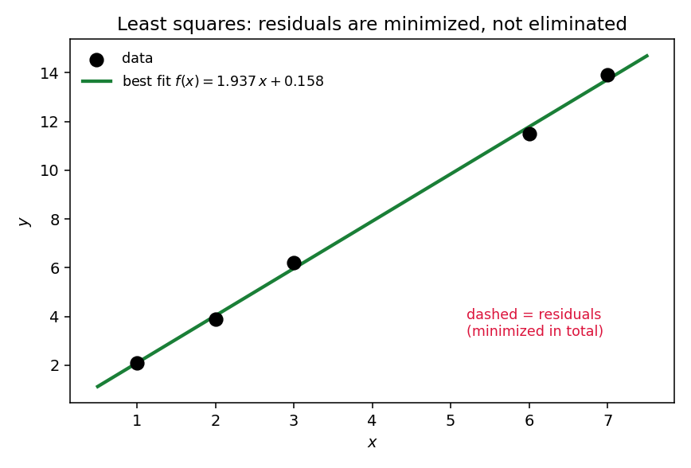
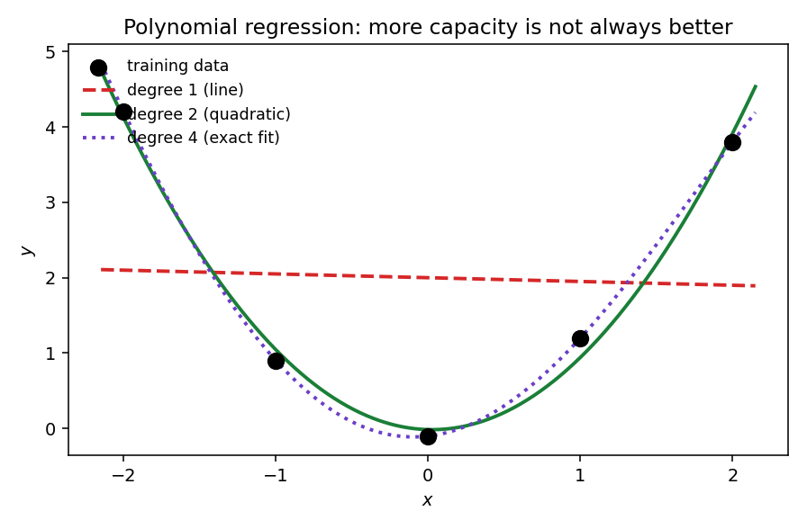

# 23. Linear and polynomial regression

Chapter 22 promised (§22.14): Chapter 23 finds the best regression model over *all* linear (and polynomial) models — not by comparing two hand-picked candidates, but by solving for the optimum over the entire infinite collection. This chapter is that solution. Everything here comes from the MLF Week 4 lecture "Linear and Polynomial Regression" (Prof. Prashanth L A, IIT Madras). The lecture's headline idea: solving linear regression by taking derivatives gives *exactly* the system of equations you would get by projecting onto the column space — §5.8's two routes to the normal equations, now wearing ML clothes. Polynomial regression turns out to need no new machinery at all: transform the features, then run the same machine.

## 23.1 The setup: data, model, loss

**Data.** $\{(x^1, y^1), (x^2, y^2), \ldots, (x^n, y^n)\}$ with $x^i \in \mathbb{R}^d$, $y^i \in \mathbb{R}$. The superscript indexes the data point, the subscript (when needed) the coordinate — §22.6's convention, kept through Part III.

**Model.** A linear function of the input:
$$\boxed{f_\theta(x) = \theta^T x}, \qquad \theta \in \mathbb{R}^d.$$
The parameters $\theta$ are what the learning algorithm chooses (§22.5).

**Note (where is the bias $b$?).** Chapter 22 wrote the model as $\mathbf{w}^T\mathbf{x} + b$. The lecture folds $b$ into $\theta$: append a constant coordinate $1$ to every $x$ (so $x = (1, x_1, \ldots, x_{d-1})^T$), and $b$ becomes $\theta_0$ (0-based indexing, used throughout this chapter). It is the same model — an intercept feature is just a feature that never changes.

**Loss.** The squared-error objective the lecture minimizes:
$$\boxed{L(\theta) = \frac{1}{2}\sum_{i=1}^{n}\big(\theta^T x^i - y^i\big)^2}.$$

**Note (the $\tfrac12$ vs the $\tfrac1n$).** Chapter 22 wrote the loss as $\frac1n\sum(\cdot)^2$; Sejal's lecture notes and the deck write $\frac12\sum(\cdot)^2$. The constant in front is a bookkeeping choice — $\tfrac12$ cancels the $2$ that differentiation produces — and it never changes the minimizer: $\arg\min \frac12\sum = \arg\min \frac1n\sum$. The learning algorithm picks the *model*, not the number.

**Basically, ...** "How far is the line's prediction from each answer? Square each miss, add up. Find the line with the smallest total." That is the entire regression problem — §22.8's curve-fitting, now with a plan to *find* the best curve.

## 23.2 The feature matrix

Stack the data into a matrix and the bookkeeping collapses. **Def (feature matrix).** $A$ is the $n \times d$ matrix whose rows are the data points as row vectors:
$$\boxed{A = \begin{pmatrix} (x^1)^T \\ (x^2)^T \\ \vdots \\ (x^n)^T \end{pmatrix}, \qquad Y = \begin{pmatrix} y^1 \\ y^2 \\ \vdots \\ y^n \end{pmatrix}}.$$
The lecture calls $A$ the **feature matrix**; $Y$ is the target vector.

i) **$A\theta$ = all predictions at once.** Row $i$ of $A\theta$ is $(x^i)^T\theta = \theta^T x^i = f_\theta(x^i)$.
ii) **$A\theta - Y$ = all residuals at once.** A vector of the $n$ misses.
iii) **The loss, in one line:**
$$\boxed{L(\theta) = \frac{1}{2}(A\theta - Y)^T(A\theta - Y) = \frac{1}{2}\|A\theta - Y\|^2}.$$

**Basically, ...** $A$ is the data table, $Y$ the answer column. Multiply the table by the parameters to get predictions; subtract the answers to get the misses; the loss is half the squared length of the miss vector.

## 23.3 Deriving the normal equations (the calculus route)

To minimize $L$: set the gradient to zero (§10.1's recipe). Write the loss with matrix entries:
$$L(\theta) = \frac{1}{2}\sum_{i=1}^{n}\left(\sum_{j=1}^{d}A_{ij}\theta_j - y^i\right)^2.$$
The partial derivative in $\theta_k$ (chain rule; the $\tfrac12$ cancels the $2$):
$$\frac{\partial L}{\partial\theta_k} = \sum_{i=1}^{n}\underbrace{\left(\sum_{j=1}^{d}A_{ij}\theta_j - y^i\right)}_{\text{residual } i}\cdot \underbrace{A_{ik}}_{\text{column } k} = \sum_{i=1}^{n}A_{ik}\,(A\theta - Y)_i = \big[A^T(A\theta - Y)\big]_k.$$
So the gradient is
$$\boxed{\nabla_\theta L = A^T(A\theta - Y)}.$$
Setting it to zero and rearranging:
$$\boxed{A^TA\,\theta = A^TY} \qquad \text{(the \textbf{normal equations})}.$$
These are $d$ equations in the $d$ unknowns $\theta$ — the lecture's entire linear-regression training step in one line.

**Note (why this is a minimum, not just a stationary point).** The Hessian is $\nabla^2 L = A^TA$. For any $z$:
$$z^T(A^TA)z = (Az)^T(Az) = \|Az\|^2 \ge 0,$$
so the Hessian is positive semidefinite (§10.8's interrogation). A convex quadratic's stationary point is its global minimum (§12.9) — the normal equations don't just find a candidate, they find *the* optimum.

**Basically, ...** Differentiate the total miss, set to zero, and the equations tidy themselves into $A^TA\,\theta = A^TY$. The $d\times d$ system on the left is all the data, compressed into one matrix.

## 23.4 The same equations from projections

This is the lecture's headline, and §5.8 already proved the mechanism:

i) **Calculus route** (§23.3): differentiate $L$, set $\nabla L = 0$ → $A^TA\theta = A^TY$.
ii) **Geometric route** (§5.7): the predictions $\mathbf{p} = A\hat\theta$ are the closest point of the column space $C(A)$ to $Y$ — i.e. the orthogonal projection of $Y$ onto $C(A)$. The error $Y - A\hat\theta$ is orthogonal to $C(A)$, which forces $A^T(Y - A\hat\theta) = 0$ — the same equations.

**The lecture's point.** Two completely different arguments — "minimize the squared miss" and "drop $Y$ perpendicularly onto the column space" — land on the identical system. Least squares **is** projection; the ML loss **is** the geometry of §5.

**Basically, ...** "The best prediction vector is the shadow $Y$ casts on the column space" and "the parameters with the smallest squared error" are the same sentence in two languages.

## 23.5 The closed-form solution and the full-rank condition

If $A$ has **full column rank** (independent columns — §4.6), then $A^TA$ is invertible and the normal equations have one solution:
$$\boxed{\hat\theta = (A^TA)^{-1}A^TY}.$$

**Why full rank of $A$ ⇒ invertibility of $A^TA$** (the lecture's homework hint, worked out). It is enough to show the two matrices have the same null space (§4.7):

i) $Ax = 0 \;\Rightarrow\; A^TAx = A^T0 = 0$. Trivial direction: $N(A) \subseteq N(A^TA)$.
ii) $A^TAx = 0 \;\Rightarrow\; x^TA^TAx = 0 \;\Rightarrow\; (Ax)^T(Ax) = \|Ax\|^2 = 0 \;\Rightarrow\; Ax = 0$. So $N(A^TA) \subseteq N(A)$.

Same null space ⇒ same rank (rank–nullity, §4.8). If $A$ has full column rank $d$, then $A^TA$ is a $d\times d$ matrix of rank $d$ — hence invertible.

**Note (dependent columns).** If $A$'s columns are dependent, the normal equations still *have* solutions — but infinitely many (§5.8 said the same): there are many least-squares $\hat\theta$, and the closed form breaks because $(A^TA)^{-1}$ doesn't exist. §23.10 shows the lecture's fix.

**Basically, ...** If every feature says something new (independent columns), there is exactly one best $\theta$, given by one matrix inverse. If two features say the same thing, credit can't be split uniquely — no single answer.

## 23.6 Why squared loss is right: the Gaussian-noise story

Why square the misses — why not absolute values, or something else? The lecture gives the probabilistic answer (the full machinery is §20.8; here is the meaning).

**The generative model.** Suppose nature produces labels as
$$\boxed{y = \theta^Tx + \varepsilon}, \qquad \varepsilon \sim N(0,\, 1/\beta),$$
i.e. the truth is linear, plus **Gaussian noise** with precision $\beta$ (precision = $1$/variance). The data $\{(x^i, y^i)\}$ are drawn independently from this model. Maximum likelihood asks: which $\theta$ makes the observed data most probable? The log-likelihood (dropping $\theta$-free constants):
$$\ell(\theta) = -\frac{\beta}{2}\sum_{i=1}^{n}\big(y^i - \theta^Tx^i\big)^2 + \text{const}.$$
Maximizing $\ell(\theta)$ = minimizing $\frac{\beta}{2}\sum(y^i - \theta^Tx^i)^2$ = minimizing the least-squares objective of §23.1 (the $\beta/2$ is another harmless constant).

**The lecture's message.** "Least squares regression solves a maximum likelihood estimation problem under a linear model." The noise model *chooses* the loss: **Gaussian noise ⇒ squared error**. This is §20.8 made concrete — the bridge from Part II's probability to Part III's algorithms.

**Basically, ...** If you believe the errors are bell-curved, squared error isn't an arbitrary choice — it's exactly what "the most likely explanation" works out to be.

## 23.7 Worked example set

**eg 1 (the normal equations on §22.8's data — beating both hand-picked candidates).** Data (with intercept feature): $(x^1,y^1) = (1,2.1)$, $(2,3.9)$, $(3,6.2)$, $(6,11.5)$, $(7,13.9)$. Chapter 22 compared $f(x) = 2x$ ($L = 0.064$) with $g(x) = x + 3$ ($L = 5.264$) — both guesses. Now solve over *all* lines $f(x) = \theta_0 + \theta_1x$.

Step 1 — build $A, Y$:
$$A = \begin{pmatrix} 1 & 1 \\ 1 & 2 \\ 1 & 3 \\ 1 & 6 \\ 1 & 7 \end{pmatrix}, \qquad Y = \begin{pmatrix} 2.1 \\ 3.9 \\ 6.2 \\ 11.5 \\ 13.9 \end{pmatrix}.$$

Step 2 — compress into the normal equations:
$$A^TA = \begin{pmatrix} 5 & 19 \\ 19 & 99 \end{pmatrix}, \qquad A^TY = \begin{pmatrix} 37.6 \\ 194.8 \end{pmatrix}.$$
(Check a couple of entries: $(A^TA)_{22} = 1+4+9+36+49 = 99$ ✓; $(A^TY)_2 = 2.1 + 2(3.9) + 3(6.2) + 6(11.5) + 7(13.9) = 2.1+7.8+18.6+69+97.3 = 194.8$ ✓.)

Step 3 — invert. $\det(A^TA) = 5\cdot 99 - 19^2 = 495 - 361 = 134 \ne 0$ — the columns are independent, so the solution is unique (§23.5):
$$(A^TA)^{-1} = \frac{1}{134}\begin{pmatrix} 99 & -19 \\ -19 & 5 \end{pmatrix}, \qquad \hat\theta = \frac{1}{134}\begin{pmatrix} 99(37.6) - 19(194.8) \\ -19(37.6) + 5(194.8) \end{pmatrix} = \frac{1}{134}\begin{pmatrix} 21.2 \\ 259.6 \end{pmatrix}.$$
$$\boxed{\hat\theta_0 \approx 0.158,\quad \hat\theta_1 \approx 1.937} \qquad \text{best line: } f(x) = 1.937x + 0.158.$$

Step 4 — verify it wins. Predictions: $2.0955,\ 4.0328,\ 5.9701,\ 11.7821,\ 13.7194$. Residuals (pred − $y$): $-0.0045,\ 0.1328,\ -0.2299,\ 0.2821,\ -0.1806$. Squared sum $= 0.1827$; in §22.8's $\tfrac1n$ convention:
$$L(\hat\theta) = \frac{0.1827}{5} \approx \boxed{0.0365} < 0.064 = L(f = 2x).$$
The algorithm didn't pick between two candidates — it searched the whole infinite collection and found something strictly better than both.

<!-- Original matplotlib illustration drawn for this chapter (not reused from any URL): the five data points of eg 1 with the optimal line f(x)=1.937x+0.158 and dashed residual segments -->

**eg 2 (invertible vs singular $A^TA$).** (i) $A = \begin{pmatrix} 1&1 \\ 1&2 \\ 1&3 \end{pmatrix}$: columns independent,
$$A^TA = \begin{pmatrix} 3 & 6 \\ 6 & 14 \end{pmatrix}, \quad \det = 42 - 36 = 6 \ne 0 \;\Rightarrow\; (A^TA)^{-1} \text{ exists}.$$
(ii) $B = \begin{pmatrix} 1&2 \\ 1&2 \\ 1&2 \end{pmatrix}$: column 2 $= 2 \times$ column 1 (the "feature" says nothing new),
$$B^TB = \begin{pmatrix} 3 & 6 \\ 6 & 12 \end{pmatrix}, \quad \det = 36 - 36 = 0 \;\Rightarrow\; \text{no inverse}.$$
In (ii) the normal equations still have infinitely many solutions — every $\theta$ with $\theta_0 + 2\theta_1$ fixed gives the same predictions — but no unique $\hat\theta$.

**eg 3 (quadratic regression by hand).** Fit a degree-2 polynomial through $(0,1)$, $(1,3)$, $(2,7)$. Transformed features (§23.8): $\phi(x) = (1, x, x^2)^T$:
$$A = \begin{pmatrix} 1 & 0 & 0 \\ 1 & 1 & 1 \\ 1 & 2 & 4 \end{pmatrix}, \qquad Y = \begin{pmatrix} 1 \\ 3 \\ 7 \end{pmatrix}.$$
Normal equations:
$$A^TA = \begin{pmatrix} 3 & 3 & 5 \\ 3 & 5 & 9 \\ 5 & 9 & 17 \end{pmatrix}, \qquad A^TY = \begin{pmatrix} 11 \\ 17 \\ 31 \end{pmatrix}, \quad\text{i.e.}\quad \begin{cases} 3\theta_0+3\theta_1+5\theta_2 = 11 \\ 3\theta_0+5\theta_1+9\theta_2 = 17 \\ 5\theta_0+9\theta_1+17\theta_2 = 31 \end{cases}.$$
$A$ is full rank (Vandermonde in disguise — distinct $x$'s), so try $\hat\theta = (1,1,1)^T$: $3+3+5 = 11$ ✓; $3+5+9 = 17$ ✓; $5+9+17 = 31$ ✓. Unique solution: $\boxed{\hat y = 1 + x + x^2}$ — and indeed $1+0+0 = 1$, $1+1+1 = 3$, $1+2+4 = 7$: the parabola threads all three points, residuals $0$. **Note.** With $m = n-1$ (degree 2, three points), the polynomial *can* hit every point exactly — training error $0$. Whether that's good is §23.9's question.

**eg 4 (the degree ladder: train error falls, test error bends).** Five training points near $y = x^2$ (mild noise): $x = (-2,-1,0,1,2)$, $y = (4.2, 0.9, -0.1, 1.2, 3.8)$. Three held-out test points: $(-1.5, 2.3)$, $(0.5, 0.3)$, $(1.5, 2.2)$. Fit polynomials of degree $m = 1, 2, 4$ (§23.8's machine):

| degree $m$ | train MSE | test MSE |
|---|---|---|
| 1 | 2.863 | 0.977 |
| 2 | 0.0229 | 0.0030 |
| 4 | 0.0000 | 0.0191 |

Read it: $m = 1$ can't bend (underfits — high train *and* test error). $m = 2$ nails the true shape (test error $0.0030$ — best). $m = 4$ has 5 parameters for 5 points, so it interpolates the training data exactly (train error $0$) — yet its test error is *worse* than $m = 2$'s: it wiggled between the training points to fit the noise. This is the overfitting curve; §23.9 turns it into a discipline.

## 23.8 Polynomial regression: curved fits with the same machine

The lecture's generalization of last week's line fitting: instead of a line, fit a degree-$m$ polynomial.

**Data.** Now one-dimensional: $\{(x^1, y^1), \ldots, (x^n, y^n)\}$, $x^i, y^i \in \mathbb{R}$.

**Def (transformed features).** For each input, build the vector of its powers:
$$\boxed{\phi(x) = \begin{pmatrix} 1 \\ x \\ x^2 \\ \vdots \\ x^m \end{pmatrix}}, \qquad \hat y(x) = \theta^T\phi(x) = \sum_{j=0}^{m}\theta_j x^j, \quad \theta = (\theta_0, \ldots, \theta_m)^T.$$

**The procedure.** Assemble $\tilde A$ with rows $\phi(x^i)^T$ (same $Y$ as before) and solve the *same* normal equations:
$$\boxed{\tilde A^T\tilde A\,\theta = \tilde A^TY}.$$
"The only difference with respect to regular linear regression," the lecture says, "is that we are transforming the features and then performing regression." No new derivation is needed — §23.3's algebra never assumed the features were raw.

**Note ("linear" = linear in $\theta$).** A parabola is curved in $x$ but linear in the parameters $(\theta_0, \theta_1, \theta_2)$ — and least squares only ever sees the parameters. That is why the same machine fits curves.

**Basically, ...** Want a parabola? Square your $x$'s yourself, hand the lecture's machine the features $[1, x, x^2]$, and it fits the "line" in that taller space. Polynomial regression is linear regression in disguise.

## 23.9 More capacity is not always better: overfitting, and the validation discipline

Eg 4's table is the whole story in miniature. Raising the degree $m$ always *can* lower the training error (a degree-4 polynomial contains every degree-2 one as a special case — set the extra $\theta_j$ to $0$). But:

i) **Training error is optimistic.** The $m = 4$ curve scored $0.0000$ on the data it was fitted to and $0.0191$ on data it wasn't — the same trap as §22.10's memorizer, now wearing a polynomial costume.
ii) **Too simple is also bad.** $m = 1$ underfits: it can't express the U-shape, so even its training error ($2.863$) is poor. Capacity too low ⇒ underfitting; capacity too high ⇒ overfitting.
iii) **The discipline (§22.10).** Fit each degree on the *training* data, compare degrees on held-out *validation* data, report the winner's error on a third split — the *test* data. Choosing the degree is **model selection**: §22.10's job (ii) — picking the collection, not the parameters. Eg 4's verdict: $m = 2$ wins on the held-out data — here that data plays the *validation* role ($0.0030$); a real deployment would then report on a third, untouched *test* split.

<!-- Original matplotlib illustration drawn for this chapter (not reused from any URL): training data with polynomial fits of degree 1 (dashed line), 2 (solid curve tracking the data), and 4 (dotted curve interpolating exactly but wiggling) -->

**Note (the lecture's hint).** The lecture mentions overfitting only to motivate its closing remark (§23.10): the regularization parameter $\lambda$ "controls overfitting — too small $\lambda$ could lead to a lot of overfitting, too large $\lambda$ leads to underfitting." There are two cures for an over-ambitious polynomial: choose a smaller $m$ by validation (this section), or penalize large parameters directly (§23.10). The full story of the second cure is Chapter 28.

**Basically, ...** "The degree-4 curve aced the practice exam and flunked the real one." Bigger model ≠ better model — judge capacity on data the model never saw during fitting.

## 23.10 The lecture's remark: ridge regularization (a pointer)

The lecture ends with "a very short remark" — ridge regression — kept short here too, because it is Chapter 28's subject. Instead of the plain least-squares objective, minimize the **regularized** version:
$$\boxed{\bar L(\theta) = \frac{1}{2}\sum_{i=1}^{n}\big((x^i)^T\theta - y^i\big)^2 + \lambda\|\theta\|^2}, \qquad \lambda > 0.$$
The extra term penalizes large parameters. Repeating §23.3's derivation, the gradient picks up $2\lambda\theta$, so stationarity gives $(A^TA + 2\lambda I)\theta_{\text{reg}} = A^TY$ — and since $\lambda > 0$ is just a constant, absorbing the $2$ into it recovers the lecture's compact form:
$$\boxed{(A^TA + \lambda I)\,\theta_{\text{reg}} = A^TY}, \qquad \hat\theta_{\text{reg}} = (A^TA + \lambda I)^{-1}A^TY.$$
**Homework (the lecture's).** Show $A^TA + \lambda I$ is invertible *even when $A$ is not full rank*: for $\lambda > 0$ and $z \ne 0$,
$$z^T(A^TA + \lambda I)z = \|Az\|^2 + \lambda\|z\|^2 > 0,$$
so the matrix is positive definite, hence invertible. The $\lambda I$ term is a purely algebraic fix — it guarantees a unique answer — that also happens to be the overfitting cure the lecture promises. Small $\lambda$ ⇒ near-ordinary least squares (overfitting risk stays); large $\lambda$ ⇒ parameters squeezed toward $0$ (underfitting). How to pick $\lambda$ in practice — by validation, §23.9's discipline — and the lasso cousin belong to Chapter 28.

**Basically, ...** Add a penalty for big weights, and two things happen at once: the equations always have a unique solution, and the model stops chasing noise. The dial $\lambda$ trades overfitting against underfitting.

## 23.11 Where this goes next

i) **Projections return.** The geometric reading of §23.4 — predictions as projections onto $C(A)$ — is the seed of Chapter 24 (PCA): there the "column space" is learned, not given.
ii) **Regularization, properly.** Chapter 28 takes §23.10's remark and makes it a subject: ridge and lasso, the bias–variance trade-off, and choosing $\lambda$ by validation.
iii) **The iterative alternative.** Forming $A^TA$ costs $O(nd^2)$ and inverting it $O(d^3)$ — for enormous data that is too slow. Chapter 10 (§10.7, §10.9) gives the scalable route: gradient descent walks downhill on $L(\theta)$ directly, no inverse needed. Same optimum (§23.3's convexity guarantees it), different engine.
iv) **The atom of the neuron.** $f_\theta(x) = \theta^Tx$ is the linear core inside every artificial neuron of Chapter 41 — this chapter is where the pattern "parameters × features, chosen by minimizing a loss" first appears in full.

## Problem set

1. For the 1-D data $(x^1,y^1) = (1,3)$, $(2,5)$, $(4,9)$ with an intercept feature: (i) write $A$ and $Y$; (ii) for $\theta = (1,2)^T$ (intercept $1$, slope $2$), compute $A\theta$ and $A\theta - Y$; (iii) evaluate $L(\theta) = \frac12\|A\theta - Y\|^2$. What does your answer say about the fit?
2. Scalar derivation (the lecture's 1-D case). $L(w, b) = \frac12\sum_{i=1}^n(wx^i + b - y^i)^2$. Compute $\partial L/\partial w$ and $\partial L/\partial b$ by hand, set both to zero, and show the result is the $2\times 2$ case of the normal equations.
3. Lecture homework, the hard direction: prove that if $A^TAx = 0$ then $Ax = 0$ (hence $N(A^TA) \subseteq N(A)$). Hint: multiply by $x^T$.
4. Fit the best line $f(x) = \theta_0 + \theta_1x$ through $(0,0)$, $(1,2)$, $(2,3)$ via the normal equations, showing all steps. Compute the minimum squared error $\|A\hat\theta - Y\|^2$.
5. Show the normal-equation solution is a *global* minimizer of $L$: (i) compute the Hessian $\nabla^2 L$; (ii) show it is positive semidefinite; (iii) conclude with §12.9.
6. Fit a quadratic $\hat y = \theta_0 + \theta_1x + \theta_2x^2$ through $(0,2)$, $(1,1)$, $(2,2)$: (i) write $\tilde A$ and $Y$; (ii) write the $3\times 3$ normal equations; (iii) solve them (verify your answer satisfies all three equations); (iv) explain why the residual is exactly $0$.
7. True or false, with one-line justification: (i) $A^TA$ is always symmetric. (ii) Full column rank of $A$ guarantees a unique $\hat\theta$. (iii) Raising the polynomial degree never increases the training error. (iv) Raising the polynomial degree never increases the test error.
8. For each $A$, say whether $(A^TA)^{-1}$ exists and give the ML reason: (i) $\begin{pmatrix} 1&1 \\ 1&2 \\ 1&3 \end{pmatrix}$; (ii) $\begin{pmatrix} 1&2&2 \\ 1&3&3 \\ 1&4&4 \end{pmatrix}$ (features: intercept, $x$, and a copy of $x$); (iii) $\begin{pmatrix} 1&0 \\ 2&0 \\ 3&0 \end{pmatrix}$ (features: $x$, and an always-$0$ feature).
9. A colleague fits polynomials of degree $1$–$4$ and reports:

   | $m$ | train MSE | validation MSE |
   |---|---|---|
   | 1 | 2.90 | 1.00 |
   | 2 | 0.05 | 0.01 |
   | 3 | 0.02 | 0.03 |
   | 4 | 0.00 | 0.09 |

   (i) Which degree should she pick, and on what data was that decision made? (ii) What phenomenon does $m = 4$ display? (iii) If she must quote one number as "the model's error" to a user, which split's number should it be, and why (§22.10)?
10. Guided MLE→least squares (§20.8, §23.6). Data generated as $y^i = \theta^Tx^i + \varepsilon^i$ with $\varepsilon^i \sim N(0,\sigma^2)$ i.i.d. (i) Write the likelihood $L(\theta)$ as a product of Gaussian densities. (ii) Take the log and drop $\theta$-free terms. (iii) Show the maximizer equals $\arg\min_\theta \sum_i (y^i - \theta^Tx^i)^2$.
