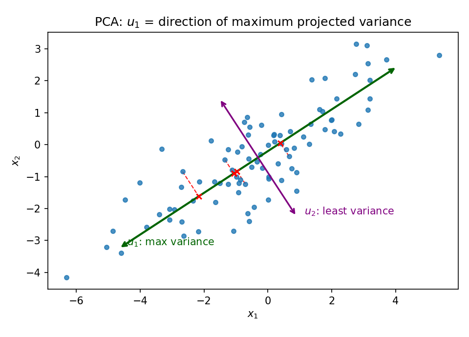
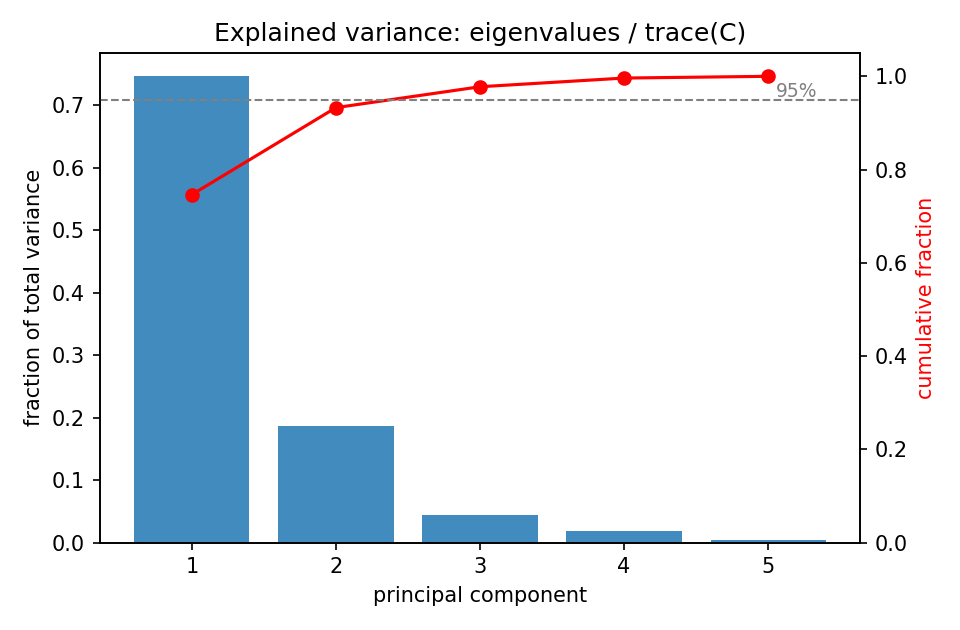
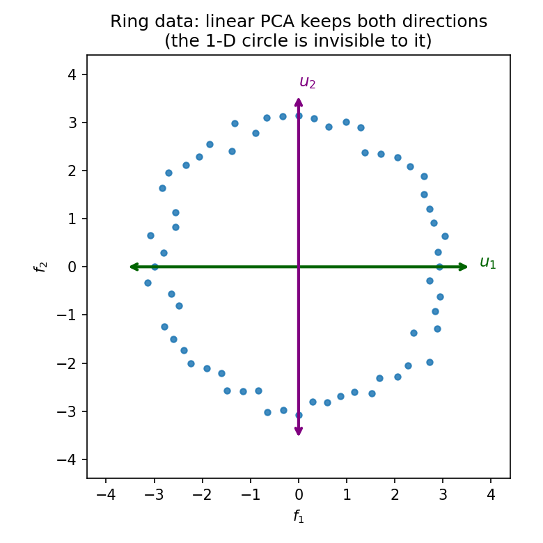

# 24. PCA: variance maximization, eigendecomposition, kernel PCA

Two promises converge here. §22.12 defined the reconstruction loss $L(f, g) = \frac1n\sum_i \|g(f(\mathbf{x}^i)) - \mathbf{x}^i\|^2$ for an encoder–decoder pair and said the algorithm that searches *all* pairs is Chapter 24's job. §23.11 added that the geometric reading of least squares — predictions as projections — returns here, except the "column space" is no longer given: it is *learned* from the data. This chapter is both promises kept. Everything in §§24.1–24.9 comes from the MLF Week 6 lectures "Principal Component Analysis" (Prof. Prashanth L A, IIT Madras) and the Week 6 tutorial; §§24.10–24.11's kernel material comes from the MLT Week 2 slides. The headline, stated in the first lecture: PCA has two viewpoints — **minimizing reconstruction error** and **maximizing variance of the projected data** — and they are the *same algorithm*.

**Notation.** The lectures write data points with subscripts — $x_1, \ldots, x_n$, $x_i \in \mathbb{R}^d$ — kept through this chapter (a change from §22.6's superscripts, flagged here so nothing is misread). The target dimension is $m$, an **input parameter** fixed before the algorithm runs. The mean is $\bar x = \frac1n\sum_{i=1}^n x_i$.

## 24.1 The problem: the best $m$-dimensional home for the data

**Data.** $D = \{x_1, \ldots, x_n\}$, $x_i \in \mathbb{R}^d$. No labels — this is unsupervised learning (§22.11).

**Goal.** Fix $m < d$. Find the **best $m$-dimensional subspace** to project $D$ onto — "best" in a sense made precise in §§24.3–24.4. Two things must be decided: (i) *which* subspace, (ii) *how* to project each point onto it.

**The broad context.** In ML-flavoured feature selection, you start by collecting as many features as you can — high-dimensional data — then reduce dimensionality to a good subset of features. PCA is the classic dimensionality-reduction method for this: project the data onto a lower-dimensional subspace chosen so that reconstruction error is minimized, or equivalently so that the variance of the projected data is maximized.

**Basically, ...** "The data lives in a tall room. Pick the $m$-dimensional floor that fits it best, then drop every point straight down onto that floor." PCA is the recipe for picking the floor.

## 24.2 The covariance matrix $C$ — the only matrix that matters

PCA's entire computation is the eigendecomposition of one matrix. **Def (sample covariance).**
$$\boxed{C = \frac{1}{n}\sum_{i=1}^{n}(x_i - \bar x)(x_i - \bar x)^T}, \qquad C \in \mathbb{R}^{d \times d}.$$
This is §19.1's covariance matrix with the expectation replaced by the data average.

i) **Symmetric:** $C^T = C$ — each term $(x_i - \bar x)(x_i - \bar x)^T$ is symmetric.
ii) **Positive semi-definite:** for any $u$, $u^TCu = \frac1n\sum_i \big(u^T(x_i - \bar x)\big)^2 \ge 0$ — the same argument as §19.1's theorem, and §7.9's PSD fact.
iii) **Spectral theorem applies (§6.11):** all eigenvalues of $C$ are real (and $\ge 0$ by (ii)), and there is an **orthonormal basis of eigenvectors** $\{u_1, \ldots, u_d\}$ with eigenvalues ordered $\lambda_1 \ge \lambda_2 \ge \cdots \ge \lambda_d \ge 0$.

**Basically, ...** $C$ is the "spread table" of the data: diagonal = variance along each axis, off-diagonal = how pairs of axes vary together. PCA reads everything off this one table's eigenvalues and eigenvectors.

## 24.3 First viewpoint: minimizing the reconstruction error

Fix a candidate $m$-dimensional subspace with orthonormal basis $B = \{u_1, \ldots, u_m\}$; extend it to a full orthonormal basis $B' = \{u_1, \ldots, u_m, u_{m+1}, \ldots, u_d\}$ of $\mathbb{R}^d$. Every point expands as $x_i = \sum_{j=1}^{d}(x_i^T u_j)\,u_j$ (orthonormal-basis coordinates, §5.4).

**Def (reconstruction error).** Approximate each point by
$$\tilde x_i = \sum_{j=1}^{m} z_{ij}\,u_j + \sum_{j=m+1}^{d} \beta_j\,u_j$$
and measure
$$\boxed{J = \frac{1}{n}\sum_{i=1}^{n}\|x_i - \tilde x_i\|^2}.$$
The coefficients $z_{ij}, \beta_j$ are free — choose them to minimize $J$.

**The optimal coefficients.** Because $B'$ is orthonormal, cross terms vanish when the norm is expanded (the $\|c_1u_1 + c_2u_2\|^2 = c_1^2 + c_2^2$ logic, applied $d$-wide):
$$J = \frac{1}{n}\sum_{i=1}^{n}\left[\sum_{j=1}^{m}(x_i^T u_j - z_{ij})^2 + \sum_{j=m+1}^{d}(x_i^T u_j - \beta_j)^2\right].$$
Each coefficient appears in exactly one square, so differentiating is trivial:
- $\frac{\partial J}{\partial z_{ij}} = 0 \;\Rightarrow\; \boxed{z_{ij} = x_i^T u_j}$ — the encoded coordinates are just dot products with the basis.
- $\frac{\partial J}{\partial \beta_j} = 0 \;\Rightarrow\; \boxed{\beta_j = \bar x^T u_j}$ — the mean's dot product with each dropped direction.

So for the given subspace, the best reconstruction is
$$\boxed{\tilde x_i = \sum_{j=1}^{m}(x_i^T u_j)\,u_j + \sum_{j=m+1}^{d}(\bar x^T u_j)\,u_j}.$$

**Note (centered data).** If the data is already centered ($\bar x = 0$) — "which is what usually people do when you do PCA," per the lecture — the second term vanishes and $\tilde x_i$ is simply the orthogonal projection onto the $m$-dimensional subspace.

**The optimal error, in terms of $C$.** Since the first $m$ terms cancel in $x_i - \tilde x_i$,
$$x_i - \tilde x_i = \sum_{j=m+1}^{d}\big((x_i - \bar x)^T u_j\big)\,u_j, \qquad \|x_i - \tilde x_i\|^2 = \sum_{j=m+1}^{d}\big((x_i - \bar x)^T u_j\big)^2$$
(orthonormality again). Swapping the sums and writing the square as a product:
$$J^* = \frac{1}{n}\sum_{i=1}^{n}\sum_{j=m+1}^{d}\big((x_i-\bar x)^T u_j\big)^2 = \sum_{j=m+1}^{d} u_j^T\underbrace{\left[\frac{1}{n}\sum_{i=1}^{n}(x_i-\bar x)(x_i-\bar x)^T\right]}_{C}\,u_j.$$
$$\boxed{J^* = \sum_{j=m+1}^{d} u_j^T C u_j} \qquad \text{(best error for the subspace spanned by } u_1,\ldots,u_m\text{)}.$$

**Basically, ...** "For a fixed floor, the best reconstruction keeps each point's coordinates along the floor and replaces the lost coordinates with the mean's. The leftover error is a sum of one quadratic form $u^TCu$ per dropped direction."

## 24.4 Second viewpoint: maximizing the variance of the projection

Totally different starting point. Project onto the line along a unit vector $u$: point $x_i$ goes to $(x_i^T u)\,u$, the projected mean to $(\bar x^T u)\,u$. The variance of the projected points:
$$\frac{1}{n}\sum_{i=1}^{n}(x_i^T u - \bar x^T u)^2 = \frac{1}{n}\sum_{i=1}^{n}u^T(x_i-\bar x)(x_i-\bar x)^T u = \boxed{u^T C u}.$$
**The problem:** maximize $u^TCu$ subject to $u^Tu = 1$.

**Solution (Lagrangian).** $L(u, \lambda) = u^TCu + \lambda(1 - u^Tu)$; $\frac{\partial L}{\partial u} = 2Cu - 2\lambda u = 0$ gives $\boxed{Cu = \lambda u}$, and then $u^TCu = \lambda$. The maximizer is an eigenvector of $C$, and the maximum value is its eigenvalue — so pick the **largest** eigenvalue.

**Note (the lecture's calculus alternative).** Maximize the ratio $\frac{u^TCu}{u^Tu}$ unconstrained instead: differentiating with the quotient rule, $\frac{\partial}{\partial u_{(i)}}\frac{u^TCu}{u^Tu} = 0$ gives $(u^Tu)Cu = (u^TCu)u$, i.e. $Cu = \lambda u$ with $\lambda = \frac{u^TCu}{u^Tu}$ — the same eigen-equation, no multipliers needed.

**Basically, ...** "Which direction, when you squash the data onto it, keeps the data most spread out?" The answer is an eigenvector of $C$ — specifically the one with the biggest eigenvalue, and that eigenvalue *is* the spread you keep.

## 24.5 The PCA algorithm: keep the top $m$, drop the bottom $d - m$

The two viewpoints now collapse into one recipe. From §24.3, the subspace problem is: choose the *dropped* directions $u_{m+1}, \ldots, u_d$ to minimize $J^* = \sum_{j=m+1}^{d} u_j^TCu_j$. The single-direction problem (§24.4 with "minimize") says each $u^TCu$ is minimized by the eigenvector of the **smallest** eigenvalue. So:

i) Compute $C$ (§24.2).
ii) Eigendecompose: eigenvalues $\lambda_1 \ge \cdots \ge \lambda_d$, orthonormal eigenvectors $u_1, \ldots, u_d$.
iii) **Keep** the top $m$ ($u_1, \ldots, u_m$ — largest eigenvalues, §24.4's maximizers); **drop** the bottom $d - m$ (smallest eigenvalues, §24.3's minimizers).
iv) Encode: $\alpha_j = x_i^T u_j$, $j = 1, \ldots, m$; reconstruct $\tilde x_i = \sum_{j=1}^{m}\alpha_j u_j$ (+ the mean term if uncentered, §24.3).

**The two bookkeeping numbers** (the tutorial's Step 8):
$$\boxed{\text{Reconstruction error } J^* = \sum_{j=m+1}^{d}\lambda_j}, \qquad \boxed{\text{Projected variance } = \sum_{j=1}^{m}\lambda_j}.$$
Same algorithm, two readings: it minimizes the first and maximizes the second.

**Basically, ...** "Find the directions where the data varies most; throw away the directions where it barely varies. The eigenvalues tell you exactly how much each direction was worth."

<!-- Original matplotlib illustration drawn for this chapter (not reused from any URL): elongated 2-D point cloud, u1 arrow along the long axis (max variance), u2 arrow along the short axis, dashed red projection segments from sample points to the u1 line -->

## 24.6 Worked example set

**eg 1 (the lecture's example — data already on a line).** $D = \{(-1,-1)^T, (0,0)^T, (1,1)^T\}$, $m = 1$.

Step 1 — mean: $\bar x = \frac13\big[(-1,-1) + (0,0) + (1,1)\big] = (0,0)^T$. Already centered.

Step 2 — covariance:
$$C = \frac{1}{3}\sum_{i=1}^{3}x_i x_i^T = \frac{1}{3}\left[\begin{pmatrix} 1 & 1 \\ 1 & 1 \end{pmatrix} + 0 + \begin{pmatrix} 1 & 1 \\ 1 & 1 \end{pmatrix}\right] = \frac{2}{3}\begin{pmatrix} 1 & 1 \\ 1 & 1 \end{pmatrix}.$$

Step 3 — eigenpairs. $\operatorname{tr}(C) = \frac{4}{3}$, $\det(C) = 0$ (rank 1), so $\lambda_1 = \frac{4}{3}$, $\lambda_2 = 0$. For $\lambda_1$: $\frac{2}{3}\begin{pmatrix} 1 & 1 \\ 1 & 1 \end{pmatrix}\begin{pmatrix} a \\ b \end{pmatrix} = \frac{4}{3}\begin{pmatrix} a \\ b \end{pmatrix} \Rightarrow a = b$; normalized $\boxed{u_1 = \frac{1}{\sqrt{2}}\begin{pmatrix} 1 \\ 1 \end{pmatrix}}$, $u_2 = \frac{1}{\sqrt{2}}\begin{pmatrix} 1 \\ -1 \end{pmatrix}$.

Step 4 — project. $\tilde x_i = (x_i^T u_1)u_1$: $x_1^T u_1 = -\sqrt{2} \Rightarrow \tilde x_1 = -\sqrt{2}\cdot\frac{1}{\sqrt{2}}(1,1)^T = (-1,-1)^T = x_1$; $\tilde x_2 = (0,0)^T = x_2$; $\tilde x_3 = (1,1)^T = x_3$.

Step 5 — books: $J^* = \lambda_2 = 0$ (nothing lost — the data was already one-dimensional, so PCA changes nothing); projected variance $= \lambda_1 = \frac{4}{3}$. Sanity check: $\frac13\big[(-\sqrt{2})^2 + 0 + (\sqrt{2})^2\big] = \frac{4}{3}$ ✓.

**eg 2 (a hand-worked 2-D PCA with real loss).** $D = \{(1,2), (2,1), (3,4), (4,3)\}$, $m = 1$.

Step 1 — mean: $\bar x = (2.5,\ 2.5)^T$. Centered points: $(-1.5,-0.5), (-0.5,-1.5), (0.5,1.5), (1.5,0.5)$.

Step 2 — covariance:
$$C = \frac{1}{4}\sum_{i}(x_i-\bar x)(x_i-\bar x)^T = \frac{1}{4}\begin{pmatrix} 5 & 3 \\ 3 & 5 \end{pmatrix} = \begin{pmatrix} 1.25 & 0.75 \\ 0.75 & 1.25 \end{pmatrix}.$$
(Check: $\sum (x_1\text{-coords})^2 = 2.25+0.25+0.25+2.25 = 5$ ✓.)

Step 3 — eigenpairs. $\operatorname{tr} = 2.5$, $\det = 1.25^2 - 0.75^2 = 1$: $\lambda = \frac{2.5 \pm \sqrt{6.25 - 4}}{2} = \frac{2.5 \pm 1.5}{2}$, so $\boxed{\lambda_1 = 2,\ \lambda_2 = 0.5}$. For $\lambda_1 = 2$: $\begin{pmatrix} -0.75 & 0.75 \\ 0.75 & -0.75 \end{pmatrix}u = 0 \Rightarrow \boxed{u_1 = \frac{1}{\sqrt{2}}(1,1)^T}$, $u_2 = \frac{1}{\sqrt{2}}(1,-1)^T$.

Step 4 — project (uncentered: recenter, project, add $\bar x$ back). E.g. $x_1 = (1,2)$: centered $(-1.5,-0.5)$, dot with $u_1$: $-2/\sqrt{2} = -\sqrt{2}$, so $\tilde x_1 = -\sqrt{2}\,u_1 + \bar x = (-1,-1) + (2.5,2.5) = (1.5,1.5)$. Similarly $\tilde x_2 = (1.5,1.5)$, $\tilde x_3 = \tilde x_4 = (3.5,3.5)$.

Step 5 — books: $J^* = \lambda_2 = 0.5$. Check directly: each $\|x_i - \tilde x_i\|^2 = 0.5^2 + 0.5^2 = 0.5$, average $= 0.5$ ✓. Projected variance $= \lambda_1 = 2$; fraction kept $= \frac{2}{2.5} = 80\%$ (§24.8).

**eg 3 (the tutorial's 3-D example — corrected).** $x_1 = (3,6,9)^T$, $x_2 = (2,4,6)^T$, $x_3 = (1,2,3)^T$. Mean $\bar x = (2,4,6)^T$; centered: $(1,2,3), (0,0,0), (-1,-2,-3)$. With $v = (1,2,3)^T$:
$$C = \frac{1}{3}\big[vv^T + (-v)(-v)^T\big] = \frac{2}{3}\begin{pmatrix} 1 & 2 & 3 \\ 2 & 4 & 6 \\ 3 & 6 & 9 \end{pmatrix}.$$
$C$ is rank 1, so two eigenvalues are $0$; the nonzero one is $\frac{2}{3}\|v\|^2 = \frac{2}{3}\cdot 14 = \boxed{\lambda_1 = \frac{28}{3}}$ (the tutorial slide writes $14$ — it forgot the $\frac{2}{3}$ factor; the eigenvectors it gives are right). $u_1 = v/\|v\| = \frac{1}{\sqrt{14}}(1,2,3)^T$. Projection: $x_1^T u_1 = 42/\sqrt{14}$, $\tilde x_1 = \frac{42}{14}(1,2,3)^T = (3,6,9)^T = x_1$ (data already 1-D). $J^* = 0$, projected variance $= 28/3$.

**Note (a tutorial slip, flagged).** The tutorial's second example (four 2-D points, $C = \big(\begin{smallmatrix} 2 & 0 \\ 0 & 2 \end{smallmatrix}\big)$) mixes an *uncentered* projection with a *centered* covariance — inconsistent — and then botches the arithmetic, writing $J = \frac14[0^2+2^2+2^2+2^2] = 24$ (the bracket is $12$, not $24$, and the $x_3$ term is really $\|(2,4)-(2,0)\|^2 = 16$, not $2^2$). Done consistently (§24.3, mean term included), the reconstructions are $(2,2), (0,2), (2,2), (4,2)$; the per-point squared errors are $4, 0, 4, 0$; and $J^* = 2 = \lambda_2$ for the dropped direction, as §24.5 predicts.

## 24.7 The encoder–decoder reading: the optimal linear pair

§22.12 promised an algorithm that searches all encoder–decoder pairs for the one minimizing the reconstruction loss. For *linear* pairs, PCA is that algorithm. Write $U_m = [u_1 \cdots u_m]$ ($d \times m$):

- **Encoder** $f(x) = U_m^T(x - \bar x) \in \mathbb{R}^m$ — the $m$ dot products $x^T u_j$ of §24.3.
- **Decoder** $g(z) = U_m z + \bar x \in \mathbb{R}^d$ — rebuild as a combination of the kept directions, plus the mean.

Then $g(f(x_i)) = \tilde x_i$ of §24.3, and §22.12's loss is exactly $J^*$:
$$\boxed{L(f, g) = \frac{1}{n}\sum_{i=1}^{n}\|g(f(x_i)) - x_i\|^2 = \sum_{j=m+1}^{d}\lambda_j}.$$
PCA doesn't compare two hand-picked pairs (the way §22.12's illustration did) — it solves for the optimum over *all* linear pairs. And §23.11's remark lands: least squares projected $Y$ onto a *given* column space; here the subspace itself — the span of the top-$m$ eigenvectors — is learned from the data's own variance.

**Basically, ...** "The best linear pipe: squeeze through the $m$ fattest-variance directions, rebuild from those. The loss you can't avoid equals the eigenvalues you threw away."

## 24.8 How many components? Reading the eigenvalues

Total variance in the data: $\sum_{j=1}^{d}\lambda_j = \operatorname{tr}(C)$ (the trace is the sum of the diagonal = sum of per-axis variances; eigenvalues sum to the trace, §6.11). Kept: $\sum_{j=1}^{m}\lambda_j$. Lost: $\sum_{j=m+1}^{d}\lambda_j$. So the **fraction of variance explained** by the first $m$ components is
$$\boxed{\frac{\sum_{j=1}^{m}\lambda_j}{\sum_{j=1}^{d}\lambda_j}}.$$
Two ways to pick $m$ from it: (i) a threshold — keep adding components until the fraction crosses, say, $95\%$; (ii) the elbow — stop where the eigenvalues flatten out and each new component adds almost nothing. (The lectures never name "explained variance" or draw a scree plot; the ratio above is just their projected-variance and trace numbers divided.)

**Note.** PCA has no validation split the way §23.9's polynomial degrees did — there is no "test error" for an unsupervised method (§22.11: nobody grades unsupervised output directly). The eigenvalue tail *is* the selection criterion: it measures exactly what reconstruction would cost.

<!-- Original matplotlib illustration drawn for this chapter (not reused from any URL): bar chart of per-component variance fractions with the cumulative curve and a 95% threshold line -->

## 24.9 PCA in high dimensions: the $n \times n$ trick

When $d \gg n$ (few points, huge features — the MLT slide's example: face recognition, "eigenfaces"), eigendecomposing the $d \times d$ matrix $C$ at $O(d^3)$ is wasteful. Let $A$ be the $n \times d$ matrix with rows $(x_i - \bar x)^T$; then $C = \frac{1}{n}A^TA$.

i) **Most eigenvalues are $0$.** $C$ is a sum of $n$ rank-1 matrices, so $\operatorname{rank}(C) \le n$ — at least $d - n$ eigenvalues are $0$. No need to find them.
ii) **The nonzero spectrum lives in an $n \times n$ matrix.** If $Cu = \lambda u$ ($\lambda \ge 0$), then
$$\frac{1}{n}AA^T(Au) = A\left(\frac{1}{n}A^TAu\right) = A(\lambda u) = \lambda(Au),$$
so $\lambda$ is also an eigenvalue of the $n \times n$ matrix $\frac{1}{n}AA^T$. Conversely, if $\frac{1}{n}AA^Tv = \lambda v$ with $\lambda > 0$, then $C(A^Tv) = \frac{1}{n}A^TAA^Tv = A^T(\lambda v) = \lambda(A^Tv)$ — recover the $d$-dimensional eigenvector as $u = A^Tv/\|A^Tv\|$.
iii) **The recipe:** eigendecompose $\frac{1}{n}AA^T$ ($n \times n$, $O(n^3)$), keep the top-$m$ eigenpairs, map back with $A^T$. Same PCA, no $d \times d$ matrix ever formed.

**Basically, ...** "With 50 faces of a million pixels each, don't diagonalize a million-by-million matrix — diagonalize the 50-by-50 one and translate the answers back."

## 24.10 Kernel PCA: when the structure isn't linear

**The problem (MLT W2, "Issue 2").** Data may not lie in a low-dimensional *linear* subspace. The slide's example: points on a circle $(f_1 - a)^2 + (f_2 - b)^2 = r^2$. Plain PCA finds $u_1, u_2$ both important (nearly equal eigenvalues) — the one-dimensional circular structure is invisible to it.

<!-- Original matplotlib illustration drawn for this chapter (not reused from any URL): ring of points in (f1,f2) with two equal double arrows u1, u2, captioned that linear PCA keeps both directions -->

**The idea.** Lift $x \in \mathbb{R}^d$ through a map $\phi$ to a high-dimensional space $\mathbb{R}^D$ where the structure *becomes* linear, then run the §24.9 machinery (we already know how to handle $D \gg n$). For the circle: with $\phi(x) = [1,\ f_1^2,\ f_2^2,\ f_1f_2,\ f_1,\ f_2]^T$,
$$\phi(x)^T u = 0 \quad\text{for}\quad u = [a^2 + b^2 - r^2,\ 1,\ 1,\ 0,\ -2a,\ -2b]^T,$$
which is exactly $(f_1-a)^2 + (f_2-b)^2 = r^2$ expanded — the points lie in a *linear* subspace of $\mathbb{R}^6$. But explicit $\phi$ can be brutal: cubic features of $d$ variables number $\approx O(d^3)$, and the RBF kernel's $\phi$ is infinite-dimensional. The slides' way out has two steps.

**Step 1 — the dual form.** An eigenvector $w_k$ of $C = \frac{1}{n}XX^T$ (data assumed centered; $X$ is $d \times n$ with columns $x_i$) satisfies
$$Cw_k = \lambda_k w_k \;\Rightarrow\; w_k = \sum_{i=1}^{n}\frac{x_i^T w_k}{n\lambda_k}\,x_i = X\alpha_k \quad\text{for some }\alpha_k \in \mathbb{R}^n.$$
**Every eigenvector is a linear combination of the data points.** Plugging $w_k = X\alpha_k$ into $Cw_k = \lambda_kw_k$ and premultiplying by $X^T$:
$$\boxed{K\alpha_k = (n\lambda_k)\,\alpha_k}, \qquad K = X^TX \in \mathbb{R}^{n \times n}.$$
Unit-norm $w_k$ needs $\alpha_k^TK\alpha_k = 1$, i.e. $\boxed{\alpha_k = \beta_k/\sqrt{n\lambda_k}}$ where $\beta_k$ is a unit eigenvector of $K$. (The linear-algebra fact behind this: $XX^T$ and $X^TX$ share their nonzero eigenvalues.)

**Step 2 — the kernel trick.** The dual form never needs $\phi(x_i)$ alone — only inner products $K_{ij} = \phi(x_i)^T\phi(x_j)$. So *replace* the dot product by a **kernel function** $\kappa(x, x')$ that computes it directly:

**eg (the slide's computation).** For $x = (f_1, f_2)$, $x' = (g_1, g_2)$:
$$\kappa(x, x') = (x^Tx' + 1)^2 = (f_1g_1 + f_2g_2 + 1)^2 = f_1^2g_1^2 + f_2^2g_2^2 + 1 + 2f_1g_1f_2g_2 + 2f_1g_1 + 2f_2g_2.$$
That equals $\phi(x)^T\phi(x')$ with $\phi(x) = [f_1^2,\ f_2^2,\ 1,\ \sqrt{2}f_1f_2,\ \sqrt{2}f_1,\ \sqrt{2}f_2]^T$. "We managed to compute $\phi(x)^T\phi(x')$ **without explicitly computing $\phi(x)$**" — $O(d)$ work instead of $O(d^2)$.

**Def (kernel function, valid kernel).** Any $\kappa: \mathbb{R}^d \times \mathbb{R}^d \to \mathbb{R}$ that *is* some $\phi(x)^T\phi(x')$ is a **kernel function**. How to tell without exhibiting $\phi$ — Mercer's theorem (informal): $\kappa$ is valid iff (a) it is symmetric, $\kappa(x,x') = \kappa(x',x)$, and (b) for *every* dataset, the matrix $K_{ij} = \kappa(x_i,x_j)$ is positive semi-definite (all eigenvalues $\ge 0$).
- **Polynomial kernel:** $\kappa(x,x') = (x^Tx' + 1)^p$, $p \ge 1$.
- **RBF / Gaussian kernel:** $\kappa(x,x') = \exp\!\big(-\|x - x'\|^2/(2\sigma^2)\big)$, $\sigma > 0$ — valid, and its $\phi$ maps into an *infinite*-dimensional space (technicalities aside: think of a point mapped to a "function," with dot products becoming integrals).

**The kernel PCA algorithm.** Input $\{x_1,\ldots,x_n\}$, kernel $\kappa$.
- Step 1: $K_{ij} = \kappa(x_i, x_j)$, then **center the kernel** — PCA needs zero-mean data, but $\phi$'s mean is uncomputable, so center its Gram matrix instead: $\boxed{K^c_{ij} = K_{ij} - \theta_i - \theta_j + P}$ with $\theta_i = \frac1n\sum_k K_{ik}$, $P = \frac{1}{n^2}\sum_{ij}K_{ij}$.
- Step 2: eigendecompose $K^c$: unit eigenvectors $\beta_1,\ldots,\beta_\ell$ with eigenvalues $n\lambda_1 \ge \cdots \ge n\lambda_\ell$; set $\alpha_k = \beta_k/\sqrt{n\lambda_k}$.
- Step 3: the eigenvectors $w_k$ of the feature-space covariance *cannot* be reconstructed (that needs $\phi$) — but the **compressed representation** can: $\phi(x_i)^Tw_k = \sum_{j=1}^{n}\alpha_{kj}\,K^c_{ij}$. "For downstream tasks, this is usually good enough."

**Basically, ...** "Linear PCA only sees straight-line structure. Lift the data into a bigger space where curves become straight, do PCA there — and use the kernel trick so you never actually visit the bigger space. You lose the reconstruction, but you keep the compressed coordinates, which is what downstream tasks eat."

**eg (kernel PCA by hand — three points on a parabola).** $x_1 = (-1,1)$, $x_2 = (0,0)$, $x_3 = (1,1)$ ($y = x^2$), quadratic kernel $\kappa(x,z) = (x^Tz + 1)^2$.

Step 1 — Gram matrix: $K_{11} = ((1+1)+1)^2 = 9$, $K_{12} = K_{13} = K_{22} = K_{23} = 1$, $K_{33} = 9$:
$$K = \begin{pmatrix} 9 & 1 & 1 \\ 1 & 1 & 1 \\ 1 & 1 & 9 \end{pmatrix}.$$
Center it: $\theta = (11/3,\ 1,\ 11/3)^T$, $P = 25/9$, so
$$K^c = \frac{1}{9}\begin{pmatrix} 40 & -8 & -32 \\ -8 & 16 & -8 \\ -32 & -8 & 40 \end{pmatrix}.$$
(Check one entry: $K^c_{11} = 9 - 2(11/3) + 25/9 = (81 - 66 + 25)/9 = 40/9$ ✓.)

Step 2 — eigendecompose. The inner matrix has trace $96$; $(1,1,1)^T \mapsto 0$ (eigenvalue $0$ — centering kills the all-ones direction); $(1,0,-1)^T \mapsto 72(1,0,-1)^T$; $(1,-2,1)^T \mapsto 24(1,-2,1)^T$. So $K^c$'s eigenvalues are $8,\ \frac{8}{3},\ 0$, i.e. $n\lambda_1 = 8$, $n\lambda_2 = 8/3$ with $n = 3$: $\boxed{\lambda_1 = 8/3,\ \lambda_2 = 8/9}$. Unit eigenvector for $n\lambda_1$: $\beta_1 = \frac{1}{\sqrt{2}}(-1,0,1)^T$; normalized $\boxed{\alpha_1 = \beta_1/\sqrt{8} = (-1/4,\ 0,\ 1/4)^T}$ (eigenvector signs are arbitrary). Check $\alpha_1^TK^c\alpha_1 = 1$ ✓.

Step 3 — compressed 1-D coordinates $z_{i1} = \sum_j \alpha_{1j}K^c_{ij} = K^c\alpha_1 = (-2,\ 0,\ 2)^T$. Their variance: $\frac{4 + 0 + 4}{3} = \frac{8}{3} = \lambda_1$ ✓ — exactly the projected-variance rule of §24.5, now in feature space. The three parabola points collapse to a clean 1-D line $(-2, 0, 2)$ that a linear PCA in the original plane could never produce.

## 24.11 Where this goes next

i) **Eigenfaces.** The MLT slide's motivating example for §24.9: each face image is a point in a million-dimensional pixel space; with far fewer images than pixels, the $n \times n$ trick makes PCA feasible, and the top eigenvectors — "eigenfaces" — are the directions of maximum variance across faces.
ii) **The SVD connection.** The MLF lecture flags it without deriving: the SVD of the centered data matrix (Chapter 7) computes PCA's directions without ever forming $C = \frac1nA^TA$ — the numerically careful way to do all of §24.5.
iii) **A different answer to "understand the data."** PCA compresses by *subspaces*. Chapter 25 (GMMs and EM) compresses by *probability*: fit a mixture of Gaussians to the data instead of a flat floor through it. Same unsupervised spirit (§22.11), different model of what "structure" means.

## Problem set

1. The lecture's example, fully worked: $D = \{(-1,-1)^T, (0,0)^T, (1,1)^T\}$, $m = 1$. (i) Compute $\bar x$ and $C$. (ii) Find the eigenvalues and (unit) eigenvectors of $C$. (iii) Write the projected points $\tilde x_i$. (iv) Compute $J^*$ two ways — directly from $\frac1n\sum_i\|x_i - \tilde x_i\|^2$ and from the eigenvalue formula — and the projected variance.
2. Baby Lagrangian. $C = \begin{pmatrix} 3 & 0 \\ 0 & 1 \end{pmatrix}$. Write a unit vector as $u = (\cos\theta, \sin\theta)^T$, compute $u^TCu$ as a function of $\theta$, and find the maximizer, the minimizer, and both values. Which eigenvectors do they correspond to?
3. Prove every eigenvalue of the covariance matrix $C$ is $\ge 0$. (Hint: §19.1's PSD argument — what is $u^TCu$?)
4. PCA by hand. Data $(1,2), (2,1), (3,4), (4,3)$, $m = 1$. (i) Compute $\bar x$ and $C$. (ii) Find its eigenvalues and unit eigenvectors. (iii) Compute the four reconstructions $\tilde x_i$. (iv) Compute $J^*$ directly and check it against the eigenvalue formula. (v) What fraction of the total variance does the first component explain?
5. Guided proof. Starting from the lecture's $J^* = \sum_{j=m+1}^{d}u_j^TCu_j$ with $u_{m+1},\ldots,u_d$ the eigenvectors for $\lambda_{m+1},\ldots,\lambda_d$: (i) show $J^* = \sum_{j=m+1}^{d}\lambda_j$; (ii) explain why any *other* choice of $m$ kept directions gives reconstruction error $\ge$ this.
6. The $n \times n$ trick, proved. Let $C = \frac1nA^TA$ with $A$ the $n \times d$ centered data matrix. (i) Show: if $Cu = \lambda u$ then $\frac1nAA^T(Au) = \lambda(Au)$. (ii) Show: if $\frac1nAA^Tv = \lambda v$ with $\lambda > 0$ then $A^Tv$ is an eigenvector of $C$ with eigenvalue $\lambda$. (iii) Why does this let PCA skip the $d \times d$ eigendecomposition when $d \gg n$?
7. The kernel identity. For $x = (f_1,f_2)$, $x' = (g_1,g_2)$, expand $(x^Tx' + 1)^2$ fully and exhibit an explicit $\phi: \mathbb{R}^2 \to \mathbb{R}^6$ with $(x^Tx' + 1)^2 = \phi(x)^T\phi(x')$.
8. Kernel PCA numeric. $K^c = \frac{1}{9}\begin{pmatrix} 40 & -8 & -32 \\ -8 & 16 & -8 \\ -32 & -8 & 40 \end{pmatrix}$ (from §24.10's parabola example, $n = 3$). (i) Find its eigenvalues (hint: try $(1,1,1)^T$, $(1,0,-1)^T$, $(1,-2,1)^T$). (ii) Deduce $\lambda_1, \lambda_2$. (iii) Compute the normalized $\alpha_1$ for the top component. (iv) Compute the compressed coordinates $K^c\alpha_1$ and verify their variance equals $\lambda_1$.
9. Centering the kernel, derived. Let $\tilde\phi(x_i) = \phi(x_i) - \frac1n\sum_k\phi(x_k)$. (i) Write $K^c_{ij} = \tilde\phi(x_i)^T\tilde\phi(x_j)$ in terms of $K_{ij} = \phi(x_i)^T\phi(x_j)$. (ii) Simplify to $K^c_{ij} = K_{ij} - \theta_i - \theta_j + P$ with $\theta_i = \frac1n\sum_kK_{ik}$, $P = \frac{1}{n^2}\sum_{k\ell}K_{k\ell}$.
10. True or false, one-line justification: (i) $C$ is always symmetric. (ii) The first principal component is the eigenvector of the *smallest* eigenvalue of $C$. (iii) $J^*$ never increases when $m$ increases. (iv) Plain PCA can discover the 1-D circular structure of ring data. (v) Kernel PCA can explicitly reconstruct the feature-space eigenvectors $w_k$.
