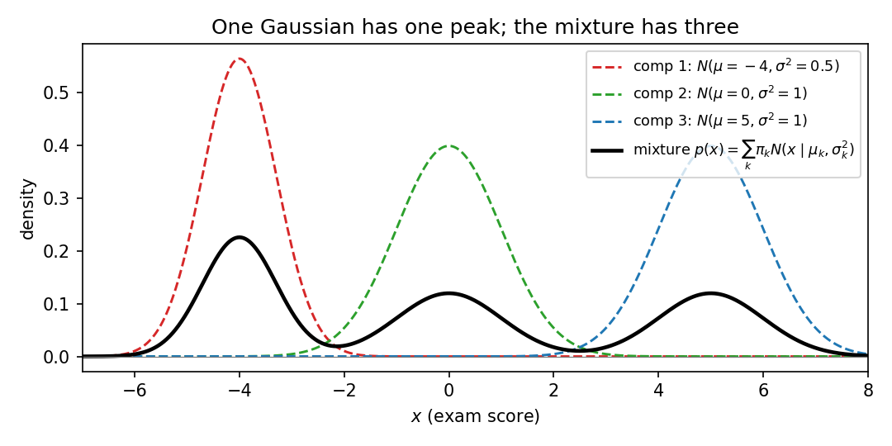
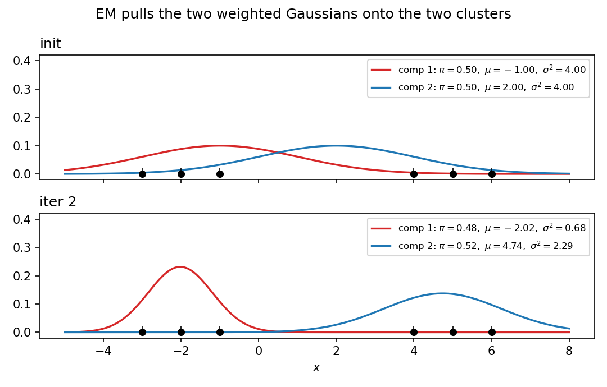

# 25. GMMs and the EM algorithm

Two promises converge here. §24.11(iii) promised a different answer to "understand the data": PCA compresses by *subspaces*; Chapter 25 compresses by *probability* — fit a mixture of Gaussians to the data instead of a flat floor through it. §22.13 sketched the density-estimation task (learn a probability mapping $P$ with the smallest negative log-likelihood) and named the Gaussian mixture model as its illustration, deferring the model and how to fit it to this chapter. This chapter is both promises kept: the mixture model (§§25.2–25.5), why fitting it by maximum likelihood is hard (§25.6), and the iterative algorithm that fits it anyway (§§25.7–25.10), with every number worked by hand (§25.11). Everything comes from the MLF Week 12 lecture "Gaussian Mixture Models and Expectation Maximisation" (Prof. Harish Guruprasad Ramaswamy, IIT Madras) and the MLT Week 4 live-session problems on EM.

**Notation.** Data $D = \{x_1, \ldots, x_n\}$, $x_i \in \mathbb{R}^d$ (same subscript convention as Chapter 24). The number of mixture components is $K$, fixed before fitting. Parameters are packaged as $\theta = \{\pi_k, \mu_k, \Sigma_k\}_{k=1}^{K}$. $N(x \mid \mu_k, \Sigma_k)$ is the Gaussian density from §19.6: in $d$ dimensions,
$$N(x \mid \mu_k, \Sigma_k) = \frac{1}{(2\pi)^{d/2}\sqrt{\det\Sigma_k}}\exp\!\left(-\tfrac12 (x-\mu_k)^T\Sigma_k^{-1}(x-\mu_k)\right),$$
and in $d = 1$, $N(x \mid \mu_k, \sigma_k^2) = \frac{1}{\sqrt{2\pi\sigma_k^2}}\exp\!\left(-\frac{(x-\mu_k)^2}{2\sigma_k^2}\right)$.

## 25.1 The other answer to "understand the data"

PCA (§24) looked at unlabelled data and asked for the best low-dimensional *floor* through it — a subspace. There is a second, equally natural question: **what probability distribution generated these points?** That is density estimation (§22.13): learn a function $p(x)$ that is large where the data is dense and small elsewhere, integrating to $1$.

i) **PCA compresses by geometry.** Keep the directions of maximum variance; throw away the rest.
ii) **GMMs compress by probability.** Don't project anything — instead, describe the data's *shape* as a weighted sum of Gaussian hills.
iii) Same unsupervised spirit (§22.11): no labels, no $y_i$. Different model of what "structure" means.

**Basically, ...** "PCA says: the data is a cloud — squash it onto the best flat floor. GMMs say: the data is several overlapping clouds — describe each cloud by its own bell curve, and say how much of the data each bell owns."

## 25.2 The motivating example: three types of students

The lecture's motivating example. An exam (multiple choice, with negative marking) is written by three types of students:

i) Type 1 mostly picks option A (doesn't study): scores $\sim$ normal with mean $-4$, variance $0.5$ — the **red** curve.
ii) Type 2 picks A/B/C/D uniformly at random: scores $\sim$ normal with mean $0$, variance $1$ — the **green** curve.
iii) Type 3 studies and answers properly: scores $\sim$ normal with mean $5$, variance $1$ — the **blue** curve.

$40\%$ of students are type 1, $30\%$ type 2, $30\%$ type 3. Nobody advertises their type: the teacher only sees a column of marks. The histogram of many marks has **three peaks** — near $-4$, near $0$, near $5$ — a *multimodal* distribution.

**The point.** Every distribution met so far (normal, exponential, uniform...) has a *single* peak. No single-peak density can capture three-peaked data. The right model is a **mixture of Gaussians**: $0.4 \times$ (red curve) $+ 0.3 \times$ (green curve) $+ 0.3 \times$ (blue curve). Not plain addition — each curve already integrates to $1$, so adding them integrates to $3$; the weights $0.4, 0.3, 0.3$ rescale so the total integrates to $1$, and they record *what fraction of students live in each mode*.

<!-- Original matplotlib illustration drawn for this chapter (not reused from any URL): the three unweighted Gaussian components of the lecture's exam-score example (red/green/blue dashed) and their weighted mixture (black solid), showing three peaks -->

**Basically, ...** "The class is secretly three different crowds mixed together. Each crowd's scores form one bell curve. The overall histogram is the three bells stacked with weights $0.4, 0.3, 0.3$ — which is why it has three humps no single bell could make."

**Note (adding densities $\neq$ adding random variables).** If you *add* normal random variables you get another normal (§19.7) — one peak, always. Adding *densities* is a different operation entirely: it produces the mixture. Don't confuse the two.

## 25.3 The Gaussian mixture model

**Def (Gaussian mixture density).** With $K$ components,
$$\boxed{f_X(x) = \sum_{k=1}^{K} \pi_k\, N(x \mid \mu_k, \Sigma_k)}.$$
Each component $k$ is a full Gaussian (§19.6); the **mixture weights** $\pi_k$ blend them.

**The parameters.** For each component $k$:
- $\pi_k$ — a scalar: *what fraction of the data comes from component $k$*; $\pi_k \ge 0$ and $\sum_{k=1}^{K}\pi_k = 1$.
- $\mu_k$ — the component's mean ($d$ numbers).
- $\Sigma_k$ — the component's covariance matrix ($d(d+1)/2$ numbers, §19.6).

i) **Why the weights.** Each $N(x \mid \mu_k, \Sigma_k)$ integrates to $1$; the weights make the mixture integrate to $\sum_k \pi_k = 1$ — a valid density.
ii) **The exam example is $K = 3$, $d = 1$:** $\pi = (0.4, 0.3, 0.3)$, $\mu = (-4, 0, 5)$, $\sigma^2 = (0.5, 1, 1)$.
iii) **$K$ is an input, not estimated.** The lecture assumes the number of components is known a priori; in practice people try several values of $K$.

**eg 1 (reading the mixture density).** For the exam example, the density at $x = 0$:
- red: $0.4 \cdot N(0 \mid -4, 0.5) = 0.4 \cdot \frac{1}{\sqrt{2\pi\cdot 0.5}}e^{-16} \approx 2.5\times10^{-8}$,
- green: $0.3 \cdot N(0 \mid 0, 1) = 0.3 \cdot \frac{1}{\sqrt{2\pi}} \approx 0.1197$,
- blue: $0.3 \cdot N(0 \mid 5, 1) = 0.3 \cdot \frac{1}{\sqrt{2\pi}}e^{-12.5} \approx 4.5\times10^{-7}$,
$$f_X(0) \approx \boxed{0.1197},$$
almost entirely the green component's doing — a score of $0$ is green territory. (Problem 1 asks for $f_X(-4)$ and $f_X(5)$: same arithmetic, different winner.)

**Basically, ...** "A GMM is $K$ bell curves plus $K$ percentages. To score a point, ask each bell how likely the point is, weight by that bell's percentage, and add. The percentages are the model's way of saying how much of the data each bell owns."

## 25.4 First caution: the component labels are meaningless

**Def (unidentifiability by label swap).** Reordering the components changes nothing about the density.

**eg 2 (the lecture's swap).** Two-component model, parameter set A: $\pi_1 = 0.5, \mu_1 = 1, \sigma_1^2 = 1$; $\pi_2 = 0.5, \mu_2 = -1, \sigma_2^2 = 1$. Parameter set B: $\pi_1 = 0.5, \mu_1 = -1, \sigma_1^2 = 1$; $\pi_2 = 0.5, \mu_2 = 1, \sigma_2^2 = 1$. As vectors these look different — but
$$f_A(x) = 0.5\,N(x\mid 1,1) + 0.5\,N(x\mid -1,1) = f_B(x),$$
purely because addition commutes. No data can ever distinguish A from B.

**The rule.** Indexing is bookkeeping, nothing more: pick an order and stay consistent. (This also means the fitted model is never unique — a fact §25.10 will need.)

**Basically, ...** "Calling the left bell 'component 1' and the right bell 'component 2' — or the other way round — describes the same mixture. The names are stickers; the density doesn't read them."

## 25.5 The latent-variable view: naming the hidden crowd

Same model, more useful notation. Introduce a **latent (hidden) variable** $Z$ = *which component generated the point*.

i) **Component choice:** $\boxed{P(Z = k) = \pi_k}$ — rolling a $K$-faced die with face probabilities $\pi_1, \ldots, \pi_K$ (in the exam story: which *type* of student you are).
ii) **Point given the component:** $\boxed{X \mid Z = k \sim N(\mu_k, \Sigma_k)}$ — once the type is fixed, the score is that type's Gaussian.
iii) **Recovering the mixture (marginalization):** $Z$ is summed out,
$$\boxed{P(X) = \sum_{k=1}^{K} P(Z = k)\,P(X \mid Z = k) = \sum_{k=1}^{K} \pi_k\, N(x \mid \mu_k, \Sigma_k)},$$
exactly §25.3's density. Nothing new mathematically — just a name for the crowd membership.

**Generative story.** To draw one data point: (1) sample $Z = k$ with probability $\pi_k$; (2) sample $x$ from $N(\mu_k, \Sigma_k)$. If you could *see* $Z$, the data would arrive colour-coded — red points from the red bell, green from green, blue from blue — and everything would be easy (§25.7). You can't: $Z$ is hidden. The lecture is explicit that "probabilities and densities" are used interchangeably here; the level of rigour doesn't need more.

**Basically, ...** "Give every point a secret colour = which bell made it. If you knew the colours, fitting would be trivial. You don't — the colours are invisible — but naming them ($Z$) lets us talk precisely about what we're missing."

## 25.6 The MLE question — and why it is ugly

We fit parametric families by maximum likelihood (§20.3). Try it here. Data $x_1, \ldots, x_n$, $K$ known, parameters $\theta = \{\pi_k, \mu_k, \Sigma_k\}$.

**Likelihood.** By independence (§20.2), the likelihood is the product of one mixture density per point:
$$L(\theta) = \prod_{i=1}^{n}\left(\sum_{k=1}^{K} \pi_k\, N(x_i \mid \mu_k, \Sigma_k)\right).$$
**Negative log-likelihood** (the risk $R(\theta)$, §20.2):
$$\boxed{R(\theta) = -\sum_{i=1}^{n}\log\!\left(\sum_{k=1}^{K} \pi_k\, N(x_i \mid \mu_k, \Sigma_k)\right)}.$$

**The problem.** There is a **summation inside the log**. A product inside a log splits into a sum (§20.2: $\log\prod = \sum\log$) — clean. A sum inside a log does not split — ugly. You can still write down the gradient of $R(\theta)$, but setting it to $0$ and solving for the parameters is not possible in closed form: every parameter appears inside every log-of-sum. (Problem 3 makes this concrete for $\mu_1$.)

i) **Not hopeless, just unsatisfying.** Generic optimizers (gradient descent, §10) could attack $R(\theta)$ directly — but the lecture wants a more intuitive solution.
ii) **The intuition comes from §25.5's colours.** The difficulty is entirely the hidden $Z$: if we knew which point came from which component, estimation would be Chapter 20 again. That observation is the whole algorithm.

**Basically, ...** "$\log(\text{sum})$ is the villain. $\log$ of a product breaks apart nicely; $\log$ of a sum refuses. So the usual move — differentiate, set to zero, solve — dies on the spot. The way out: stop fighting the sum, and use the hidden colours instead."

## 25.7 The chicken-and-egg insight

Two facts, both easy, each assuming the other:

i) **If you knew the colours ($Z$), the parameters are trivial.** Take all red points: their sample mean estimates $\mu_{\text{red}}$ (§20.6), their sample covariance estimates $\Sigma_{\text{red}}$ (§20.7), and the fraction of red points estimates $\pi_{\text{red}}$. Ridiculously easy — just Chapter 20 per colour.
ii) **If you knew the parameters, the colours are (mostly) easy.** Handed $x = 0.2$ with the exam parameters, you'd bet green with near-certainty; $x = 6.2$ screams blue; $x = -5.3$ screams red. Only boundary points are genuinely ambiguous — $x = -2$ could be red or green (§25.8 computes exactly how ambiguous).

**The catch.** You have neither. This is the **chicken-and-egg problem**: parameters give colours, colours give parameters, and you're holding nothing.

**The standard escape** (the lecture's analogy): *create a random chicken first.* Initialize the parameters to some valid random values. From that chicken hatch an egg (compute colours). From that egg hatch a better chicken (recompute parameters). Repeat — and hope the generations converge to a realistic chicken *and* egg. That loop is the EM algorithm.

**Basically, ...** "Parameters and colour-assignments each determine the other. Since you have neither, guess one at random, derive the other, derive the first back — and keep going. Each round's guess is a little less random than the last."

## 25.8 The E-step: responsibilities

Fix the parameters. For point $x_i$, ask: *what is the probability it came from component $k$?* That is $P(Z_i = k \mid x_i)$ — and Bayes' rule (§14) answers it, since we know both pieces ($P(Z_i=k) = \pi_k$, $X_i \mid Z_i = k \sim N(\mu_k, \Sigma_k)$):

$$\boxed{\gamma(z_{ik}) \;:=\; P(Z_i = k \mid x_i) = \frac{\pi_k\, N(x_i \mid \mu_k, \Sigma_k)}{\sum_{j=1}^{K} \pi_j\, N(x_i \mid \mu_j, \Sigma_j)}}.$$

**Def (responsibilities).** $\gamma(z_{ik})$ is the **responsibility** component $k$ takes for point $x_i$: how much of the blame/credit for that point belongs to bell $k$.

i) **Rows sum to 1:** $\sum_{k=1}^{K}\gamma(z_{ik}) = 1$ — the numerator summed over $k$ *is* the denominator. Every point's total responsibility is fully distributed.
ii) **Soft, not hard:** $\gamma(z_{ik}) \in [0,1]$. A point is not *assigned* to one component; each component takes a *share* of it.
iii) **The extreme case:** if $\gamma(z_{ik})$ is $1$ for exactly one $k$ and $0$ for the rest, the point is fully assigned — keep this case in mind for §25.9.

**eg 3 (the lecture's ambiguous point, computed).** Exam parameters; $x = -2$:
- numerator: red $0.4\cdot N(-2\mid -4,0.5) = 0.4\cdot 0.010333 = 0.004133$; green $0.3\cdot N(-2\mid 0,1) = 0.3\cdot 0.053991 = 0.016197$; blue $\approx 0$;
- denominator: $0.004133 + 0.016197 \approx 0.020331$;
$$\boxed{\gamma = (0.2033,\; 0.7967,\; 0.0000)}.$$
So $x = -2$ is $79.7\%$ green, $20.3\%$ red — exactly the lecture's "could have come from either" made quantitative.

**eg 4 (the unambiguous point).** $x = 0.2$: green numerator $0.3\cdot 0.391043 = 0.117313$, denominator $\approx 0.117314$,
$$\boxed{\gamma \approx (0.00000,\; 0.99999,\; 0.00001)},$$
i.e. green takes essentially full responsibility — the lecture's "almost certainly the green cluster", now with the number attached.

**Basically, ...** "The E-step re-colours every point *softly*: instead of stamping 'red' on it, you write down a probability vector — $20\%$ red, $80\%$ green. Bayes' rule does the stamping: each bell's claim is its weight times its density at the point, normalized."

## 25.9 The M-step: responsibility-weighted MLE

Now reverse direction: responsibilities known, re-estimate the parameters. Start from the extreme case (§25.8(iii)), where each point belongs to exactly one component:

- $\mu_k$ = sample mean of the points assigned to $k$ (§20.6),
- $\Sigma_k$ = sample covariance of the points assigned to $k$ (§20.7),
- $\pi_k$ = fraction of points assigned to $k$.

With soft responsibilities, "the points assigned to $k$" becomes "all points, weighted by $\gamma(z_{ik})$". Define the **effective count**
$$\boxed{N_k = \sum_{i=1}^{n}\gamma(z_{ik})}$$
("a proxy for the number of points assigned to component $k$" — the lecture's phrase). Then:

$$\boxed{\mu_k = \frac{1}{N_k}\sum_{i=1}^{n}\gamma(z_{ik})\,x_i}, \qquad \boxed{\pi_k = \frac{N_k}{n}},$$
$$\boxed{\Sigma_k = \frac{1}{N_k}\sum_{i=1}^{n}\gamma(z_{ik})\,(x_i - \mu_k)(x_i - \mu_k)^T}.$$

i) **Each is Chapter 20's MLE with weights.** Set all $\gamma(z_{ik}) \in \{0,1\}$ and these collapse to §20.6's $\hat\mu = \bar x$, §20.7's $\hat\Sigma$, and the plain fraction — the unweighted MLEs.
ii) **Denominator $n$, not $n-1$** — same as §20.6's Note: MLE averages, it doesn't debias.
iii) **Where they come from.** Holding the responsibilities fixed, each update maximizes the responsibility-weighted log-likelihood. For $\mu_k$ in $d=1$: minimizing $-\sum_i \gamma(z_{ik})\log N(x_i\mid\mu_k,\sigma_k^2)$ and setting the derivative to $0$ gives $-\sum_i\gamma(z_{ik})(x_i-\mu_k)/\sigma_k^2 = 0$, i.e. the $\mu_k$ formula above. The $\Sigma_k$ formula is the same weighted-MLE argument as §20.7; $\pi_k = N_k/n$ follows from maximizing $\sum_i\sum_k\gamma(z_{ik})\log\pi_k$ under $\sum_k\pi_k = 1$ (Lagrange, §11 — Problem 7).

**Note.** The lecture presents these updates intuitively ("the sample mean/covariance of the points the component is responsible for") and notes the full theory behind *why* they are the right updates belongs to a later course. The formulas above *are* those updates.

**Basically, ...** "The M-step rebuilds each bell from the points it is responsible for — but a point that is $80\%$ green counts as $0.8$ of a green point. Mean = weighted average, covariance = weighted spread, weight = total responsibility divided by $n$. It is Chapter 20's MLE, wearing responsibility-weights."

## 25.10 The EM algorithm: alternate until convergence

Put §§25.8–25.9 together. **EM = Expectation–Maximisation.**

i) **Initialize** $\pi_k, \mu_k, \Sigma_k$ to valid random values (the random chicken).
ii) **E-step:** compute all responsibilities $\gamma(z_{ik})$ from the current parameters (§25.8).
iii) **M-step:** recompute $\pi_k, \mu_k, \Sigma_k$ from the responsibilities (§25.9).
iv) **Repeat (ii)–(iii)** until convergence — the parameters (or the log-likelihood) stop changing.

**What the lecture actually promises.** Honestly, not much beyond the loop: "you can keep on alternating till you have reached convergence", with the *hope* that each generation's chicken is more realistic than the last. The theorem-level story (why these updates are principled, what exactly converges) is deferred to a later course. So here is the precise, no-more-than-is-known status:

i) **No global-optimum guarantee.** EM climbs to a *local* optimum / stationary point of the likelihood, not necessarily the best one. Where you land depends on where you start — **initialization matters**.
ii) **Non-uniqueness is built in.** §25.4's label swaps mean the optimum was never unique to begin with; different runs may return permuted-but-identical solutions.
iii) **$K$ stays fixed** throughout — it was your input (§25.3(iii)), not something EM discovers.

**Basically, ...** "Guess, re-colour, rebuild, repeat — until nothing moves anymore. It works remarkably well in practice, but it is hill-climbing from a random start: different starts can reach different hills. The lecture shows you the loop; the proof that the loop is sensible is a later course's job."

## 25.11 Worked: two EM iterations by hand

Data (1-D), $n = 6$: $x = \{-3, -2, -1, 4, 5, 6\}$ — two visible clusters. $K = 2$. Deliberately mediocre initialization:
$$\pi_1 = \pi_2 = 0.5, \qquad \mu_1 = -1,\ \mu_2 = 2, \qquad \sigma_1^2 = \sigma_2^2 = 4.$$
(Initial log-likelihood: $-17.468$.)

**Iteration 1, E-step.** Responsibilities $\gamma(z_{i1}), \gamma(z_{i2})$:

| $x_i$ | $-3$ | $-2$ | $-1$ | $4$ | $5$ | $6$ |
|---|---|---|---|---|---|---|
| $\gamma(z_{i1})$ | $0.9325$ | $0.8670$ | $0.7549$ | $0.0675$ | $0.0331$ | $0.0159$ |
| $\gamma(z_{i2})$ | $0.0675$ | $0.1330$ | $0.2451$ | $0.9325$ | $0.9669$ | $0.9841$ |

eg, $x = -3$: $N(-3\mid-1,4) = \frac{1}{\sqrt{8\pi}}e^{-4/8} = 0.199471\cdot e^{-0.5} = 0.120985$; $N(-3\mid 2,4) = 0.199471\cdot e^{-25/8} = 0.008764$; $\gamma(z_{11}) = \frac{0.5\cdot0.120985}{0.5\cdot0.120985 + 0.5\cdot0.008764} = \frac{0.120985}{0.129749} = \boxed{0.9325}$. (Every row sums to $1$ — check the first: $0.9325 + 0.0675 = 1.0000$ ✓.)

**Iteration 1, M-step.** Effective counts: $N_1 = 0.9325+0.8670+0.7549+0.0675+0.0331+0.0159 = \boxed{2.6709}$, $N_2 = 6 - 2.6709 = \boxed{3.3291}$.
- $\mu_1 = \frac{0.9325(-3)+0.8670(-2)+0.7549(-1)+0.0675(4)+0.0331(5)+0.0159(6)}{2.6709} = \frac{-4.7553}{2.6709} = \boxed{-1.78}$,
- $\mu_2 = \frac{0.0675(-3)+0.1330(-2)+0.2451(-1)+0.9325(4)+0.9669(5)+0.9841(6)}{3.3291} = \frac{13.7553}{3.3291} = \boxed{4.13}$,
- $\sigma_1^2 = 2.48,\ \sigma_2^2 = 5.73$ (weighted average squared deviations about the *new* means),
- $\pi_1 = 2.6709/6 = \boxed{0.445},\ \pi_2 = \boxed{0.555}$.
Log-likelihood after the M-step: $\boxed{-14.360}$ (up from $-17.468$).

**Iteration 2, E-step** (with the updated parameters):

| $x_i$ | $-3$ | $-2$ | $-1$ | $4$ | $5$ | $6$ |
|---|---|---|---|---|---|---|
| $\gamma(z_{i1})$ | $0.9871$ | $0.9698$ | $0.9148$ | $0.0015$ | $0.0001$ | $0.0000$ |
| $\gamma(z_{i2})$ | $0.0129$ | $0.0302$ | $0.0852$ | $0.9985$ | $0.9999$ | $1.0000$ |

**Iteration 2, M-step.** $N_1 = 2.8734$, $N_2 = 3.1266$;
$$\boxed{\mu_1 = -2.02,\ \mu_2 = 4.74}, \qquad \boxed{\sigma_1^2 = 0.68,\ \sigma_2^2 = 2.29}, \qquad \boxed{\pi_1 = 0.479,\ \pi_2 = 0.521}.$$
Log-likelihood: $\boxed{-12.294}$ — up again.

**Reading the numbers.** The means walk toward the true clusters: $\mu_1: -1 \to -1.78 \to -2.02$ (left cluster sits at $\approx -2$), $\mu_2: 2 \to 4.13 \to 4.74$ (right cluster at $\approx 5$). Responsibilities *sharpen* — $x = -3$ goes from $93\%$ to $98.7\%$ component-1 — and the inflated initial variances collapse as each bell stops trying to cover both clusters. Run to 20 iterations: $\mu = (-2.00, 5.00)$, $\sigma^2 = (0.667, 0.667)$, $\pi = (0.5, 0.5)$, log-likelihood $-11.456$, stable to 4 decimals — the sample statistics of the two clusters, recovered from a bad start.

<!-- Original matplotlib illustration drawn for this chapter (not reused from any URL): the two weighted 1-D Gaussian components of the hand-worked example at initialization and after two EM iterations, showing them migrating onto the two data clusters -->

**Basically, ...** "Two rounds are enough to watch the magic: the bells slide onto the clusters, the colour-assignments harden, the likelihood climbs. EM is just §§25.8–25.9 on repeat — and the numbers above are the proof that repeating works."

## 25.12 Where this goes next — and the close of Part III

i) **Clustering, the soft way.** The lecture's closing application: run EM on a GMM and you have "one of the building blocks of clustering". Each point ends with a responsibility vector, not a single label — *soft* clustering. (The hard-assignment cousin, k-means, is Chapter 26's job.)
ii) **The theory behind the updates.** The lecture is upfront: the updates are intuitively right, and they are also "theoretically well founded" — but that foundation is a later course's material, not this chapter's.
iii) **Part III, closed.** §22.11 framed unsupervised learning as "understanding data" and named two tasks: dimensionality reduction and density estimation. Chapter 24 answered with *subspaces* (PCA: the best floor through the data). This chapter answers with *probability* (GMMs: the best mixture of bells for the data, fitted by EM). Same spirit, different model of structure — the unsupervised arc is complete.
iv) **What Part IV adds.** The models so far were few and classical — regression, PCA, mixtures. Part IV (MLT) widens the toolbox: k-means, kernels, regularization, trees, SVMs, ensembles. The probability machinery of Part II stays underneath all of it.

**Basically, ...** "Part III in one line: Chapter 22 asked what ML is, 23 fitted lines, 24 found floors, 25 fitted bells. You now own the classical unsupervised toolkit — compress by subspace, or describe by mixture. Part IV spends that toolkit on the modern zoo."

## Problem set

1. **Trimodal arithmetic (the exam example).** With $\pi = (0.4,0.3,0.3)$, $\mu = (-4,0,5)$, $\sigma^2 = (0.5,1,1)$: (i) compute $f_X(-4)$ and $f_X(5)$ the way eg 1 computed $f_X(0)$. (ii) The three values are $\approx 0.2257$, $0.1197$, $0.1197$ — which peak of the histogram is tallest, and why (weights $\times$ widths)?
2. **Labels don't matter.** Write the mixture density for the lecture's parameter set A ($\pi_1 = 0.5, \mu_1 = 1, \sigma_1^2 = 1$; $\pi_2 = 0.5, \mu_2 = -1, \sigma_2^2 = 1$) and for set B (same, with $\mu_1,\mu_2$ swapped). Show the two densities are identical functions.
3. **Why direct MLE is ugly (guided).** 1-D data $\{a, b\}$, $K = 2$, $\sigma_1^2 = \sigma_2^2 = 1$ and $\pi_1 = \pi_2 = \tfrac12$ known; estimate $\mu_1, \mu_2$. (i) Write $R(\mu_1,\mu_2)$. (ii) Compute $\partial R/\partial\mu_1$ and express it through the responsibilities $\gamma(z_{i1})$. (iii) Set it to $0$: what equation must $\mu_1$ satisfy? Explain why this is not a closed-form solution (where does $\mu_1$ appear?).
4. **E-step arithmetic (MLT Week 4 live session).** A 3-component GMM; for $x = 6$: $P(x\mid z=1) = 0.2$, $P(x\mid z=2) = 0.3$, $P(x\mid z=3) = 0.5$; $\pi_1 = 0.4$, $\pi_2 = 0.3$, $\pi_3 = 0.3$. Compute the posterior $P(z=k\mid x)$ for $k = 1,2,3$. Which component most likely generated $x = 6$?
5. **Fill the responsibilities (MLT Week 4 live session).** 1-D data $X = [-3,-1,1,3]$, $K = 3$. An E-step produced
$$R = \begin{pmatrix} 0.3 & a & 0.5 \\ b & 1 & b \\ c & 0.5 & c \\ 0.1 & 0.4 & d \end{pmatrix},$$
each row = one point's responsibilities. (i) Use $\sum_k R_{ik} = 1$ to find $a,b,c,d$. (ii) Compute the M-step means $\mu_1,\mu_2,\mu_3$ and their sum.
6. **M-step arithmetic (MLT Week 4 live session).** Data $\{2,1,3,2,1,2,0,-3,0,2\}$ ($n = 10$), $K = 3$. At some EM round the E-step gave, for component 3, $\lambda_{3i} = P(z_i = 3\mid x_i)$: $[0.2, 0.3, 0.1, 0.6, 0.1, 0.5, 0.4, 0.7, 0.1, 0.2]$. Compute $\pi_3$ and $\mu_3$ after the M-step.
7. **The $\pi_k$ update, derived.** With responsibilities fixed, the $\pi$-dependent part of the objective is $\sum_{i=1}^{n}\sum_{k=1}^{K}\gamma(z_{ik})\log\pi_k$, subject to $\sum_{k=1}^{K}\pi_k = 1$. Use a Lagrange multiplier (§11) to show $\boxed{\pi_k = N_k/n}$.
8. **True or false, one-line justification:** (i) $\sum_{k=1}^{K}\gamma(z_{ik}) = 1$ for every data point $i$. (ii) EM is guaranteed to find the global maximum of the likelihood. (iii) If every $\gamma(z_{ik}) \in \{0,1\}$, the M-step is exactly the per-cluster sample mean, sample covariance, and data fraction. (iv) Swapping two components' labels changes the fitted mixture density. (v) A GMM with $K = 1$ can capture trimodal data.
