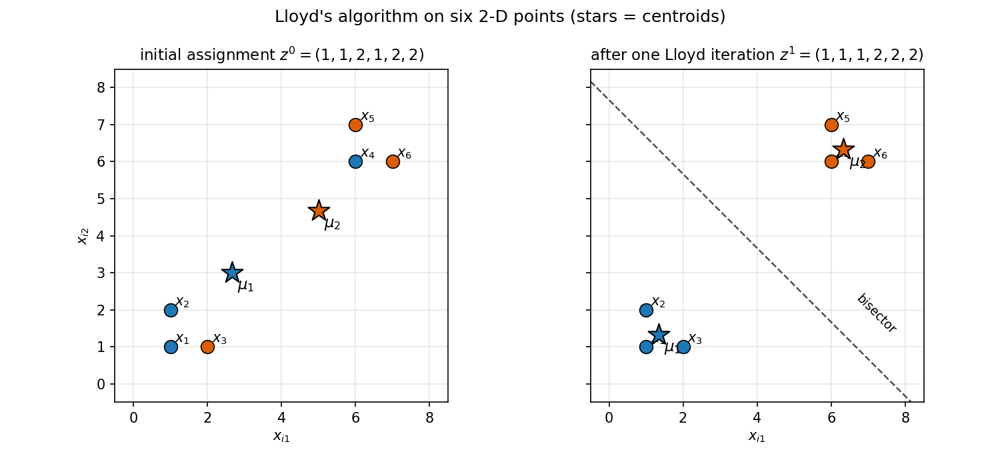

# 26. K-means clustering

**Part IV opens here.** §25.12(iv) previewed this part: the modern ML toolbox — k-means, kernels, regularization, trees, SVMs, ensembles — with Part II's probability machinery underneath. The toolbox opens with the oldest and simplest clustering algorithm there is, and it keeps a promise §25.12(i) made: EM on a GMM clusters *softly*, handing every point a responsibility vector; the hard-assignment cousin, k-means, is this chapter's job. Same unsupervised spirit as Chapters 24–25 (§22.11) — a different goal: not compressing the data, not scoring it, but *grouping* it.

Everything in §§26.1–26.10 comes from the MLT Week 3 lecture notes on k-means (Lloyd's algorithm) and the Week 3 practice assignment; the hand-worked example in §26.5 follows the lecture's step order exactly, with every number recomputed independently (review log).

**Notation.** Data $D = \{x_1, \ldots, x_n\}$, $x_i \in \mathbb{R}^d$ (subscript convention, Chapters 24–25). The number of clusters $K$ is fixed *before* the algorithm runs — an input, like GMM's $K$ (§25.3(iii)). Each point carries a **cluster indicator** $z_i \in \{1, \ldots, K\}$: $z_i = k$ means "$x_i$ belongs to cluster $k$". Cluster $k$'s center is $\mu_k \in \mathbb{R}^d$, the **centroid**.

## 26.1 The clustering task: grouping unlabelled data

**Def (clustering).** Given unlabelled $x_1, \ldots, x_n$, partition them into $K$ groups — **clusters** — so that points in the same group are similar and points in different groups are dissimilar.

i) **Unsupervised, §22.11's third verb.** §22.11 says unsupervised learning compresses, explains, and *groups*. PCA compressed (§24), GMMs explained via probability (§25); k-means *groups*. No labels, no $y_i$ — the groups are discovered, not taught.
ii) **The use case (§22.11).** §22.11's marketing manager: a million tweets a week, unreadable — group them into 10 clusters (selfies-with-Coke, co-branding, paid promotions, …), then a human reads the 10 groups. The grouping is the algorithm's job; giving the groups meaning is the human's.
iii) **$K$ is your call.** The algorithm does not discover how many clusters exist; you hand it $K$ up front (§26.8 is about choosing it).

**Basically, ...** "You have a pile of unlabelled points and a number $K$. Sort the pile into $K$ heaps so each heap's points huddle together. Nobody tells you the right heaps — 'right' has to be defined by the algorithm itself, which is §26.3's job."

## 26.2 How many partitions? Counting the assignments

Fix $K$. An assignment is a choice of $z_1, \ldots, z_n$, each in $\{1, \ldots, K\}$.

**Count.** $n$ points, $K$ independent choices each (clusters allowed to be empty):
$$\boxed{K^n \text{ possible assignments}}$$
— the lecture's count, stated exactly this way.

i) **Brute force is hopeless.** $K^n$ grows brutally: $n = 100$, $K = 3$ gives $3^{100}$ assignments. Nobody enumerates.
ii) **So we iterate, not enumerate.** Lloyd's algorithm (§26.4) walks through assignments — each step either moves to a strictly better one or stops — instead of checking all $K^n$.
iii) **Labels are bookkeeping.** As with GMM components (§25.4), permuting cluster labels changes nothing — assignments differing only by renaming clusters describe the same partition. The $K^n$ count ignores this; it is an upper bound on *distinct* partitions, which is all the convergence argument (§26.4) needs.

**eg 1 (counting, tiny).** $n = 3$ points, $K = 2$: $2^3 = 8$ assignments — $(1,1,1), (1,1,2), (1,2,1), (1,2,2), (2,1,1), (2,1,2), (2,2,1), (2,2,2)$. Note $(1,1,2)$ and $(2,2,1)$ are the same partition with renamed labels — the double-counting (iii) mentions.

**Basically, ...** "Every point independently picks one of $K$ buckets: $K^n$ ways to fill them. For any real dataset that number is astronomical, so the algorithm never lists assignments — it improves its way to a good one instead."

## 26.3 The k-means objective: within-cluster sum of squares

Given an assignment, how good is it? The lecture's answer: add up, over all points, the squared distance from each point to its own cluster's center.

**Def (k-means objective).** With $\mu_{z_i}$ = the center of the cluster assigned to $x_i$,
$$\boxed{F(z_1, \ldots, z_n) = \sum_{i=1}^{n} \|x_i - \mu_{z_i}\|^2}.$$
Also called the **distortion** or the **within-cluster sum of squares (WCSS)**: it measures how scattered each cluster is around its center. **Goal: minimize $F$.**

**Def (centroid).** The center $\mu_k$ is the *mean* of the points assigned to cluster $k$:
$$\boxed{\mu_k = \frac{\sum_{i=1}^{n} x_i\,\mathbf{1}(z_i = k)}{\sum_{i=1}^{n} \mathbf{1}(z_i = k)}}$$
— the lecture's formula: the cluster's points summed, divided by the cluster's headcount ($\mathbf{1}(\cdot)$ is the indicator, $1$ when true, $0$ when false).

i) **Why the mean?** For a fixed assignment, the mean is what *minimizes* that cluster's contribution to $F$: differentiating $\sum_{i:z_i=k}\|x_i - \mu\|^2$ w.r.t. $\mu$ (componentwise, the §20.6 calculation) gives $-2\sum_{i:z_i=k}(x_i - \mu) = 0$, i.e. $\mu =$ average. The centroid isn't an arbitrary "center" — it is the optimal one for the points it serves.
ii) **$F$ is a loss, §22.11-style.** Unsupervised learning has no $y_i$ to check against, so each task invents its own loss (§22.11(i)): PCA invented reconstruction error (§22.12), density estimation invented negative log-likelihood (§22.13), and clustering invents $F$.
iii) **$F \ge 0$ always**, and $F = 0$ means every point sits exactly on its centroid — possible only if each cluster's points coincide, or (trivially) with $K = n$ (§26.8).

**eg 2 (reading $F$).** 1-D data $\{0, 2, 9, 10\}$, $K = 2$, assignment $z = (1,1,2,2)$:
- cluster 1: $\{0,2\}$, $\mu_1 = 1$: contributions $(0-1)^2 + (2-1)^2 = 2$;
- cluster 2: $\{9,10\}$, $\mu_2 = 9.5$: contributions $0.25 + 0.25 = 0.5$;
$$\boxed{F = 2.5}.$$
A worse grouping scores worse — Problem 1 works this out on similar data, where a bad split scores $\tfrac{146}{3}$ against $1$ for the good one. That sensitivity is the point: $F$ *scores* assignments.

**Basically, ...** "$F$ is the total 'unhappiness': every point measures its squared distance to its cluster's center, and you add them all up. Good clustering = small $F$ = every point snuggled close to its own center. And the center is just the average of its points — the one location that minimizes that cluster's unhappiness."

## 26.4 Lloyd's algorithm: assign, re-mean, repeat

Minimizing $F$ over $K^n$ assignments by brute force is out (§26.2). The lecture's algorithm — **Lloyd's algorithm** — alternates two steps, each trivial, each unable to increase $F$.

**Initialization.** Pick $z_1^0, \ldots, z_n^0 \in \{1, \ldots, K\}$ — an initial assignment (§26.7 is about choosing it well).

**Until convergence, repeat:**
- **Compute means.** For each $k$,
$$\boxed{\forall k,\quad \mu_k^t = \frac{\sum_{i=1}^{n} x_i\,\mathbf{1}(z_i = k)}{\sum_{i=1}^{n} \mathbf{1}(z_i = k)}}$$
(the centroid formula, applied to the current assignment).
- **Reassignment step.** For each $i$,
$$\boxed{\forall i,\quad z_i^{t+1} = \arg\min_{k} \|x_i - \mu_k^t\|^2}$$
— every point moves to its *nearest* centroid. (Ties: keep the old label; it changes nothing — a convention, not in the lecture.)

**Why each step is safe** (neither can increase $F$):
i) **The mean step** fixes the assignment and re-centers: by §26.3(i), the mean minimizes each cluster's squared-deviation sum, so recomputing $\mu_k$ can only *lower* (or leave) $F$.
ii) **The reassignment step** fixes the centers and re-assigns: each point independently picks the $k$ minimizing its own term $\|x_i - \mu_k^t\|^2$, so the sum $F$ can only *lower* (or leave).
Hence, with $F^t$ = the objective after iteration $t$:
$$\boxed{F^{t+1} \le F^t}$$
— the practice assignment's answer, and the lecture's "every reassignment reduces the value of the objective function", stated with exactly the strictness the sources support: *strictly* smaller whenever at least one point actually changes cluster — a point moves only if it finds a *strictly* closer center (the lecture's "unhappy" points).

**Why it must stop (the lecture's convergence argument).** In the lecture's four lines:
i) In every iteration, only unhappy points change clusters.
ii) Every reassignment that moves a point reduces $F$.
iii) Every reassignment results in a *new* partition — $F$ strictly dropped, so this partition cannot be one already visited (the practice solution's (a)+(c)+(e): partitions never repeat, and a change in $F$ means the partition changed).
iv) There are only finitely many partitions ($\le K^n$, §26.2) — a strictly decreasing sequence over a finite set must end. The algorithm converges.

**What "converges" does NOT mean** (practice assignment, Q6/Q9 — stated exactly as sourced):
i) **No global optimum.** Different initializations can land in different local minima of $F$ — "one initialization might get stuck in local minima, while another may lead to global minima" (Q9(b)).
ii) **Init affects speed.** The number of iterations to converge depends on the start (Q9(d)).
iii) **It always stops.** Q9(c) ("one initialization may converge while another may not") is *false* — the finiteness argument holds for every start.
iv) **$K^n$ bounds partitions, not iterations** — Q6(f) is false: $K^n$ is only the upper limit on possible partitions, not the iteration count (in practice Lloyd stops far, far earlier).

**Note (empty clusters).** The $K^n$ count allows empty clusters, but the centroid formula divides by the cluster's headcount — a cluster that empties out breaks the formula. The lecture prescribes no fix; in practice, re-seed or drop the empty center. (Flagged in the review log as a point the lecture leaves open.)

**Basically, ...** "Two dance steps, repeated: (1) each cluster's center moves to its points' average; (2) each point defects to its nearest center. Neither step can ever make $F$ worse — so $F$ ratchets down every round. There are only finitely many assignments, so the ratchet must click to a stop. *Where* it stops depends on where you started: Lloyd finds a local valley of $F$, not necessarily the deepest one."

## 26.5 Worked: one Lloyd iteration by hand

Six points in 2-D, $K = 2$ — deliberately bad initial assignment so things move:
$$x_1=(1,1),\; x_2=(1,2),\; x_3=(2,1),\; x_4=(6,6),\; x_5=(6,7),\; x_6=(7,6),$$
$$z^0 = (1,1,2,1,2,2)$$
(points $1,2,4$ start in cluster 1; $3,5,6$ in cluster 2).

**Step 1 — compute means.** Cluster 1: $\{x_1,x_2,x_4\}$, $\mu_1^0 = \big(\tfrac{1+1+6}{3}, \tfrac{1+2+6}{3}\big) = \boxed{\big(\tfrac83, 3\big)}$. Cluster 2: $\{x_3,x_5,x_6\}$, $\mu_2^0 = \big(\tfrac{2+6+7}{3}, \tfrac{1+7+6}{3}\big) = \boxed{\big(5, \tfrac{14}{3}\big)}$.

Initial objective (each point to its *assigned* center):
- cluster 1: $\|x_1-\mu_1^0\|^2 = \tfrac{61}{9}$, $\|x_2-\mu_1^0\|^2 = \tfrac{34}{9}$, $\|x_4-\mu_1^0\|^2 = \tfrac{181}{9}$ → $\tfrac{276}{9}$;
- cluster 2: $\|x_3-\mu_2^0\|^2 = \tfrac{202}{9}$, $\|x_5-\mu_2^0\|^2 = \tfrac{58}{9}$, $\|x_6-\mu_2^0\|^2 = \tfrac{52}{9}$ → $\tfrac{312}{9}$;
$$\boxed{F^0 = \tfrac{276+312}{9} = \tfrac{196}{3} \approx 65.33}.$$

**Step 2 — reassign** (squared distances to the two centers; smaller wins):

| point | to $\mu_1^0$ | to $\mu_2^0$ | new $z$ |
|---|---|---|---|
| $x_1$ | $\tfrac{61}{9}\approx6.78$ | $\tfrac{265}{9}\approx29.44$ | 1 |
| $x_2$ | $\tfrac{34}{9}\approx3.78$ | $\tfrac{208}{9}\approx23.11$ | 1 |
| $x_3$ | $\tfrac{40}{9}\approx4.44$ | $\tfrac{202}{9}\approx22.44$ | **1** (was 2) |
| $x_4$ | $\tfrac{181}{9}\approx20.11$ | $\tfrac{25}{9}\approx2.78$ | **2** (was 1) |
| $x_5$ | $\tfrac{244}{9}\approx27.11$ | $\tfrac{58}{9}\approx6.44$ | 2 |
| $x_6$ | $\tfrac{250}{9}\approx27.78$ | $\tfrac{52}{9}\approx5.78$ | 2 |

eg, $x_3=(2,1)$: to $\mu_1^0$: $(2-\tfrac83)^2 + (1-3)^2 = \tfrac{4}{9}+4 = \tfrac{40}{9}$; to $\mu_2^0$: $(2-5)^2 + (1-\tfrac{14}{3})^2 = 9 + \tfrac{121}{9} = \tfrac{202}{9}$. Closer to $\mu_1^0$ — it defects. Two unhappy points move ($x_3$: $2\to1$, $x_4$: $1\to2$); the rest stay.
$$\boxed{z^1 = (1,1,1,2,2,2)}.$$

**Step 3 — recompute means.** $\mu_1^1 = \big(\tfrac{1+1+2}{3},\tfrac{1+2+1}{3}\big) = \boxed{\big(\tfrac43,\tfrac43\big)}$; $\mu_2^1 = \big(\tfrac{6+6+7}{3},\tfrac{6+7+6}{3}\big) = \boxed{\big(\tfrac{19}{3},\tfrac{19}{3}\big)}$ — the centers have slid onto the two natural blobs.
$$F^1 = \underbrace{\tfrac29+\tfrac59+\tfrac59}_{\text{cluster 1}} + \underbrace{\tfrac29+\tfrac59+\tfrac59}_{\text{cluster 2}} = \boxed{\tfrac83 \approx 2.67},$$
down from $65.33$. **Convergence check:** reassigning with $\mu_1^1,\mu_2^1$ moves no point (eg $x_3$: $\tfrac59$ vs $\tfrac{425}{9}$ — stays), so $z^2 = z^1$ and the algorithm stops. Every number above was recomputed independently (fractions and numpy) in the review log.

<!-- Original matplotlib illustration drawn for this chapter (not reused from any URL): initial vs after-one-iteration assignment of the six 2-D points with centroid stars and the perpendicular bisector of the final centers -->

**Basically, ...** "One round is enough to watch it work: the centers jump to their points' averages, the two misplaced points defect to the nearer center, the centers jump again onto the real blobs, and $F$ collapses from $65.3$ to $2.7$. Then nothing wants to move — done."

## 26.6 The shape of the clusters: half-spaces and bisectors

Fix the final centers. Which points of the plane would join cluster 1 vs cluster 2? The lecture's geometric answer:

i) **The boundary between two centers is a perpendicular bisector.** The set of points equidistant from $\mu_1,\mu_2$ — $\|x-\mu_1\| = \|x-\mu_2\|$ — is the hyperplane perpendicular to the segment $\mu_1\mu_2$ through its midpoint (practice Q3; Problem 4 proves it).
ii) **Each cluster's region is an intersection of half-spaces.** Cluster $k$'s region = points closer to $\mu_k$ than to *every* other center = the intersection of the $K-1$ half-spaces cut by the bisectors with centers $1,\ldots,K$ (excluding $k$) — the lecture's statement.
iii) **Consequence.** Every cluster region is convex (an intersection of convex half-spaces, §§12.3–12.4) and polygonal/polyhedral. k-means can only draw *straight* boundaries — it will never carve out a crescent or a ring.

**eg 3 (the worked example's bisector).** Final centers $\mu_1 = (\tfrac43,\tfrac43)$, $\mu_2 = (\tfrac{19}{3},\tfrac{19}{3})$. Midpoint: $(\tfrac{23}{6},\tfrac{23}{6})$. Equidistance $\|x-\mu_1\|^2 = \|x-\mu_2\|^2$ gives $2x^T(\mu_2-\mu_1) = \|\mu_2\|^2-\|\mu_1\|^2$, i.e. $10(x_1+x_2) = \tfrac{230}{3}$:
$$\boxed{x_1 + x_2 = \tfrac{23}{3}}$$
— the dashed line in the figure: perpendicular to the segment joining the centers (direction $(1,1)$), through the midpoint (check: $\tfrac{23}{6}+\tfrac{23}{6} = \tfrac{23}{3}$ ✓). Points with $x_1+x_2 < \tfrac{23}{3}$ join cluster 1 — all of $x_1,x_2,x_3$ satisfy this ($2,3,3 < 7.67$); $x_4,x_5,x_6$ don't ($12,13,13 > 7.67$).

**Basically, ...** "Once the centers freeze, the plane is divided like a cake cut with straight knives: each pair of centers contributes the perpendicular bisector of the segment between them, and your cluster is the piece containing your center. Straight cuts only — k-means can't do curves."

## 26.7 Initialization: uniform vs k-means++

Lloyd's start matters (§26.4: local minima, iteration count). The lecture gives two ways to choose the initial centers:

i) **Uniformly at random.** Pick the initial centers (or assignments) with equal probability over the data. Simple; sometimes unlucky.
ii) **k-means++.** Idea, in the lecture's words: "cluster centers should be as far apart as possible." Procedure:
   1. Choose the first center $\mu_1^0$ uniformly at random from $x_1,\ldots,x_n$.
   2. For $l = 2, 3, \ldots, K$: choose $\mu_l^0$ *probabilistically*, with probability proportional to the score
$$\boxed{S(x) = \min_{j=1,\ldots,l-1} \|x - \mu_j^0\|^2 \qquad \forall x}$$
   — the squared distance to the *nearest* already-chosen center.

**Reading the score.** $S(x)$ is big exactly when $x$ is far from all existing centers — so far-flung points are *likely* (not certain) to become new centers, and the centers spread out. Two edge facts: a point sitting exactly on an existing center has $S = 0$ and is never re-chosen; and "proportional to" means *probabilities*, not a maximum — the highest-score point is the most likely pick but not a guaranteed one (practice Q5: scores $25,67,89,24,56$ → the $89$ point has the highest *probability*, yet might not be chosen).

**eg 4 (k-means++ scoring, on §26.5's data).** Suppose the first pick is $\mu_1^0 = x_4 = (6,6)$. Then $S(x) = \|x-(6,6)\|^2$:
$S(x_1)=50,\ S(x_2)=41,\ S(x_3)=41,\ S(x_4)=0,\ S(x_5)=1,\ S(x_6)=1$; total $134$.
$$P(\mu_2^0 = x_1) = \tfrac{50}{134} \approx 0.373,\quad P(x_2)=P(x_3)=\tfrac{41}{134}\approx0.306,\quad P(x_5)=P(x_6)=\tfrac1{134}\approx0.0075,\quad P(x_4)=0.$$
The far blob ($x_1,x_2,x_3$) soaks up $\approx 98.5\%$ of the probability — the second center will almost surely land far from the first, as intended.

**Basically, ...** "Random start = throw $K$ darts blindfolded. k-means++ = throw the first dart blindfolded, then throw each next dart *aiming away* from where darts already landed — 'away' measured by squared distance, a dice roll deciding exactly where. Spread-out starts, fewer bad valleys."

## 26.8 Choosing $K$: the lecture's penalty idea

$K$ is an input (§26.1(iii)) — but which $K$? The lecture reasons from the objective:

i) **$K = n$ trivializes $F$.** Every point its own cluster, each point its own centroid: $\|x_i - \mu_{z_i}\| = 0$ for all $i$, so $\boxed{F = 0}$ (practice Q8). Perfect score, useless clustering.
ii) **More centers never hurt the optimum.** With $K+1$ clusters you can always match the best $K$-cluster solution (leave one cluster empty), so the *optimal* $F$ is non-increasing in $K$ (practice Q7: among $K = 1, 10, 100$, $K = 1$ gives the largest $F$).
iii) **So $F$ alone can't pick $K$.** The lecture's resolution, stated as a slogan rather than a formula:
$$\boxed{\text{minimize}\quad F\ \text{(objective value)}\ +\ \text{Penalty}(K)}$$
— want $F$ small *and* $K$ small; penalize large $K$ to block the $K=n$ triviality.

**Note (the lecture stops here).** No concrete penalty and no selection rule appear in the lecture — the elbow method and other criteria belong to later material, not these sources (flagged in the review log). The takeaway is the *principle*: fit quality and model complexity pull in opposite directions, and $K$ sits at the tradeoff.

**Basically, ...** "Asking '$F$ alone, which $K$ is best?' always answers '$K=n$, perfect zero' — which is cheating. So you pay a tax for every extra cluster and minimize score + tax. The lecture states the tax idea but doesn't hand you the tax table."

## 26.9 The hard-assignment cousin of GMM/EM

§25.12(i)'s promise, kept. The two algorithms side by side — same skeleton, one decisive difference:

| | GMM + EM (§25) | k-means (§26) |
|---|---|---|
| **Assignment** | soft: responsibility vector $\gamma(z_{ik}) \in [0,1]$, $\sum_k\gamma(z_{ik})=1$ (§25.8) | hard: single label $z_i \in \{1,\ldots,K\}$ |
| **"E"-step** | Bayes: $\gamma(z_{ik}) \propto \pi_k\,N(x_i\mid\mu_k,\Sigma_k)$ | $\arg\min$: nearest centroid, a 0/1 stamp |
| **"M"-step** | responsibility-*weighted* mean/covariance/weights (§25.9) | plain mean of the assigned points (§26.3) |
| **$K$** | fixed input (§25.3(iii)) | fixed input (§26.1(iii)) |
| **Convergence** | to a local optimum; init matters (§25.10) | to a local minimum of $F$; init matters (§26.4) |

i) **The bridge is exact in one direction.** Take EM's M-step (§25.9) and force every responsibility to $0$ or $1$: $\mu_k = \frac{1}{N_k}\sum_i \gamma(z_{ik})x_i$ becomes *the mean of the points assigned to $k$* — exactly k-means' centroid formula — and $N_k$ becomes the headcount (Problem 8). §25.9(i) already noted this collapse; k-means is what EM's M-step looks like when the E-step stops hedging.
ii) **What k-means gives up.** No $\pi_k$ (cluster sizes aren't modeled, just counted), no $\Sigma_k$ (clusters are implicitly spherical — every direction counts equally in $\|x_i-\mu_k\|^2$), no uncertainty for boundary points (a point is *in* or *out*; §25.8's $x = -2$ would get stamped instead of split $20\%/80\%$).
iii) **What k-means gains.** Simplicity and speed: no densities to evaluate, no covariances to maintain — just distances and means. The lecture's closing application of EM was "one of the building blocks of clustering" (§25.12(i)); k-means is the other, harder-edged block.

**Note (the $\sigma^2\to0$ limit).** The textbook story — k-means as the zero-variance limit of a spherical GMM — is *not* in these lectures, so this chapter doesn't claim it (flagged in the review log).

**Basically, ...** "EM says: every point belongs to every cluster a little bit — here are the percentages. k-means says: pick one. Same alternating skeleton (assign-ish, then re-mean), same fixed $K$, same init-sensitivity, same local-optimum honesty. Freeze EM's percentages into 0s and 1s and its update formulas turn into k-means' — that's the family resemblance, proved in Problem 8."

## 26.10 Cautions from the practice bench

Two warnings the Week 3 practice assignment insists on:

i) **Outliers hurt.** k-means minimizes *squared* distances with *means* — both are outlier-magnets. One far-flung point drags its cluster's centroid toward itself and can wreck the grouping of the honest points (practice Q10: yes, sensitive).
ii) **Geometry can fool it.** Two parallel lines of points, $K = 2$ (practice Q4): with a lucky initialization you get the two lines as clusters; with an unlucky one you get a left-half/right-half split — and if the lines are far apart relative to the gaps between points, initialization stops mattering. The clusters you get depend on the start *and* on the data's geometry, because $F$ has multiple valleys.

**Basically, ...** "Squared distance + mean = outlier-sensitive by construction. And $F$'s landscape can have several valleys — which one you land in depends on where you start and how the data is shaped. k-means is simple, not magic."

## 26.11 Where this goes next

i) **The unsupervised arc, complete.** §22.11 asked for models that compress, explain, and group: PCA compressed (§24), GMMs explained (§25), k-means groups (§26). Three answers, one spirit — no labels anywhere.
ii) **Part IV continues.** Next in the toolbox: kernel methods, regularization, trees, SVMs, ensembles (§25.12(iv)'s list) — and the coming chapters will reuse this chapter's moves: alternating minimization, distance-based decisions, and the ever-present question of how complex a model to fit.

## Problem set

1. **Objective arithmetic.** 1-D data $\{0, 1, 9, 10\}$, $K = 2$. (i) Compute $F$ for $z = (1,1,2,2)$. (ii) Compute $F$ for $z = (1,2,2,2)$. (iii) Which assignment is better, and what does "better" mean here?
2. **One Lloyd step.** 1-D data $\{1, 2, 9, 10\}$, $K = 2$, initial assignment $z^0 = (1,1,1,2)$. (i) Compute $\mu_1^0, \mu_2^0$. (ii) Perform the reassignment step: give $z^1$. (iii) Compute $F^0$ and $F^1$; verify $F^1 < F^0$.
3. **Monotonicity, proved (guided).** (i) For a fixed assignment, show the centroid $\mu_k$ minimizes cluster $k$'s contribution $\sum_{i:z_i=k}\|x_i-\mu\|^2$ (differentiate w.r.t. $\mu$). (ii) Conclude the compute-means step cannot increase $F$. (iii) Conclude the reassignment step cannot increase $F$ (each point minimizes its own term). (iv) Conclude $F^{t+1} \le F^t$, with strict inequality iff at least one point changes cluster.
4. **Bisector geometry.** Centers $\mu_1 = (0,0)$, $\mu_2 = (4,0)$. (i) Find the equation of the boundary between the clusters. (ii) Which cluster does $(1,1)$ join? (iii) Prove the general claim: the boundary is perpendicular to the segment $\mu_1\mu_2$ and passes through its midpoint.
5. **k-means++ scoring.** 1-D data $\{0, 5, 6\}$; first center $\mu_1^0 = 0$. (i) Compute $S(x)$ for each point. (ii) Give $P(\mu_2^0 = x)$ for each point. (iii) Which point is most likely chosen as $\mu_2^0$, and can you *guarantee* it will be?
6. **Choosing $K$.** (i) Show that $K = n$ achieves $F = 0$ for any dataset. (ii) For $100$ points, which of $K = 1, 10, 100$ gives the largest optimal $F$, and why? (iii) In one line: why does the lecture say to penalize large $K$?
7. **True or false, one-line justification:** (i) Two runs of Lloyd's algorithm from different initializations always return the same clusters. (ii) $F$ can never increase from one iteration to the next. (iii) Lloyd's algorithm can visit the same partition twice. (iv) k-means is insensitive to outliers. (v) Every k-means cluster region is convex.
8. **Hard vs soft (the §25.12(i) bridge).** (i) In EM's M-step (§25.9), suppose every responsibility $\gamma(z_{ik}) \in \{0,1\}$. Show the $\mu_k$ update becomes exactly k-means' centroid formula, and interpret $N_k$ and $\pi_k = N_k/n$. (ii) In one line: what does k-means' reassignment step do that EM's E-step does not?
