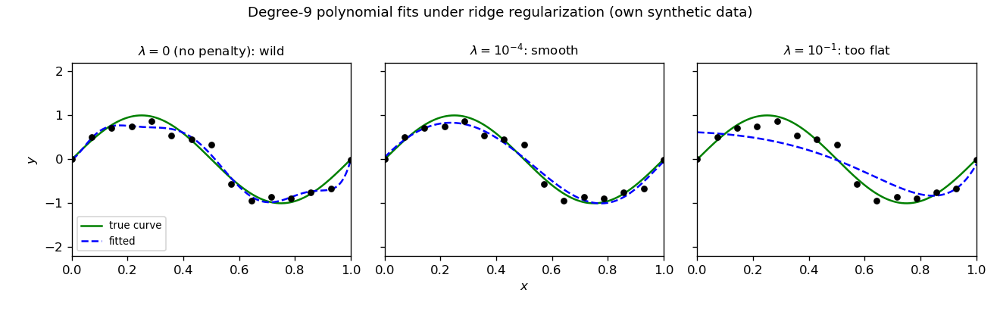
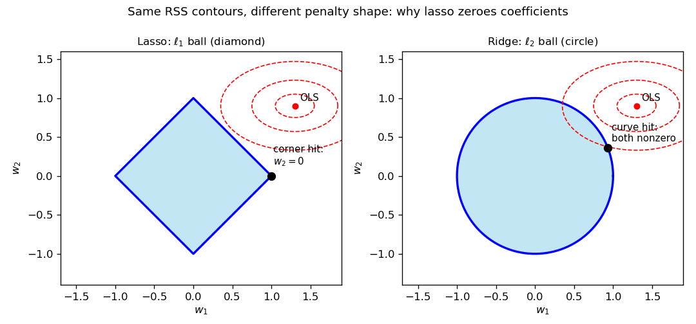
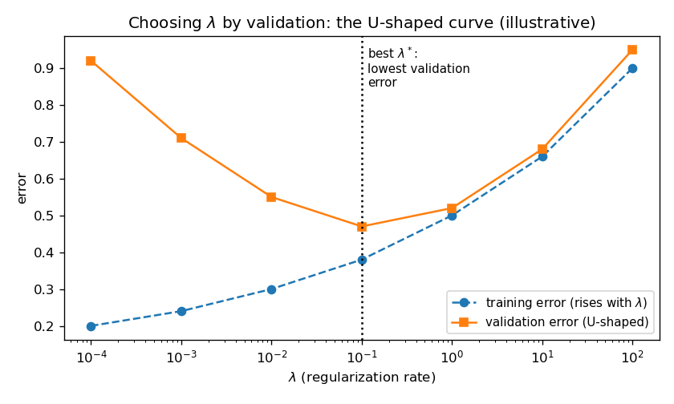

# 28. Regularization: ridge and lasso

§23.10 ended with a promise and a deferral: add a penalty on large parameters to least squares, get ridge regression, and leave the full story — ridge *and* lasso, the bias–variance trade-off, how $\lambda$ is actually chosen — to this chapter. §27.4 already borrowed ridge for kernel regression. This chapter pays both debts. Everything here comes from the MLT Week 3 slides (Ashish Tendulkar) — the regularization block that closes the regression unit — with the practical $\lambda$-selection half from the MLP Week 4 slides.

## 28.1 The problem, restated: overfitting wears big weights

§23.9's verdict: capacity too low ⇒ underfitting; capacity too high ⇒ overfitting. The lecture makes the mechanism concrete with a degree-9 polynomial fit on a small dataset. The fitted weights come out grotesque — $w_4 = -3332.88$, $w_5 = 2993.67$, $w_6 = -1304.04$ — and the lecture's observation is the whole diagnosis:

i) The curve threads every training point (training error $\approx 0$).
ii) Between the points it whipsaws wildly — it memorized the noise, §22.10's memorizer in polynomial costume.
iii) **The signature of the disease is the weights themselves**: higher-degree features carry enormous, cancelling weights. Overfitting *looks like* huge parameters.

**Basically, ...** "The degree-9 curve aced the practice exam and flunked the real one — and you can see the cheating in the weights: thousands, cancelling each other out."

There are two cures (§23.9 named the first): pick a smaller degree $m$ by validation, or **penalize large parameters directly** — keep the degree-9 features, but forbid the weights from exploding. That second cure is regularization.

## 28.2 The fix: charge rent on big weights

**Def (regularized objective).** The lecture modifies the least-squares loss by adding a penalty term:
$$\boxed{J(w) = \tfrac{1}{2}(Xw - y)^T(Xw - y) + \lambda \cdot \text{penalty}}, \qquad \lambda > 0.$$
Two components, and the lecture names both:

i) **The penalty** = a function of the weight vector $w$ — it measures "how big" the weights are.
ii) **The regularization rate $\lambda$** = how much penalty to add — the dial that controls the strength of the cure.

Regularizing changes the loss, so it changes the loss's derivative, so it changes the weight-update rule in gradient descent. That is the entire machinery: one extra term, and both the closed-form solution and the iterative one shift.

**Basically, ...** "Fit the data, but pay a tax on big weights. The tax bill has two parts: *what counts as big* (the penalty) and *the tax rate* ($\lambda$)."

## 28.3 Ridge regression: the $\ell_2$ penalty

**Def (ridge objective).** Ridge uses the squared $\ell_2$ norm of the weight vector as the penalty:
$$\boxed{J(w) = \frac{1}{2}\sum_{i=1}^{n}\big(w^T x^{(i)} - y^{(i)}\big)^2 + \frac{\lambda}{2}\sum_{j=1}^{m} w_j^2}, \qquad \lambda > 0,$$
in vectorized form
$$\boxed{J(w) = \tfrac{1}{2}(Xw - y)^T(Xw - y) + \tfrac{\lambda}{2}\lVert w\rVert_2^2 = \tfrac{1}{2}(Xw - y)^T(Xw - y) + \tfrac{\lambda}{2}w^Tw}.$$

**Note (the $\lambda$ convention, flagged as §27.4 did).** This chapter follows the lecture: the penalty carries $\frac{\lambda}{2}$, so the gradient below comes out clean as $\lambda w$ with no stray factor of 2. §23.10 wrote the penalty as $\lambda\lVert\theta\rVert^2$ and then absorbed the 2 into $\lambda$; §27.4 uses $\frac{\lambda}{2}$ exactly as here. All three are the same objective up to renaming $\lambda$ — the minimizer never cares about the bookkeeping.

**Basically, ...** "Ridge = least squares, plus a tax of $\lambda/2$ on every squared weight. Big weight ⇒ big tax bill ⇒ the optimizer keeps weights small."

## 28.4 The ridge solution, by hand

The lecture differentiates term by term (same steps as §23.3's least-squares gradient, plus the penalty). Expanding,
$$J(w) = \tfrac{1}{2}\big(w^TX^TXw - 2w^TX^Ty + y^Ty + \lambda w^Tw\big),$$
and differentiating each piece (§10.1's recipe):
$$\begin{aligned}
\nabla_w J &= \tfrac{1}{2}\big(2X^TXw - 2X^Ty + 0 + 2\lambda w\big) \\
&= \boxed{\nabla_w J = X^TXw - X^Ty + \lambda w}.
\end{aligned}$$
**Eg (one GD step, fully worked).** Data: one feature, no intercept, points $(x, y) = (1, 2), (2, 3)$; $\lambda = 2$, step size $\alpha = 0.1$, start $w_0 = 0$. The lecture's update is $w_{k+1} := w_k - \alpha\big(X^T(Xw_k - y) + \lambda w_k\big)$. Here $X^TX = 1^2 + 2^2 = 5$ and $X^Ty = 1\cdot 2 + 2\cdot 3 = 8$. Then $w_1 = 0 - 0.1\big(X^T(0 - y) + 0\big) = 0.1 \cdot 8 = 0.8$. One step already walks from $0$ toward the exact answer (Problem 4 checks it against the closed form).

Set the gradient to zero for the closed form:
$$X^TXw - X^Ty + \lambda w = 0 \quad\Longrightarrow\quad \boxed{(X^TX + \lambda I)w = X^Ty},$$
$$\boxed{\hat w_{\text{ridge}} = (X^TX + \lambda I)^{-1}X^Ty}.$$
This is §23.10's compact form, now earned from the lecture's $\frac{\lambda}{2}$ convention. Two endpoints, straight from the lecture:

i) **No regularization.** $\lambda \to 0$: $\hat w \to (X^TX)^{-1}X^Ty$ — the ordinary least-squares solution. The tax is switched off.
ii) **Infinite regularization.** $\lambda \to \infty$: the $\lambda I$ term dominates, $\hat w \to 0$ — every weight taxed into oblivion.

And §23.10's homework result is why the inverse always exists: for $\lambda > 0$ and $z \ne 0$, $z^T(X^TX + \lambda I)z = \lVert Xz\rVert^2 + \lambda\lVert z\rVert^2 > 0$, so $X^TX + \lambda I$ is positive definite — invertible even when $X$'s columns are dependent and plain least squares has infinitely many answers.

**Basically, ...** "Ridge has a formula, not just an algorithm: $(X^TX + \lambda I)^{-1}X^Ty$. Turn $\lambda$ to zero and you get plain least squares back; crank it to infinity and every weight dies to zero."

**Note (the Bayesian reading: ridge = MAP with a Gaussian prior).** §20.12(ii) promised this connection; the MLT lectures never state it — the four lines below are the book's own derivation, from definitions already in Chapters 19–20. Assume Gaussian noise, $y \mid X, w \sim N(Xw, \sigma^2 I)$ (§19.6):
$$\log P(y \mid X, w) = -\frac{1}{2\sigma^2}\|Xw - y\|^2 + c_1.$$
Put a Gaussian prior on the weights, $w \sim N(0, \tau^2 I)$ — "before seeing data, I believe the weights are small":
$$\log f(w) = -\frac{1}{2\tau^2}\|w\|^2 + c_2.$$
MAP (§20.10) maximizes the sum:
$$\hat w_{MAP} = \arg\max_w \left[-\frac{1}{2\sigma^2}\|Xw-y\|^2 - \frac{1}{2\tau^2}\|w\|^2\right] = \arg\min_w \left[\frac{1}{2}\|Xw-y\|^2 + \frac{\sigma^2}{2\tau^2}\|w\|^2\right],$$
exactly the ridge objective (§28.3) with $\boxed{\lambda = \sigma^2/\tau^2}$ — the noise variance over the prior variance. The "tax rate" $\lambda$ suddenly has a meaning: how noisy you think the data is, divided by how strongly you believed the weights should be small. (Lasso's counterpart runs the same four lines with a Laplace prior $f(w_j) \propto e^{-c|w_j|}$, whose log is the $\ell_1$ penalty — stated as the standard counterpart, not derived.)

## 28.5 Gradient descent for ridge

From the gradient, the lecture's update rule:
$$\boxed{w_{k+1} := w_k - \alpha\big(X^T(Xw_k - y) + \lambda w_k\big)}.$$
Read it against §23.3's unregularized update $w_{k+1} := w_k - \alpha X^T(Xw_k - y)$: the only change is the extra $-\alpha\lambda w_k$ — every step, each weight is dragged a little toward zero *in addition* to following the data's gradient. That drag is the tax, collected per-iteration.

**Basically, ...** "Gradient descent with ridge = ordinary gradient descent, plus a small tug toward zero on every step. The tug is $\lambda$-sized."

## 28.6 What $\lambda$ does: shrinkage, then underfitting

The lecture's slide on the effect of $\lambda$ is blunt: **as $\lambda$ increases, the model loses capacity, and for very large $\lambda$ it underfits.** The degree-9 polynomial experiment makes it visible:

<!-- Original matplotlib illustration drawn for this chapter (not reused from any URL): degree-9 polynomial ridge fits on synthetic sin(2*pi*x) data at three lambda values -->

i) $\lambda = 0$: the penalty is off — the wild interpolating curve, §28.1's disease.
ii) Small $\lambda > 0$: weights shrink just enough to kill the whipsaw; the curve tracks the true shape. The sweet spot.
iii) Large $\lambda$: weights crushed toward zero; the fit goes nearly flat and misses the signal — underfitting, exactly as the lecture warns.

**Note.** Shrinking $\ne$ zeroing: ridge makes weights *small*, essentially never *exactly* zero. If you want coefficients killed outright, that is lasso's job (§28.7).

**Basically, ...** "$\lambda$ is a dimmer switch on model flexibility: 0 = blinding overfit, a little = just right, a lot = the model goes blind and underfits."

## 28.7 Lasso: the $\ell_1$ penalty, and exact zeros

**Def (lasso objective).** Lasso swaps the squared penalty for the $\ell_1$ norm:
$$\boxed{J(w) = \tfrac{1}{2}(Xw - y)^T(Xw - y) + \tfrac{\lambda}{2}\lVert w\rVert_1 = \tfrac{1}{2}(Xw - y)^T(Xw - y) + \tfrac{\lambda}{2}\sum_{j=1}^{m}\lvert w_j\rvert}.$$
The lecture is honest about the cost: *estimating the lasso weights needs specialized optimization algorithms, beyond this course's scope* — the $\lvert w_j\rvert$ kink at zero means no clean gradient-and-inverse route like §28.4. (The MLP course just calls sklearn's `Lasso`.)

But the headline property needs no optimizer to state: **lasso sets some coefficients *exactly* to zero.** It does feature selection by itself — out of a pile of candidate features, it keeps a few and discards the rest. Two ways to see why:

i) **The 1-D case (Problem 3 proves it).** With one feature, the lasso solution is the *soft-thresholded* least-squares answer: $\hat w = \mathrm{sign}(\rho)\,(|\rho| - \lambda/2)_+/\lVert x\rVert^2$ with $\rho = x^Ty$. If $|\rho| \le \lambda/2$ — the feature's pull on the data is weaker than the tax — the weight is not shrunk, it is *deleted*: exactly $0$. Ridge's 1-D answer $\rho/(\lVert x\rVert^2 + \lambda)$ only ever shrinks.
ii) **The geometry.** Minimizing $J$ equals minimizing the squared error subject to a penalty budget $\lVert w\rVert \le t$. The $\ell_1$ budget region is a *diamond* — it has corners on the axes. The error contours (ellipses around the OLS point) generically first touch a diamond at a corner, and a corner means some $w_j = 0$. The $\ell_2$ budget is a *ball* — smooth, no corners — so the touch point keeps every coordinate nonzero:

<!-- Original matplotlib illustration drawn for this chapter (not reused from any URL): l1 diamond vs l2 circle with RSS ellipses, corner touch vs smooth touch -->

**Basically, ...** "Ridge puts weights on a diet; lasso fires some of them. The diamond has corners and the circle doesn't — corners are where coordinates are exactly zero."

## 28.8 Ridge vs lasso, side by side

| | Ridge ($\ell_2$) | Lasso ($\ell_1$) |
|---|---|---|
| Penalty | $\frac{\lambda}{2}\lVert w\rVert_2^2$ | $\frac{\lambda}{2}\lVert w\rVert_1$ |
| Closed form | Yes: $(X^TX+\lambda I)^{-1}X^Ty$ | No — specialized optimizers (beyond scope; sklearn in MLP) |
| Effect on weights | Shrinks toward 0, never exactly 0 | Shrinks *and* zeroes: automatic feature selection |
| $\lambda\to 0$ | Least squares | Least squares |
| $\lambda\to\infty$ | All weights $\to 0$ | All weights $\to 0$ |

**Note (elastic net).** The lecture lists a third type — the *combination* of $\ell_1$ and $\ell_2$, elastic net — with no further detail; the MLP slides add its cross-validated estimator `ElasticNetCV`. It inherits lasso's sparsity and ridge's stability, and belongs to the same choose-by-validation discipline as everything in this chapter.

**Basically, ...** "Many correlated features and you want them all, small? Ridge. A pile of features and you suspect only a few matter? Lasso."

## 28.9 The bias–variance trade-off, tied to $\lambda$

§27.10(i) promised this section; here it is, in exactly the terms the sources support. The lecture never writes a bias–variance decomposition formula — what it gives, twice, is the trade-off itself:

i) **Too small $\lambda$** ⇒ the fit bends to every wiggle of *this particular* training sample — the degree-9 whipsaw, the memorizer. The model is over-sensitive to the sample's noise. Call that the **high-variance** end: refit on a fresh sample and the curve swings wildly.
ii) **Too large $\lambda$** ⇒ the fit is too stiff to follow the true shape — the nearly-flat panel, the lecture's "the model loses its capacity… underfits." The model systematically misses the signal no matter the sample. Call that the **high-bias** end.
iii) **The sweet spot** sits between them, and the $\lambda$-vs-validation-error curve (§28.10) draws the trade-off: error falls as the noise-chasing stops, then rises as stiffness sets in. **$\lambda$ is the dial of the trade-off.**

**Note (scope).** The formal $\mathbb{E} = \mathrm{bias}^2 + \mathrm{variance} + \mathrm{noise}$ decomposition is not in these lectures; this section stays with their qualitative reading — flexibility against the sample's noise on one side, stiffness against the signal on the other, $\lambda$ choosing the balance. Nothing here contradicts the formal version; the course simply never states it.

**Basically, ...** "Small $\lambda$ = a nervous student who memorizes the textbook's typos; large $\lambda$ = a student who only learned the chapter headings. You want the one in between — and $\lambda$ picks which student you get."

## 28.10 Choosing $\lambda$: the validation discipline

$\lambda$ is a hyperparameter — §22.10's job (ii), picking the collection, not the parameters. The lecture gives the complete procedure, four steps:

1. **Construct a set of candidate $\lambda$ values** to experiment with (a grid, usually logarithmic: $10^{-4}, 10^{-3}, \ldots, 10^2$).
2. **For each candidate:** train the model, and compute the error on the **validation set** (cross-validation error). Pick the $\lambda$ with the **least validation error**.
3. **Retrain** with the chosen $\lambda$ on the **entire training set**.
4. **Report** the final model's performance on the **test set** — untouched until now (§23.9's discipline, unchanged).

The validation-error curve is typically **bowl-shaped (U-shaped)**: high at tiny $\lambda$ (overfitting end), high at huge $\lambda$ (underfitting end), minimum at the sweet spot. The lecture's own figure finds the most appropriate $\lambda = 0.1$ at the bowl's bottom:

<!-- Original matplotlib illustration drawn for this chapter (not reused from any URL): training error rising with lambda, validation error U-shaped, minimum marked -->

**Note (the MLP practice).** In sklearn the regularization rate is the `alpha` argument — `Ridge(alpha=1e-3)` sets $\lambda = 10^{-3}$ (and `SGDRegressor(alpha=1e-3, penalty='l2')` is the same idea by gradient descent). Doing the four steps by hand for every $\lambda$ is tedious, so the MLP slides point at the estimators that automate step 2: **`RidgeCV` / `LassoCV` / `ElasticNetCV` perform the cross-validated $\lambda$ search internally**, and `GridSearchCV` / `RandomizedSearchCV` generalize the same grid-search pattern to any hyperparameter.

**Basically, ...** "Don't guess $\lambda$ — audition a lineup of them on held-out data, hire the winner, then give it the full training set and report its score on data it has never seen. The U-curve tells you the auditions worked."

## 28.11 Worked example: one tiny dataset, three fits

Setup (deliberately nasty): two *nearly collinear* features, three points, no intercept.
$$x_1 = \begin{pmatrix}1\\2\\3\end{pmatrix},\quad x_2 = \begin{pmatrix}1\\1.9\\3.1\end{pmatrix},\quad y = \begin{pmatrix}2\\4.3\\5.7\end{pmatrix}.$$
Correlation of the columns $\approx 0.997$ — $x_2$ is almost a copy of $x_1$. The sufficient statistics:
$$X^TX = \begin{pmatrix}14 & 14.1\\14.1 & 14.22\end{pmatrix},\qquad X^Ty = \begin{pmatrix}27.7\\27.84\end{pmatrix},\qquad \det(X^TX) = 14\cdot 14.22 - 14.1^2 = 0.27.$$
That tiny determinant is the warning light: $X^TX$ is nearly singular, so plain least squares will be unstable.

**Fit 1 — unregularized ($\lambda = 0$).** $(X^TX)^{-1} = \frac{1}{0.27}\begin{pmatrix}14.22 & -14.1\\-14.1 & 14\end{pmatrix}$, so
$$\hat w_1 = \frac{14.22\cdot 27.7 - 14.1\cdot 27.84}{0.27} = \frac{1.35}{0.27} = 5,\qquad \hat w_2 = \frac{-14.1\cdot 27.7 + 14\cdot 27.84}{0.27} = \frac{-0.81}{0.27} = -3.$$
Predictions: $X\hat w = (5-3,\ 10-5.7,\ 15-9.3)^T = (2, 4.3, 5.7)^T = y$ — training MSE $= 0$. **The trap, exactly as §23.9 warns**: zero training error from weights $(5, -3)$ that violently cancel — one feature's coefficient is large positive, its near-twin's large negative. Any fresh noise would swing this fit wildly.

**Fit 2 — ridge, $\lambda = 1$.** $X^TX + I = \begin{pmatrix}15 & 14.1\\14.1 & 15.22\end{pmatrix}$, $\det = 15\cdot 15.22 - 14.1^2 = 29.49$:
$$\hat w_1 = \frac{15.22\cdot 27.7 - 14.1\cdot 27.84}{29.49} = \frac{29.05}{29.49} \approx 0.985,\qquad \hat w_2 = \frac{-14.1\cdot 27.7 + 15\cdot 27.84}{29.49} = \frac{27.03}{29.49} \approx 0.917.$$
Predictions $\hat y \approx (1.902,\ 3.712,\ 5.797)^T$; residuals $\approx (-0.098,\ -0.588,\ 0.097)$; training MSE $\approx 0.122$. The wild $(5,-3)$ collapsed to a calm $(0.985, 0.917)$ — both features share the load, same sign, no cancellation. Push further to $\lambda = 5$: $\hat w \approx (0.841, 0.832)$, MSE $\approx 0.515$ — shrinkage deepening, error rising: the underfitting end of §28.6.

**Fit 3 — lasso, $\lambda = 1$.** No closed form, so coordinate descent with soft-thresholding (threshold $\lambda/2 = 0.5$; column norms $\lVert x_1\rVert^2 = 14$, $\lVert x_2\rVert^2 = 14.22$). Start $w = (0,0)$:
- Sweep 1: $w_1 \gets S(27.7,\, 0.5)/14 = 27.2/14 = 68/35 \approx 1.943$; then $w_2 \gets S(27.84 - 14.1\cdot 1.942857,\, 0.5)/14.22 = S(0.4457,\, 0.5)/14.22 = 0$ — below threshold, *deleted*.
- Sweep 2: $w_1$ recomputes to the same $1.943$; $w_2$ stays $0$. Converged: $\boxed{\hat w = (1.943,\ 0)^T}$.

Check (KKT): gradient of the squared-error half at $\hat w$ is $X^T(X\hat w - y) \approx (-0.5,\ -0.4457)^T$; for $w_1 \ne 0$ this equals $-\frac{\lambda}{2}\mathrm{sign}(w_1) = -0.5$ ✓, and $|{-0.4457}| \le 0.5 = \lambda/2$ permits $w_2 = 0$ ✓. Training MSE $\approx 0.064$. The redundant twin feature is gone — sparsity, on a hand-checkable example.

| Fit | $\hat w_1$ | $\hat w_2$ | Train MSE | Reading |
|---|---|---|---|---|
| OLS ($\lambda=0$) | $5$ | $-3$ | $0$ | Memorizer: exact on training, unstable weights |
| Ridge $\lambda=1$ | $0.985$ | $0.917$ | $0.122$ | Shrunk: stable, shares load across twins |
| Ridge $\lambda=5$ | $0.841$ | $0.832$ | $0.515$ | Over-shrunk: sliding toward underfit |
| Lasso $\lambda=1$ | $1.943$ | $0$ | $0.064$ | Sparse: redundant feature deleted |

**Basically, ...** "Same three points, three personalities: OLS memorized them with crazy cancelling weights, ridge calmed both weights down, lasso fired the redundant feature outright."

## 28.12 Where this goes next

i) **Ridge, kernelized.** §27.4–§27.6 already ran this chapter's ridge objective through the kernel trick: $(K + \lambda I)\alpha = y$. Regularization is what keeps that infinite-dimensional fit solvable and honest.
ii) **The $\lambda$ discipline generalizes.** Everything in §28.10 — candidates, validation error, retrain, test — is §22.10's model-selection job (ii) in full; later chapters reuse it for every hyperparameter, not just $\lambda$.
iii) **Priors, derived.** §20.12(ii) promised that ridge's penalty has a probabilistic reading — MAP with a Gaussian prior. The MLT lectures never state that connection, so §28.4 derives it as the book's own four-line argument (not a lecture claim): with Gaussian noise and a $N(0, \tau^2 I)$ prior on $w$, the MAP estimate is exactly the ridge objective, with $\lambda = \sigma^2/\tau^2$.

## Problem set

1. **Ridge gradient, by hand.** For $J(w) = \tfrac{1}{2}(Xw - y)^T(Xw - y) + \tfrac{\lambda}{2}w^Tw$: (i) expand $J$ fully; (ii) differentiate term by term to get $\nabla_w J = X^TXw - X^Ty + \lambda w$; (iii) write the stationary condition as $(X^TX + \lambda I)w = X^Ty$.
2. **The two endpoints.** From $\hat w_{\text{ridge}} = (X^TX + \lambda I)^{-1}X^Ty$: (i) argue that as $\lambda \to 0$, $\hat w \to (X^TX)^{-1}X^Ty$ (assume $X^TX$ invertible); (ii) argue that as $\lambda \to \infty$, $\hat w \to 0$. One line each, citing which term dominates.
3. **Soft-thresholding in 1-D.** Single feature $x \in \mathbb{R}^n$, no intercept: $J(w) = \tfrac{1}{2}\lVert xw - y\rVert^2 + \tfrac{\lambda}{2}\lvert w\rvert$, $w \in \mathbb{R}$. With $\rho = x^Ty$: (i) show the minimizer is $\hat w = \mathrm{sign}(\rho)\,(|\rho| - \lambda/2)_+/\lVert x\rVert^2$, where $(z)_+ = \max(z, 0)$; (ii) contrast with ridge's 1-D answer $\hat w_{\text{ridge}} = \rho/(\lVert x\rVert^2 + \lambda)$ — when does lasso give *exactly* zero while ridge never does?
4. **One GD step vs the closed form.** Data $(x, y) = (1,2), (2,3)$, one feature, no intercept; $\lambda = 2$, $\alpha = 0.1$, $w_0 = 0$. (i) Compute $w_1$ from the lecture's update $w_{k+1} := w_k - \alpha\big(X^T(Xw_k - y) + \lambda w_k\big)$. (ii) Compute the exact ridge $\hat w$ from §28.4 and say whether $w_1$ moved toward it.
5. **Read a $\lambda$ table.** A grid search reports:

   | $\lambda$ | $10^{-4}$ | $10^{-3}$ | $10^{-2}$ | $10^{-1}$ | $1$ | $10$ |
   |---|---|---|---|---|---|---|
   | Train MSE | $0.20$ | $0.24$ | $0.30$ | $0.38$ | $0.50$ | $0.66$ |
   | Validation MSE | $0.92$ | $0.71$ | $0.55$ | $0.47$ | $0.52$ | $0.68$ |

   (i) Which $\lambda$ does the lecture's procedure pick, and why? (ii) Why is "pick the $\lambda$ with smallest *training* MSE" wrong — name the section that explains the trap. (iii) After picking, what are the next two steps before reporting?
6. **Why the diamond zeroes and the ball doesn't.** In one paragraph, using the soft-thresholding result of Problem 3 and the §28.7 figure: explain why the $\ell_1$ penalty produces *exactly* zero coefficients while the $\ell_2$ penalty only shrinks them.
7. **sklearn practice (MLP slides).** (i) In `Ridge(alpha=1e-3)`, what does `alpha` correspond to in this chapter's notation? (ii) What do `RidgeCV` / `LassoCV` automate from §28.10's four steps? (iii) Name the lecture's third regularization type and its CV estimator from the MLP slides.
