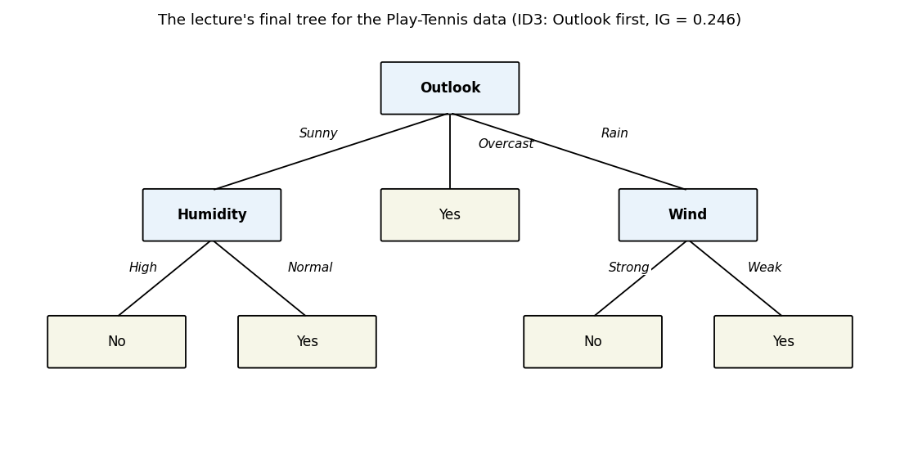

# 29. KNN and decision trees

Two classifiers from the MLT lectures, and a study in opposites. KNN (Week 7 slides) never builds a model at all — it keeps the whole training set and decides each new point by asking its neighbours. Decision trees (Week 9 slides) do the reverse: they compress the training set into an explicit set of if-then rules — a partition of the feature space — and throw the data away at prediction time. Both are §22.9 classifiers ($f: \mathbb{R}^d \to \{\text{classes}\}$), both handle regression too (the lectures say so for each), and both carry a complexity hyperparameter — $k$ for KNN, tree size/depth for trees — chosen by exactly the discipline §28.12(ii) promised would generalize: §28.10's candidates → validation error → retrain → test, applied to every hyperparameter, not just $\lambda$.

Everything in §§29.2–29.8 comes from the MLT Week 7 KNN slides; §§29.9–29.21 from the MLT Week 9 decision-tree slides (Dr. Ashish Tendulkar). The hand-worked examples in §§29.5 and 29.13 use the chapter's own tiny datasets, with every number recomputed independently (review log); the lecture's Play-Tennis numbers in §29.14 are verified, not copied blind.

**Notation.** The lectures write the $i$-th example as $x^{(i)}$ (superscript, §22's convention) with label $y^{(i)}$; $x_j^{(i)}$ is feature $j$ of example $i$. $D = \{(x^{(i)}, y^{(i)})\}_{i=1}^n$ is the training set. A tree node covers a region $R_i$ holding $N_i$ samples.

## 29.1 The task both solve: §22.9 classification

**Setup.** Same as §22.9: instances $x^{(i)} \in \mathbb{R}^d$, but the labels are discrete — $\boxed{y^{(i)} \in \{1, \ldots, K\}}$ for $K$ classes (the tree lectures write it this way; §22.9's $\pm 1$ is the $K = 2$ case). The algorithm outputs $\boxed{f: \mathbb{R}^d \to \{1, \ldots, K\}}$.

i) **The loss is still §22.9's.** Misclassification fraction $L(f) = \tfrac1n \sum_i \mathbf{1}(f(x^{(i)}) \ne y^{(i)})$ — fraction wrong. KNN and trees just carve the input space into class regions differently than a linear separator does: not one straight cut (§22.9), but many small local decisions.
ii) **Both also do regression.** Each lecture says so explicitly: KNN averages neighbours' outputs (§29.4), trees fit a constant per region (§29.15). The chapter leads with classification because both lectures do.

**Basically, ...** "§22.9's game — predict a discrete label, count your mistakes — played two new ways: KNN asks 'who are this point's neighbours?', trees ask 'which box does this point fall in?'."

## 29.2 KNN: the algorithm — no model, just neighbours

**Def (k-nearest neighbours).** KNN is a **supervised** algorithm for classification and regression. It is an **instance-based** learning technique: **there is no explicit model**. To label a new example, KNN compares it with the existing training examples, finds the $k$ **nearest neighbours**, and assigns an output based on those neighbours' labels.

i) **The key insight** (the lecture's one-liner): *"An example is labeled by the company it keeps."* A new point inherits the majority opinion of its neighbourhood.
ii) **Two hyperparameters** (the lecture names exactly two): **how many neighbours ($k$)** to consult, and **which distance metric** to compare examples with (§29.3).
iii) **Nothing is learned up front.** Training = storing the dataset. All the work happens when a prediction is requested — the lecture's limitation (i) in §29.8 is exactly this.

**Basically, ...** "KNN doesn't study for the exam — it brings the textbook into the hall. New point arrives, it measures distances to every stored point, takes a vote among the $k$ closest, done. The only decisions you make: how many voters ($k$) and what 'close' means (the metric)."

## 29.3 The distance metric: what "near" means

Following the lecture, the two metrics used quite often, for points $x^{(1)}, x^{(2)}$ with $m$ features:

**Def (Euclidean distance).**
$$\boxed{\delta(x^{(1)}, x^{(2)}) = \sqrt{(x_1^{(1)} - x_1^{(2)})^2 + \cdots + (x_m^{(1)} - x_m^{(2)})^2} = \left(\sum_{j=1}^{m} (x_j^{(1)} - x_j^{(2)})^2\right)^{\!1/2}}$$
Vectorized: $\boxed{\delta = \big((x^{(1)} - x^{(2)})^T (x^{(1)} - x^{(2)})\big)^{1/2}}$ — the ordinary straight-line distance, §2-style.

**Def (Manhattan distance).**
$$\boxed{\delta(x^{(1)}, x^{(2)}) = |x_1^{(1)} - x_1^{(2)}| + \cdots + |x_m^{(1)} - x_m^{(2)}| = \sum_{j=1}^{m} |x_j^{(1)} - x_j^{(2)}|}$$
Vectorized (the lecture's form): $\boxed{\delta = \mathbf{1}_{1 \times m}^T\, |x^{(1)} - x^{(2)}|_{m \times 1}}$ — sum of absolute per-feature gaps: the "city-block" walk, no diagonals.

i) **The metric is a hyperparameter** (§29.2(ii)): the lecture lists it alongside $k$, with no selection procedure given — in practice it joins $k$ in the §29.7 audition (Problem 2 shows it can flip a prediction).
ii) **Every feature counts** — which is also the sensitivity the lecture warns about (§29.8): all $m$ features enter the sum, relevant or not.

**eg 1 (both metrics, one pair).** $x^{(1)} = (1, 2)$, $x^{(2)} = (4, 6)$: Euclidean $\sqrt{9 + 16} = \boxed{5}$; Manhattan $|{-3}| + |{-4}| = \boxed{7}$.

**Basically, ...** "Euclidean = as the crow flies (square each gap, add, square-root). Manhattan = as the taxi drives (add the raw gaps). Both turn 'how alike are these two examples?' into one number — and that number is the whole algorithm's raw material."

## 29.4 Voting (classification) and averaging (regression)

**Classification.** The $k$ neighbours take part in voting; **the class that receives the highest number of votes is the predicted class** (majority vote).

**Regression.** The prediction is the **average** of the neighbours' outputs:
$$\boxed{\hat y = \frac{1}{k}\sum_{i=1}^{k} y_i}.$$

**eg 2 (regression, by hand).** A new house's $k = 3$ nearest neighbours (by area, bedrooms, …) sold for $2.0$, $3.5$, $6.5$ (₹ crore): $\hat y = \tfrac13(2.0 + 3.5 + 6.5) = \boxed{4.0}$.

i) **Vote for labels, average for numbers.** Discrete $y^{(i)}$ → count; real $y^{(i)}$ → mean. Same neighbours, different aggregation.
ii) **Ties are the lecture's silence.** With even $k$ (or $k \to n$ on balanced classes) the vote can tie; the slides prescribe no tie-break — flagged in the review log, and the chapter's examples keep strict majorities.

**Basically, ...** "Classification: the neighbours vote, majority wins. Regression: the neighbours' numbers get averaged. That's the entire 'model' — there isn't one."

## 29.5 Worked: 3-NN on seven 2-D points

Data (class $A$ = blue, $B$ = red), query points $q = (2,2)$, $q_2 = (4,2)$:
$$A_1=(0,0),\; A_2=(1,4),\; A_3=(3,1),\qquad B_1=(5,2),\; B_2=(4,5),\; B_3=(6,3),\; B_4=(7,2).$$
Euclidean distance, squared (comparing squares orders the same as roots):

| neighbour | $d^2(q, \cdot)$ | $d^2(q_2, \cdot)$ |
|---|---|---|
| $A_1$ | $(2)^2+(2)^2 = 8$ | $(4)^2+(2)^2 = 20$ |
| $A_2$ | $(1)^2+(2)^2 = 5$ | $(3)^2+(2)^2 = 13$ |
| $A_3$ | $(1)^2+(1)^2 = 2$ | $(1)^2+(1)^2 = 2$ |
| $B_1$ | $(3)^2+(0)^2 = 9$ | $(1)^2+(0)^2 = 1$ |
| $B_2$ | $(2)^2+(3)^2 = 13$ | $(0)^2+(3)^2 = 9$ |
| $B_3$ | $(4)^2+(1)^2 = 17$ | $(2)^2+(1)^2 = 5$ |
| $B_4$ | $(5)^2+(0)^2 = 25$ | $(3)^2+(0)^2 = 9$ |

**The $k = 3$ vote.** For $q$: nearest are $A_3$ ($2$), $A_2$ ($5$), $A_1$ ($8$) — three $A$ votes → $\boxed{\text{predict } A}$. For $q_2$: nearest are $B_1$ ($1$), $A_3$ ($2$), $B_3$ ($5$) — two $B$, one $A$ → $\boxed{\text{predict } B}$.

**Boundary reasoning.** Every plane point gets the majority label of its 3 nearest training points, so the plane splits into an $A$-region (around the blue cluster) and a $B$-region (around the reds) — the shaded regions in the figure. $q$ sits inside $A$'s region, $q_2$ inside $B$'s; the boundary threads between them.

<!-- Original matplotlib illustration drawn for this chapter (not reused from any URL): the seven training points of the worked example with 1-NN vs 5-NN decision regions, query points q and q2, and q's three nearest neighbours circled -->

**Basically, ...** "Measure seven distances, sort, take the top three, count the colours. $q$'s three closest are all blue — lands in the blue zone. $q_2$'s are two red, one blue — lands red. The coloured zones in the figure are just this vote repeated for every point of the plane."

## 29.6 Decision boundaries: what $k$ does to the shape

Run the §29.5 vote at every plane point and the class regions emerge — the **decision boundary** is where the vote flips. The lecture's panels (boundaries for $k = 9, \ldots, 16$ on its demo data) and the figure above agree on the pattern:

i) **Small $k$ ($1$, $2$): jagged, overfit.** The model is **sensitive to noise** — it adjusts to tiny wiggles in the data, and the boundary turns very jagged (left panel above: each training point carves its own intricate cell).
ii) **Large $k$: smooth, underfit.** The model gets **biased** — it ignores the underlying trend, and the boundary smooths out (right panel: one calm curve).
iii) **$k \to n$: majority rules everything.** As $k$ approaches the dataset size, the neighbourhood *is* the dataset, so the model predicts the **majority class for every possible example** — on §29.5's data ($3$ $A$ vs $4$ $B$), $k = 7$ labels the entire plane $B$.

**Note (the $k = 1$ boundary, the book's own observation — not a lecture claim).** With $k = 1$ each plane point takes the label of its single nearest training point, so the boundary is exactly the Voronoi tessellation of the training set: each point owns the cell of plane closest to it. "Voronoi-like" is this, softened for larger $k$ — every KNN boundary is **piecewise**, built from distance comparisons, never a single straight cut like §22.9's separator.

**Basically, ...** "$k$ is a smoothness knob. Twist it to 1: the boundary hugs every training point, noise included — jagged memorization. Twist it up: the boundary relaxes into a smooth curve — and at the extreme it gives up and calls everything the majority class. Small $k$ overfits, large $k$ underfits: the same U-story as §28.9's $\lambda$."

## 29.7 Choosing $k$: §28.10's discipline, reused

$k$ is a hyperparameter (§29.2(ii)) — so §28.12(ii) applies verbatim: run §28.10's four steps with $k$ in $\lambda$'s seat:

1. **Candidates** — a grid of $k$ values ($1, 2, \ldots$).
2. **Validation error** — train (store) on the training split, score each $k$ on held-out data; pick the $k$ with the **least validation error**.
3. **Retrain** on the full training set with the winning $k$.
4. **Report** on the test set, untouched until now.

i) **The lecture's chart is this procedure's output.** Its "Error vs $k$" plot (error rate against $k = 1, \ldots, 16$) dips and rises; the lecture's rule: *"The value $k$ that yields minimum test error is most suitable."*
ii) **"Test" vs "validation" — a wording note.** The slide says *test* error; the book's standing discipline (§22.10, §28.10) selects on *validation* data and reserves the test set for the final report — selecting on the test set would spend it. The curve's shape and the rule's spirit are the lecture's; the split hygiene is §28.10's (flagged in the review log).

**Basically, ...** "Don't guess $k$ — audition $1, 2, 3, \ldots$ on held-out data and hire the one with the smallest error, exactly the §28.10 ritual from the $\lambda$ chapter. The error-vs-$k$ curve is the audition scorecard."

## 29.8 KNN: strengths and limits (as the lecture lists them)

**Advantages.**
i) **Easy to understand and implement** — the whole algorithm is §29.2–§29.4.
ii) **Interpretable predictions** — a prediction can be *explained by its neighbours* ("you're class $A$ because your 3 nearest stored examples are $A$").

**Limitations.**
i) **Slow at prediction time on large training sets** — all computations are performed at runtime (§29.2(iii)): every query measures distance to every stored point.
ii) **Sensitive to redundant or irrelevant features** — all $m$ features enter the distance sum (§29.3(ii)), so junk features vote as loudly as signal.
iii) **Outperformed on hard tasks** — on significantly difficult problems it can lose to SVMs and neural networks (the lecture's words).

**Basically, ...** "KNN's pitch: trivial to build, and every answer comes with its receipts (the neighbours). KNN's price: it does all its work at query time, it can't tell signal features from noise, and on genuinely hard problems the heavy machinery wins."

## 29.9 Decision trees: recursive partitioning

**Def.** Decision trees are **non-parametric supervised** methods for classification and regression. **Tree-based methods partition the feature space into a set of rectangles (or cuboids) and then fit a simple model (like a constant) in each one.** Conceptually simple yet powerful; a **binary** tree splits into two branches at each node.

i) **Partition, then predict.** The tree asks a sequence of yes/no questions about the features; each root-to-leaf path carves out one rectangle of feature space, and every point landing in the same leaf gets the same prediction (majority class, or region mean — §§29.13, 29.15).
ii) **Non-parametric** = no fixed parameter vector sized by the modeller: the tree's shape *is* the model, and it grows with the data (contrast §23's fixed $w$).
iii) **Three questions drive everything** (the lecture poses them up front): **which attribute** to split on? **what splitting criterion**? **what tree size** is optimal? — §§29.10–29.12, §29.16, and §§29.17–29.19 answer them in order.

**Basically, ...** "A decision tree plays twenty questions with the features: 'is outlook sunny?' → yes → 'is humidity high?' → … Each answer narrows down a rectangle of the feature space until the tree reaches a leaf and announces the verdict for everyone inside that box. The learning is choosing the questions."

## 29.10 ID3: the greedy top-down algorithm

Most tree-learning algorithms are variations of one core algorithm, **ID3** (Iterative Dichotomizer 3). It employs a **top-down, greedy search** through the space of possible trees.

**The procedure.** Start with the question *"which attribute should be tested at the root of the tree?"* — each attribute is evaluated with some measure of how well it alone classifies the training examples (§§29.11–29.12):
1. **Select the best attribute**, split at the root node.
2. **Create one descendant per possible value** of that attribute; send each training example to the matching descendant.
3. **Repeat recursively** on each descendant's examples — pick the best attribute for *that* subset, split again.

i) **Greedy = never backtracks.** Once an attribute is chosen at a node, the algorithm never reconsiders earlier choices — it takes the locally best split at every step and hopes the tree comes out acceptable.
ii) **Stopping criterion** — recursion on a subset stops when:
   - every element in the subset belongs to the **same class** → leaf, labelled with that class;
   - **no attributes remain** but classes still mix → leaf, labelled with the **most common class** of the subset;
   - the subset is **empty** (no training example matched that attribute value).

**Basically, ...** "ID3 builds the tree like you'd actually interrogate a dataset: at each node ask the single most revealing question (§29.12 scores 'revealing'), branch on every possible answer, and repeat inside each branch. It never second-guesses an old question — greedy, one pass down. Stop when a branch is pure, out of questions, or empty."

## 29.11 Measuring impurity: how mixed is this node?

Let $p_{i,k}$ be the **proportion of data points in node $i$** (region $R_i$) **assigned to class $k$** ($k = 1, \ldots, K$):
$$\boxed{p_{i,k} = \frac{1}{N_i}\sum_{x^{(i)} \in R_i} \mathbf{1}(y^{(i)} = k)}, \qquad N_i = \text{samples in } R_i.$$
Three ways to score a node's impurity:

**Misclassification error.** The fraction misclassified if the node predicts its majority class:
$$\boxed{Q_i(T) = 1 - p_{i,k(i)} = \frac{1}{N_i}\sum_{x^{(i)} \in R_i} \mathbf{1}(y^{(i)} \ne k(i))}, \qquad k(i) = \arg\max_k p_{i,k}.$$

**Gini index.**
$$\boxed{G_i = \sum_{k=1}^{K} p_{i,k}(1 - p_{i,k})}$$
Two readings (both the lecture's): (a) instead of predicting the majority class, predict class $k$ **with probability** $p_{i,k}$ — the training error rate of that randomized rule *is* the Gini index; (b) code each observation as $1$ for class $k$ and $0$ otherwise — the variance of that 0–1 response over the node is $p_{i,k}(1 - p_{i,k})$, and summing over classes gives Gini again.

**Entropy.**
$$\boxed{H_i = -\sum_{k=1}^{K} p_{i,k}\log_2 p_{i,k}}$$
$0$ for a pure node, maximal ($\log_2 K$) for a perfectly mixed one.

i) **All three are $0$ iff the node is pure** and grow as the mix evens out — they agree on "pure vs mixed", differ in *how much* they care about shades of mixing (§29.16, Problem 7).
ii) **ID3's original choice is entropy** (via §29.12); CART's classification trees (§29.16) default to Gini.

**eg 3 (all three, one node).** Node with $6$ of class $+$ and $2$ of class $-$ ($p = \tfrac34, \tfrac14$): misclassification $1 - \tfrac34 = \boxed{\tfrac14}$; Gini $\tfrac34\cdot\tfrac14 + \tfrac14\cdot\tfrac34 = \boxed{\tfrac38}$; entropy $-\tfrac34\log_2\tfrac34 - \tfrac14\log_2\tfrac14 \approx \boxed{0.811}$.

**Basically, ...** "Impurity = 'how mixed is the class soup in this node?' Three thermometers: misclassification ('fraction I'd get wrong betting the majority'), Gini ('error rate if I guessed randomly *in proportion* to the mix'), entropy ('the information-theory measure of mixed-up-ness'). Pure node → all read zero."

## 29.12 Information gain: the splitting score

**Def.** Information gain is the expected **reduction in entropy** from partitioning the examples by an attribute — how much the split un-mixes the soup:
$$\boxed{IG(S, A) = \mathrm{Entropy}(S) - \sum_{v \in \mathrm{Values}(A)} \frac{|S_v|}{|S|}\,\mathrm{Entropy}(S_v)},$$
where $S_v$ = the examples with $A = v$. In words (the lecture's): $IG(\text{attr}) = \text{entropy of dataset} - \text{entropy of attribute}$ — the weighted child entropy subtracted from the parent's.

**ID3's rule:** compute $IG$ (equivalently, the child entropy) for each remaining attribute; **split on the attribute with the largest information gain** — equivalently, the smallest weighted child entropy.

i) **Gain $\ge 0$ always**: a split can't increase the weighted entropy — at worst it teaches nothing ($IG = 0$).
ii) **Why entropy and not misclassification for growing?** Preview of §29.16: entropy/Gini react to *any* probability shift, misclassification only to majority flips — the growing phase wants the sensitive instrument.

**Basically, ...** "Information gain = 'how much less mixed-up do things get if I split on this attribute?' Compute the parent's entropy, subtract the size-weighted average of the children's entropies. Biggest drop wins the split. It's the scoreboard that answers ID3's root question."

## 29.13 Worked: one full split computation by hand

Ten labelled items (defective $-$ vs ok $+$ widgets), two categorical features:

| # | colour | size | label |
|---|---|---|---|
| 1–3 | red | big | $+,+,+$ |
| 4–5 | red | small | $-,-$ |
| 6 | blue | big | $+$ |
| 7–8 | blue | big | $-,-$ |
| 9–10 | blue | small | $-,-$ |

**Parent entropy.** $4$ $+$, $6$ $-$:
$$H(S) = -\tfrac{4}{10}\log_2\tfrac{4}{10} - \tfrac{6}{10}\log_2\tfrac{6}{10} \approx 0.529 + 0.442 = \boxed{0.971}.$$

**Split on size.** Big: $4$ $+$, $2$ $-$ → $H = -\tfrac23\log_2\tfrac23 - \tfrac13\log_2\tfrac13 \approx 0.918$. Small: $0$ $+$, $4$ $-$ → $H = 0$ (pure). Weighted: $\tfrac{6}{10}(0.918) + \tfrac{4}{10}(0) = 0.551$.
$$\boxed{IG(S, \text{size}) = 0.971 - 0.551 = 0.420}.$$

**Split on colour.** Red: $3$ $+$, $2$ $-$ → $H \approx 0.971$. Blue: $1$ $+$, $4$ $-$ → $H = -\tfrac15\log_2\tfrac15 - \tfrac45\log_2\tfrac45 \approx 0.722$. Weighted: $\tfrac{5}{10}(0.971) + \tfrac{5}{10}(0.722) = 0.846$.
$$\boxed{IG(S, \text{colour}) = 0.971 - 0.846 = 0.125}.$$

Size wins ($0.420 > 0.125$) → **root splits on size**. Small branch: pure $-$ → leaf "$-$". Big branch ($4$ $+$, $2$ $-$, $H = 0.918$): split on colour — red-big $+,+,+$ → leaf "$+$"; blue-big $+,-,-$ → mixed, no attributes left → leaf with the most common class, $\boxed{-}$. Final tree: size=small → $-$; size=big → colour=red → $+$, colour=blue → $-$.

**Gini cross-check** (same verdict): $G(S) = 1 - 0.4^2 - 0.6^2 = 0.48$; size-split weighted Gini $\tfrac{6}{10}\big(1 - (\tfrac46)^2 - (\tfrac26)^2\big) + 0 = 0.267$; Gini gain $\boxed{0.213}$ — again the biggest drop, so Gini would also pick size first.

**Basically, ...** "Score both questions: 'split by size?' un-mixes the soup by $0.42$ bits, 'split by colour?' by only $0.125$. Ask the size question first. The small branch is pure — done. The big branch still mixes, so ask colour inside it; blue-and-big ends $1$-to-$2$ against, so the leaf calls it $-$ by majority. Two questions, three leaves, every number above recomputed twice."

## 29.14 The lecture's tennis example (numbers verified)

The slides work ID3 on the classic Play-Tennis data: $14$ examples, $9$ "Yes" / $5$ "No". Recomputed independently (review log) — the lecture's rounded values check out:

$$H(S) = -\tfrac{9}{14}\log_2\tfrac{9}{14} - \tfrac{5}{14}\log_2\tfrac{5}{14} \approx \boxed{0.940}.$$

| attribute | split counts | $IG$ |
|---|---|---|
| Wind | weak $6$Y/$2$N ($H=0.811$), strong $3$Y/$3$N ($H=1$) | $0.940 - \tfrac{8}{14}(0.811) - \tfrac{6}{14}(1) = \boxed{0.048}$ |
| **Outlook** | sunny $2$Y/$3$N ($0.971$), overcast $4$Y/$0$N ($0$), rain $3$Y/$2$N ($0.971$) | $0.940 - \tfrac{5}{14}(0.971) - \tfrac{4}{14}(0) - \tfrac{5}{14}(0.971) = \boxed{0.246}$ |
| Temperature | cold $3$Y/$1$N ($0.811$), mild $4$Y/$2$N ($0.918$), hot $2$Y/$2$N ($1$) | $\boxed{0.029}$ |
| Humidity | high $3$Y/$4$N ($0.985$), normal $6$Y/$1$N ($0.593$) | $\boxed{0.151}$ |

Outlook's $0.246$ is the largest → **root = Outlook**. Recursing the same way inside each branch gives the lecture's final tree:

<!-- Original matplotlib rendering drawn for this chapter of the lecture's final Play-Tennis tree (not reused from any URL): Outlook at root; Sunny->Humidity->(High: No, Normal: Yes); Overcast: Yes; Rain->Wind->(Strong: No, Weak: Yes) -->

**Basically, ...** "Four candidate questions, four scores: Outlook un-mixes the most ($0.246$ bits), so it goes at the top. Same scoring inside each branch grows the rest. The picture is the whole classifier — follow the answers down to a leaf."

## 29.15 CART: regression trees — constants per region

CART models **both** regression and classification, learning classification trees very much like ID3 (§29.16). For regression, suppose the space is partitioned into $M$ regions $R_1, \ldots, R_M$, with a **constant** $c_i$ predicted in each:
$$\boxed{\hat y = \sum_{i=1}^{M} c_i\,\mathbf{1}(x \in R_i)}$$
($\mathbf{1}(\cdot)$ is the indicator). Learning = choosing the partition *and* the constants. Three sub-questions (the lecture's): which variable splits each node? what threshold $s$? what constant $c_i$ per region?

**The greedy answer.** Fixing a partition and minimizing the sum-of-squares $J = \sum_{i=1}^{n}(y^{(i)} - \hat y^{(i)})^2$ is easy — but the *best binary partition* for minimum SSE is computationally infeasible, so CART goes greedy: start with all data, consider splitting variable $j$ at split point $s$ into half-planes
$$\boxed{R_1 = \{x \mid x_j \le s\},\qquad R_2 = \{x \mid x_j > s\}}$$
and solve
$$\boxed{\min_{j,s}\left[\min_{c_1}\sum_{i:\,x^{(i)} \in R_1}(y^{(i)} - c_1)^2 + \min_{c_2}\sum_{i:\,x^{(i)} \in R_2}(y^{(i)} - c_2)^2\right]}.$$

**The inner minimum is the mean** (differentiate $\sum (y^{(i)} - c_1)^2$ w.r.t. $c_1$: $-2\sum(y^{(i)} - c_1) = 0$):
$$\boxed{\hat c_1 = \frac{1}{N_1}\sum_{i:\,x^{(i)} \in R_1} y^{(i)}},\qquad \boxed{\hat c_2 = \frac{1}{N_2}\sum_{i:\,x^{(i)} \in R_2} y^{(i)}}$$
— the region averages, exactly k-means' centroid logic (§26.3(i)) in new clothes. For each variable, the best $(j, s)$ is found by scanning through the inputs; then partition, and **repeat the splitting process on each resulting region**.

i) **Variance reduction** can replace SSE as the splitting score for regression trees (the lecture's one-line alternative).
ii) **ID3 vs CART splits.** ID3 branches one-per-attribute-value (multiway, categorical); CART always splits **binary** on $x_j \lessgtr s$ — even categorical-looking splits become thresholded binaries.

**eg 4 (region means).** Region $R_1$ holds outputs $\{2, 4, 6\}$: $\hat c_1 = \tfrac{12}{3} = \boxed{4}$ — the constant that minimizes that region's SSE (check: $(2-4)^2 + 0 + (6-4)^2 = 8$; any other $c$ scores worse).

**Basically, ...** "CART for numbers: chop the space into boxes, predict each box's average. To choose where to chop, try every variable and every cut point, score each by 'sum of squared misses around the two boxes' averages', keep the best cut, repeat inside each box. The box's prediction is just its average — calculus says so in one line."

## 29.16 Classification trees: swap the loss, keep the growing

For classification, growing (and pruning) works the same — except SSE is replaced by a node-impurity measure. With $p_{i,k}$ from §29.11, classify node $i$'s observations as class $k$ if
$$\boxed{p_{i,k} > p_{i,j}\quad \forall\, j \ne k}$$
— the majority class, §29.10's leaf rule in symbols.

**Which impurity $Q_i(T)$?** The lecture lists three — **misclassification error, Gini index, cross-entropy** — with a division of labour:
i) **For growing the tree: Gini or cross-entropy.** Both are differentiable, hence more amenable to numerical optimization — and, more importantly, **more sensitive to node probabilities** than the misclassification rate (Problem 7 exhibits the gap: two splits with identical misclassification error but different Gini).
ii) **For pruning the tree: misclassification rate.** Once the tree exists and the question is which branches to cut (§29.19), the plain error rate is the criterion.

**Basically, ...** "Classification CART = regression CART with the squared-error score swapped for an impurity score. Grow with the sensitive instruments (Gini/cross-entropy — they notice probability shifts the raw error rate sleeps through); prune with the honest one (plain misclassification). The leaf's verdict is always the majority class."

## 29.17 Overfitting: deep trees memorize

**The problem.** Overfitting in trees = the tree is designed to **perfectly fit all training samples** — branches with strict rules and sparse data — which wrecks accuracy on test data. **A very large tree might overfit; a small tree might not capture the important structure.** Without depth control, the tree fits the noise too (the lecture's figure: an uncontrolled tree's boundary writhes around every stray point).

**Def (maximum depth).** The length of the longest path from root to leaf; **the root has depth $0$**.

i) **Tree size is a tuning parameter** — the lecture's words. Like $k$ (§29.7) and $\lambda$ (§28.10), depth/max-depth is a hyperparameter: audition candidates by validation error (§28.12(ii)), not by training fit.
ii) **Rectangles are the mechanism.** Each extra level doubles down on axis-aligned boxes; deep enough, every training point gets its own tiny box — zero training error, pure memorization.

<!-- Original matplotlib illustration drawn for this chapter (not reused from any URL): schematic of a depth-2 tree's three big rectangular regions vs an unrestricted-depth tree carving tiny rectangles around two label-flipped noise points -->

**Basically, ...** "Let the tree grow unchecked and it stops learning the pattern and starts memorizing the roster — one tiny box per training point, noise points included. The figure's right panel is that pathology: perfect on training, clueless on anything new. Depth is the leash: too long, it memorizes; too short, it can't see the structure."

## 29.18 Pre-pruning: stop before it overgrows

One approach: **stop the algorithm before it becomes a fully-grown tree**. Stopping criteria (the lecture's):
- stop if the **number of samples** in a node is below some user-specified threshold;
- stop if **expanding the node does not improve impurity**.

i) **Cheap and direct** — no second phase; the tree simply never grows the dubious branches.
ii) **But short-sighted.** The lecture's objection: *"a seemingly worthless split might lead to a very good split below it"* — refusing a split with zero immediate gain can block the split beneath it that would have paid off. Greedy stopping can't see around the corner.

**Basically, ...** "Pre-pruning = quit while you're ahead: don't split tiny nodes, don't split when impurity won't budge. Simple — but it can chicken out one level too early, killing a useless-looking split that was guarding a great one underneath."

## 29.19 Post-pruning: grow big, then cut back (cost-complexity)

The lecture's **preferred strategy**: grow a large tree $T_0$ — stopping the splitting only when some minimum node size is reached — then **prune it back**. Pruning balances residual error against model complexity.

**Setup.** A **subtree** $T \subset T_0$ is any tree obtainable by pruning nodes off $T_0$. For region $R_i$ the prediction is the mean
$$\boxed{c_i = \frac{1}{N_i}\sum_{x^{(i)} \in R_i} y^{(i)}},$$
with residual sum-of-squares contribution
$$\boxed{Q_i(T) = \sum_{x^{(i)} \in R_i}(y^{(i)} - c_i)^2}.$$

**The pruning criterion** (cost-complexity):
$$\boxed{C(T) = \sum_{i=1}^{|T|} Q_i(T) + \alpha\,|T|},$$
$|T|$ = number of leaf nodes. The **regularization parameter $\alpha \ge 0$** trades residual error against complexity: **large $\alpha$ → smaller trees**, small $\alpha$ → larger trees — the same shape as §28's $\lambda$ disciplining weights.

i) **$\alpha$ is chosen by cross-validation** — yet another hyperparameter joining the §28.12(ii) audition line ($k$, depth, $\alpha$).
ii) **Post- beats pre-** precisely because of §29.18(ii): growing past the "worthless" split lets the good split below it appear; pruning then removes only what the error-vs-complexity trade can't justify (Problem 8 works the arithmetic).

**Basically, ...** "Post-pruning = let the tree overgrow, then haircut it. Score every candidate haircut by 'total squared miss + $\alpha$ × (number of leaves)' and keep the cheapest. Big $\alpha$ = expensive leaves = severe haircut. $\alpha$ itself gets picked by cross-validation — hyperparameters all the way down."

## 29.20 KNN vs decision trees

| | KNN (§§29.2–29.8) | Decision trees (§§29.9–29.19) |
|---|---|---|
| **Model built?** | No explicit model — the training set *is* the model | Explicit model: the partition + leaf constants, built at training time |
| **Work happens…** | …at prediction time (all computation at runtime) | …at training time; prediction is a root-to-leaf walk (logarithmic cost, §29.21) |
| **Decision shape** | Piecewise, Voronoi-like neighbourhoods (§29.6) | Axis-aligned rectangles (§29.9) |
| **Complexity knob** | $k$ (small = jagged/overfit, large = smooth/underfit) | tree size / max depth (deep = memorize, shallow = underfit) |
| **Knob chosen by** | validation error (§29.7) | validation error (§29.17(i)); $\alpha$ by CV (§29.19) |
| **Interpretability** | "your neighbours are…" (§29.8) | the tree visualizes directly (§29.21) |
| **Weakness** | slow queries; junk features pollute distances | high variance; overfits without pruning |

i) **Complementary pathologies.** KNN's risk is at *query* time (slow, distance-dominated); trees' risk is at *training* time (variance, overfitting). §29.8(iii) and §29.21's disadvantages say so respectively.
ii) **The lecture never says "lazy" or "eager"** — those textbook labels for this exact contrast are omitted here; the table uses the lectures' own vocabulary ("no explicit model", "computations performed at runtime"). Flagged in the review log.

**Basically, ...** "KNN memorizes the data and thinks at query time; trees think at training time and memorize the *rules*. KNN's boundary is drawn from neighbourhoods, the tree's from boxes. Both have one complexity knob, both tune it on held-out data — and the lectures describe the contrast without ever saying 'lazy' or 'eager'."

## 29.21 Trees: advantages and disadvantages (as the lecture lists them)

**Advantages.**
i) **Versatile** — classification, regression, even multi-output tasks.
ii) **Simple to understand and interpret** — trees can be visualized (§29.14's picture *is* the model).
iii) **Little data preprocessing needed** — splits are threshold comparisons, so scaling/monotonic transforms don't matter.
iv) **Logarithmic prediction cost** — using the tree costs $\log$ in the number of training samples (walk down, don't scan).

**Disadvantages.**
i) **Overly complex trees don't generalize** — pruning (§§29.18–29.19) is needed to address this.
ii) **High variance** — small data changes can reshuffle the splits; mitigated by **ensembles** (Chapter 34's topic — the "Where this goes next" pointer).
iii) **Piecewise-linear approximation, poor extrapolation** — constant-per-box fits can't extend trends beyond the training range.

**Basically, ...** "Trees: draw the model as a picture, predict by walking down it in log time, barely preprocess anything. The bill: they overfit unless pruned, they're twitchy (high variance — ensembles calm them, Chapter 34), and boxes can't extrapolate a trend."

## 29.22 Where this goes next

i) **The toolbox continues.** Next in §25.12(iv)'s list: SVMs (Chapters 32–33) — the "heavy machinery" §29.8(iii) name-checks — then ensembles (Chapter 34), which directly attack trees' high-variance weakness (§29.21(ii)): the variance-reduction story the tree lecture only gestures at.
ii) **The hyperparameter discipline, fully generalized.** §28.12(ii)'s promise is now visibly kept: $\lambda$ (§28.10), $k$ (§29.7), max depth (§29.17(i)), and the pruning parameter $\alpha$ (§29.19(i)) are all chosen the same way — candidates, validation error, retrain, test. One ritual, every knob.
iii) **From here to deep learning.** Trees partition with axis-aligned boxes and KNN with distance neighbourhoods — both are *fixed* geometries. The coming chapters (and Part V) replace the fixed geometry with *learned* ones: kernels (§27) already hinted at it; neural networks make the feature space itself trainable.

## Problem set

1. **3-NN vote, by hand.** On §29.5's seven points, for $q_2 = (4, 2)$: (i) list the squared Euclidean distances to all seven points; (ii) name the $3$ nearest neighbours; (iii) give the vote and the predicted label. (iv) Repeat the vote for $k = 5$.
2. **The metric can flip the answer.** Query $q = (0,0)$; training points $a = (5,0)$ labelled $+$, $b = (3,3)$ labelled $-$. With $k = 1$: (i) which point is nearest under Euclidean distance, and what is predicted? (ii) Which under Manhattan distance, and what is predicted? (iii) One line: why does the lecture list the metric as a hyperparameter?
3. **KNN regression.** A query's $k = 3$ nearest neighbours have outputs $2.0$, $3.5$, $6.5$. (i) Compute $\hat y$ from §29.4. (ii) In one line: why average here but vote for classification?
4. **The effect of $k$.** On §29.5's data ($3$ $A$, $4$ $B$), query $q = (2,2)$: (i) predict with $k = 1$, $3$, $5$; (ii) predict with $k = 7$ and explain via the lecture's "$k$ close to $n$" claim; (iii) using the §29.5 figure, describe in two lines how the boundary changes from $k = 1$ to $k = 5$.
5. **Verify the lecture's Wind number.** Given $H(S) = 0.940$, $H(S_{\text{weak}}) = 0.811$ ($8$ examples), $H(S_{\text{strong}}) = 1.0$ ($6$ examples): recompute $IG(S, \text{Wind})$ from §29.12's formula and confirm the lecture's $0.048$.
6. **Finish the §29.13 comparison.** For the ten-widget dataset: (i) compute $H$ of the red branch ($3$ $+$, $2$ $-$) and the blue branch ($1$ $+$, $4$ $-$); (ii) compute $IG(S, \text{colour})$ and confirm it is $\approx 0.125 < IG(S, \text{size})$; (iii) state which attribute ID3 picks for the root.
7. **Why Gini beats misclassification for growing.** Parent node: $40$ $+$, $40$ $-$. Split A: children $(30+/10-)$, $(10+/30-)$. Split B: children $(20+/40-)$, $(20+/0-)$. (i) Compute the size-weighted misclassification error of each split. (ii) Compute the size-weighted Gini index of each split. (iii) Which split does Gini prefer, and in one line why is it the better split? (iv) Connect to the lecture's "more sensitive to the node probabilities".
8. **Cost-complexity arithmetic.** A grown tree $T_0$ has $|T_0| = 4$ leaves with $\sum Q_i(T_0) = 10$; pruning one branch gives $T$ with $|T| = 2$ leaves and $\sum Q_i(T) = 14$. (i) Compute $C(T_0)$ and $C(T)$ for $\alpha = 1$ — which wins? (ii) Repeat for $\alpha = 3$. (iii) State the general rule relating $\alpha$ to tree size.
