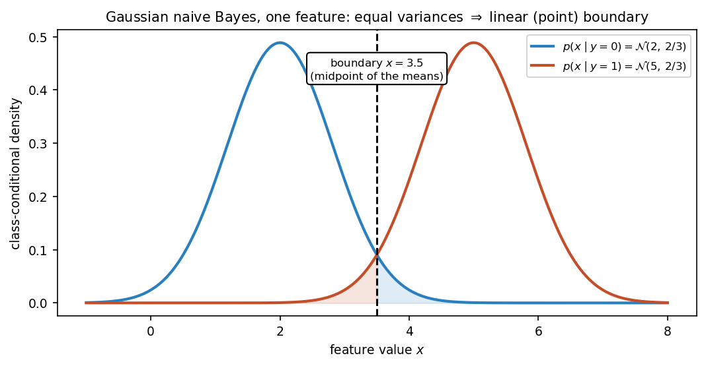

# 30. Naive Bayes: generative vs discriminative models

Two roads to the same destination. A **discriminative** classifier models $P(y \mid x)$ directly — "given this email, how likely is it spam?" A **generative** classifier takes the long way round: it models how each class *generates* its data, $P(x \mid y)$ and $P(y)$, and then flips the conditioning with Bayes' rule (§14.11) to get $P(y \mid x)$. Naive Bayes is the lecture's flagship generative classifier — the intro slide calls it the **"generative counterpart of logistic regression"** (Chapter 31 is the discriminative half of that pair). It makes one strong, usually-false assumption — features are independent given the class — and works shockingly well anyway, especially on text (document classification, spam filtering).

Everything in §§30.1–30.8 comes from the MLT Naive Bayes slides (Dr. Ashish Tendulkar; the shared materials' "Week 6" folder — actual Naive Bayes content, week numbering notwithstanding) and the Week 8 TA-notes summary, which adds the generative-vs-discriminative framing, the parameter-counting argument, Laplace smoothing, and the linear-boundary derivation. The worked example in §30.9 is the course notes' six-email dataset ("Get Your Concepts Right" notes, IITM BS MLT SEP 2022 Week 8), with every number recomputed independently — one of its printed lines has an arithmetic slip, corrected here and flagged in the review log. §30.10's Gaussian example is the chapter's own.

**Notation.** The $i$-th example is $x^{(i)}$ (superscript, §22's convention) with label $y^{(i)} \in \{1, \ldots, k\}$ for $k$ classes; $x_j^{(i)}$ is feature $j$ of example $i$. $D = \{(x^{(i)}, y^{(i)})\}_{i=1}^n$. The binary case ($y \in \{0, 1\}$, $x_j \in \{0, 1\}$ — word present/absent) carries all the examples; the formulas are stated for $k$ classes.

## 30.1 Two philosophies: model $P(y \mid x)$, or model $P(x, y)$

**Setup.** Same as §22.9: instances $x^{(i)} \in \mathbb{R}^d$, discrete labels $y^{(i)}$. The running example (from the TA notes): each $x^{(i)}$ is an email, each feature $x_j^{(i)} \in \{0, 1\}$ says whether word $j$ of a dictionary appears, $y^{(i)} \in \{0, 1\}$ says spam or not. The algorithm outputs $\boxed{f: \mathbb{R}^d \to \{1, \ldots, k\}}$, judged by §22.9's misclassification fraction.

The joint distribution of a (point, label) pair factors two ways (TA notes):
$$\boxed{P(x, y) = P(y \mid x)\,P(x) = P(x \mid y)\,P(y)}.$$

i) **Discriminative: model $P(y \mid x)$ directly.** "We just need $P(y \mid x)$ for prediction" (TA notes) — so model exactly that and nothing else. Given the email, what is the probability it is spam? No need to model what emails look like in general ($P(x)$ is never estimated). The TA notes' examples: **decision trees** (§29.9) and **KNN** (§29.2).
ii) **Generative: model the pair $P(x, y) = P(x \mid y)\,P(y)$.** Learn two things: **$P(y)$** — how often each label occurs (the **class prior**), and **$P(x \mid y)$** — for each class, what its data looks like (the **class-conditional density**). Then obtain $P(y \mid x)$ from Bayes' rule at prediction time (§30.2). The examples: **Naive Bayes** and **Gaussian Naive Bayes**.

**Basically, ...** "Discriminative = learn the boundary straight: 'given these features, which class?' Generative = learn each class's portrait first — 'what does a spam email look like, what does a ham email look like, and how common is each?' — then use Bayes' rule to pick the class whose portrait matches the new point best."

## 30.2 Bayes' rule for classification

Naive Bayes predicts $P(y \mid x)$ — the **posterior probability** of the label — using §14.11's theorem (the slides' four names, verbatim):
$$\boxed{P(y \mid x) = \frac{P(x, y)}{P(x)} = \frac{P(x \mid y)\,P(y)}{P(x)}},$$
where $P(x \mid y)$ is the **class-conditional density**, $P(y)$ the **class prior**, and $P(x)$ the **evidence**.

The denominator is expanded by the law of total probability over the $k$ classes (the slides do this via the chain rule):
$$\boxed{P(x) = \sum_{r=1}^{k} P(x \mid y_r)\,P(y_r)}.$$

**The decision rule.** Predict the class with the largest posterior (the slides' inference rule):
$$\boxed{\hat y = \operatorname*{argmax}_{y_c}\; P(y_c \mid x; w) = \operatorname*{argmax}_{y_c}\; P(x \mid y_c; w)\,P(y_c; w)},$$
because $P(x; w)$ is the same for every candidate class and drops out of the $\operatorname*{argmax}$. This is the **MAP decision rule** — §20.10 maximized the posterior over *parameters*; here we maximize it over *classes*. §20.12(iv) promised the Bayesian story continues wherever priors appear: this is it — the class priors $P(y_c)$ play exactly the prior's role, weighting each class by its base rate before the evidence is weighed (§14.11's "base rates dominate" lesson, now inside a classifier).

**Basically, ...** "Posterior = (how well this class explains the point) × (how common this class is), divided by (how common such points are overall). To *decide*, the denominator is shared by all classes, so just compare numerator × prior per class and take the biggest — that is MAP, with the class as the hypothesis."

## 30.3 The Naive Bayes assumption

**Def (the naive assumption).** Features are **conditionally independent given the label**:
$$\boxed{P(x_1, x_2, \ldots, x_m \mid y) = P(x_1 \mid y)\,P(x_2 \mid y)\,\cdots\,P(x_m \mid y) = \prod_{j=1}^{m} P(x_j \mid y)}.$$

i) **Why "naive".** It is a strong assumption and usually false. In the spam story: the presence/absence of one word is assumed to have no impact on any other word — it "does not model the grammatical, semantic and other structures present in a language" (TA notes). Words obviously do correlate ("Viagra" and "cheap" travel together).
ii) **Why it is worth it.** Without it, the generative story must estimate a probability for *every* (feature-vector, label) combination: $k \cdot 2^d - 1$ parameters for $d$ binary features ($2^{d+1} - 1$ in the TA notes' binary case) — exponential in $d$, "computationally infeasible". With the assumption, each feature needs only its per-class probability: $2d$ conditional probabilities plus one prior — $2d + 1$ numbers (the TA notes' count) — linear in $d$. The assumption buys tractability.
iii) **Why it works anyway.** Classification only needs the *argmax* to be right, not the probabilities to be accurate — even a crude factorization often ranks the classes correctly. (The slides say only that it is "simple yet very powerful"; the argmax-forgiveness is the standard explanation of the empirical success.)

With the assumption, the posterior becomes (the slides' compact form):
$$\boxed{P(y = y_c \mid x) = \frac{\,p(y_c)\prod_{j=1}^{m} p(x_j \mid y_c)\,}{\,\sum_{r=1}^{k} p(y_r)\prod_{j=1}^{m} p(x_j \mid y_r)\,} }.$$

**Parameters.** $k$ prior probabilities (one redundant — they sum to $1$) plus $k \times m$ class-conditional densities — "$m$ conditional densities per class and there are $k$ such classes" (slides). How many numbers each density needs "depends on its mathematical form" (§30.4).

**Basically, ...** "Full generative modelling tries to learn a probability for every possible email — exponentially many, impossible. Naive Bayes cheats: assume words occur independently given the class, and you only need one number per word per class. The assumption is false, but the classifier only needs to pick the winner, and the cheat usually picks right."

<!-- Original matplotlib illustration drawn for this chapter (not reused from any URL): per-class per-feature Bernoulli bars from the §30.9 worked example, combined by Bayes' rule into posteriors for x_test = [1,0,1] -->
![Generative-story schematic: bar charts of P(F_j = 1 | y) for class y = 1 (bars 1.00, 0.67, 0.33) and class y = 0 (bars 0.33, 0.67, 0.67), each with prior 1/2; then Bayes' rule combines them for x_test = [1,0,1] into scores 1/18 vs 1/27, posteriors 0.6 vs 0.4, predicting y = 1.](assets/30-nb-schematic.png)

## 30.4 Modelling $p(x_j \mid y_c)$: one distribution per feature type

The distribution used for $p(x_j \mid y_c)$ depends on the feature's nature (the slides' four cases, verbatim):

i) **Binary feature** (word present/absent) → **Bernoulli** ($\mu_{jc}$). $p(x_j = 1 \mid y_c) = \mu_{jc}$, $p(x_j = 0 \mid y_c) = 1 - \mu_{jc}$, combined compactly (§15.11's distribution):
$$\boxed{p(x_j \mid y_c; \mu_{jc}) = \mu_{jc}^{x_j}(1 - \mu_{jc})^{1 - x_j}}.$$
Check: $x_j = 1$ gives $\mu_{jc}^1(1-\mu_{jc})^0 = \mu_{jc}$; $x_j = 0$ gives $\mu_{jc}^0(1-\mu_{jc})^1 = 1 - \mu_{jc}$. For $s$ binary features and $k$ classes: $k \times s$ Bernoulli parameters.
ii) **Categorical feature** ($e > 2$ values, e.g. $\{\text{red}, \text{green}, \text{blue}\}$) → **Categorical** $\mathrm{Cat}(\mu_{j1c}, \ldots, \mu_{jec})$, $\sum_q \mu_{jqc} = 1$. For $x_j = v_q$: $p(x_j = v_q \mid y_c) = \mu_{jqc}$; compactly $\prod_q \mu_{jqc}^{\mathbf{1}(x_j = v_q)}$.
iii) **Counts** (word-count vector, $\sum_j x_j = l$) → **Multinomial** $(l, \mu_{1c}, \ldots, \mu_{mc})$:
$$\boxed{p(x \mid y_c; l, \mu_{1c}, \ldots, \mu_{mc}) = \frac{l!}{x_1!\cdots x_m!}\prod_{j=1}^{m} \mu_{jc}^{x_j}}, \qquad \sum_j x_j = l.$$
Used for documents represented by word counts — the classic spam-filter setup.
iv) **Continuous feature** (e.g. area in sq. feet) → **Gaussian** $\mathcal{N}(\mu_{jc}, \sigma_{jc}^2)$:
$$\boxed{p(x_j \mid y_c; \mu_{jc}, \sigma_{jc}^2) = \frac{1}{\sqrt{2\pi}\,\sigma_{jc}}\exp\!\left(-\frac{(x_j - \mu_{jc})^2}{2\sigma_{jc}^2}\right)}.$$
Alternately a **multivariate Gaussian** for the whole vector — but under conditional independence every off-diagonal of the covariance is zero, $\Sigma_{jj} = \sigma_j^2$, so it factorizes into the same per-feature Gaussians (slides).

**Basically, ...** "Pick the distribution that matches the feature's shape: coin-flip (Bernoulli) for yes/no, die-roll (categorical) for one-of-many, word-counts (multinomial) for bags of words, bell curve (Gaussian) for measurements. One such distribution per feature per class — that is the whole model."

## 30.5 Inference: decide in log space

Prediction is the MAP rule from §30.2, expanded with the naive factorization:
$$\hat y = \operatorname*{argmax}_{y_c}\left(\prod_{j=1}^{m} p(x_j \mid y_c; w)\right) p(y_c; w).$$
Products of many small probabilities **underflow** — so compute in log space (the slides' fix):
$$\boxed{\hat y = \operatorname*{argmax}_{y_c}\left[\sum_{j=1}^{m} \log p(x_j \mid y_c; w) + \log p(y_c; w)\right]}.$$

**Note (the slides' warning).** The $\operatorname*{argmax}$ equation gives the *label*, not a probability. If actual probabilities are wanted, use the normalized posterior (§30.3's fraction) — also computed in log space.

**The boundary is linear.** For binary $y$, the log-odds telescopes into a linear function (TA notes):
$$\log\frac{P(y = 1 \mid x)}{P(y = 0 \mid x)} = \sum_{j=1}^{d} f_j w_j + b, \qquad w_j = \log\frac{p_{j1}(1 - p_{j0})}{p_{j0}(1 - p_{j1})},$$
so Naive Bayes decides by $\boxed{w^T x + b > 0}$ — a **linear decision boundary**, the same shape §22.9 drew. This is the precise content of "generative counterpart of logistic regression": logistic regression (Chapter 31) learns that linear boundary *discriminatively*, straight from $P(y \mid x)$; Naive Bayes arrives at the same shape via the generative detour.

**Basically, ...** "Multiplying hundreds of tiny probabilities underflows to zero, so take logs — products become sums, the argmax is unchanged, and the computer survives. Bonus: in log space the spam/ham decision is just 'weighted word-score plus bias, check the sign' — a straight-line boundary, exactly what logistic regression will learn the direct way in Chapter 31."

## 30.6 Training = maximizing the log-likelihood

**Def (likelihood).** The joint probability of the observed data $D$ under parameters $w$ (the slides' Part 3):
$$\boxed{L(w) = p(D; w) = \prod_{i=1}^{n} p(x^{(i)}, y^{(i)}; w)},$$
since examples are i.i.d. Take logs for convenience:
$$\boxed{\ell(w) = \sum_{i=1}^{n} \log p(x^{(i)}, y^{(i)}; w)}, \qquad J(w) = -\ell(w)$$
— minimize the **negative log-likelihood** (NLL) "to maintain uniformity with other algorithms" (slides).

With the naive factorization, the log-likelihood splits into a prior term and a per-feature term:
$$\boxed{\ell(w) = \sum_{i=1}^{n} \log p(y^{(i)}; w) + \sum_{i=1}^{n}\sum_{j=1}^{m} \log p(x_j^{(i)} \mid y^{(i)}; w)}.$$

**Basically, ...** "Training = choose the parameters that make the observed (email, label) pairs most probable. Log it, negate it, minimize it — the same NLL ritual every model from here on follows (§20.12(i))."

## 30.7 The MLE estimates: training is counting

The slides' three-step recipe: differentiate $\ell(w)$ w.r.t. each parameter, set to $0$ (maxima condition), solve. The solutions are all fractions of counts:

i) **Priors** — class fractions:
$$\boxed{\hat p(y = y_c) = \frac{\sum_{i=1}^{n}\mathbf{1}(y^{(i)} = y_c)}{n}}.$$
ii) **Bernoulli** — fraction of class-$y_r$ examples with feature $j$ equal to $1$:
$$\boxed{\hat w_{jyr} = \frac{\sum_{i=1}^{n}\mathbf{1}(y^{(i)} = y_r)\,x_j^{(i)}}{\sum_{i=1}^{n}\mathbf{1}(y^{(i)} = y_r)}}.$$
In words: among the training examples labelled $y_r$, what fraction have $x_j = 1$. (The slides derive this by differentiating the Bernoulli log-likelihood — the standard $\frac{x}{w} - \frac{1-x}{1-w}$ derivative, set to zero.)
iii) **Categorical** — fraction of class-$y_r$ examples with $x_j = v$:
$$\boxed{\hat w_{jvyr} = \frac{\sum_{i=1}^{n}\mathbf{1}(y^{(i)} = y_r)\,\mathbf{1}(x_j^{(i)} = v)}{\sum_{i=1}^{n}\mathbf{1}(y^{(i)} = y_r)}}.$$
iv) **Multinomial** — share of feature $j$'s total count inside class $y_r$:
$$\boxed{\hat w_{jyr} = \frac{\sum_{i=1}^{n}\mathbf{1}(y^{(i)} = y_r)\,x_j^{(i)}}{\sum_{i=1}^{n}\mathbf{1}(y^{(i)} = y_r)\sum_{j=1}^{m}x_j^{(i)}}}.$$
v) **Gaussian** — class-conditional mean and variance ($n_r$ = number of class-$y_r$ examples; the MLE divides by $n_r$):
$$\boxed{\hat\mu_{jr} = \frac{1}{n_r}\sum_{i=1}^{n}\mathbf{1}(y^{(i)} = y_r)\,x_j^{(i)}, \qquad \hat\sigma_{jr}^2 = \frac{1}{n_r}\sum_{i=1}^{n}\mathbf{1}(y^{(i)} = y_r)\,(x_j^{(i)} - \hat\mu_{jr})^2}.$$

**Basically, ...** "No gradients, no iterations: training Naive Bayes is counting. Priors = class fractions; each conditional = the fraction of that class's examples showing the feature value. The calculus just confirms what the fractions already say."

## 30.8 The zero-count problem and Laplace smoothing

**The problem.** If no training example of class $y_r$ has $x_j = 1$, the MLE says $\hat w_{jyr} = 0$ — so $p(x_j \mid y_r) = 0$, and the *entire* posterior $P(y_r \mid x)$ collapses to $0$ for any test point with $x_j = 1$. One unseen combination vetoes the whole class. The TA notes' version: both posteriors can become $0$ and "prediction becomes difficult". This is §20.4's **zero-count warning** relocated into a classifier — MLE's overconfidence again — and §20.11's Beta prior is its conceptual cousin (a prior "keeps the estimate sane").

**The fix: smoothing.** Pretend we saw a few extra pseudo-examples. The slides' **Laplace smoothing** adds $+c$ to the numerator and the matching pseudo-total to the denominator (binary case, $x_j \in \{0, 1\}$ — one pseudo-count per value):
$$\boxed{\hat w_{jyr} = \frac{\sum_{i=1}^{n}\mathbf{1}(y^{(i)} = y_r)\,x_j^{(i)} + c}{\sum_{i=1}^{n}\mathbf{1}(y^{(i)} = y_r) + 2c}},$$
with $+ce$ for categorical ($e$ values) and $+cm$ for multinomial ($m$ words). $c = 1$ is **Laplace smoothing** proper; $c$ is a hyperparameter — "too high a value of $c$ leads to underfitting" (slides), i.e. the pseudo-data drowns the real data.

**Basically, ...** "MLE says 'never seen it, impossible' — one zero poisons the whole product. Smoothing pads every count with a little fake data ($c = 1$: pretend you saw each outcome once), so no probability is ever exactly zero. Too much padding and the fake data runs the show — that is underfitting."

## 30.9 Worked example: six emails, three words (every number recomputed)

The course notes' dataset ("Get Your Concepts Right", MLT SEP 2022 Week 8). Three binary features $F_1, F_2, F_3$ (word present $= 1$), label $y = 1$ (spam) / $0$:

| example | $F_1$ | $F_2$ | $F_3$ | $y$ |
|---|---|---|---|---|
| $x^{(1)}$ | 0 | 1 | 0 | 0 |
| $x^{(2)}$ | 1 | 1 | 0 | 1 |
| $x^{(3)}$ | 0 | 1 | 1 | 0 |
| $x^{(4)}$ | 1 | 0 | 1 | 0 |
| $x^{(5)}$ | 1 | 0 | 0 | 1 |
| $x^{(6)}$ | 1 | 1 | 1 | 1 |

**Step 1 — priors (§30.7(i)).** Three of six labels are $1$: $\boxed{\hat p(y{=}1) = 3/6 = 1/2}$, $\boxed{\hat p(y{=}0) = 1/2}$.

**Step 2 — conditionals (§30.7(ii)).** Class $1$ = examples $2, 5, 6$; class $0$ = examples $1, 3, 4$:

| | $\hat p(F_j{=}1 \mid y{=}1)$ | $\hat p(F_j{=}1 \mid y{=}0)$ |
|---|---|---|
| $F_1$ | $3/3 = 1$ | $1/3$ |
| $F_2$ | $2/3$ | $2/3$ |
| $F_3$ | $1/3$ | $2/3$ |

($F_1$ for class $1$: examples $2,5,6$ all have $F_1 = 1$; $F_2$ for class $0$: examples $1,3$ have $1$, example $4$ has $0$ — $2/3$; etc.)

**Step 3 — classify $x_{\text{test}} = [1, 0, 1]$.** For each feature take $\hat p_j$ if the value is $1$, $(1 - \hat p_j)$ if $0$ (the Bernoulli compact form, §30.4(i)):
$$P(x_{\text{test}} \mid y{=}1) = \underbrace{1}_{F_1=1}\cdot\underbrace{\left(1 - \tfrac23\right)}_{F_2=0}\cdot\underbrace{\tfrac13}_{F_3=1} = 1\cdot\tfrac13\cdot\tfrac13 = \boxed{\tfrac19 \approx 0.111},$$
$$P(x_{\text{test}} \mid y{=}0) = \underbrace{\tfrac13}_{F_1=1}\cdot\underbrace{\left(1 - \tfrac23\right)}_{F_2=0}\cdot\underbrace{\tfrac23}_{F_3=1} = \tfrac13\cdot\tfrac13\cdot\tfrac23 = \boxed{\tfrac{2}{27} \approx 0.074}.$$

**Step 4 — posteriors.** Unnormalized scores ($\times$ prior $1/2$): $y{=}1$: $1/18 \approx 0.0556$; $y{=}0$: $1/27 \approx 0.0370$. Normalizing (evidence $= 1/18 + 1/27 = 5/54$):
$$\boxed{P(y{=}1 \mid x_{\text{test}}) = \frac{1/18}{5/54} = \frac{3}{5} = 0.6}, \qquad \boxed{P(y{=}0 \mid x_{\text{test}}) = \frac{2}{5} = 0.4}.$$
$\boxed{\text{Predict } y = 1.}$

**Note (source slip, corrected).** The notes print the $y{=}1$ likelihood as "$1.00 \times 0.33 \times 0.67 = 0.22$" — the third factor should be $\hat p_3^1 = 0.33$ ($F_3 = 1$), not $1 - \hat p_3^1 = 0.67$. Correct: $1.00 \times 0.33 \times 0.33 \approx 0.11 = 1/9$. The verdict (predict $1$) is unchanged, since $1/9 > 2/27$ either way. Flagged in the review log.

**Step 5 — smoothing demo.** Note $\hat p(F_1{=}1 \mid y{=}1) = 1$, i.e. $\hat p(F_1{=}0 \mid y{=}1) = 0$: any test point with $F_1 = 0$ gets $P(x \mid y{=}1) = 0$ — §30.8's pathology, live. With Laplace $c = 1$: $\hat p_1^1 = 4/5 = 0.8$, $\hat p_2^1 = 3/5 = 0.6$, $\hat p_3^1 = 2/5 = 0.4$; $\hat p_1^0 = 2/5 = 0.4$, $\hat p_2^0 = \hat p_3^0 = 3/5 = 0.6$. Then $P(x_{\text{test}} \mid y{=}1) = 0.8 \cdot 0.4 \cdot 0.4 = 0.128$, $P(x_{\text{test}} \mid y{=}0) = 0.4 \cdot 0.4 \cdot 0.6 = 0.096$ — still predict $1$, but no zero vetoes remain.

**Basically, ...** "Count: half the emails are spam; among spam, word 1 always appears, word 2 appears two-thirds of the time, word 3 one-third. New email $[1,0,1]$: multiply the matching numbers per class, weight by the half-half prior, normalize — spam wins $0.6$ to $0.4$. And the $1.00$ for word-1-in-spam is a warning: one zero anywhere in the product kills the class, which is why smoothing exists."

## 30.10 Worked example: Gaussian NB on one continuous feature

Class $0$: $x \in \{1, 2, 3\}$; class $1$: $x \in \{4, 5, 6\}$; priors $1/2$ each. By §30.7(v):
$$\hat\mu_0 = 2,\quad \hat\mu_1 = 5,\quad \hat\sigma_0^2 = \hat\sigma_1^2 = \frac{(1-2)^2 + 0 + (3-2)^2}{3} = \frac{2}{3}.$$

**Decision boundary.** Equal priors and equal variances: $p(x \mid 1) = p(x \mid 0)$ iff the exponents match,
$$-\frac{(x-5)^2}{2\sigma^2} = -\frac{(x-2)^2}{2\sigma^2} \iff (x-5)^2 = (x-2)^2 \iff \boxed{x = 3.5},$$
the midpoint of the means — a (one-point) linear boundary, as §30.5 promised.

**Classify.** $x = 4$: $(4-5)^2 = 1 < (4-2)^2 = 4$ → nearer class $1$'s centre → $\boxed{\text{predict } 1}$. $x = 3$: $(3-5)^2 = 4 > (3-2)^2 = 1$ → $\boxed{\text{predict } 0}$.

<!-- Original matplotlib illustration drawn for this chapter (not reused from any URL): the two class-conditional Gaussians N(2, 2/3) and N(5, 2/3) with the decision boundary at x = 3.5 -->

**Basically, ...** "Per class, fit a bell curve (mean and variance of that class's numbers). New point: whichever bell is taller there wins. Same spread on both bells → the boundary is exactly halfway between the humps."

## 30.11 Strengths and limits (as the sources list them)

**Strengths.**
i) **Simple and fast** — training is counting (§30.7); prediction is a product of table lookups.
ii) **Few parameters** — $2d + 1$ instead of $2^{d+1} - 1$ (§30.3(ii)); works on small data.
iii) **Surprisingly strong on text** — "simple yet very powerful … used extensively in applications like document classification and spam filtering" (intro slide).
iv) **Mixed feature types** — binary, categorical, counts, continuous each get their own distribution (§30.4).

**Limits.**
i) **The independence assumption is usually false** — words do correlate; the model "does not model the grammatical, semantic and other structures present in a language" (TA notes). It cannot learn feature interactions at all.
ii) **Zero counts veto classes** — needs Laplace smoothing (§30.8), whose strength $c$ is another hyperparameter to tune.
iii) **Gaussian NB assumes normality** — skewed or multimodal features per class break the bell-curve model.

**Evaluation** (the slides' closing list, brief): confusion matrix, precision/recall/F1, AUC ROC/PR curve, with cross-validation and a held-out test set — §22.10's discipline. Classification losses get their own chapter (Chapter 35).

**Basically, ...** "Naive Bayes: cheap to train, few knobs, great first try on text. The bill: it pretends features don't interact (often false), one unseen combo can zero a class (smooth it), and the Gaussian version believes every class is bell-shaped."

## 30.12 Where this goes next

i) **The discriminative twin.** Chapter 31 (logistic regression) is the intro slide's "generative counterpart" in reverse: same linear boundary $w^T x + b$, learned by modelling $P(y \mid x)$ directly instead of the $P(x \mid y)P(y)$ detour. Comparing the two is the cleanest way to feel what "generative vs discriminative" buys and costs.
ii) **The Part IV toolbox continues** (§25.12(iv)'s list): SVMs (Chapters 32–33), ensembles (Chapter 34) — heavier machinery for when the naive assumption costs too much accuracy.

## Problem set

1. **Classify $[0, 0, 1]$ on §30.9's data.** Using the §30.9 estimates (no smoothing): (i) compute $P(x \mid y{=}1)$ and $P(x \mid y{=}0)$; (ii) give the unnormalized scores and the posteriors; (iii) state the prediction; (iv) point to the exact factor that makes one likelihood $0$ and name the §30.8 concept it illustrates.
2. **Parameter counting.** $k = 4$ classes, $d = 5$ binary features. (i) How many parameters does the full generative story need (TA notes' $k2^d - 1$ form)? (ii) How many does Naive Bayes need, counting priors straight (TA-notes style)? (iii) One of those priors is redundant — why, and what is the exact free-parameter count? (iv) In one line each: how do the two totals scale with $d$?
3. **Laplace smoothing in action.** On §30.9's data, test point $x = [0, 1, 1]$: (i) show the unsmoothed $P(x \mid y{=}1) = 0$ and give the (forced) prediction; (ii) recompute all six conditionals with $c = 1$; (iii) recompute both likelihoods, the posteriors, and the prediction.
4. **Spam posterior (practice-assignment numbers).** $P(\text{spam}) = 0.2$; word likelihoods — spam: Hurray! $0.7$, win $0.2$, exciting $0.01$, prizes $0.3$; non-spam: $0.01$, $0.02$, $0.01$, $0.1$. Mail: "Hurray! win exciting prizes" (these four words are the only features). Compute $P(\text{spam} \mid \text{mail})$ to two decimal places.
5. **Gaussian NB boundary.** Class $0$: $\{1, 2, 3\}$; class $1$: $\{5, 6, 7\}$; equal priors. (i) Estimate $\hat\mu_0, \hat\mu_1, \hat\sigma_0^2, \hat\sigma_1^2$. (ii) Find the decision boundary. (iii) Classify $x = 3$ and $x = 5$.
6. **Generative or discriminative?** From the TA notes' classification: for each of {decision trees, KNN, Naive Bayes, Gaussian Naive Bayes}, state whether it models $P(y \mid x)$ or $P(x, y)$, with a one-line justification.
7. **Why log space.** (i) Prove the §30.5 claim: $\operatorname*{argmax}_{y_c} P(y_c \mid x)$ equals $\operatorname*{argmax}_{y_c}[\sum_j \log p(x_j \mid y_c) + \log p(y_c)]$. (ii) In one line: why is the log version used in practice?
