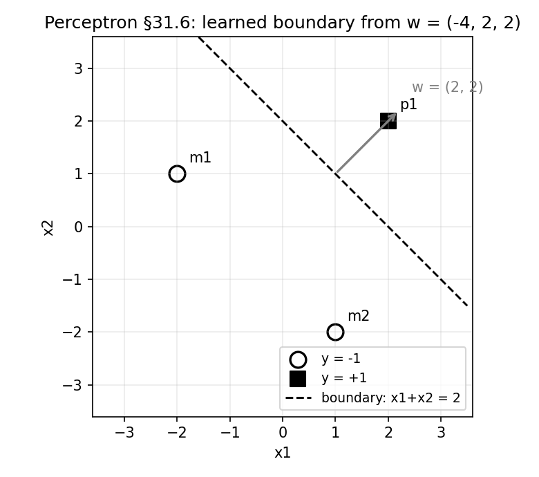
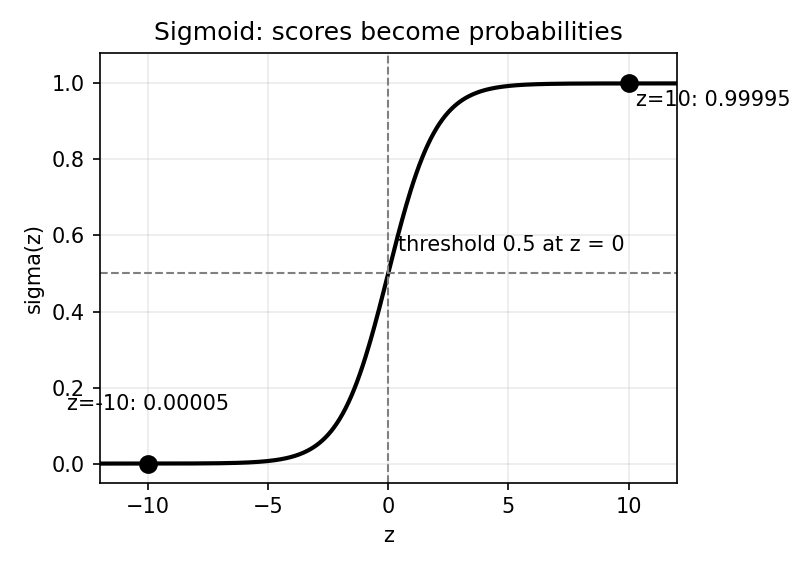

# 31. Perceptron and logistic regression

Two linear classifiers, two opposite temperaments. The **perceptron** learns by making mistakes: it guesses, gets corrected, and nudges its weights only when it is wrong. **Logistic regression** never guesses at all — it models the probability $P(y \mid x)$ directly and tunes its weights to make the observed labels as probable as possible. Both draw the same shape in the end — the linear boundary $w^T x + b = 0$ (§22.9, §30.5) — but they arrive by completely different roads.

This is the chapter §30 promised. Naive Bayes was the intro slide's "generative counterpart of logistic regression" — the model that reaches the linear boundary via the $P(x \mid y)P(y)$ detour. Logistic regression is the **discriminative half of that pair**: it skips the detour and learns $P(y \mid x)$ straight from the data. The perceptron comes first because it is the older, simpler machine (Rosenblatt, 1958) and the direct ancestor of the neural networks in Part VI.

**Notation.** Two label conventions appear because the two algorithms come from two sources: the perceptron slides use $y^{(i)} \in \{-1, +1\}$; logistic regression (the 6.036 notes in the course materials) uses $y^{(i)} \in \{0, 1\}$, "enabling them to be interpreted as probabilities of being a member of the class of interest". Translate freely: $+1 \leftrightarrow 1$, $-1 \leftrightarrow 0$. The $i$-th example is $x^{(i)}$, its label $y^{(i)}$, $D = \{(x^{(i)}, y^{(i)})\}_{i=1}^n$ (§22.9). **Note:** this parenthesized $x^{(i)}$ replaces Part III's $x^i$ — same meaning; the parens remove the power-collision §22.6 warned about. The $x^{(i)}$ form is used from here on (Chapters 32–36 and beyond).

Everything in §§31.2–31.6 comes from the MLT Perceptron slides (Dr. Ashish Tendulkar; the shared materials' "Week 4" folder — actual perceptron content, week numbering notwithstanding) and the Week 9 practice assignment. §§31.7–31.12 come from the MITx 6.036 machine-learning notes kept in the MLT "Notes" folder (the logistic-classification and gradient-descent chapters). The linear-boundary geometry (§31.1) is from the "Models of Classification" slides; the generative-vs-discriminative framing (§31.13) leans on §30.1–30.2's TA-notes account.

## 31.1 The shared shape: a linear boundary, and what its parts mean

Both algorithms in this chapter learn a **linear discriminant function** — "very similar to the linear regression" (Models of Classification slides):
$$\boxed{y = w_0 + w_1 x_1 + \cdots + w_m x_m = w_0 + w^T x}.$$
The decision rule: predict class $1$ if $w_0 + w^T x > 0$, class $0$ otherwise. The **decision boundary** is
$$\boxed{w_0 + w^T x = 0}$$
— a hyperplane, one dimension below the feature space (a line in 2-D, a plane in 3-D).

The slides give each part a geometric job:

i) **$w$ = orientation.** Take two points $x^{(A)}, x^{(B)}$ on the boundary: $w^T x^{(A)} = w^T x^{(B)} = -w_0$, so $w^T(x^{(A)} - x^{(B)}) = 0$. $w$ is orthogonal to every vector lying in the decision surface — it fixes which way the boundary faces.
ii) **$w_0$ = location.** Normalizing by $\lVert w \rVert$, the normal distance from the origin to the surface is $-w_0 / \lVert w \rVert$ — $w_0$ slides the boundary toward or away from the origin.
iii) **The value $w_0 + w^T x$ = signed distance.** The discriminant gives a signed measure of the perpendicular distance of $x$ from the surface — positive on one side, negative on the other.

**The bias trick.** By adding a dummy feature $x_0 = 1$, the bias folds into the weight vector: $w_0 x_0 + w^T x = w^T x$ (augmented). The boundary becomes a hyperplane through the origin in the one-dimension-higher space. §31.6's worked example uses this trick — watch for the leading $1$ in every feature vector.

**Basically, ...** "A linear classifier is a flat wall: $w$ decides which way the wall faces, $w_0$ decides where it stands, and the sign of $w_0 + w^T x$ tells you which side of the wall a point is on. Everything in this chapter is about where to put that wall."

## 31.2 The perceptron: a neuron that learns from mistakes

**Def (perceptron).** A binary classification algorithm — the slides stress it "can solve only binary classification problems", so $y^{(i)} \in \{-1, +1\}$. Invented in 1958 by Frank Rosenblatt, "intended to be a machine, rather than a program", and "meant to be a rough model of how individual neurons work in the brain".

The **model** (the slides' form):
$$\boxed{\hat y = h_w(x) = f(w^T \phi(x)) = f(z)},$$
i) **$\phi(x)$** — a feature transformation of the input (use $\phi(x) = (1, x)$ to smuggle in the bias, §31.1).
ii) **$w^T \phi(x)$** — the linear combination of (transformed) features.
iii) **$f$** — a non-linear activation: the **sign** (threshold) function,
$$\boxed{f(z) = \begin{cases} +1, & z \ge 0, \\ -1, & z < 0, \end{cases}}$$
i.e. $\hat y = \operatorname{sign}(w^T \phi(x))$.

So the perceptron is the linear discriminant of §31.1 with its continuous output snapped to $\pm 1$ by a hard threshold. Its decision boundary is $w^T \phi(x) = 0$ — the same $w_0 + w^T x = 0$ shape.

**Basically, ...** "Take the linear score $w^T x$, then slam it through a sign function: non-negative means class $+1$, negative means class $-1$. It is a neuron in the roughest sense — weighted sum in, yes/no out. And it only does two classes, ever."

## 31.3 The perceptron loss: pay only for mistakes

Let $\hat y^{(i)}$ be the perceptron's prediction and $y^{(i)}$ the true label. The slides define the per-example error:
$$e^{(i)} = \begin{cases} 0, & \hat y^{(i)} = y^{(i)}, \\ -w^T \phi(x^{(i)})\, y^{(i)}, & \text{otherwise}, \end{cases}$$
compactly,
$$\boxed{e^{(i)} = \max\!\left(0, -w^T \phi(x^{(i)})\, y^{(i)}\right) = \max\!\left(0, -\hat y^{(i)} y^{(i)}\right)}.$$

Why this shape: if the prediction is correct, $\hat y^{(i)} y^{(i)} = +1$ and the error is $\max(0, -1) = 0$. If wrong, $\hat y^{(i)} y^{(i)} = -1$ and the error is $\max(0, 1) = 1$ (the slides' illustration works both cases out to exactly $0$ and $1$). The total loss:
$$\boxed{J(w) = \sum_{i=1}^{n} e^{(i)} = \sum_{i=1}^{n} \max\!\left(0, -w^T \phi(x^{(i)})\, y^{(i)}\right)}.$$

**Note (the slides' warning).** This error is **piecewise linear**: zero in the correctly-classified region, a linear function of $w$ in the misclassified region — and $J(w)$ is **not differentiable** in $w$. So gradient descent (Chapter 10) cannot be applied directly; the perceptron needs its own optimization procedure (§31.4).

**Basically, ...** "Right answer: pay nothing. Wrong answer: pay $1$ — the bill is all-or-nothing per point. As a function of the weights it has a kink at the boundary — no smooth slope to descend — so the perceptron optimizes by a different trick: fix mistakes one at a time."

## 31.4 The perceptron update rule: learn only when wrong

**Def (perceptron update rule).** Initialize $w^{(0)} = 0$. For each training example $(x^{(i)}, y^{(i)})$:
$$\boxed{\hat y^{(i)} = \operatorname{sign}\!\left(w^T \phi(x^{(i)})\right), \qquad w^{(t+1)} := w^{(t)} + \alpha\,\bigl(y^{(i)} - \hat y^{(i)}\bigr)\,\phi(x^{(i)})},$$
$\alpha$ the learning rate. The three cases (the slides work each one out):

i) **Correct:** $y^{(i)} = \hat y^{(i)}$ → $(y^{(i)} - \hat y^{(i)}) = 0$ → $w^{(t+1)} = w^{(t)}$. Nothing happens.
ii) **True $-1$, predicted $+1$:** $w^{(t+1)} = w^{(t)} - 2\alpha\,\phi(x^{(i)})$ — push the weights *away* from this point.
iii) **True $+1$, predicted $-1$:** $w^{(t+1)} = w^{(t)} + 2\alpha\,\phi(x^{(i)})$ — pull the weights *toward* this point.

This is **mistake-driven learning** in its purest form: correctly classified examples leave no trace on the weights; only mistakes move them. (The slides' own summary of the loss: "for misclassified example, we can reduce loss by reducing $w$. And for correctly classified examples, we leave $w$ unchanged.")

**Basically, ...** "Guess a label for each point. Right? Move on, change nothing. Wrong? Shove the weights toward the point if it should have been $+1$, away if it should have been $-1$. The algorithm has no memory of its successes — only its mistakes teach it."

## 31.5 Convergence: guaranteed on separable data, hopeless otherwise

The slides state the convergence behaviour with unusual bluntness:

i) **Linearly separable data → convergence.** "Linear separable examples lead to convergence of the algorithm with zero training loss" — the update loop eventually finds weights that classify every training point correctly and then stops (correct points cause no updates).
ii) **Non-separable data → oscillation, forever.** "Else it oscillates." The Week 9 practice assignment makes this concrete (Q2): on three points no line can separate, the perceptron cycles through the same weight vectors "and will never converge".

**The mistake bound (practice assignment, Q3–Q4).** On separable data the slides' guarantee can be quantified. Let $R$ be the maximum length of the data points and $\gamma$ the margin — the smallest value of $y^{(i)}(u^T x^{(i)})$ over the data, for a unit-norm separator $u$. Then the perceptron makes only finitely many mistakes — at most
$$\boxed{\text{\#mistakes} \le \left(\frac{R}{\gamma}\right)^2}.$$
The assignment's numbers: $R = 4$, $\gamma = 1$ → at most $(4/1)^2 = 16$ mistakes (answer: 16). And a single update can grow the squared weight length by at most $R^2$: with $\lVert w \rVert^2 = 36$ and $R = 4$, the next iteration's squared length is at most $36 + 16 = 52$ — so $45$ is a valid value, $55$ is not (Q3's answer).

**Note (scope of the claim).** The sources give the *statement* — separable implies convergence with zero training loss, plus the $(R/\gamma)^2$ bound as the assignment uses it — not a full proof. Nothing here promises anything about test data (§22.10's warning stands) or about *which* separator is found when many exist.

**Basically, ...** "If a straight wall *can* separate the classes, the perceptron *will* find one — after at most $(R/\gamma)^2$ mistakes, and then it stops dead, training loss zero. If no such wall exists, it never stops: it just keeps shuffling the same weights around forever. Check separability first (practice Q1/Q8 are exactly this skill)."

## 31.6 Worked example: three points, two updates (every number recomputed)

Data (augmented $\phi(x) = (1, x_1, x_2)$, bias folded in; labels in $\{-1, +1\}$):

| example | $\phi(x^{(i)})$ | $y^{(i)}$ |
|---|---|---|
| $m_1$ | $(1, -2, 1)$ | $-1$ |
| $m_2$ | $(1, 1, -2)$ | $-1$ |
| $p_1$ | $(1, 2, 2)$ | $+1$ |

(Separable: $x_1 + x_2 = 0$ already separates them, but the perceptron must discover a wall on its own.) $\alpha = 1$, $w^{(0)} = (0,0,0)$. Cycle $m_1, m_2, p_1$ repeatedly. Recall $f(z) = +1$ for $z \ge 0$ — so a zero score predicts $+1$.

**Sweep 1.**
- $m_1$: $z = 0 \to \hat y = +1 \ne -1$. Mistake (case ii): $w := (0,0,0) + 1\cdot(-1-1)\cdot(1,-2,1) = -2(1,-2,1) = \boxed{(-2,\, 4,\, -2)}$.
- $m_2$: $z = (-2)(1) + 4(1) + (-2)(-2) = -2 + 4 + 4 = 6 \ge 0 \to \hat y = +1 \ne -1$. Mistake: $w := (-2,4,-2) + (-2)(1,1,-2) = \boxed{(-4,\, 2,\, 2)}$.
- $p_1$: $z = (-4)(1) + 2(2) + 2(2) = -4 + 4 + 4 = 4 \ge 0 \to \hat y = +1 = y$. Correct — no change.

**Sweep 2** (verify; $w = (-4,2,2)$).
- $m_1$: $z = -4(1) + 2(-2) + 2(1) = -4 - 4 + 2 = -6 < 0 \to -1$ ✓.
- $m_2$: $z = -4(1) + 2(1) + 2(-2) = -4 + 2 - 4 = -6 < 0 \to -1$ ✓.
- $p_1$: $z = 4 \ge 0 \to +1$ ✓.
All correct — no updates fire, training loss is $0$, the algorithm halts. (Every score above was recomputed in numpy independently — see the review log; an early hand pass scored $m_1$'s second-sweep $z$ as $-10$, the recompute corrected it to $-6$.)

**The learned boundary.** $-4 + 2x_1 + 2x_2 = 0$, i.e. $\boxed{x_1 + x_2 = 2}$ — the same $w_0 + w^T x = 0$ shape from §31.1, with $w = (2,2)$ fixing the orientation (orthogonal to the line) and $w_0 = -4$ fixing the location.

<!-- Original matplotlib illustration drawn for this chapter (not reused from any URL): the three §31.6 training points, the learned boundary x1+x2=2, and the orientation vector w=(2,2) -->

**Basically, ...** "Start with zero weights, so everything scores $0$ and gets called $+1$. The two $-1$ points complain: shove the weights by $-2$ times each offender, landing at $(-4, 2, 2)$. Second pass: every point is now on the right side of the wall $x_1 + x_2 = 2$, nobody complains, done. Two mistakes, then silence — that is perceptron learning."

## 31.7 Why probabilities? The perceptron's blind spot

A perceptron's output is categorical: $+1$ or $-1$, no in-between. The 6.036 notes list why that hurts:

i) **No degree of certainty.** "The classifier can't express a degree of certainty about whether a particular input $x$ should have an associated value $y$." A point miles from the boundary and a point grazing it get the same verdict.
ii) **Flat, uninformative loss.** Any two hypotheses with the same misclassification count "have the same $J$ value" — the loss cannot tell a near-miss from a confident error, "which makes it difficult to design an algorithm that searches through the space of hypotheses for a good one".

The fix: keep the linear score $z = \theta^T x + \theta_0$, but map it to $(0,1)$ with a smooth squashing function and read the output **as a probability**. That is logistic regression.

**Basically, ...** "The perceptron only shouts yes or no. Sometimes you want 'probably yes, 90% sure' — and a loss that rewards getting *more* right rather than just counting wrongs. Swap the hard sign for a soft S-curve and the output becomes a probability."

## 31.8 Logistic regression: the model

**Def (linear logistic classifier).** Hypotheses parameterized by a vector $\theta$ and a scalar $\theta_0$ (the 6.036 notes' notation), producing outputs in $(0,1)$:
$$\boxed{h(x; \theta, \theta_0) = \sigma(\theta^T x + \theta_0)}, \qquad \boxed{\sigma(z) = \frac{1}{1 + e^{-z}}},$$
$\sigma$ the **logistic (sigmoid) function**. The output is interpreted as a probability because it always lies in $(0,1)$.

**The probabilistic model** (labels now in $\{0,1\}$):
$$\boxed{P(y = 1 \mid x) = \sigma(\theta^T x + \theta_0) = g, \qquad P(y = 0 \mid x) = 1 - g}.$$
This is the discriminative move §30.1 described: model $P(y \mid x)$ directly — "we just need $P(y \mid x)$ for prediction" — with no $P(x)$, no class portraits, no Bayes flip.

**The boundary is still linear.** Predict $1$ when $g > 1/2$: since $\sigma(z) = 1/2 \iff z = 0$,
$$\boxed{\sigma(\theta^T x + \theta_0) > \tfrac12 \iff \theta^T x + \theta_0 > 0},$$
so the decision boundary $\sigma = 1/2$ is exactly the line (hyperplane) $\theta^T x + \theta_0 = 0$ — the 6.036 notes pose this as a study question ("convince yourself that the set of points for which $\sigma(\theta^T x + \theta_0) = 0.5$ … is a line"). Same shape §30.5 derived for Naive Bayes ($w^T x + b > 0$), now learned straight from $P(y \mid x)$.

**Note (the name lies).** "Logistic *regression*" is classification — the "regression" is historical baggage. What it regresses is the *log-odds*: $\log \frac{g}{1-g} = \theta^T x + \theta_0$, a linear function of $x$.

**eg (practice-assignment numbers, Q9).** Two points with scores $z = 10$ and $z = -10$: $\sigma(10) = 1/(1+e^{-10}) \approx 0.99995$, $\sigma(-10) \approx 0.00005$ — the first point's probability "will be much higher than" the second's (the assignment's answer). Far along $+w$, certainty saturates at $1$; far along $-w$, at $0$.

<!-- Original matplotlib illustration drawn for this chapter (not reused from any URL): the sigmoid curve with the 0.5 threshold at z=0 and the practice Q9 markers at z=±10 -->

**Basically, ...** "Keep the perceptron's linear score, but instead of snapping it to $\pm 1$, run it through an S-curve that squeezes any number into a probability between $0$ and $1$. Score $0$ → fifty-fifty; big positive → nearly certain $1$; big negative → nearly certain $0$. The 50/50 line is still a straight wall — $\theta^T x + \theta_0 = 0$."

## 31.9 The loss: cross-entropy is the negative log-likelihood

Training means choosing $\theta, \theta_0$ to "maximize the probability assigned by the classifier to the correct $y$ values, as specified in the training set" (6.036). With guess $g^{(i)} = \sigma(\theta^T x^{(i)} + \theta_0)$ and labels in $\{0,1\}$, the probability the model assigns to the *observed* labels (independent examples) is
$$\prod_{i=1}^{n} g^{(i)\,y^{(i)}}\bigl(1 - g^{(i)}\bigr)^{1 - y^{(i)}}$$
— the Bernoulli likelihood (§15.11's distribution, now with $g^{(i)}$ in the $\mu$ slot). Check the exponent trick: $y^{(i)} = 1$ picks out $g^{(i)}$; $y^{(i)} = 0$ picks out $1 - g^{(i)}$.

Products are hard to optimize, and log is monotonic, so maximize the log — equivalently **minimize the negative log-likelihood** (the §20.12(i) ritual: logistic regression is listed there as an MLE example, next to least squares and neural nets). Per example, the **negative log-likelihood (NLL)** loss:
$$\boxed{L_{\mathrm{nll}}(g, y) = -\bigl(y \log g + (1 - y)\log(1 - g)\bigr)},$$
and the training objective (before regularization):
$$\boxed{J(\theta, \theta_0) = \frac{1}{n}\sum_{i=1}^{n} L_{\mathrm{nll}}\!\left(\sigma(\theta^T x^{(i)} + \theta_0),\, y^{(i)}\right)}.$$
This $L_{\mathrm{nll}}$ is the **cross-entropy** (log) loss: $-\log$ of the probability assigned to the truth. Confident and right ($g \approx y$) → loss near $0$; confident and wrong ($g \approx 1 - y$) → loss explodes. Unlike the perceptron's $0/1$ bill, it grades *how* wrong.

**Basically, ...** "Ask: 'under my current weights, how probable is the *actual* observed label?' Take the log (products become sums), negate it (we minimize), average over examples. That is the whole loss — cross-entropy is just negative log-likelihood wearing a fancy name, and minimizing it is MLE exactly as §20.12(i) promised."

## 31.10 The gradient, and training by gradient descent

Unlike the perceptron's kinked loss, $J$ is smooth — so Chapter 10's machinery applies. The 6.036 notes work the gradient out (posed as a study question; verified below). Write $z^{(i)} = \theta^T x^{(i)} + \theta_0$, $g^{(i)} = \sigma(z^{(i)})$.

**Derivation.** Chain rule, one example at a time. First the sigmoid:
$$\frac{d\sigma}{dz} = \frac{e^{-z}}{(1+e^{-z})^2} = \sigma(z)\bigl(1 - \sigma(z)\bigr) \quad \text{(check: multiply out)}.$$
Then the loss w.r.t. the guess:
$$\frac{\partial L_{\mathrm{nll}}}{\partial g} = -\left(\frac{y}{g} - \frac{1-y}{1-g}\right) = \frac{g - y}{g(1-g)}.$$
Multiply — the $g(1-g)$ cancels beautifully:
$$\frac{\partial L_{\mathrm{nll}}}{\partial z} = \frac{g - y}{g(1-g)} \cdot g(1-g) = \boxed{g - y}.$$
The error signal is just *prediction minus truth*. Finally $z^{(i)} = \theta^T x^{(i)} + \theta_0$ gives $\partial z^{(i)}/\partial\theta = x^{(i)}$, $\partial z^{(i)}/\partial\theta_0 = 1$. Averaging over the $n$ examples:
$$\boxed{\nabla_{\theta} J = \frac{1}{n}\sum_{i=1}^{n}\bigl(g^{(i)} - y^{(i)}\bigr)\,x^{(i)}, \qquad \frac{\partial J}{\partial\theta_0} = \frac{1}{n}\sum_{i=1}^{n}\bigl(g^{(i)} - y^{(i)}\bigr)}.$$

**Training = gradient descent** (§10.5, §10.7: step opposite the gradient):
$$\boxed{\theta := \theta - \eta\,\nabla_{\theta} J, \qquad \theta_0 := \theta_0 - \eta\,\frac{\partial J}{\partial\theta_0}},$$
repeated until the change in $J$ is tiny. Each step nudges every weight against its average error-weighted feature — misclassified-by-a-mile points (large $|g^{(i)} - y^{(i)}|$) shout loudest, the opposite of the perceptron's flat treatment.

**The regularized objective.** The 6.036 notes train $J_{\mathrm{lr}} = J + \tfrac{\lambda}{2}\lVert\theta\rVert^2$, adding $\lambda\theta$ to the gradient — the ridge penalty of Chapter 28 (§20.12(ii): MAP with a Gaussian prior). It matters: the notes' study question asks what happens on *separable* data with $\lambda = 0$ — the weights blow up ($\lVert\theta\rVert \to \infty$ drives every $g^{(i)}$ to $0$ or $1$ and the NLL to $0$, but no finite minimizer exists). Regularization keeps the optimum finite.

**Basically, ...** "The gradient has the cleanest form in ML: average over examples of (how wrong the probability was) × (the features). Step the weights downhill (§10.5) and repeat. And if the data is perfectly separable, unregularized logistic regression never settles — it keeps inflating the weights toward infinite certainty — so the $\lambda$ penalty is load-bearing, not decoration."

## 31.11 Worked example: one gradient-descent step (every number recomputed)

Two points, one feature: $x^{(1)} = 0, y^{(1)} = 0$; $x^{(2)} = 2, y^{(2)} = 1$. Start $\theta_0 = 0, \theta = 0$; step size $\eta = 1$; no regularization.

**Step 0 — scores and loss.** $z^{(i)} = 0 \to g^{(i)} = \sigma(0) = 1/2$ for both.
$$J = \tfrac12\Bigl[-\log(1-\tfrac12) - \log(\tfrac12)\Bigr] = \tfrac12(\log 2 + \log 2) = \boxed{\log 2 \approx 0.6931}.$$

**Step 1 — gradient (§31.10).** Errors $g^{(i)} - y^{(i)}$: $1/2 - 0 = 1/2$; $1/2 - 1 = -1/2$.
$$\frac{\partial J}{\partial\theta_0} = \tfrac12\left(\tfrac12 - \tfrac12\right) = \boxed{0}, \qquad \frac{\partial J}{\partial\theta} = \tfrac12\left(\tfrac12\cdot 0 + \left(-\tfrac12\right)\cdot 2\right) = \boxed{-\tfrac12}.$$

**Step 2 — update.** $\theta_0 := 0 - 1\cdot 0 = 0$; $\theta := 0 - 1\cdot(-\tfrac12) = \boxed{\tfrac12}$.

**Step 3 — check the loss fell.** New scores: $z^{(1)} = 0 \to g^{(1)} = 0.5$; $z^{(2)} = 1 \to g^{(2)} = \sigma(1) = 1/(1+e^{-1}) \approx 0.7311$.
$$J_{\text{new}} = \tfrac12\bigl[-\log(1-0.5) - \log(0.7311)\bigr] = \tfrac12(0.6931 + 0.3133) \approx \boxed{0.5032} < 0.6931\ \checkmark.$$
(Every number above recomputed in numpy — see the review log. Note the bias gradient came out $0$: the two errors $\pm 1/2$ cancel, so this step moves only the slope.)

**Basically, ...** "Start flat: both points get fifty-fifty, loss $\log 2$. The point at $x=2$ should be class $1$ but scores only $0.5$ — error $-1/2$, times feature $2$, averaged: slope gradient $-1/2$. Step uphill against it: $\theta = 1/2$. Now $x=2$ scores $\sigma(1) \approx 0.73$ and the loss drops to $0.50$. One step, loss down — gradient descent doing its job."

## 31.12 Multiclass: softmax

Binary logistic regression squashes one score into $(0,1)$. For $k > 2$ classes with one-hot labels $y = (y_1, \ldots, y_k)$, the 6.036 notes use the **softmax** activation on a score vector $z = (z_1, \ldots, z_k)$:
$$\boxed{\operatorname{softmax}(z)_j = \frac{e^{z_j}}{\sum_{r=1}^{k} e^{z_r}}},$$
which lands in $[0,1]^k$ and sums to $1$ — "we can interpret it as a probability distribution over $k$ items". The multiclass NLL extends the §31.9 form:
$$\boxed{L_{\mathrm{nllm}} = -\sum_{r=1}^{k} y_r \log a_r}, \qquad a = \operatorname{softmax}(z),$$
($k = 2$ recovers $L_{\mathrm{nll}}$ — the notes set this as a study question.) Each class gets its own linear score $z_r = \theta_r^T x + \theta_{r0}$; the class boundaries are the hyperplanes where two scores tie — exactly the $k$-discriminant fix the Models of Classification slides build after showing one-vs-rest's ambiguity regions (§31.1's source: $k-1$ one-vs-rest walls leave "regions of ambiguity"; $k$ scored classes with argmax do not).

**Basically, ...** "Softmax = sigmoid for $k$ teams: exponentiate each class's linear score, divide by the total, and you get $k$ probabilities summing to $1$. The loss is still 'negative log of the probability given to the truth'."

## 31.13 Generative vs discriminative, revisited: Naive Bayes against logistic regression

§30.1 framed the two philosophies; now both halves of the pair are on the table. Same binary task, same linear boundary $w^T x + b > 0$ (§30.5) — different things estimated, different training:

i) **What is estimated.** Naive Bayes models the *joint* $P(x, y) = P(x \mid y)P(y)$ — class portraits plus priors — and Bayes-flips at prediction time. Logistic regression models *only* $P(y \mid x) = \sigma(\theta^T x + \theta_0)$; $P(x)$ is never estimated ("we just need $P(y \mid x)$ for prediction", §30.1).
ii) **How training works.** NB training is *counting* — closed-form MLE fractions, no iterations (§30.7). Logistic regression has *no closed form* — the weights come from iterative gradient descent on the NLL (§31.10).
iii) **Parameter count (binary, $d$ features).** NB needs $2d + 1$ numbers (per-class per-feature probabilities plus the prior, §30.3(ii)). Logistic regression needs $d + 1$ ($\theta$, $\theta_0$). Fewer knobs — but each costs iterations.
iv) **Where the boundary comes from.** NB's boundary falls out of the log-odds of the *fitted generative* model (§30.5). Logistic regression's boundary is fitted *directly* to separate the classes in $P(y \mid x)$ space.

**Note (what the sources do not say).** The classic "generative learns faster from little data, discriminative wins with lots of data" comparison (Ng & Jordan) appears nowhere in the course materials — so it appears nowhere here either. The honest sourced contrast is i)–iv) above. Flagged in the review log.

**Basically, ...** "Naive Bayes learns what each class *looks like* (by counting) and derives the wall from the portraits. Logistic regression learns the wall *directly*, as the $P(y\mid x)$ that best explains the labels (by gradient descent). Same wall shape, opposite directions of travel — that is the whole generative-vs-discriminative idea, in one pair."

## 31.14 Strengths and limits (as the sources list them)

**Perceptron.**
- Strengths: i) dead simple — one update rule, no derivatives needed (the loss isn't differentiable anyway, §31.3); ii) **mistake-driven**: correct points cost nothing, training touches only errors; iii) finite-step convergence with zero training loss on separable data (§31.5).
- Limits: i) **binary only** (slides); ii) **linearly separable data only** — otherwise it oscillates forever, never converging (practice Q2); iii) no probabilities, no notion of confidence (§31.7); iv) says nothing about test error (§22.10).

**Logistic regression.**
- Strengths: i) **probabilistic outputs** — expresses certainty, and the loss rewards *how right* not just *whether right* (§31.7); ii) smooth, differentiable objective → principled training by gradient descent (§31.10); iii) extends cleanly to $k$ classes via softmax (§31.12).
- Limits: i) **still a linear boundary** ($\sigma = 1/2 \iff \theta^T x + \theta_0 = 0$) — XOR-type data defeats it exactly as it defeats the perceptron (practice Q7's lesson generalizes: any linear wall fails where no straight wall exists); ii) **no closed form** — training is iterative, with a step size to tune (§10.4); iii) on separable data the unregularized weights diverge — the $\lambda$ penalty is required for a finite solution (§31.10).

**Evaluation** (both algorithms; the slides' list, same as §30.11): confusion matrix, then precision, recall, accuracy, F1 — §22.9's misclassification fraction underneath it all.

**Basically, ...** "Perceptron: the simplest learner that could possibly work — mistakes only, guaranteed to finish *if* a straight wall exists. Logistic regression: the grown-up version — probabilities, smooth loss, gradient descent — but it draws the same straight wall, so curved problems still beat it. Pick the perceptron for the idea, logistic regression for the probabilities."

## 31.15 Where this goes next

i) **Heavier linear machinery.** Chapters 32–33 (SVMs) keep the linear boundary but choose *which* wall — the max-margin one — instead of the perceptron's first wall found. The practice assignment's margin $\gamma$ (§31.5) is the preview.
ii) **Beyond linearity.** Ensembles (Chapter 34) and the neural networks of Part VI — the perceptron with a smooth activation and stacked layers is where this whole book is heading; §31.2's neuron remark was the seed.
iii) **Loss functions.** Classification losses get their own chapter (Chapter 35); $L_{\mathrm{nll}}$ was the first specimen.

## Problem set

1. **Perceptron by hand.** Augmented data ($\phi(x) = (1, x_1, x_2)$, $y \in \{-1,+1\}$), $\alpha = 1$, $w^{(0)} = (0,0,0)$, cycle in the given order:
   $a = ((1, 0, 2), +1)$, $b = ((1, 2, 0), -1)$, $c = ((1, -1, -1), -1)$.
   (i) Run sweeps until no update fires; give $w$ after every update. (ii) State the learned boundary in $x_1, x_2$. (iii) How many mistakes (updates) were made in total?
2. **Mistake bound.** (i) $R = 3$ (max point length), margin $\gamma = 0.5$: what is the maximum number of mistakes the perceptron can make? (ii) After some iteration $\lVert w \rVert^2 = 20$ with $R = 2$: which of $\{21, 23, 25\}$ can be the squared length after the next update, and why? (iii) In one line: what does the bound say about data that is *not* linearly separable?
3. **Flip the labels.** You trained a perceptron to $w$, then discover every training label was backwards ($+1 \leftrightarrow -1$). You cannot touch the data or the prediction code — only $w$. What single change to $w$ flips every prediction (assume no point lies exactly on the boundary)? Prove it in two lines.
4. **Sigmoid arithmetic.** (i) Compute $\sigma(10)$ and $\sigma(-10)$ to 4 significant figures. (ii) Find $z$ with $\sigma(z) = 0.9$. (iii) Prove $\sigma(-z) = 1 - \sigma(z)$, and use it to show the decision rule "$g > 1/2 \iff z > 0$" from §31.8.
5. **One GD step, new numbers.** Data: $(x^{(1)}, y^{(1)}) = (1, 0)$, $(x^{(2)}, y^{(2)}) = (3, 1)$; $\theta_0 = 0$, $\theta = 0$, $\eta = 1$, no regularization. (i) Compute $J$ before the step. (ii) Compute $\nabla J$ via §31.10's formulas. (iii) Take the step; give the new $(\theta_0, \theta)$. (iv) Compute $J$ after and confirm it decreased.
6. **Same wall, two derivations.** Starting from §30.5's Naive Bayes log-odds $\log \frac{P(y=1 \mid x)}{P(y=0 \mid x)} = w^T x + b$ and from §31.8's $P(y=1 \mid x) = \sigma(\theta^T x + \theta_0)$, show both decision rules reduce to "predict $1$ iff (linear score) $> 0$". In two lines: what is genuinely different about how the two methods *obtain* their coefficients?
7. **Count the knobs.** Binary task, $d$ features. (i) How many parameters does Naive Bayes fit (§30.3(ii))? (ii) How many does logistic regression fit? (iii) Which training procedure is closed-form and which is iterative — and what does the iterative one need that the closed-form one does not?
