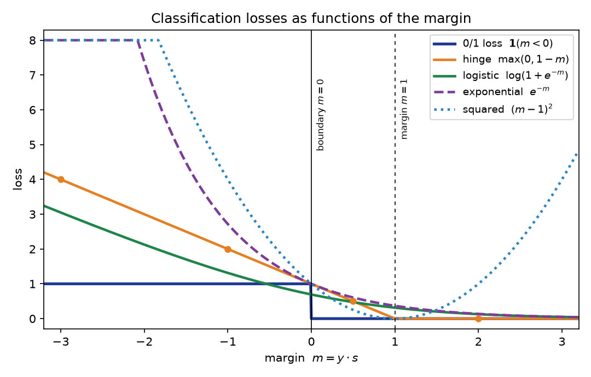

# Chapter 35: Loss functions for classification

Everything in §§35.1–35.9 comes from the MLT Week-12 PPT slides (the "loss-function view": 0/1 loss and its NP-hardness, the four surrogate curves, the perceptron-as-SGD note, the SVM-as-regularization-plus-hinge decomposition, and the logistic-loss margin derivation), with the logistic-regression loss itself from the MITx 6.036 notes (§§31.9–31.10), the hinge loss from §33.3, and the AdaBoost updates from §34.6. §§35.10–35.11 follow ESL ch. 14 (§§14.4–14.6: AdaBoost as forward stagewise exponential-loss minimization, the $\beta_m$ derivation, the population minimizer, the robustness comparison). The worked comparison in §35.10 and the figure use the chapter's own tiny datasets, with every number recomputed independently (review log).

**Notation.** The §22.9 convention: instances $x^{(i)}$, labels $\boxed{y^{(i)} \in \{+1, -1\}}$. A classifier produces a real-valued **score** $s^{(i)} = s(x^{(i)})$ (e.g. $w^T x^{(i)} + b$), and the predicted label is $\operatorname{sign}(s^{(i)})$. The **margin** of example $i$ is $\boxed{m^{(i)} = y^{(i)} s^{(i)}}$: positive means correct, negative means wrong, and its size says *how* correct or wrong. Nearly every classification loss is a function of this single number.

## 35.1 The ideal loss — and why it's unusable

The loss you actually care about is the one from §22.9: the **misclassification (0/1) loss**, the fraction of points you get wrong,
$$L(f) = \frac{1}{n}\sum_{i=1}^{n}\mathbf{1}\!\left(f(x^{(i)}) \ne y^{(i)}\right).$$
It is the scoreboard. But nobody trains with it, and the MLT Week-12 slides say why — three reasons:

i) **It is flat almost everywhere.** §31.7 already made this point for the perceptron: any two hypotheses with the same mistake count "have the same $J$ value" — the loss cannot tell a near-miss from a confident error, "which makes it difficult to design an algorithm that searches through the space of hypotheses for a good one."
ii) **It is not differentiable.** §31.3's note: the 0/1-style bill is piecewise constant in the weights, so gradient descent (Chapter 10) has no slope to follow — the gradient is zero wherever it exists.
iii) **Minimizing it over linear separators is NP-hard** (the slide's word, written in red next to the $\min_w$). Even if you could handle i) and ii), the combinatorial problem itself is intractable.

So every working algorithm trains on a **surrogate**: a stand-in loss that is smooth (or at least convex) and easy to minimize, while the 0/1 loss stays on as the judge. That trade is this chapter's whole subject.

**Basically, ...** "The 0/1 loss is the exam — but you can't study for it directly. It's flat (no slope to descend), jagged (no derivatives), and NP-hard to minimize anyway. So every algorithm picks a *practice* loss that behaves well under optimization and hopes the exam score follows."

## 35.2 One yardstick: the margin

Before the zoo, one definition that organizes everything.

**Def (margin).** For score $s^{(i)}$ and label $y^{(i)} \in \{+1,-1\}$,
$$\boxed{m^{(i)} = y^{(i)} \cdot s^{(i)}}.$$
$m^{(i)} > 0$ = correct; $m^{(i)} < 0$ = wrong; $|m^{(i)}|$ = confidence.

Four regimes a point can be in:
- **Confident correct:** $m \gg 0$ (e.g. $m = 2$).
- **Correct but shaky:** $0 < m < 1$ (right side of the boundary, but close).
- **Wrong:** $m < 0$.
- **Confident wrong:** $m \ll 0$.

Each loss below is a rule for turning this one number into a bill. They all agree that negative margins are mistakes to penalize; they disagree — sometimes violently — on how to price the *size*, and even on whether a bigger positive margin is always better (§35.5's squared loss is the rebel).

**Basically, ...** "Multiply the label by the score. Positive: right answer. Negative: wrong answer. Bigger: more confident. Every loss in this chapter is just a different pricing scheme for this one number."

## 35.3 Zero-one loss: the ideal, restated in margin form

**Def (0/1 loss, per-example).** $\boxed{\ell_{0/1}(m) = \mathbf{1}(m < 0)}$ — $1$ if wrong, $0$ if right. The training objective is the average, $\frac{1}{n}\sum_i \ell_{0/1}(m^{(i)})$, i.e. §22.9's $L(f)$.

**Note (the $m = 0$ convention).** The MLT slide writes $\mathbf{1}(\hat w^T x \cdot y < 0)$ with a *strict* inequality; §22.9's eg 9 instead defines $\operatorname{sign}(0) = +1$, so a boundary point counts as a $+1$ prediction. This chapter follows the slide's strict form; with no margin exactly $0$ in any worked example, the two agree everywhere here.

Shape: a step — flat $1$ for all $m < 0$, flat $0$ for all $m \ge 0$. That is §31.7's flatness made visible: a point with $m = -3$ (confidently wrong) and one with $m = -0.01$ (barely wrong) pay *identically*.

**eg 1 (0/1 on three margins).** Margins $m = 1.5, -0.2, 0.3$:
$$\ell_{0/1} = 0,\ 1,\ 0 \qquad\Rightarrow\qquad \text{average } = 1/3.$$
The barely-wrong point costs as much as a disaster would — the loss grades *whether*, never *how*.

**Basically, ...** "Right: free. Wrong: one rupee — no matter how wrong. The perfect judge and the worst teacher."

## 35.4 Hinge loss: the SVM's bribe

**Def (hinge loss).** $\boxed{\ell_{\text{hinge}}(m) = \max(0,\, 1 - m)}.$

This is the $\xi_i$ of §33.3 — Chapter 33 promised (§33.10) its full treatment here. There, $\xi_i = \max\big(1 - y^{(i)}(w^T x^{(i)} + b),\, 0\big)$ was the "bribe" a point pays for violating the margin, and the MLT Week-12 slide re-derives exactly this: pushing each $\xi_i$ as low as its constraint allows gives $\xi_i = \max(0, 1 - \hat w_i^T x_i y_i)$, turning the soft-margin primal into
$$\min_{w,b}\ \underbrace{\tfrac12\lVert w\rVert^2}_{\text{model-dependent}} + C\sum_{i=1}^{n}\underbrace{\max(0, 1 - y^{(i)}(w^T x^{(i)} + b))}_{\text{data-dependent loss}}$$
— "regularization + hinge loss," in the slide's words.

How it grades the four regimes:
- $m \ge 1$: $\boxed{0}$ — satisfied, pays nothing. The SVM doesn't just want correct; it wants correct *by a margin of 1*.
- $0 < m < 1$: $1 - m > 0$ — **correct, but still charged**. A point barely on the right side pays almost $1$.
- $m < 0$: $1 - m > 1$ — wrong, and charged more than the 0/1 loss's flat $1$, growing linearly with how wrong.

**Note (convex, but not smooth).** The subgradient w.r.t. $w$: $-xy$ when $w^Txy < 1$ (the loss's active region — including correct-but-shaky points, not just mistakes), $0$ when $w^Txy > 1$, and the whole interval between $-xy$ and $0$ at the kink $w^Txy = 1$ — a subgradient, the standard replacement for a derivative at a convex kink. (The MLT slide's "$-xy$ on mistakes, $0$ elsewhere, kink at $w^Txy = 0$" bullet was its *perceptron* statement — the modified hinge of §35.8, not this one.)

**eg 2 (hinge on three margins).** $m = 1.5, -0.2, 0.3$:
$$\max(0, -0.5) = 0,\quad \max(0, 1.2) = 1.2,\quad \max(0, 0.7) = 0.7.$$
Compare eg 1: the barely-wrong point pays $1.2$ (more than 0/1's $1$), and the barely-*right* point pays $0.7$ where 0/1 paid $0$. The SVM taxes uncertainty.

**Basically, ...** "Being right isn't enough — be right with room to spare. Margin above $1$: free. Anything less: you pay $1 - m$, even if you were technically correct. It's the strict teacher who marks down shaky answers."

## 35.5 Squared loss: regression doing classification

The MLT slide's "Alg 1: using regression for classification" just fits $(g(x) - y)^2$ with $y \in \{+1, -1\}$ and $\hat h(x) = \operatorname{sign}(g(x))$. Expanding:
$$(g - y)^2 = g^2 + y^2 - 2gy = (gy)^2 + 1 - 2gy = \boxed{\ell_{\text{sq}}(m) = (m - 1)^2},$$
using $y^2 = 1$. (The MLT Week-12 practice assignment's Q2 computes exactly this loss on a dataset — answer $7$.)

The shape is a parabola with its zero at $m = 1$. Two consequences the slide's plot shows:

i) **It punishes over-confidence.** At $m = 2.5$ (very confidently correct), $\ell_{\text{sq}} = 2.25$ — more than at $m = 0$! It was built for regression, where the score should *equal* the label; "too right" is as bad as wrong.
ii) **It is monotone-wrong.** ESL §14.6: squared error "is not a monotone decreasing function of increasing margin … for margin values $y_i f(x_i) > 1$ it increases quadratically, thereby placing increasing influence (error) on observations that are correctly classified with increasing certainty, thereby reducing the relative influence of those incorrectly classified." Conclusion: "if class assignment is the goal, a monotone decreasing criterion serves as a better surrogate loss function."

**eg 3 (the confidence tax).** $m = 2.5, -1, 0.2$:
$$\ell_{\text{sq}} = 2.25,\ 4,\ 0.64 \qquad\text{vs hinge:}\qquad 0,\ 2,\ 0.8.$$
At $m = 2.5$ the hinge is fully satisfied ($0$) while squared charges $2.25$ — the parabola's right arm is the giveaway that this loss doesn't understand classification.

**Basically, ...** "Squared loss wants the score to *equal* the label, not just agree with it. Nail the answer too confidently and it fines you for showing off. That's why it's a regression loss moonlighting in classification — and not a great one (ESL says so outright)."

## 35.6 Logistic loss: cross-entropy in margin form

§31.9's loss was the negative log-likelihood with $\{0,1\}$ labels,
$$\boxed{L_{\mathrm{nll}}(g, y) = -\big(y\log g + (1-y)\log(1-g)\big)},$$
$g = \sigma(\theta^T x + \theta_0)$. The MLT Week-12 slide converts it to the $\{\pm 1\}$ margin form. Writing $z_i = 1$ for $y_i = +1$ and $z_i = 0$ for $y_i = -1$, with $s_i = \hat w^T x_i$:

- $z_i = 1$: $-\log\sigma(s_i) = -\log\frac{1}{1+e^{-s_i}} = \log(1 + e^{-s_i}) = \log(1 + e^{-y_i s_i})$.
- $z_i = 0$: $-\log(1-\sigma(s_i)) = -\log\frac{e^{-s_i}}{1+e^{-s_i}} = \log(1 + e^{s_i}) = \log(1 + e^{-y_i s_i})$.

Both cases collapse to one formula:
$$\boxed{\ell_{\text{log}}(m) = \log\!\left(1 + e^{-m}\right), \qquad m = y \cdot s}.$$
The slide boxes exactly this as the "logistic loss," and the objective becomes $\min_w \sum_i \log(1 + e^{-y_i s_i})$. This is §31.15(iii)'s "first specimen" $L_{\mathrm{nll}}$, now in its margin uniform.

Behavior: at $m = 0$ it pays $\log 2 \approx 0.693$; for large positive $m$ it decays toward $0$ (never quite reaching it — §31.10: on separable data the weights inflate toward infinite certainty); for large negative $m$ it grows *linearly* ($\log(1+e^{-m}) \approx -m$), much gentler than the exponential loss (§35.7). Unlike hinge it never hits exactly $0$; unlike squared it never punishes being too right.

**eg 4 (the two faces agree).** $\{0,1\}$ form: $g = 0.8$, $y = 1$:
$$L_{\mathrm{nll}} = -\log 0.8 = 0.2231.$$
Margin form: $s = \sigma^{-1}(0.8) = \log\frac{0.8}{0.2} = \log 4 = 1.3863$, $m = (+1)(1.3863)$:
$$\log(1 + e^{-1.3863}) = \log(1 + 0.25) = \log 1.25 = 0.2231.\ \checkmark$$
Same bill, two notations — the margin form just hides the $\{0,1\}\!\leftrightarrow\!\{\pm1\}$ bookkeeping.

**Basically, ...** "Cross-entropy asks: 'how probable did I say the *true* label was?' Take negative log of that probability. The margin formula $\log(1+e^{-m})$ is the same question rewritten so both label conventions give one line. Confident and right: nearly free. Confident and wrong: the bill grows without bound — but only linearly, not exponentially."

## 35.7 Exponential loss: AdaBoost's engine

**Def (exponential loss).** $\boxed{\ell_{\exp}(m) = e^{-m}}.$

The MLT slide's "Boosting" bullet gives it in one line: $\text{Loss} = e^{-y\,h(x)}$. §35.11 derives *why* AdaBoost is secretly minimizing exactly this — but the shape already tells the story: at $m = 0$ it pays $1$; for $m > 0$ it decays toward $0$; for $m < 0$ it **explodes exponentially**. A point with margin $-3$ pays $e^{3} \approx 20.09$ — twenty times the 0/1 loss's flat $1$.

ESL §14.6 compares it with the logistic (binomial deviance) loss: "The penalty associated with binomial deviance increases linearly for large increasingly negative margin, whereas the exponential criterion increases the influence of such observations exponentially." The price of that steepness: the exponential criterion "concentrates much more influence on observations with large negative margins," while the deviance is "far more robust in noisy settings … especially in situations where there is misspecification of the class labels in the training data" — and "the performance of AdaBoost has been empirically observed to dramatically degrade in such situations." Mislabeled points scream under the exponential bill.

**eg 5 (the explosion).** $m = 1.5, -0.2, 0.3$:
$$e^{-1.5} = 0.2231,\quad e^{0.2} = 1.2214,\quad e^{-0.3} = 0.7408.$$
The barely-wrong point pays $1.22$ (above 0/1's $1$ already at $m = -0.2$); a confident error at $m = -3$ would pay $20.09$. Compare logistic's $3.05$ there — the exponential curve is the steepest punisher of confident mistakes in the zoo.

**Basically, ...** "Exponential loss is the drama queen: correct answers get pocket change, but a confident mistake gets billed *exponentially*. That's why AdaBoost obsesses over hard points — and why a mislabeled point can hijack it (ESL documents the degradation)."

## 35.8 The perceptron's loss: hinge without the margin

§31.3's per-example error, $e^{(i)} = \max(0, -w^T\phi(x^{(i)})y^{(i)})$, is the **modified hinge loss** $\boxed{\ell_{\text{mod-hinge}}(m) = \max(0, -m)}$ — the hinge with the margin demand deleted (compare §35.4's $\max(0, 1-m)$). Correct: $0$. Wrong: $-m = |m|$, linear in how wrong.

And the MLT slide draws the consequence: with subgradient $-xy$ on mistakes ($w^Txy < 0$), $0$ elsewhere, one SGD step with step size $1$ gives
$$w_{t+1} = w_t - 1\cdot(-x_i y_i) = w_t + x_i y_i \quad\text{(on mistakes)},$$
i.e. **the perceptron update** (§31.4) — "perceptron can be interpreted as SGD with modified hinge loss with step size $= 1$" (the slide's words; §31.4's $(y^{(i)} - \hat y^{(i)}) = \pm 2$ on mistakes folds the extra factor of $2$ into the step size).

So the perceptron *does* have a loss after all — just the least demanding one in the zoo: it asks only for the right side of the boundary, no margin, no probabilities. That is §31.7's blind spot in one formula.

**Basically, ...** "The perceptron's loss is the hinge loss with the ambition removed: right side = free, wrong side = pay $|m|$. No margin demand, no probability. And its famous update rule is just one SGD step on this loss — 'learn only when wrong' falls out of the subgradient being zero on correct points."

## 35.9 Surrogate losses: the trade

Collecting the MLT slide's conclusions (its closing list, verbatim in spirit):

i) **0/1 loss is NP-hard to minimize** — the ideal is intractable (§35.1).
ii) **Different algorithms use different "surrogate" losses** — SVM → hinge, logistic regression → logistic/cross-entropy, AdaBoost → exponential, perceptron → modified hinge, least-squares-for-classification → squared.
iii) **Surrogates are convex and hence easy to minimize** — every curve in the zoo (except 0/1) is convex in the margin, so gradient/subgradient methods apply.

The deal, then: **train on the surrogate, evaluate on 0/1.** The surrogate is the practice ground you can optimize; the 0/1 loss is the exam you actually care about. ESL's Figure-14.3 note makes the gap concrete: in boosting, "the training-set misclassification error decreases to zero" after ~250 iterations "while the exponential loss continues to decrease" — "Clearly AdaBoost is not optimizing training-set misclassification error; the exponential loss is more sensitive to changes in the estimated class probabilities."

**Note (which surrogates bound 0/1).** The slide's plot shows the surrogates sitting *above* the 0/1 step — almost. Hinge, squared, and exponential are genuine upper bounds of $\mathbf{1}(m<0)$ everywhere (check: $\max(0,1-m) \ge 1$ for $m \le 0$; $(m-1)^2 > 1$ for $m < 0$; $e^{-m} \ge 1$ for $m \le 0$). The logistic loss is **not**: at $m = -0.5$, $\log(1+e^{0.5}) = 0.9741 < 1$. It dips a hair below the step for small negative margins — a fine-print exception worth knowing.

<!-- Original matplotlib illustration drawn for this chapter (not reused from any URL): the five classification losses — 0/1, hinge, logistic, exponential, squared — plotted as functions of the margin m = y*s, with the worked-comparison margins marked on the hinge curve -->

**Basically, ...** "You can't minimize the exam, so you minimize a practice test that's shaped like the exam but smooth enough to study with. Pick the practice test your algorithm was built for — they're all convex, so the studying is easy. Just remember the practice score isn't the exam score: AdaBoost can keep improving its exponential loss long after its mistake count hits zero."

## 35.10 The big comparison: one dataset, five losses

Five points, fixed once, scored under every loss. Scores $s$ and labels $y$:

| point | $s$ | $y$ | margin $m = ys$ | verdict |
|---|---|---|---|---|
| A | $2.0$ | $+1$ | $2.0$ | confident correct |
| B | $0.5$ | $+1$ | $0.5$ | correct, shaky |
| C | $-0.5$ | $-1$ | $0.5$ | correct, shaky |
| D | $-1.0$ | $+1$ | $-1.0$ | wrong |
| E | $3.0$ | $-1$ | $-3.0$ | confident wrong |

The bills (every number recomputed by hand and in numpy — review log):

| point | $m$ | 0/1 $\mathbf{1}(m<0)$ | hinge $\max(0,1-m)$ | logistic $\log(1+e^{-m})$ | squared $(m-1)^2$ | exponential $e^{-m}$ |
|---|---|---|---|---|---|---|
| A | $2.0$ | $0$ | $0$ | $0.1269$ | $1$ | $0.1353$ |
| B | $0.5$ | $0$ | $0.5$ | $0.4741$ | $0.25$ | $0.6065$ |
| C | $0.5$ | $0$ | $0.5$ | $0.4741$ | $0.25$ | $0.6065$ |
| D | $-1.0$ | $1$ | $2$ | $1.3133$ | $4$ | $2.7183$ |
| E | $-3.0$ | $1$ | $4$ | $3.0486$ | $16$ | $20.0855$ |
| **total** | | $2$ ($0.4$ avg) | $7$ ($1.4$ avg) | $5.4369$ ($1.0874$ avg) | $21.5$ ($4.3$ avg) | $24.1522$ ($4.8304$ avg) |

Reading the table:

i) **B and C (correct but shaky):** 0/1 charges nothing; hinge charges $0.5$ — the margin demand made visible. Logistic ($0.4741$) and exponential ($0.6065$) also tax shakiness, gently.
ii) **A (confident correct):** hinge is satisfied ($0$); squared is the *only* loss that punishes it ($1$) — the confidence tax of §35.5.
iii) **E (confident wrong):** 0/1's flat $1$ against exponential's $20.09$. Every surrogate punishes confident errors harder than 0/1 — that extra slope is exactly what makes them trainable.
iv) **Ordering of harshness on mistakes:** exponential $>$ squared $>$ hinge $>$ logistic $>$ 0/1 on point E. The losses don't just differ in shape; they differ in *temperament*.

**Basically, ...** "Same five predictions, five different report cards. 0/1 only counts bodies. Hinge fines you for being right-but-nervous. Squared fines you for being right-and-smug. Exponential goes nuclear on confident mistakes. Logistic stays the calm middle — which is why it's the default."

## 35.11 Why AdaBoost's weights update the way they do

§34.10(iii) promised this story: ESL's deeper theory (ch. 14) shows AdaBoost fits an **additive model** optimizing the **exponential loss** — and once you see it, the $e^{\pm\alpha}$ updates stop looking like magic.

**Setup.** The final classifier is a weighted vote, $G(x) = \operatorname{sign}(f_M(x))$ with
$$f_M(x) = \sum_{m=1}^{M} \beta_m G_m(x), \qquad G_m(x) \in \{+1,-1\},$$
an *additive expansion* in the base classifiers (ESL §14.2). The claim (ESL §14.4): AdaBoost.M1 is **forward stagewise additive modeling** — build $f_M$ one term at a time, never revisiting old terms — with the exponential loss
$$\boxed{L(y, f(x)) = e^{-y\,f(x)}} \qquad\text{(ESL (14.8))}.$$

**Step 1 — the weights are the loss.** At round $m$, the model so far is $f_{m-1}$. Choosing the next pair $(\beta, G)$ to minimize the total exponential loss:
$$(\beta_m, G_m) = \arg\min_{\beta, G}\ \sum_{i=1}^{n} \exp\!\big[-y_i\big(f_{m-1}(x_i) + \beta G(x_i)\big)\big].$$
Factor out everything independent of $(\beta, G)$:
$$= \arg\min_{\beta, G}\ \sum_{i=1}^{n} \underbrace{e^{-y_i f_{m-1}(x_i)}}_{w_i^{(m)}}\ e^{-\beta y_i G(x_i)} \qquad\text{(ESL (14.9))}.$$
The weights $w_i^{(m)} = e^{-y_i f_{m-1}(x_i)}$ **are the current per-point exponential loss** — no separate invention needed. Reweighting *is* loss bookkeeping.

**Step 2 — fitting $G_m$ means minimizing weighted error.** Fix $\beta > 0$. Since $y_i G(x_i) = +1$ on correct points and $-1$ on wrong ones,
$$\sum_i w_i^{(m)} e^{-\beta y_i G(x_i)} = e^{-\beta}\!\!\sum_{\text{correct}}\! w_i^{(m)} + e^{\beta}\!\!\sum_{\text{wrong}}\! w_i^{(m)} = (e^{\beta} - e^{-\beta})\sum_i w_i^{(m)}\mathbf{1}(y_i \ne G(x_i)) + e^{-\beta}\sum_i w_i^{(m)},$$
so the minimizer is
$$\boxed{G_m = \arg\min_G\ \sum_{i=1}^{n} w_i^{(m)}\,\mathbf{1}(y_i \ne G(x_i))} \qquad\text{(ESL (14.10))}$$
— "fit the weak classifier to the data *weighted by* $D_{m-1}$" (§34.6(ii)) falls out of the loss, not from a heuristic.

**Step 3 — the optimal vote weight.** Let $\mathrm{err}_m$ be $G_m$'s weighted error rate (ESL (14.13)). Minimizing the criterion over $\beta$ is one-variable calculus: with total weight $W$,
$$C(\beta) = e^{-\beta}W(1-\mathrm{err}_m) + e^{\beta}W\,\mathrm{err}_m, \quad \frac{dC}{d\beta} = 0 \iff e^{2\beta} = \frac{1-\mathrm{err}_m}{\mathrm{err}_m},$$
$$\boxed{\beta_m^\star = \tfrac12\log\frac{1-\mathrm{err}_m}{\mathrm{err}_m}} \qquad\text{(ESL (14.12))}$$
— the course's $\alpha_m$ (§34.6(iii); the Note there covers ESL's factor-of-2 convention).

**Step 4 — the $e^{\pm\alpha}$ update.** The next round's weights are the updated loss:
$$\boxed{w_i^{(m+1)} = w_i^{(m)}\,e^{-\beta_m^\star\, y_i G_m(x_i)}} \qquad\text{(ESL (14.14))}.$$
Since $y_i G_m(x_i) = +1$ (correct) or $-1$ (wrong):
- correct: multiply by $e^{-\beta_m^\star}$,
- wrong: multiply by $e^{+\beta_m^\star}$.

With the course's $\alpha_m = \beta_m^\star$: **misclassified $\times e^{+\alpha_m}$, correctly classified $\times e^{-\alpha_m}$** — exactly §34.6(iv). (ESL writes it as $w_i^{(m)}e^{\alpha_m\mathbf{1}(\text{wrong})}e^{-\beta_m}$ with $\alpha_m = 2\beta_m$; the common $e^{-\beta_m}$ factor normalizes away — ESL (14.15).)

So the "why": the weights are the exponential loss of the model built so far, and because the loss is exponential, adding a term to the model *multiplies* each point's loss by $e^{-\beta y G}$ — i.e. by $e^{+\alpha}$ for mistakes and $e^{-\alpha}$ for hits. Nothing arbitrary; it is the additive model updating its own books.

**Two sourced footnotes.**

i) **What it estimates.** The population minimizer of the exponential loss is $f^\star(x) = \tfrac12\log\frac{P(Y=1\mid x)}{P(Y=-1\mid x)}$ — one-half the log-odds (ESL (14.16), "easy to show (Friedman et al. 2000)" — the proof is cited, not shown, in ESL). Hence $\operatorname{sign}(f_M)$ is a justified classification rule. The binomial deviance (logistic loss, ESL (14.18)) shares this population minimizer — but "$e^{-Yf}$ itself is not a proper log-likelihood, since it is not the logarithm of any probability mass function" (ESL §14.5).
ii) **Surrogate ≠ scoreboard, again.** ESL's Figure-14.3 note (§35.9): training misclassification hits zero while the exponential loss keeps decreasing — "AdaBoost is not optimizing training-set misclassification error; the exponential loss is more sensitive to changes in the estimated class probabilities."

**Basically, ...** "AdaBoost's weights aren't a trick — they're the current exponential loss, one number per point. Add a stump to the model and each point's loss gets *multiplied* by $e^{+\alpha}$ (if the stump missed it) or $e^{-\alpha}$ (if it got it). The $e^{\pm\alpha}$ update is just the loss doing its own accounting. And at the population level, all that multiplying is estimating half the log-odds — which is why taking the sign at the end is legitimate."

## 35.12 Strengths and limits (as the sources list them)

**Strengths.**
i) **The zoo is honest.** Each loss wears its algorithm's priorities on its sleeve: hinge demands a margin (SVM), logistic grades probabilities (logistic regression), exponential obsesses over hard points (AdaBoost), modified hinge asks only for the right side (perceptron).
ii) **Convexity buys optimizability.** Every surrogate here is convex in the margin — the MLT slide's whole point: "surrogates are convex and hence easy to minimize."
iii) **The margin unifies them.** One number, five pricing schemes — the comparison table of §35.10 is the chapter in miniature.

**Limits.**
i) **The surrogate is not the goal.** Training loss and 0/1 loss can diverge (ESL's Figure-14.3 note, §35.9/§35.11) — §22.10's "training loss is not the goal" in a new costume.
ii) **Surrogates have their own pathologies.** Squared punishes confident-correct points (ESL §14.6: "not a good surrogate"); exponential degrades on mislabeled data (ESL §14.6); logistic has no finite minimizer on separable data without regularization (§31.10); hinge has a kink at $m = 1$ (subgradients needed).
iii) **0/1 stays NP-hard.** The slide states it without proof — this chapter reports the claim, not a proof.

**Basically, ...** "Surrogates are practice tests: convex, gradeable, each with its own bias. None of them *is* the exam, and each has a failure mode. Know which practice test you're taking and what it lies about."

## 35.13 Where this goes next

Part IV closes here. Four promises, kept:

i) §30.11 ("Classification losses get their own chapter") — kept: this chapter.
ii) §31.15(iii) ("$L_{\mathrm{nll}}$ was the first specimen") — kept: §35.6 puts it in margin form alongside the rest.
iii) §33.10 (hinge loss "gets its full treatment") — kept: §35.4, with the $\xi_i$ of §33.3 identified as the hinge loss.
iv) §34.10(iii) ("the 'why do the weights update *this* way' story") — kept: §35.11.

Part VI picks the thread straight back up: the MLT Week-12 slides close with neural networks trained by **cross-entropy loss** for classification (slide 2's $p(y\mid x)$ diagram, "Cross-Entropy Loss") — the logistic loss of §35.6, scaled up to deep networks. Chapter 41 is where that story continues.

**Basically, ...** "Every classifier you met in Part IV was secretly a loss function wearing a trench coat. Part V takes the same losses — cross-entropy front and center — and trains neural networks with them."

## Problem set

1. **Margin and 0/1.** Points $(s, y)$: $A = (1.5, +1)$, $B = (-0.4, +1)$, $C = (-2.2, -1)$, $D = (0.8, -1)$, $E = (0.2, +1)$. (i) Compute each margin $m = ys$. (ii) Using $\ell_{0/1} = \mathbf{1}(m < 0)$, give each point's loss and the average.
2. **Hinge's margin demand.** Same five points. (i) Compute each hinge loss $\max(0, 1-m)$ and the total. (ii) Which points are *correct* ($m > 0$) yet still charged? (iii) In one line: why does the SVM charge them?
3. **Squared loss's confidence tax.** Margins $2.5$, $-1$, $0.2$. (i) Compute $(m-1)^2$ and $\max(0, 1-m)$ for each. (ii) At which margin(s) does squared charge *more* than hinge? (iii) In one line: why would a loss ever dislike $m = 2.5$?
4. **Logistic, two faces.** (i) In $\{0,1\}$ notation compute $L_{\mathrm{nll}}$ for $(g, y) = (0.8, 1)$ and $(0.2, 0)$. (ii) Convert both to $\pm 1$ notation: find each score $s = \sigma^{-1}(g)$, each margin $m$, and verify $\log(1+e^{-m})$ equals the (i) answers.
5. **Perceptron = modified-hinge SGD.** For a misclassified point, $\ell(w) = \max(0, -y\,w^T x)$. (i) Write the loss without the $\max$ and compute $\nabla_w \ell$. (ii) Take one SGD step with step size $1$ and show it is the perceptron update $w \gets w + yx$ (cf. §31.4). (iii) What happens on a correctly classified point, and which §31.4 phrase does that match?
6. **AdaBoost weights from exponential loss.** Normalized weights $w_i$ ($\sum_i w_i = 1$); fixed $G$; $\mathrm{err} = \sum_{i:\,y_i \ne G(x_i)} w_i$. (i) Write $C(\beta) = \sum_i w_i e^{-\beta y_i G(x_i)}$ in terms of $\mathrm{err}$ and show $\beta^\star = \tfrac12\ln\frac{1-\mathrm{err}}{\mathrm{err}}$. (ii) Show the updated weights $w_i e^{-\beta^\star y_i G(x_i)}$ equal §34.6(iv)'s update (misclassified $\times e^{+\alpha_m}$, correct $\times e^{-\alpha_m}$) with the course's $\alpha_m$. (iii) In one line: which step of the derivation forces $G_m$ to minimize the *weighted* error?
7. **True or false, one-line justification:** (i) The hinge loss is differentiable everywhere. (ii) The logistic loss upper-bounds the 0/1 loss. (iii) A point with margin exactly $1$ pays hinge loss $1$. (iv) AdaBoost's $\operatorname{sign}(f_M(x))$ is justified because $f^\star$ estimates half the log-odds. (v) Minimizing 0/1 loss over linear separators is NP-hard (per the MLT slides). (vi) $e^{-Yf}$ is a proper log-likelihood.
