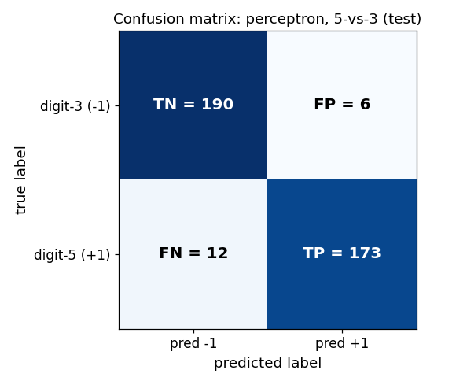

# Chapter 38: scikit-learn: classification workflows

Everything in §§38.1–38.7 comes from the MLP Week-5 "Classification functions in sci-kit learn" slide deck (Dr. Ashish Tendulkar, IIT Madras) and the "Notes by Sejal" Week-5 summary; §§38.8–38.10 draw additionally on the Week-5 programming-questions solution notebook (the MNIST perceptron experiments). This is the code for Chapters 29–35's equations: §31.8 derived $h(x) = \sigma(\theta^T x + \theta_0)$ on paper; here something calls `.fit()` and returns it.

**A word on what was actually run.** sklearn is not installed on this machine (see the chapter task note), so no `sklearn` call below was executed here. The code blocks are transcribed from the course slides and notebooks — verbatim unless a slide typo forced a fix (each fix is logged in `reviews/38-sklearn-classification.md`). Every *number* beside the code is either **[recorded]** — printed as output in the course material itself — or **[verified]** — worked by hand in this session from the recorded confusion-matrix entries (accuracy/precision/recall/F1 are four arithmetic operations on those entries; nothing is invented). The two kinds are marked wherever they could be confused.

**Notation.** The book's standing convention (chapters 31–36): $X \in \mathbb{R}^{n \times d}$ holds the points $x^{(1)}, \dots, x^{(n)}$ as rows. For classifiers the labels are discrete: $y \in \{-1, +1\}^n$ (the §22.9 convention), $\{0, 1\}^n$, or plain strings like `'apple'`. sklearn accepts all three.

## 38.1 The classifier contract: `fit`, `predict`, `decision_function`, `predict_proba`, `score`

**Def (classifier).** A **classifier** = an estimator whose `predict` returns a *label*, not a number. It honors the same contract as §37.1's regressors, with two additions:

i) `fit(X_train, y_train)` — learn the parameters from the training data. For logistic regression, this is §31.10's job: minimize the cross-entropy.
ii) `predict(X_test)` — apply the learned parameters to new data: return a class label per row.
iii) `decision_function(X)` — the *confidence score* before the label is snapped on: for a linear classifier, the raw value $w^T x + b$ (whose sign is the prediction — §22.9's linear separator, un-snapped).
iv) `predict_proba(X)` — for classifiers that model probabilities (§31.8's $P(y=1 \mid x)$): the probability of each class per row.
v) `score(X_test, y_test)` — evaluate on held-out data. For classifiers this returns the **mean accuracy** (fraction correct — §22.9's $1 - L$).

The slide lists these as the common methods "for model training, prediction and evaluation," and adds the miscellaneous shelf: `get_params` / `set_params` (the §37.8 double-underscore addressing works here too), `densify()` / `sparsify()` (convert the coefficient matrix between dense and sparse formats).

The slide's two-API split, which organizes the whole chapter:

| generic | specific |
|---|---|
| `SGDClassifier` — gradient descent; you pick the `loss` | `LogisticRegression`, `Perceptron`, `RidgeClassifier` (least-squares), `KNeighborsClassifier`, `SVC`, `GaussianNB` — specialized solvers |

**Basically, ...** "Chapter 37's regressors predicted numbers; classifiers predict labels. The machine is the same — `fit` learns, `predict` labels, `score` grades (accuracy now, not $R^2$). Two extras: `decision_function` shows the raw score behind the label, `predict_proba` shows the probability. And sklearn splits the shelf in two: one generic engine where *you* name the loss, and one-object-per-algorithm with a purpose-built solver."

## 38.2 The zoo, as the course presents it

The slide names five specific classifier families; each is the code for one of the book's math chapters:

```python
from sklearn.neighbors import KNeighborsClassifier      # §29.2's voters: the k nearest decide
from sklearn.tree import DecisionTreeClassifier         # §29.9's recursive partitions
from sklearn.svm import SVC                             # ch32–33's max-margin machines
from sklearn.naive_bayes import GaussianNB              # §30.7's counters: training is counting
from sklearn.ensemble import RandomForestClassifier, AdaBoostClassifier  # ch34's committees
```

(The class names are the standard sklearn API for the algorithms the slide lists; the slide itself codes only the linear family below — §§38.3–38.6 — which is where this chapter spends its pages.)

**Note (the zoo's shared contract).** Every object above takes `fit(X, y)`, answers `predict(X)`, and reports `score(X, y)` as accuracy. Learn §§38.3–38.6 once and the pattern transfers: the math chapters (29–34) change what happens *inside* `fit`; the three verbs don't move.

## 38.3 Least-squares classification: `RidgeClassifier`

§35.5's idea as an estimator: least-squares classification (LSC) treats the labels as numbers and runs ridge regression on them.

**The construction** (the slide's, kept whole). Binary classification:
i) Convert binary targets to $\{-1, +1\}$.
ii) Treat it as a regression task, minimizing the penalized residual sum of squares
$$\boxed{\min_w \; \lVert Xw - y\rVert_2^2 + \alpha\lVert w\rVert_2^2}$$
— §28.3's ridge objective, now with class labels in the $y$ slot.
iii) The predicted class is the **sign** of the regressor's prediction — §22.9's $\mathrm{sign}(w^T x + b)$ again.

Multiclass: "treated as multi-output regression; predicted class corresponds to the output with the highest value."

```python
from sklearn.linear_model import RidgeClassifier
ridge_classifier = RidgeClassifier()          # step 1: choose the estimator
ridge_classifier.fit(X_train, y_train)        # step 2: learn, on train only
y_pred = ridge_classifier.predict(X_test)     # labels, not numbers
```

**The `alpha` dial** (the slide's): `RidgeClassifier(alpha=0.001)`; default $0.1$ per the slide; must be positive; larger $\alpha$ = stronger regularization — the same dial as §37.7's `Ridge`, and the same book-$\lambda$ (§28.3) wearing the sklearn name.

**Solvers** (the slide's list): `svd` (SVD of the feature matrix), `cholesky` (`scipy.linalg.solve`, closed form), `sparse_cg` (conjugate gradient; "for large scale data"), `lsqr` ("fastest", regularized least-squares routine), `sag`/`saga` ("when both n_samples and n_features are large"; "fast convergence is only guaranteed on features with approximately the same scale" — §37.3's scaling sermon, repeated), `lbfgs`. The default `solver='auto'` picks by data type (the slide's pseudocode):
```python
if solver == 'auto':
    if return_intercept:
        # only sag supports fitting intercept directly
        solver = "sag"
    elif not sparse.issparse(X):
        solver = "cholesky"
    else:
        solver = "sparse_cg"
```
**Intercept:** `fit_intercept=True` by default; if the data is already centered, set it `False` and no intercept is used. `RidgeClassifierCV` = the same estimator with built-in cross-validation (Chapter 39 owns the machinery; §37.7's `RidgeCV` is its regression twin).

**Basically, ...** "Take ridge regression (§28.3), feed it $\pm 1$ labels instead of prices, and read the *sign* of the output as the class. That's the whole classifier. `alpha` is the familiar regularization dial; the solver list is just different routes to the same closed form."

## 38.4 The perceptron, as code

§31.2's neuron, one import away:

```python
from sklearn.linear_model import Perceptron
perceptron_classifier = Perceptron()
perceptron_classifier.fit(X_train, y_train)
```

**The identity that matters** (the slide's): `Perceptron()` shares its implementation with `SGDClassifier`, and
```python
Perceptron()
#  is
SGDClassifier(loss="perceptron", eta0=1, learning_rate="constant", penalty=None)
```
The perceptron (§31.3's "pay only for mistakes" loss) is one loss-setting of the generic engine — §38.6's table makes this a pattern.

**The knobs** (the slide's parameter list): `penalty` (default `'l2'`), `l1_ratio` (default $0.15$), `alpha` (default $10^{-4}$), `fit_intercept` (default `True`), `max_iter` (default $1000$), `tol` ($10^{-3}$), `n_iter_no_change` ($5$), `eta0` ($1$), `validation_fraction` ($0.1$), `early_stopping` (`False`), `warm_start` (re-initialize from the previous run's weights), and `partial_fit` (train one epoch at a time — the course solution uses it to watch the bias evolve).

**eg 1 (a real perceptron, on MNIST digits 6 vs 9) [recorded].** The course's practice solution builds a binary task from MNIST: digit-6 = positive ($+1$), digit-9 = negative ($-1$), first $10{,}000$ images for training. The training split holds $1014$ sixes and $978$ nines [recorded]; the labels are stacked ($+1$s then $-1$s) and shuffled with `random_state=1729` [recorded]:
```python
from sklearn.linear_model import Perceptron
clf = Perceptron(random_state=1729,
                 eta0=1, max_iter=10,
                 shuffle=False,
                 validation_fraction=0.1,
                 fit_intercept=True,
                 penalty=None,
                 warm_start=False)
clf.fit(x_train1, y_train1)
clf.coef_[0, 69]      # the 70th feature's weight (0-based indexing) after 10 epochs
# 605.0  [recorded]
```
`clf.coef_` is §31.1's weight vector, `clf.intercept_` the bias — the same two attributes §37.4 read off a regressor. And the bias across epochs, via `partial_fit` [recorded]:
```python
updates = []
for i in range(5):
    clf.partial_fit(x_train1, y_train1, classes=np.unique(y_train1))
    updates.append(clf.intercept_[0])
# [-1.0, -4.0, -4.0, -6.0, -5.0]  [recorded]
```
Each epoch nudges the bias by $\pm \eta$ per mistake (§31.4's update rule, with $\eta = 1$): the bias walks $-1 \to -4 \to -4 \to -6 \to -5$ as the perceptron argues with the training rows.

**Basically, ...** "The perceptron is one line of sklearn — and secretly one *setting* of the generic SGD engine. Its weights live in `coef_` exactly where the regressor's did. The course's MNIST eg shows the bias literally walking, epoch by epoch, as mistakes get corrected."
## 38.5 Logistic regression, as code

§31.8's model — $P(y=1 \mid x) = \sigma(\theta^T x + \theta_0)$ — as an estimator ("also known as logit regression, maximum-entropy classifier, log-linear classifier," per the slide):

```python
from sklearn.linear_model import LogisticRegression
logit_classifier = LogisticRegression()
logit_classifier.fit(X_train, y_train)
```

**The objective** (the slide's, kept verbatim in shape): the implementation minimizes
$$\text{regularization penalty} \;+\; C \times \text{cross-entropy loss},$$
i.e. $\arg\min_{w}\; \text{penalty} + C \cdot L_{\mathrm{nll}}$ — and §31.9 proved that cross-entropy loss *is* the negative log-likelihood. So `LogisticRegression.fit` is §31.10's training, outsourced to a solver.

**The `C` dial — read this twice.** sklearn's logistic regression does *not* take `alpha`; it takes **`C`, the inverse of the regularization rate**:
i) `C` multiplies the *loss*, not the penalty. Smaller $C$ → the penalty dominates → **stronger** regularization; larger $C$ → weaker.
ii) In the book's §28.3 convention (objective = loss $+$ $\lambda \cdot$ penalty), dividing the slide's objective by $C$ gives $\text{loss} + \tfrac{1}{C}\cdot\text{penalty}$ — so **$\lambda = 1/C$**, i.e. **sklearn's `C` = 1/`alpha`**. §37.7's ridge `alpha` *is* the book's $\lambda$; logistic regression's `C` is its reciprocal. Same dial, flipped name tag.

**Penalties and solvers** (the slide's table):

| solver | penalties supported |
|---|---|
| `'newton-cg'` | `l2`, `none` |
| `'lbfgs'` | `l2`, `none` |
| `'liblinear'` | `l1`, `l2` |
| `'sag'` | `l2`, `none` |
| `'saga'` | `elasticnet`, `l1`, `l2`, `none` |

The slide's selection rules: small datasets → `'liblinear'`; large ones → `'sag'`/`'saga'`; unscaled data → `'liblinear'`, `'lbfgs'`, `'newton-cg'` are robust; multinomial loss (§31.12) needs `'newton-cg'`, `'sag'`, `'saga'`, or `'lbfgs'` — `'liblinear'` is one-vs-rest only. Default: `solver='lbfgs'`, `penalty='l2'` ("regularization is applied by default because it improves numerical stability").

**Class imbalance** (the slide's note): `class_weight` in the constructor — "mistakes in a class are penalized by the class weight; higher value here would mean higher emphasis on the class." Every classifier estimator in sklearn carries it:
```python
LogisticRegression(class_weight={0: 1, 1: 10})   # a mistake on class 1 costs 10x
```

**`LogisticRegressionCV`** = logistic regression with built-in cross-validation over `C` (and `l1_ratio`): `cv` picks the iterator, `scoring` the metric, `Cs` the candidate strengths. `refit=True` averages *scores* across folds, takes the winning `C`, and refits once; `refit=False` averages the *coefficients, intercepts, and C* themselves. (Chapter 39 gives CV its full treatment; the stratified iterators it needs are §38.9's.)

**Basically, ...** "Logistic regression in sklearn = §31.8's sigmoid model + §31.9's cross-entropy loss + a solver doing §31.10's optimization. The one trap is the dial: it is called `C`, it multiplies the *loss*, and it is the *reciprocal* of the regularization strength — $C = 1/\lambda = 1/\mathrm{alpha}$. Small $C$, strong regularization. And `class_weight` is how you tell it that missing class 1 hurts ten times more."

## 38.6 `SGDClassifier`: one engine, many classifiers

§37.3's hill-walker, now for labels: "a simple yet very efficient approach to fitting linear classifiers under convex loss functions" — one sample at a time, model updated along the way with a decreasing learning rate. Same demands as its regression twin: **shuffle the training data before fitting, standardize the features** (sensitive to scaling — §37.3's sermon applies verbatim).

**The `loss` table** (the slide's — this is the whole API):

| `loss=` | classifier trained |
|---|---|
| `'hinge'` (default) | (soft-margin) linear SVM |
| `'log'` | logistic regression |
| `'modified_huber'` | smoothed hinge: outlier-tolerant, with probability estimates |
| `'squared_hinge'` | hinge, quadratically penalized |
| `'perceptron'` | the perceptron (§38.4) |
| `'squared_error'`, `'huber'`, `'epsilon_insensitive'`, `'squared_epsilon_insensitive'` | regression losses (the `SGDRegressor` shelf, §37.3) |

The slide's equivalences, kept as stated:
```python
SGDClassifier(loss='log')      # == LogisticRegression(solver='sgd')
SGDClassifier(loss='hinge')    # == linear support vector machine
```
and multi-class comes free via one-vs-all (§38.7). (Note: real sklearn's `LogisticRegression` has no `solver='sgd'` — the slide's equivalence is in the *loss and optimization* sense: `loss='log'` trains the same logistic-regression objective by SGD. Write `SGDClassifier(loss='log')` in code.) It "easily scales up to more than $10^5$ training examples and $10^5$ features" and handles sparse input — text classification is the slide's named use case.

```python
from sklearn.linear_model import SGDClassifier
SGD_classifier = SGDClassifier(loss='log')   # logistic regression, SGD-flavoured
SGD_classifier.fit(X_train, y_train)
```

**Regularization** (the slide's): `penalty='l2'` (default) / `'l1'` / `'elasticnet'` $= (1 - \text{l1\_ratio})\cdot L2 + \text{l1\_ratio}\cdot L1$ (default `l1_ratio=0.15`); `alpha` multiplies the penalty term (default $10^{-4}$ — §37.7's dial, same name here). `max_iter` = epochs (default $1000$). The shared knobs with `SGDRegressor` (§37.3): `learning_rate` (`'constant'`/`'optimal'`/`'invscaling'`/`'adaptive'`), `tol`, `n_iter_no_change`, `early_stopping`, `validation_fraction`, `average` (averaged SGD), `warm_start`.

**Basically, ...** "`SGDClassifier` is the Swiss-army engine: name a loss, get a classifier. `loss='log'` is logistic regression, `'hinge'` is a linear SVM, `'perceptron'` is §38.4's perceptron — three chapters of math (31, 33, 35) behind one constructor argument. Price of admission: shuffle, scale, and set the knobs §37.3 taught."

## 38.7 Multiclass, multilabel, multioutput

**The three setups** (the slide's definitions):
i) **Multiclass**: exactly one label per example, more than two classes (iris: setosa/versicolor/virginica; MNIST: ten digits).
ii) **Multilabel**: more than one output, each binary (an article tagged {sports, politics}).
iii) **Multiclass-multioutput**: more than one output, each with $> 2$ values.
The slide calls all three "multi-learning problems."

**What shape is `y`?** Ask `type_of_target` (the slide's diagnostic):
```python
from sklearn.utils.multiclass import type_of_target
type_of_target(y)
```
[recorded] examples from the slide: `type_of_target([1, 0, 2])` → `'multiclass'`; `type_of_target([1.0, 0.0, 3.0])` → `'multiclass'`; `type_of_target(['a', 'b', 'c'])` → `'multiclass'`; `type_of_target(np.array([[1, 2], [3, 1]]))` → `'multiclass-multioutput'`; `type_of_target(np.array([[0, 1], [1, 1]]))` → `'multilabel-indicator'`; `type_of_target([[1, 2]])` → `'multilabel-indicator'`. (Plus `'continuous'`/`'continuous-multioutput'` for regression and `'binary'` for two-class.)

**Representing labels** — `LabelBinarizer` turns a label vector into the $(n, k)$ indicator matrix [recorded]:
```python
from sklearn.preprocessing import LabelBinarizer
y = np.array(['apple', 'pear', 'apple', 'orange'])
y_dense = LabelBinarizer().fit_transform(y)
# [[1 0 0]
#  [0 0 1]
#  [1 0 0]
#  [0 1 0]]
```

**Meta-estimators**: wrappers that "transform the multi-learning problem into a set of simpler problems and fit one estimator per problem":
i) `OneVsRestClassifier` — one classifier per class, $c$-vs-rest; $k$ classifiers; "computationally efficient," "interpretable"; also handles multilabel (labels as an $(n, k)$ indicator matrix).
ii) `OneVsOneClassifier` — one classifier per *pair* of classes: $\binom{k}{2} = k(k-1)/2$ classifiers; predicts the class with the most votes, ties broken by aggregate confidence; "processes subset of data at a time," useful when the base classifier "does not scale with the data."
```python
from sklearn.multiclass import OneVsRestClassifier, OneVsOneClassifier
from sklearn.svm import LinearSVC
OneVsRestClassifier(LinearSVC(random_state=0)).fit(X, y)
OneVsOneClassifier(LinearSVC(random_state=0)).fit(X, y)
```
iii) `MultiOutputClassifier` — one classifier per target (multi-output/multi-label).
iv) `ClassifierChain` — chains binary classifiers so each sees the previous targets' predictions: "capable of exploiting correlations among targets" (the slide's contrast: `MultiOutputClassifier` fits independent targets; the chain lets targets talk to each other).

**Built-in support** (the slide's table): many estimators need no wrapper — inherently multiclass: `LogisticRegression(multi_class='multinomial')`, `LogisticRegressionCV(multi_class='multinomial')`, `RidgeClassifier`, `RidgeClassifierCV`; multiclass-as-OVR: `LogisticRegression(multi_class='ovr')`, `SGDClassifier`, `Perceptron`; multilabel: `RidgeClassifier`, `RidgeClassifierCV`. The slide's advice: "All classifiers in scikit-learn perform multiclass classification out-of-the-box. Use `sklearn.multiclass` only when you want to experiment with different multiclass strategies."

**Basically, ...** "One label of many (multiclass), many yes/no labels (multilabel), many multi-valued labels (multioutput) — three shapes, checked with `type_of_target`. Most classifiers already handle multiclass internally (logistic regression even does proper multinomial, §31.12). The meta-estimators are the DIY kit: OVR trains $k$ 'this-vs-everything' classifiers, OVO trains $k(k-1)/2$ pairwise duels and takes the vote."
## 38.8 Evaluation: the confusion matrix, and what it implies

§22.9's 0/1 loss counts mistakes; the confusion matrix *sorts* them. For binary labels with $+1$ the positive class:

**Def (confusion matrix).** `confusion_matrix(y_true, y_pred)` returns the $2 \times 2$ table whose entry $(i, j)$ = "number of observations actually in group $i$ but predicted to be in group $j$" (the slide's definition — **rows are the truth**):

|  | pred $+1$ | pred $-1$ |
|---|---|---|
| true $+1$ | **TP** (true positive) | **FN** (false negative) |
| true $-1$ | **FP** (false positive) | **TN** (true negative) |

From these four counts, everything follows (standard definitions, used exactly as the course's code uses them):
$$\boxed{\text{accuracy} = \frac{TP + TN}{TP+TN+FP+FN}}, \qquad
\boxed{\text{precision} = \frac{TP}{TP + FP}}, \qquad
\boxed{\text{recall} = \frac{TP}{TP + FN}}, \qquad
\boxed{F_1 = \frac{2 \cdot \text{precision} \cdot \text{recall}}{\text{precision} + \text{recall}}}.$$
Accuracy = $1 - $ §22.9's 0/1 loss. Precision = "of everything I *called* positive, how many truly were" (purity of the alarms). Recall = "of everything truly positive, how many did I catch" (completeness of the net). $F_1$ is their harmonic mean — it punishes a classifier that games one at the expense of the other. The slide's metrics shelf: `accuracy_score`, `balanced_accuracy_score`, `top_k_accuracy_score`, `precision_score`, `recall_score`, `f1_score`, `roc_auc_score`.

**eg 2 (the course's digit-5 vs digit-3 perceptron, graded) [recorded entries, arithmetic verified].** The graded solution trains the §38.4-style perceptron (`random_state=42`, `max_iter=100`, `shuffle=True`, no penalty) on MNIST 5-vs-3 (train: $863$ fives, $1032$ threes [recorded]) and reports this test confusion matrix [recorded]:

<!-- Original matplotlib illustration drawn for this chapter (not reused from any URL): the course's recorded confusion matrix, rows = true labels, with TP/TN/FP/FN labeled -->


Read the four cells: $TN = 190$, $FP = 6$, $FN = 12$, $TP = 173$ (positive = digit-5, label $+1$ — sklearn's default `pos_label`). Then:
$$\text{accuracy} = \frac{173 + 190}{381} = \frac{363}{381} \approx \boxed{0.9528},$$
$$\text{precision} = \frac{173}{173 + 6} = \frac{173}{179} \approx \boxed{0.9665}, \qquad
\text{recall} = \frac{173}{173 + 12} = \frac{173}{185} \approx \boxed{0.9351},$$
$$F_1 = \frac{2 \times 0.9665 \times 0.9351}{0.9665 + 0.9351} \approx \boxed{0.9505}.$$
The accuracy/precision/recall match the notebook's printed `0.952755905511811`, `0.9664804469273743`, `0.9351351351351351` [recorded] to every shown digit — the arithmetic is the definition, no magic.

**Note (a wrinkle in the course's own answer keys).** The PDF's answer keys for two graded questions read $FN = 6$, $FP = 12$ — transposed against the confusion matrix above *and* against the notebook's own printed precision/recall (which use sklearn's `pos_label=1` convention: $FP = 6$, $FN = 12$). The chapter follows the matrix and the printed metric values; the discrepancy is logged in the review.

The display machinery (the slide's): `ConfusionMatrixDisplay(confusion_matrix=cm, display_labels=clf.classes_)`, `ConfusionMatrixDisplay.from_estimator(clf, X_test, y_test)`, `ConfusionMatrixDisplay.from_predictions(y_test, y_pred)` — the figure above is that third form's content. And `classification_report(y_true, y_pred)` prints per-class precision/recall/F1 in one text block.

**Basically, ...** "The confusion matrix is the mistake ledger: rows = truth, columns = verdict. $TP$/$TN$ are the agreements, $FP$/$FN$ the two kinds of disagreement. Accuracy counts agreements; precision asks 'were my positive calls right?'; recall asks 'did I find all the positives?'; $F_1$ keeps the two honest with each other. The course's own perceptron gets 95% accuracy — and the matrix shows you *where* the other 5% went."

## 38.9 Thresholds, imbalance, and multiclass metrics

A probabilistic classifier (§31.8) doesn't have to snap at $0.5$. `predict_proba` gives $P(y=1 \mid x)$; choosing the threshold that converts it to a label is a decision, not a law:

i) **Lower the threshold** → more predicted positives → recall rises, precision usually falls.
ii) **Raise the threshold** → fewer, surer positive calls → precision rises, recall falls.

The slide's tools for watching the trade-off move:
```python
from sklearn.metrics import precision_recall_curve, roc_curve
precision, recall, thresholds = precision_recall_curve(y_true, y_predicted)
fpr, tpr, thresholds = roc_curve(y_true, y_scores, pos_label=2)
```
`precision_recall_curve` sweeps the threshold and records precision/recall at each; `roc_curve` sweeps it and records the false-positive rate vs the true-positive rate (recall) — the ROC curve, whose area is `roc_auc_score` (§30.11's closing list names AUC the same way).

**Class imbalance, two levers** (both course-sourced):
i) `class_weight` (§38.5): penalize mistakes on the rare class more, at *training* time.
ii) The threshold (§38.9): move the decision boundary at *prediction* time — free, no retraining.

**One binary metric, $k$ classes** (the slide's `average=` table): treat the problem as $k$ one-vs-rest binaries, then average:
- `macro`: plain mean of the per-class scores (every class equal, rare or not).
- `weighted`: mean weighted by each class's presence in the true data (frequent classes count more).
- `micro`: every sample-class pair contributes equally (big classes dominate).
- `samples`: average the metric over samples (multilabel).
- `None`: no averaging — return the per-class array.

**Basically, ...** "Accuracy is one number; the threshold is a dial you turn *after* training. Lower it and you catch more positives but cry wolf more; raise it and your alarms get trustworthy but sparse. `precision_recall_curve` draws that trade-off so you can pick your point. And when there are $k$ classes, `average=` decides whether rare classes get an equal vote (`macro`) or a proportional one (`weighted`)."

## 38.10 The full classification pipeline: three course experiments

This section replays §37.8's pipeline discipline on classifiers, using the course's own experiments — including two places where the course's first attempt teaches the lesson by failing.

**The setup (both course-sourced).** The graded MNIST 5-vs-3 data ($x_{\text{train}1}$ has shape $(1895, 784)$ [recorded]), and the §38.4 perceptron with `shuffle=True`.

**Experiment A — shuffle matters (or: SGD on sorted data).** Same perceptron, two shuffles [recorded]:

|  | accuracy | precision | recall |
|---|---|---|---|
| `shuffle=True` | $0.9528$ | $0.9665$ | $0.9351$ |
| `shuffle=False` | $0.5486$ | $1.0000$ | $0.0703$ |

With `shuffle=False` the confusion matrix is $(TN, FP, FN, TP) = (196, 0, 172, 13)$ [recorded]: the perceptron predicts $-1$ for nearly everything — perfect precision (its 13 positive calls were all right) and catastrophic recall (it found 13 of 185 fives). Why: the training rows were stacked $+1$s-then-$-1$s (§38.4), and SGD (§38.6) "estimates the gradient with one sample at a time" — fed 863 fives first, it walks deep into five-territory, then 1032 threes drag it back and it never recovers. The slide's rule — "it is important to permute (shuffle) the training data before fitting" — is not hygiene, it is load-bearing. (The course's Q6 answer, options 3/5/7 [recorded]: with shuffling off, accuracy *decreased*, precision *increased*, recall *decreased*.)

**Experiment B — the leak the course committed, then fixed.** To reduce $784$ pixels to $10$, the solution's first attempt was:
```python
x_train1_reduced = pca.fit(x_train1).transform(x_train1)
x_test1_reduced  = pca.fit(x_test1).transform(x_test1)   # fit AGAIN, on the test set
```
Two violations in two lines: fitting on the test set learns the projection from test statistics (§37.8's Note — the same leak as `fit_transform` before the split), and worse, train and test get *different* projection bases. Result: confusion matrix $(119, 77, 92, 93)$ [recorded], accuracy $0.5564$, precision $0.5471$, recall $0.5027$ [recorded] — barely above coin-flip. The corrected version fits once, on train only:
```python
p = pca.fit(x_train1)
x_train1_reduced = p.transform(x_train1)
x_test1_reduced  = p.transform(x_test1)
```
and the structural fix is the pipeline — `fit` learns every step on train, `predict` only transforms (§37.8):
```python
from sklearn.decomposition import PCA
from sklearn.pipeline import make_pipeline
pca = PCA(n_components=10, random_state=1)
clf = Perceptron(random_state=42, eta0=1, max_iter=100,
                 shuffle=True, validation_fraction=0.1,
                 fit_intercept=True, penalty=None, warm_start=False)
pipe = make_pipeline(pca, clf, verbose=1)
pipe.fit(x_train1, y_train1)
y_pred1 = pipe.predict(x_test1)
```
The corrected run's confusion matrix: $(TN, FP, FN, TP) = (175, 21, 9, 176)$ [recorded] — accuracy $351/381 \approx \boxed{0.9213}$, precision $176/197 \approx \boxed{0.8934}$, recall $176/185 \approx \boxed{0.9514}$ [verified]. Ten PCA components keep 92% accuracy; the leak had thrown away 36 points of it.

**Experiment C — does regularization help here?** Same correct-PCA setup, perceptron with `penalty='l2'`, `alpha=0.01` [recorded]: accuracy $0.7480$, precision $0.7543$, recall $0.7135$ [recorded] — from $(TN, FP, FN, TP) = (153, 43, 53, 132)$ [verified]. With `penalty='l1'`, `alpha=0.01` [recorded]: accuracy $0.8688$, precision $0.8689$, recall $0.8595$ [recorded] — from $(172, 24, 26, 159)$ [verified]. Against the unregularized $0.9213$: L2 *hurts*, L1 hurts less but still hurts (the course's Q9 answer: no [recorded]). L1 beats L2 here ($0.8688 > 0.7480$ [verified]) — on $10$ dense PCA components there is nothing to sparsify away, so the penalty is pure drag; §28.9's trade-off cuts both ways.

**Basically, ...** "Three experiments, three morals the course learned the hard way: (1) shuffle before SGD, or the perceptron memorizes the *order* of your data; (2) `pca.fit` on the test set is the leak §37.8 warned about — fit once on train, or let a pipeline make the leak un-writable; (3) regularization is not fairy dust — on already-compressed features it cost 5–17 points of accuracy. Every one of these numbers is the course's own output."

## 38.11 Where this goes next

i) **Evaluation doctrine, properly.** Chapter 39 takes §38.9's sketch — the stratified iterators the slide names (`StratifiedKFold`, `RepeatedStratifiedKFold`, `StratifiedShuffleSplit`: folds that replicate the overall class distribution, because plain folds can starve a class), `LogisticRegressionCV`'s `refit` semantics, and the full grid/randomized search — and makes it a subject.
ii) **Debugging the workflow.** Chapter 40: when `score` prints $0.55$ and the pipeline looks right, the discipline for finding out why — Experiment A's shuffle disaster is the canonical first suspect.
iii) **The neural turn.** The perceptron of §38.4 *is* Chapter 41's neuron with a sign snapped on top; `MLPClassifier` will honor the same `fit`/`predict` contract with a hidden layer inside. The contract outlives linear models — again.

## Problem set

1. **The contract.** (i) In one line each, say what `fit`, `predict`, `decision_function`, and `score` compute for a classifier, in the book's notation ($w, b$; $\mathrm{sign}(w^T x + b)$; §22.9's loss). (ii) Which of these does a regressor's `score` *not* return, and what does it return instead (§37.5)? (iii) `predict_proba` exists for `LogisticRegression` but is meaningless for `RidgeClassifier` — why, from §38.3's construction?
2. **Confusion matrix by hand.** A test set gives $TP = 40$, $TN = 50$, $FP = 10$, $FN = 20$. (i) Compute accuracy, precision, recall, $F_1$. (ii) A colleague reports "accuracy $75\%$, so the model is fine" — the positive class is a rare disease. Using precision and recall, argue in two lines why accuracy alone misleads here.
3. **The `C` translation.** The slide's logistic-regression objective is $\text{penalty} + C \cdot \text{cross-entropy loss}$. (i) Divide through by $C$ and match against the book's §28.3 form $\text{loss} + \lambda \cdot \text{penalty}$ to show $\lambda = 1/C$. (ii) Explain in one line why *smaller* $C$ means *stronger* regularization. (iii) §37.7 says ridge's `alpha` *is* the book's $\lambda$ — so what is `LogisticRegression(C=...)`'s `C` in terms of that `alpha`?
4. **Course-sourced.** The slide's `LabelBinarizer` example transforms `['apple', 'pear', 'apple', 'orange']`. (i) Write the $(4, 3)$ indicator matrix by hand and check it against the recorded output. (ii) Why does the slide say the result has shape $(n, k)$ — what are $n$ and $k$ here?
5. **Threshold moving.** `precision, recall, thresholds = precision_recall_curve(y_true, y_predicted)` (the slide's call). (i) As you walk the thresholds array from high to low, what happens to the number of predicted positives, and hence to recall? (ii) A spam filter must almost never flag a legitimate email, but may let some spam through. Should its threshold go up or down from $0.5$, and which metric is being protected?
6. **Spot the leak.** The course solution's first PCA attempt (Experiment B) ran `pca.fit(x_train1)` *and* `pca.fit(x_test1)`. (i) Name the discipline this violates (§37.8's Note / §36.7) and say exactly what leaks where — and what *else* breaks beyond the leak. (ii) Rewrite the two lines so the leak is structurally impossible (one `fit`, or a pipeline).
7. **OVR vs OVO.** (i) For $k = 5$ classes, how many binary classifiers do `OneVsRestClassifier` and `OneVsOneClassifier` train? (ii) The slide says OVO "processes subset of data at a time and is useful in cases where the classifier does not scale with the data" — explain in one line why training on subsets helps an unscalable base estimator.
8. **Diagnose the fit.** A perceptron reports test accuracy $0.5486$, precision $1.0$, recall $0.0703$ (Experiment A's numbers). (i) Reconstruct the approximate confusion matrix counts from these three numbers plus $n = 381$ (positive class = $185$ rows). (ii) Diagnose in §38.6's vocabulary: what single constructor argument most likely caused this, and why does it interact with how the course stacked the training rows?
