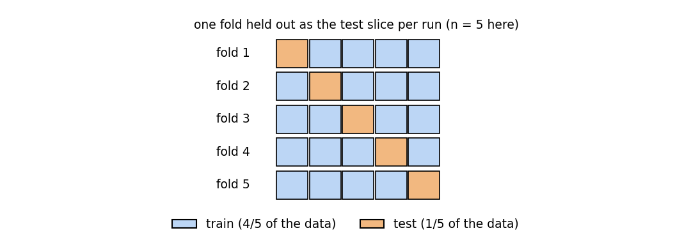

# Chapter 39: Model evaluation, cross-validation, hyperparameter tuning

Everything in §§39.1–39.4 comes from the MLP Week-3 "Linear Regression" slide deck (Dr. Ashish Tendulkar, IIT Madras) and the "Notes by Sejal" Week-3 summary; §§39.6–39.7 from the Week-4 "Polynomial regression / Hyperparameter tuning" deck; §39.5 and the `LogisticRegressionCV` part of §39.8 from the Week-5 classification deck; the course experiments from the Week-3 and Week-4 programming-question solution notebooks. This is the code for §23.9's overfitting diagnosis, §28.10's $\lambda$-choosing discipline, and §37.9's hyperparameter sketch — now as full subjects.

**A word on what was actually run.** sklearn is not installed on this machine (see the chapter task note), so no `sklearn` call below was executed here. The code blocks are transcribed from the course slides and notebooks — verbatim unless a slide typo forced a fix (each fix is logged in `reviews/39-model-evaluation-cv.md`). Every *number* beside the code is either **[recorded]** — printed as output in the course material itself — or **[verified]** — worked by hand in this session from definitions (fold index sets, split-MSE arithmetic, variance ratios). The two kinds are marked wherever they could be confused.

**Notation.** $X \in \mathbb{R}^{n \times d}$ as usual (chapters 31–38). A *hyperparameter* is set before training; a *parameter* is learned by it.

## 39.1 One test split is a noisy number

The Week-3 deck states the evaluation ritual in four steps:

i) **STEP 1:** Split data into train and test — `train_test_split(X, y, random_state=42)` (§36.6's seeded split).
ii) **STEP 2:** Fit the estimator on the training set.
iii) **STEP 3:** Calculate the **training error** (a.k.a. *empirical error*) — how wrong the model is on data it already saw.
iv) **STEP 4:** Calculate the **test error** (a.k.a. *generalization error*) — how wrong it is on data it never saw.

Then compare training and test errors (§23.9's whole diagnosis lives in that comparison).

**Def (score vs error).** A **score** = a metric where higher is better ($R^2$). An **error** = a metric where lower is better (mean squared error). sklearn needs scores to maximize, so it converts an error metric into a score metric by negating it — the **`neg_` prefix** (§37.5): `neg_mean_absolute_error`, `neg_mean_squared_error`, `neg_root_mean_squared_error`, `neg_mean_squared_log_error`, `neg_median_absolute_error`.

But the deck immediately asks the uncomfortable question: *if train and test performance look comparable on this one split, is that performance guaranteed on other splits too?* Two ways the answer is no:

i) **Small test set → unstable estimate.** The test error is a sample statistic; with few test points it wobbles and "would not reflect the true test error on large test set" (the slide's words).
ii) **Lucky split → optimistic estimate.** "What is the chance that the easiest examples were kept aside as test by chance? This if happens would lead to optimistic estimation of the true test error."

**eg 1 (how loud one split can be — hand arithmetic) [verified].** The slide's own baseline estimator, `DummyRegressor(strategy="mean")` ("makes a prediction as specified by the strategy" — here, the training mean), on four labels $y = (1, 2, 10, 11)$. Test mean squared error for three different 50/50 splits:

| split | train | test | train mean | test MSE |
|---|---|---|---|---|
| A | $\{1, 2\}$ | $\{10, 11\}$ | $1.5$ | $\frac{(10-1.5)^2 + (11-1.5)^2}{2} = \frac{72.25 + 90.25}{2} = \boxed{81.25}$ |
| B | $\{1, 10\}$ | $\{2, 11\}$ | $5.5$ | $\frac{(2-5.5)^2 + (11-5.5)^2}{2} = \frac{12.25 + 30.25}{2} = \boxed{21.25}$ |
| C | $\{1, 11\}$ | $\{2, 10\}$ | $6$ | $\frac{(2-6)^2 + (10-6)^2}{2} = \frac{16 + 16}{2} = \boxed{16.00}$ |

Same model class, same data, one shuffle of luck apart: the estimate swings **$16$ → $81$**. (The solutions volume also works out the leave-one-out number, $36.44$ — the average over every possible hold-out.) The slide's remedy: "We use cross validation for robust performance evaluation."

**Note (beat the dummy first).** `DummyRegressor(strategy="mean"/"median"/"quantile"/"constant")` exists so every evaluation starts with a floor: a real model must beat the dumbest sensible predictor. The deck's $R^2$ page makes the floor quantitative — "a constant model that always predicts the expected value of $y$ would get a score of $0.0$." If your tuned regressor scores $0.05$, you have learned almost nothing.

**Basically, ...** "One split gives one number, and the number depends on which rows drew the short straw. Small test set? Unstable. Easy rows in test? Flattering. The fix is to re-split *many times* and average — that's all cross-validation is."

## 39.2 Cross-validation: the robust estimate

**Def (cross-validation).** **Cross-validation** = repeated splitting into training and test parts, producing *many* train/test errors instead of one — "this enables us to estimate variability in generalization performance of the model" (the slide's sentence). sklearn's iterators, all in `sklearn.model_selection`:

i) **`KFold`** — divide the data into $k$ folds; each run uses $k-1$ folds for training and $1$ for evaluation; rotate the held-out fold.
ii) **`RepeatedKFold`** — repeat $k$-fold $r$ times with different shuffles (averages out the fold-luck too).
iii) **`LeaveOneOut`** — $k = n$: each point gets its own test fold. Maximum data reuse, $n$ fits — expensive.
iv) **`ShuffleSplit`** — "random permutation based": shuffle, split into train/test, repeat $n$ user-chosen times with a chosen `test_size`. Not a partition — test sets of different iterations can overlap.

<!-- Original matplotlib illustration drawn for this chapter (not reused from any URL): five rows (folds 1–5), each a bar of five blocks; per row exactly one block (the held-out fold) is colored orange, the other four blue -->


**The workhorse call.** `cross_val_score` runs the estimator through the iterator and returns one score per fold:
```python
from sklearn.model_selection import cross_val_score

lin_reg = LinearRegression()                       # the slide writes linear_regression(); the class is LinearRegression
score = cross_val_score(lin_reg, X, y, cv=5)       # KFold, 5 folds -> 5 scores
```
With an explicit iterator (the slide's alternate form):
```python
from sklearn.model_selection import KFold
kfold_cv = KFold(n_splits=5, random_state=42)
score = cross_val_score(lin_reg, X, y, cv=kfold_cv)
```
**Note (`random_state` without `shuffle`).** The slide's `KFold(n_splits=5, random_state=42)` never sets `shuffle=True` — and with the default `shuffle=False` the folds are deterministic contiguous blocks, so `random_state` is silently inert (it only takes effect when `shuffle=True`). Transcribed as written; the caveat is cross-checked against the sklearn docs, and logged in the review.

**eg 2 (fold arithmetic — no sklearn needed) [verified].** $n = 6$ rows, `KFold(n_splits=3)` without shuffling. The three test index sets are forced by the definition: $\{0, 1\}$, $\{2, 3\}$, $\{4, 5\}$ — each row is tested exactly once, trained on exactly twice. `LeaveOneOut` on the same data is `KFold(n_splits=6)`: $6$ fits, test sets $\{0\}, \{1\}, \dots, \{5\}$.

**The repeated version, as the course ran it [recorded].** The Week-4 graded question runs `RepeatedKFold(n_splits=2, n_repeats=2, random_state=1)` on `X = [[1, 2], [3, 4], [1, 2], [3, 4]]` and asks for the concatenated train+test indices:
```python
from sklearn.model_selection import RepeatedKFold
ans = RepeatedKFold(n_splits=2, n_repeats=2, random_state=1)
for train, test in ans.split(X):
    ...
array1 = np.append(train, test)    # the course's function returns only the LAST iteration's split
# [0 2 1 3]  [recorded]
```
Read it as: in the final repetition's final split, rows $\{0, 2\}$ trained and rows $\{1, 3\}$ were tested (the graded answer's option (a)). The four splits ran; the function kept only the last one — a quirk of the course's code, not of `RepeatedKFold`.

**`ShuffleSplit`, the slide's third form:**
```python
from sklearn.model_selection import ShuffleSplit
shuffle_split = ShuffleSplit(n_splits=5, test_size=0.2, random_state=42)
score = cross_val_score(lin_reg, X, y, cv=shuffle_split)
```
"You define the number of splits and the test fraction; each iteration shuffles and re-splits." The slide adds that it is "robust to class distribution" — read alongside §39.5: repeated random subsampling averages out split luck, but *proportion-matching* is the stratified iterators' job, not this one's.

**Basically, ...** "`KFold` is the honest version of the single split: cut the data into $k$ slices, test each slice once, average the $k$ numbers. `LeaveOneOut` takes it to the extreme ($k = n$, $n$ fits — slow). `RepeatedKFold` repeats the cutting to average out fold luck. `ShuffleSplit` rolls its own random splits. All four answer the same question: what does the test error look like *on average*, not on one lucky split?"

## 39.3 `cross_val_score` vs `cross_validate`: what they return

The slide draws a sharp line between the two:

i) **`cross_val_score`** — the quick one. Returns a plain array of *test* scores, one per fold (`cv=5` → five numbers). One metric only.
ii) **`cross_validate`** — the instrumented one. Returns a **dictionary** with keys:
   - `fit_time`, `score_time` — how long fitting and scoring took per fold,
   - `test_score` — the per-fold test scores,
   - `estimator` — the fitted estimator per fold (only with `return_estimator=True`),
   - `train_score` — the per-fold training scores (only with `return_train_score=True`).

```python
from sklearn.model_selection import cross_validate, ShuffleSplit

cv = ShuffleSplit(n_splits=40, test_size=0.3, random_state=0)
cv_results = cross_validate(regressor, data, target, cv=cv,
                            scoring="neg_mean_absolute_error")
# cv_results['test_score']  -> 40 numbers; cv_results['fit_time'] -> 40 timings
```

Need the fitted models or the train scores (the train/test gap is §23.9's overfitting signal)? Ask for them:
```python
cv_results = cross_validate(regressor, data, target, cv=cv,
                            scoring="neg_mean_absolute_error",
                            return_train_score=True,
                            return_estimator=True)
# cv_results['estimator']  -> the 40 fitted estimators
```

And `cross_validate` — unlike `cross_val_score` — accepts a **list of scorings** and computes all of them in the same folds:
```python
cv_results = cross_validate(regressor, data, target, cv=cv,
                            scoring=["neg_mean_absolute_error", "neg_mean_squared_error"],
                            return_train_score=True, return_estimator=True)
```

**The `scoring=` menu** (the slide's list, regression): `max_error`, `r2`, `neg_mean_absolute_error`, `neg_mean_squared_error`, `neg_mean_squared_log_error`, `neg_median_absolute_error`, `neg_root_mean_squared_error`. Two reading rules, straight from the definitions:

i) Every `neg_` value is $\leq 0$; **negate it to get the error**. `cross_val_score(..., scoring='neg_mean_squared_error')` returning $-16.04$ means $\mathrm{MSE} = 16.04$.
ii) sklearn maximizes whatever `scoring` names — the `neg_` versions exist (§37.5) so that "higher is better" machinery can optimize an error.

**Basically, ...** "`cross_val_score` answers 'how good, on average?' with one array. `cross_validate` answers 'how good, how long, and what did each fold's model look like?' with a dict — and it can score several metrics at once, which `cross_val_score` refuses to do. And whenever you see `neg_`, flip the sign before reading it as an error."

## 39.4 Learning curves: §23.9 as code

§23.9 diagnosed overfitting on paper by comparing training and test error at *one* training size. The slide's `learning_curve` asks the follow-up question: **how do the two errors move as the training set grows?**

```python
from sklearn.model_selection import learning_curve

results = learning_curve(lin_reg, X_train, y_train,
                         train_sizes=train_sizes, cv=cv,
                         scoring="neg_mean_absolute_error")
train_size, train_scores, test_scores = results[:3]
# Convert the scores into errors
train_errors, test_errors = -train_scores, -test_scores
```

Three facts about the shapes (from the call's semantics): `train_size` is the $m$ training sizes tried; `train_scores` and `test_scores` have shape $(m, k)$ — one row per training size, one column per fold. The slide's STEP 2: plot the per-size means (usually $\pm$ one standard deviation) of the two errors against $n$, "and make assessment about model fitment: under/overfitting or right fit."

<!-- Original matplotlib illustration drawn for this chapter (not reused from any URL): learning-curve schematic — training error falling fast and flattening low; cross-validated error starting high and converging toward it; annotations marking the overfit gap and the underfit plateau -->


**Reading the curves** (the standard reading of the slide's "under/overfitting or right fit"):

i) **Both errors high and flat** → **underfit** (§23.9's $m = 1$ line). The model can't express the pattern; more data won't help — change the model (more features, less regularization).
ii) **Train error low, CV error high, gap still closing as $n$ grows** → **overfit that data can cure**. More training rows pull the two curves together.
iii) **Gap that stays open at the largest $n$** → **overfit that needs the model changed** — §28.9's trade-off says the dial is now regularization or capacity, not data.

The slide's second diagnosis sketch works the *other* axis: "Fit linear models with different number of features … plot #features vs error graph — one each for training and test errors … We can replace #features with any other tunable hyperparameter to do this diagnosis for setting that hyperparameter." (sklearn's name for exactly this is `validation_curve` — flagged as a standard-resource cross-check in the review log; the slide describes the idea without naming the function.)

**Basically, ...** "A learning curve is §23.9's train-vs-test comparison with the x-axis switched from 'one dataset' to 'how much data'. Two lines: training error (optimistic, falls) and cross-validated error (honest, falls toward it). Both stuck high — your model is too simple, buy capacity. A gap that keeps closing — buy data. A gap that won't close — buy regularization."

## 39.5 Stratified iterators: the classification addition

The Week-5 deck opens with a scope note that organizes this whole chapter's second half: "Cross validation and hyper parameter search for classification works exactly like how it works in regression setting" — with "a couple of CV strategies that are specific to classification." Those strategies are the **stratified iterators**.

**The problem** (the slide's): "There may be issues like class imbalance in classification, which tend to impact the cross validation folds. The overall class distribution and the ones in folds may be different and this has implications in effective model training." A fold that accidentally contains no positives can't train (or test) the positive class.

**The fix** (the slide's): "sklearn.model_selection provides three stratified APIs to create folds such that the **overall class distribution is replicated in individual folds**":

i) **`StratifiedKFold`** — $k$-fold with each fold's class proportions matching the whole dataset.
ii) **`RepeatedStratifiedKFold`** — the repeated version.
iii) **`StratifiedShuffleSplit`** — the shuffle-split version. **Note** (the slide's): "Folds obtained via `StratifiedShuffleSplit` may not be completely different" — test sets can overlap across iterations, so it is repeated subsampling, not a partition.

**eg 3 (why plain folds starve — hand arithmetic) [verified].** Eight rows, $4$ positive / $4$ negative, sorted positives-first, `n_splits=2`, no shuffling:

- Plain `KFold`: test fold 1 = rows $\{0, 1, 2, 3\}$ — **all positive**; test fold 2 = rows $\{4, 5, 6, 7\}$ — **all negative**. Fold 1's model trains on negatives only and is tested on positives only.
- `StratifiedKFold(n_splits=2)`: each test fold holds $2$ positives and $2$ negatives — the $50/50$ overall split replicated exactly.

The arithmetic is definitional: stratification forces each fold to mirror the dataset's class fractions.

**Basically, ...** "Plain folds cut the data blindly; on imbalanced or sorted labels a fold can end up with zero examples of a class. The stratified iterators cut *each class* separately and stack the slices, so every fold is a miniature of the whole dataset's class mix. For classification, reach for these by default — the Week-5 deck says everything else about CV and HPT is identical to the regression case."

## 39.6 The three-way split doctrine: train / validation / test

Hyperparameters are the things cross-validation is *for*. The Week-4 deck defines them first:

**Def (hyperparameter).** **Hyperparameters** = "parameters that are not directly learnt within estimators. In sklearn, they are passed as arguments to the constructor of the estimator classes" — e.g. `degree` in `PolynomialFeatures`, the learning rate in `SGDRegressor`. (Parameters are learned by `fit`; hyperparameters are chosen by you.) §28.10 did this on paper for $\lambda$; this section is the code.

**Def (hyperparameter search).** The slide's five ingredients: **an estimator** (regressor or classifier); **a parameter space**; **a method for searching or sampling candidates**; **a cross-validation scheme**; and **a score function**.

Choosing hyperparameters on the *test* set would spend the test set — it would become a second validation set, and the final number would be optimistic (§28.10's discipline). So the slide mandates a **three-way split** — training, validation, test — and five steps:

i) **STEP 1:** Divide the data into training, validation, and test sets.
ii) **STEP 2:** For each hyperparameter combination, learn a model on the **training** set. *Tips (the slide's):* run the combinations in parallel with `n_jobs=-1`; some combinations may fail on some folds — set `error_score=0` (or `np.NaN`) so the search survives a bad combination instead of crashing.
iii) **STEP 3:** Evaluate each model on the **validation** set; pick the best-scoring combination.
iv) **STEP 4:** **Retrain** the winner on training **and** validation combined — the winner deserves the validation rows too, now that their job (choosing) is done.
v) **STEP 5:** Evaluate the retrained model on the **test set, once.**

The slide's closing line, the doctrine's whole point: "Note that the **test set was not used in hyper-parameter search and model retraining**." §37.9's one-line version: **spend the test set exactly once.**

**Basically, ...** "Three piles, three jobs: *train* teaches the parameters, *validation* picks the hyperparameters, *test* grades the final model — once, at the very end. Touch the test set during tuning and your grade is rigged. The five steps are: split three ways, train every candidate on train, crown the winner on validation, re-train the winner on train+validation, grade once on test."

## 39.7 `GridSearchCV` vs `RandomizedSearchCV`

The slide's two generic search strategies:

| | Grid search | Randomized search |
|---|---|---|
| What you specify | exact values of each parameter | **distributions** over parameter values |
| How candidates are picked | **all** combinations, exhaustively | **sampled** from the distributions |
| Budget | forced: grows as the product of the value lists | **chosen by you**, independent of the number of parameters — the `n_iter` argument (default $10$) |

**The course's grid experiment [recorded].** The Week-4 notebook tunes `SGDRegressor` on the California housing data (70/30 split, `random_state=1`, standardized features — the scale-first-then-search shape §39.9 will fix):
```python
from sklearn.model_selection import GridSearchCV
from sklearn.linear_model import SGDRegressor

sgdregressor = SGDRegressor(random_state=1)
sgdr_model = GridSearchCV(sgdregressor,
                          {'loss': ['squared_error', 'huber'],
                           'penalty': ['l2', 'l1'],
                           'alpha': [0.1, 0.01, 0.001],
                           'max_iter': [1000, 2000, 5000]},
                          cv=4,
                          return_train_score=True)
sgdr_model.fit(X_train_norm, y_train)
sgdr_model.best_params_
# {'alpha': 0.01, 'loss': 'squared_error', 'max_iter': 1000, 'penalty': 'l1'}  [recorded]
sgdr_model.score(X_test_norm, y_test)
# 0.5951040704728554  [recorded]   (test R^2, the once-spent test set)
```
Count the work [verified]: $2 \times 2 \times 3 \times 3 = 36$ combinations $\times$ $4$ folds = $144$ fits. The winner: squared-error loss, L1 penalty, `alpha = 0.01`, `max_iter = 1000` — and `best_params_` hands you exactly that dict.

**The course's ridge experiment [recorded].** Same data, `Ridge` through `GridSearchCV` over `alpha` $\in \{0.5, 0.1, 0.05, 0.01, 0.005, 0.001\}$ and `fit_intercept` $\in \{\mathrm{True}, \mathrm{False}\}$, `cv=4`:
```python
ridge_model = GridSearchCV(Ridge(),
                           {'fit_intercept': [True, False],
                            'alpha': [0.5, 0.1, 0.05, 0.01, 0.005, 0.001]},
                           cv=4)
ridge_model.fit(X_train_norm, y_train)
# best_params_ -> {'alpha': 0.5, 'fit_intercept': True}  [recorded]
# test R^2 -> 0.5971450612248769  [recorded]
```

**The course's randomized experiment — and its warning [recorded].** `Lasso` through `RandomizedSearchCV` over a *discrete* space of $2 \times 4 = 8$ combinations (`fit_intercept`, `alpha` $\in \{1, 0.1, 0.01, 0.001\}$), `cv=6`:
```python
lasso_model = RandomizedSearchCV(Lasso(),
                                 {'fit_intercept': [True, False],
                                  'alpha': [1, 0.1, 0.01, 0.001]},
                                 cv=6)
lasso_model.fit(X_train_norm, y_train)
```
sklearn printed (verbatim from the notebook):
```
UserWarning: The total space of parameters 8 is smaller than n_iter=10.
Running 8 iterations. For exhaustive searches, use GridSearchCV.
```
and then `best_params_` $\to$ `{'fit_intercept': True, 'alpha': 0.001}` [recorded], test $R^2 = 0.6065831805608592$ [recorded]. The moral: random search on a *tiny discrete* space degenerates into grid search — the warning is the tell. Randomized search earns its keep on large or continuous spaces, where $10$ (or $50$, or $100$) sampled candidates beat an exponential grid.

**The slide's pipeline grid** (the shape §39.9 adopts — typo `POlynomialFeatures` fixed, logged in the review; §37.9 showed this too):
```python
from sklearn.model_selection import GridSearchCV
from sklearn.pipeline import Pipeline
from sklearn.preprocessing import PolynomialFeatures
from sklearn.linear_model import SGDRegressor

param_grid = [{'poly__degree': [2, 3, 4, 5, 6, 7, 8, 9]}]
pipeline = Pipeline(steps=[('poly', PolynomialFeatures()),
                           ('sgd', SGDRegressor())])
grid_search = GridSearchCV(pipeline, param_grid, cv=5,
                           scoring='neg_mean_squared_error',
                           return_train_score=True)
grid_search.fit(X_train, y_train)   # slide: x_train.reshape(-1, 1) for 1-D input
```
`poly__degree` is §37.8's double-underscore addressing: reach *inside* the named pipeline step and set its hyperparameter. `return_train_score=True` keeps the train-side CV scores too — the train/CV gap is the overfitting read of §39.4.

**`refit`, the quiet default.** The slide's HPT STEP 4 (retrain the winner on train+validation) is what `GridSearchCV` does for you automatically: with the default `refit=True`, after the search it refits the best combination on the *whole* training data, so `best_estimator_` is ready to predict and `.score(X_test, y_test)` works straight away. (Cross-checked against standard sklearn behavior; logged in the review.)

**Basically, ...** "Grid search tries *everything* — $36$ combos $\times$ $4$ folds = $144$ fits in the course's SGD eg, winner `{alpha: 0.01, loss: 'squared_error', max_iter: 1000, penalty: 'l1'}`. Randomized search tries `n_iter` *samples* — brilliant on big continuous spaces, pointless on an 8-combo space (sklearn literally warns you and runs the 8). The course's own numbers: SGD $0.5951$, ridge $0.5971$, lasso $0.6066$ — all test $R^2$, all on the once-spent test set."

## 39.8 Model-specific HPT: `RidgeCV`, `LassoCV`, `ElasticNetCV`, `LogisticRegressionCV`

Grid search is generic; some estimators tune *one* parameter so efficiently that the CV is built in. The slide's principle: "Some models can fit data for a range of values of some parameter **almost as efficiently as fitting the estimator for a single value** of the parameter. This feature can be leveraged to perform more efficient cross-validation used for model selection of this parameter."

i) **`RidgeCV` / `LassoCV` / `ElasticNetCV`** (§37.7's one-line version; the slide's details): hand `RidgeCV` the candidate strengths via **`alphas`** — "the regularization rate must be positive; larger values indicate stronger regularization" (the §37.7 dial). **`cv`** picks the splitting strategy: `None` → the efficient Leave-One-Out path; an integer → that many folds; a CV splitter; or an iterable of (train, test) index splits. For binary/multiclass targets with `cv=None` or an integer, the slide says `StratifiedKFold` is used — §39.5's iterators, inside the estimator. The fitted estimator reports the chosen strength: the slide writes "`alphas` provides the estimated regularization parameter" — in current sklearn the winner lives in **`alpha_`** (§37.7 already used that name; the slide's `alphas` is the constructor's candidate list — logged in the review).
ii) **`LogisticRegressionCV`** (Week-5 deck): "logistic regression with in-built cross validation support to find the best values of **C** and **l1_ratio** according to the specified scoring attribute." Key parameters: **`cv`** (the iterator), **`scoring`** (the metric), **`Cs`** (the candidate regularization strengths — the slide writes "cs"). **Note** (cross-check, also in `reviews/38-sklearn-classification.md`): the slide's `l1_ratio` is the current sklearn keyword **`l1_ratios`** (a list of candidates, like `Cs`). And the **`refit`** semantics (also §38.5's):
   - `refit=True`: "scores averaged across folds, values corresponding to the best score are selected, and final refit with these parameters" — one winner $C$, one final model.
   - `refit=False`: "the coefs, intercepts and C that correspond to the best scores across folds are averaged" — the answer is an *average* of fold-winners, no final refit.

**When to use which.** The slide's own two options for ridge's `alpha`: "[Option #1] built-in cross validation in `RidgeCV`" (cheap, one parameter) vs "[Option #2] Grid search / Randomized search" (general, many parameters). Same pattern for lasso. If the *only* dial is the regularization strength, the `*CV` estimator is the short path; the moment you tune two or more things (say, `degree` *and* `alpha`), it is `GridSearchCV` over the pipeline.

**Basically, ...** "For one special dial — the regularization strength — sklearn ships estimators with the search baked in: `RidgeCV`/`LassoCV`/`ElasticNetCV` for regression, `LogisticRegressionCV` for classification (tuning $C$, with `refit` choosing between 'crown one winner and refit' and 'average the fold-winners'). One dial → the `*CV` estimator; several dials → `GridSearchCV` over a pipeline."

## 39.9 The pipeline + search combination: leak-proof HPT

Look again at the course's grid-search notebook (§39.7): it standardized *first* (`scaler.fit_transform(X_train)`), then searched. That works here only because the scaler was fit on the training split. But inside the CV loop the scaler stays fixed across folds while the estimator refits — a mild version of the disease §38.10's PCA story diagnosed: statistics learned outside the fold loop leaking across it.

The slide's own poly-degree example (§39.7) shows the structural fix: **put the whole pipeline *inside* the search**. Then every fold — and every candidate — gets a pipeline that is `fit` on that fold's training rows only, exactly §37.8's "learn on train, apply everywhere":

```python
param_grid = [{'poly__degree': [2, 3, 4, 5, 6, 7, 8, 9]}]
pipeline = Pipeline(steps=[('scale', StandardScaler()),   # learned per fold, inside the search
                           ('poly', PolynomialFeatures()),
                           ('sgd', SGDRegressor())])
grid_search = GridSearchCV(pipeline, param_grid, cv=5,
                           scoring='neg_mean_squared_error')
grid_search.fit(X_train, y_train)
```

Three disciplines, one object:

i) **No leak.** The scaler (or imputer, §36.7; or PCA, §38.10) is refit inside every fold on fold-train rows only — the §38.10 leak ("`pca.fit` on the test set", accuracy $0.5564$ [recorded] vs $0.9213$ corrected [verified]) becomes structurally un-writable.
ii) **One address space.** `poly__degree`, `sgd__alpha` — the double underscore (§37.8) tunes preprocessing *and* model hyperparameters in a single grid.
iii) **One verdict.** `best_params_` / `best_score_` / `best_estimator_` describe the whole workflow, not a naked estimator.

The Week-4 deck closes the arc this chapter opened: "Since the polynomial regression uses more parameters (due to polynomial representation of the input), it is **more prone to overfitting**. We will study how to **detect overfitting with learning curves** and use of **regularization to mitigate the risk** of overfitting." Detect (§39.4) → mitigate (§28.10, §39.8) → verify (§39.6, test set spent once). That is the chapter in one sentence.

**Basically, ...** "Never tune around a pipeline — tune *inside* one. The pipeline goes into `GridSearchCV`, the grid addresses steps with `__`, and every fold refits every learning step on its own training rows. That's the §38.10 leak made impossible by construction, and it's why the slide's poly-degree example wraps the pipeline, not the estimator."

## 39.10 Where this goes next

i) **The honest boundary.** The course's CV story ends here: iterators, `cross_val_score`/`cross_validate`, learning curves, grid/randomized search, the `*CV` estimators, the three-way split. One natural follow-up the sources do *not* cover is **nested cross-validation** (an outer CV loop around the whole HPT, so the reported score isn't optimistic from model selection itself) — flagged, not invented; the deck never names it.
ii) **Debugging the workflow.** Chapter 40: when the CV scores print nonsense and the pipeline looks right — §38.10's shuffle disaster and the leak story are the first two suspects, and this chapter's iterators are the instrument panel.
iii) **The contract survives.** `GridSearchCV` honors the estimator contract (§37.1): it `fit`s, `predict`s, and `score`s like any estimator — which is why a search object can sit anywhere an estimator can, including inside another pipeline.

## Problem set

1. **Split variance, by hand.** `DummyRegressor(strategy="mean")` on $y = (1, 2, 10, 11)$ (eg 1). (i) Recompute the test MSEs for the three 50/50 splits (A: train $\{1,2\}$; B: train $\{1,10\}$; C: train $\{1,11\}$). (ii) Compute the leave-one-out MSE for the same model: for each $y_i$, predict the mean of the other three and average the four squared errors. (iii) In two lines: why does the slide prefer the many-split estimate over any one of your three numbers?
2. **Fold arithmetic.** (i) Write the three test index sets of `KFold(n_splits=3)` on $n = 6$ rows, no shuffling. (ii) How many fits does `LeaveOneOut` run on $n = 6$ rows, and why? (iii) The course's `RepeatedKFold(n_splits=2, n_repeats=2, random_state=1)` function printed `[0 2 1 3]` — say exactly what this array contains, and why only *one* array is returned when $2 \times 2 = 4$ splits were run.
3. **Two functions, two returns.** (i) `cross_val_score(lin_reg, X, y, cv=5)` returns an array of length $5$ — of *what*? (ii) List the five keys the slide's `cross_validate` dict can carry, and say which two need a flag to appear. (iii) `cross_val_score(..., scoring='neg_mean_squared_error')` returns `array([-16.04, -18.90, -15.02])`. Compute the mean MSE. (iv) Why does `cross_validate` accept a *list* for `scoring` while `cross_val_score` does not?
4. **Course-sourced metric.** The Week-4 practice asks for the explained variance of `y_true = [7, 4, 9, 4]`, `y_pred = [8, 7, 12, 5]`. (i) Compute it by hand from $1 - \mathrm{Var}(y - \hat y)/\mathrm{Var}(y)$ (population variances) and check against the recorded $0.7777777777777778$. (ii) From the formula: what does a perfect predictor score, and what does a mean-predictor (`DummyRegressor(strategy="mean")`) score? (iii) The Week-3 practice's graded answers give explained variance $0.6605500501742703$ vs $R^2 = 0.6605140591531992$ on the California test split [recorded] — in one line, why are they nearly but not exactly equal?
5. **Read the curves.** (i) A learning curve shows training error $0.8$ and CV error $0.82$, both flat from $n = 200$ to $n = 2000$. Diagnose in §23.9's vocabulary and name the fix direction. (ii) Training error $0.10$, CV error $0.45$, and the CV curve is still falling at the largest $n$. Diagnose, and say whether the next experiment should buy data or regularization. (iii) Write the slide's three unpack lines for `learning_curve` results and the two negation lines; for $5$ training sizes and $4$ folds, what is the shape of `train_scores`?
6. **Grid vs randomized.** (i) The course's Lasso search ran on an $8$-combination space with `n_iter=10` (the default). Quote sklearn's warning verbatim [recorded] and say what it did instead. (ii) A grid has $3$ parameters with $4$ values each and `cv=5` — how many fits? (iii) In one line each: when is randomized search the better choice, and when is grid search?
7. **The three-way doctrine.** (i) List the slide's five HPT steps in order. (ii) Why does STEP 4 retrain on train+validation instead of just keeping the STEP-3 winner? (iii) The course's notebook called `sgdr_model.score(X_test_norm, y_test)` *after* the search — which doctrine does this honor, and which `GridSearchCV` default did the STEP-4 retraining for it?
8. **Spot the leak.** The Week-4 notebook ran `scaler.fit_transform(X_train)` *before* `GridSearchCV`. (i) Name the discipline this bends (§36.7 / §37.8 / §38.10) and say what is fixed across folds that shouldn't be. (ii) Rewrite the search so the scaler is inside the pipeline and the grid still tunes the estimator's `alpha` — use the double-underscore addressing and name the pipeline steps.
9. **Refit semantics.** (i) `LogisticRegressionCV(refit=True)` vs `refit=False`: one line each, from the slide. (ii) The slide says `RidgeCV` reports the estimated regularization strength via "`alphas`", but §37.7 reads it from `alpha_`. Reconcile the two names using the constructor-vs-fitted-attribute distinction. (iii) You must tune *both* the polynomial degree and the ridge `alpha` on a regression task. Name the search object and the estimator choice the slide sanctions, and say why `RidgeCV` alone is insufficient.
