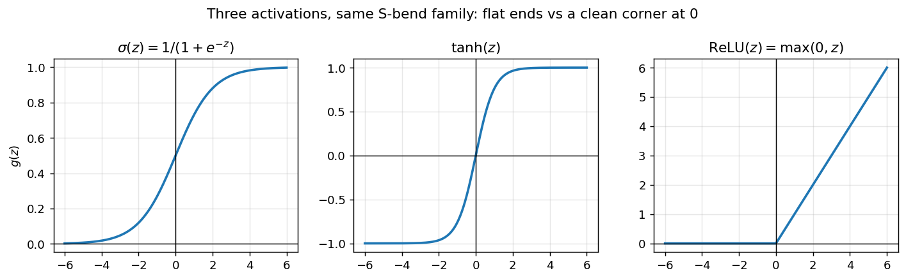
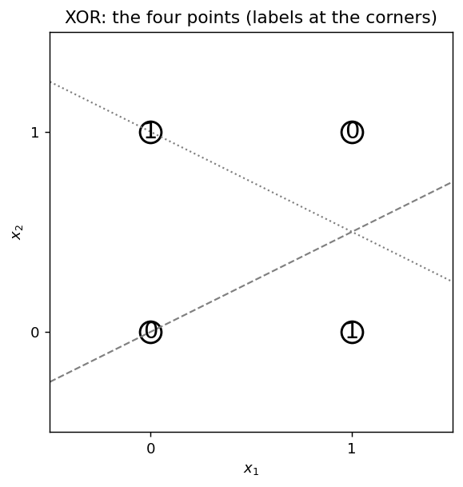

# Chapter 41: The artificial neuron and MLPs from scratch

Part VI opens here. The shape of this chapter follows the GenAI Weeks 1–2 deck ("Introduction to ANN," Balaji Srinivasan and Ganapathy Krishnamurthi), cross-checked against the MLT Week-12 ANN slides (Ashish Tendulkar) and the course's own notebooks — the XOR lab, the PyTorch fundamentals, the PyTorch workflow, and the Fashion-MNIST classifier. One idea, fully worked: **a neuron is a perceptron with a smooth activation, and an MLP is layers of such neurons trained by gradient descent.** The from-scratch code in this chapter is new numpy written for this book — every number below was re-run here and is marked **[verified-NumPy]**. Notebook numbers are transcribed from the course material and marked **[recorded]** — torch is not installed on this machine, so no PyTorch line below was executed here.

**Notation.** Per-example (the deck's, column-vector) form is $z^{[l]} = W^{[l]} a^{[l-1]} + b^{[l]}$, $a^{[l]} = g(z^{[l]})$. Batch (the MLT slides', and this book's) form is $Z^l = A^{l-1} W^l + b^l$, $A^l = g(Z^l)$, with the book's $(n, d)$ convention — points as rows (§36.1). §41.4's Note pins the two conventions to each other; mix them up and you get the transpose bug.

## 41.1 The neuron's two steps

The MLT Week-12 slide writes the whole thing in two lines (its notation, single neuron, three inputs):
$$\boxed{z = w_1 a_1 + w_2 a_2 + w_3 a_3 + b, \qquad a = g(z)}.$$
i) **Pre-activation:** combine the inputs linearly — a weighted sum plus a bias, $z = w^T a + b$.
ii) **Activation:** pass the sum through a non-linearity $g$ — $a = g(z)$.

The GenAI deck says the same thing in a bigger font: "This two-step 'Linear Sum → Non-Linear Activation' process is performed by **every single neuron** in a deep neural network."

**Def (artificial neuron).** A function of its inputs, parameterized by weights and a bias: linear combination first, smooth non-linearity second. Everything in this chapter — layers, the MLP, the forward pass — is this two-step process repeated.

**Basically, ...** "A neuron takes a bunch of numbers, multiplies each by a weight, adds them up plus a bias — that is the linear part — then bends the answer with a squashing function, the activation. Two moves, every neuron, every layer. That is the whole animal."

## 41.2 The lineage: a calculator, a learner, and a neuron

The deck tells this as three slides, and they are worth knowing because they say exactly what changed at each step:

i) **The M-P neuron (a calculator, not a learner).** "The M-P neuron was a fixed logic gate. It could compute, but it could not learn." Its two lacks, in the deck's words: **no feature importance** — "equally important features," "missing piece: weights"; **no automatic learning** — "threshold $(\theta)$ is fixed. Must be set manually."

ii) **The perceptron (a learner).** Rosenblatt's 1958 move was to *learn* the weights: $\hat y = \mathrm{sign}(w^T \phi(x))$ (§31.2). The deck's strengths list: "It Learns! An automatic learning rule adjusts weights from data. Feature Importance: learns which inputs are more important via weights. Convergence Guarantee: if data is linearly separable, it's guaranteed to find a solution." Its two limits: **the fatal flaw, linear separability only** — "only problems where a single straight line (or hyperplane) can separate the classes can be solved"; and **the harsh threshold** — "the step function activation is not differentiable, preventing modern gradient-based training."

iii) **The artificial neuron.** Take the perceptron's weighted sum, keep the learned weights, and swap the step function for a *smooth* non-linearity — sigmoid, tanh, ReLU. Logistic regression (§31.8) was already this exact object wearing a statistics costume: $h = \sigma(\theta^T x + \theta_0)$ is a neuron with a sigmoid activation.

**Basically, ...** "Three generations: the M-P neuron *computed* with hand-set weights (no learning). The perceptron *learned* the weights but could only draw straight walls, and its step function was too harsh to descend. The artificial neuron keeps the learned weighted sum, swaps in a smooth activation — and now gradient descent can train it."

## 41.3 Why smooth matters: differentiability → gradient descent

The perceptron trained by its own bespoke rule — fix mistakes one at a time (§31.4) — because its loss had a kink at the boundary (§31.3's Note: $J(w)$ is "not differentiable in $w$"). The artificial neuron's move is to make *everything* differentiable:

- The activation $g$ is smooth (or smooth enough — ReLU is smooth everywhere except a single corner, and gradient descent tolerates the corner).
- The loss is smooth (cross-entropy, squared error — §41.11).
- So the chain rule applies everywhere, gradients exist (§10.7's multivariate machinery), and Chapter 10's update $\theta := \theta - \eta \nabla J$ (§10.5) drives training.

This is why the deck's "harsh threshold" bullet is load-bearing: the *only* thing that kept the perceptron off the gradient-descent highway was a non-differentiable activation. Smooth it, and the whole machinery of Part I applies.

**Basically, ...** "Gradient descent needs a slope to walk down (§10.5). A step function has no slope — flat, then a cliff. A smooth activation has a slope everywhere, so the loss has a slope, so the gradient exists, so Chapter 10's machinery trains the network. The smoothness is the ticket onto the highway."

## 41.4 From one neuron to a layer: the two vectorized equations

One neuron at a time is "incredibly inefficient" (the deck), so a whole layer is computed at once — the vectorized form (§36.2's discipline, now paying off). The deck's two core equations, for a layer $l$:

$$\boxed{z^{[l]} = W^{[l]} a^{[l-1]} + b^{[l]}}, \qquad \boxed{a^{[l]} = g\!\left(z^{[l]}\right)}.$$

The MLT slides write the same two equations for a whole batch at once — the form the code will use:
$$\boxed{Z^l = A^{l-1} W^l + b^l}, \qquad \boxed{A^l = g(Z^l)}, \qquad A^0 = X.$$
The parts, from the slides:
i) $a^{[l-1]}$ ($A^{l-1}$): activations from the previous layer — the input vector $x$ at $l = 1$.
ii) $W^{[l]}$ ($W^l$): the weight matrix. $W_{ij}$ is the weight from neuron $j$ in layer $l-1$ to neuron $i$ in layer $l$ (deck's index order). In the batch form, $W^l$ has size $S_{l-1} \times S_l$ — each neuron in layer $l$ gets $S_{l-1}$ incoming weights, and the layer holds $S_{l-1} \times S_l$ weights total (MLT slides).
iii) $b^{[l]}$ ($b^l$): one bias per neuron — a vector of length $S_l$.
iv) $z^{[l]}$ ($Z^l$): pre-activations — the weighted sums.
v) $a^{[l]}$ ($A^l$): post-activations — $g$ applied element-wise in the hidden layers (MLT slides).

**Note (the transpose convention).** The deck's per-example form left-multiplies, $W^{[l]} a^{[l-1]}$ — its $W$ is $S_l \times S_{l-1}$. The batch/MLT/code form right-multiplies rows, $A^{l-1} W^l$ — its $W$ is $S_{l-1} \times S_l$. Same weights, transposed layout; pick the one that matches your data layout and don't mix them. Everything below uses the batch form with the book's $(n, d)$ rows (§36.1). Shapes, for a layer with $S_{l-1} = m$ inputs and $S_l$ neurons on $n$ points:
$$A^{l-1}: n \times m, \quad W^l: m \times S_l, \quad b^l: (S_l,) \text{ broadcast across the rows (§36.3)}, \quad Z^l, A^l: n \times S_l.$$

**Def (MLP).** "Simply a feedforward network with one or more hidden layers" (the deck). Information flows one direction — input to output, no loops (MLT slides). The layers are indexed $0 \le l \le L$: layer $0$ is the input, layer $L$ the output, and $L$ itself is a hyperparameter. Layer sizes: $S_0 = m$ features; $S_1, \dots, S_{L-1}$ are the hidden-layer widths — hyperparameters; $S_L = 1$ for regression, $S_L = k$ for $k$-class classification (MLT slides).

## 41.5 Worked example: one layer, every number recomputed

The deck's worked example (slide 36/93): a hidden layer with $3$ neurons receiving input from $2$ features, ReLU activation. Every number recomputed here [verified-NumPy]:

**eg 1 (the deck's 2→3 ReLU layer).**
$$x = \begin{bmatrix} 0.5 \\ 1.0 \end{bmatrix}, \quad W = \begin{bmatrix} 0.2 & 0.7 \\ -0.4 & 0.1 \\ 0.9 & -0.3 \end{bmatrix}, \quad b = \begin{bmatrix} 0.1 \\ 0.2 \\ -0.5 \end{bmatrix}.$$
Step 1 — weighted sum, $z = Wx + b$:
\begin{align*}
z_1 &= 0.2(0.5) + 0.7(1.0) + 0.1 = 0.1 + 0.7 + 0.1 = 0.9, \\
z_2 &= -0.4(0.5) + 0.1(1.0) + 0.2 = -0.2 + 0.1 + 0.2 = 0.1, \\
z_3 &= 0.9(0.5) + (-0.3)(1.0) + (-0.5) = 0.45 - 0.3 - 0.5 = -0.35.
\end{align*}
Step 2 — element-wise ReLU, $a = \max(0, z)$:
$$a = \begin{bmatrix} \max(0, 0.9) \\ \max(0, 0.1) \\ \max(0, -0.35) \end{bmatrix} = \begin{bmatrix} 0.9 \\ 0.1 \\ 0 \end{bmatrix}.$$
The third neuron fires $0$ — a negative pre-activation killed by the threshold (§36.4's `np.where` one-liner, in matrix form). The numpy re-run prints `z = [0.9  0.1 -0.35]`, `a = [0.9 0.1 0.]` — matching the slide [verified-NumPy].

**eg 2 (same layer, batch form, four points at once).** The same $W, b$ applied to four rows, $A^0 \in \mathbb{R}^{4 \times 2}$:
```python
X = np.array([[0.5, 1.0],
              [0.0, 0.0],
              [-1.0, 2.0],
              [0.5, 0.0]])          # (4, 2): four points as rows
Z = X @ W.T + b                      # (4, 2) @ (2, 3) -> (4, 3)
A = np.maximum(0, Z)
```
The row-first convention means the deck's per-example $W$ $(3 \times 2)$ gets transposed in batch code (§41.4's Note). One matrix multiply replaces four loops — and on a GPU, "computationally efficient and perfectly suited for GPUs" (the deck).

## 41.6 Why depth needs non-linearity

Two facts, in order:

**Fact 1 — stacking linear layers is useless.** "Without a non-linear activation function, a deep network simply collapses into a single linear model, no matter how many layers it has" (the deck). Two layers without activation:
$$L_2(L_1(x)) = W_2(W_1 x + b_1) + b_2 = (W_2 W_1)\, x + (W_2 b_1 + b_2) = W' x + b'.$$
Just another linear function. "A 100-layer linear network has the same power as a 1-layer network." The activation is what stops the collapse — with $g$, the composition $g(W_2\, g(W_1 x + b_1) + b_2)$ "cannot be simplified," which "allows the network to learn arbitrarily complex, 'wiggly' functions."

**Fact 2 — the perceptron's fatal flaw needs depth to fix.** The deck's MLP slide states it plainly: "A single Perceptron fails on non-linear data (like XOR)" — "cannot be separated by one line." The hidden layer is "an automatic feature engineer": "it learns to transform the data into a new representation," and "in this new space, the data becomes linearly separable." The output layer then draws the (single) straight wall in *that* space.

**Basically, ...** "Depth without the bend is a lie: a hundred linear layers fold down into one ($W'x + b'$). The activation is the ingredient that makes stacking *do* something — each bent layer re-represents the data, and the last layer separates what the earlier layers arranged."

## 41.7 Activations compared

The MLT slides' three hidden-layer activations, plus the deck's notes on when each breaks:

| $g(z)$ | Formula | Range | Why it helps | Why it hurts |
|---|---|---|---|---|
| Sigmoid | $\sigma(z) = \dfrac{1}{1 + e^{-z}}$ | $(0, 1)$ | "Firing rate" reading; probabilities out (§31.8) | **Vanishing gradients**: "flat at both ends... gradient near zero for large inputs, effectively stops learning"; not zero-centered — "outputs always positive, which can slow down learning" |
| Tanh | $\tanh(z) = \dfrac{e^{z} - e^{-z}}{e^{z} + e^{-z}}$ | $(-1, 1)$ | Zero-centered — "helps center the data for the next layer, often speeding up convergence" | Same vanishing-gradient flattening — "difficult to use in very deep networks" |
| ReLU | $\max(0, z)$ | $[0, \infty)$ | "Computationally efficient: very fast to compute (just a threshold)"; "no vanishing gradient (for $z > 0$)" — constant slope $1$ carries the signal deep; sparsity from the zeros | **Dying ReLU**: "if a neuron's weights are updated such that its pre-activation $z$ is always negative, it will always output $0$... and can never recover" |

The ReLU family fixes the dying problem with a small slope on the negative side — the deck's Leaky ReLU:
$$f(z) = \begin{cases} z, & z > 0, \\ \alpha z, & z \le 0, \end{cases} \qquad \text{($\alpha$ small, e.g. $0.01$).}$$
The deck's practical guide, verbatim in spirit: hidden layers — "start with ReLU. Most common, fastest, and usually works"; for dying neurons "switch to Leaky ReLU or Parametric ReLU"; "for Transformer-based models, consider GELU or Swish." The output layer is task-dependent (§41.11): binary classification → sigmoid; multiclass → softmax (§31.12); regression → none (linear/identity).

<!-- Original matplotlib illustration drawn for this chapter (not reused from any URL): sigmoid, tanh, ReLU curves — the flat ends that cause vanishing gradients, against ReLU's constant positive slope -->


**Basically, ...** "Sigmoid and tanh are S-bends — nice for probabilities, but their flat tails choke the gradient in deep stacks. ReLU is a corner: free slope on the right, zero on the left — fast, and the signal survives depth. Its price is neurons that can die (always negative); Leaky ReLU gives them a trickle."

## 41.8 XOR: why no linear model can do it

The deck's proof (and the XOR notebook's §2.2) — write out what a linear model must do to the four XOR corners and watch it contradict itself:

**eg 3 (the proof).** XOR: $(0,0)\!\to\!0$, $(0,1)\!\to\!1$, $(1,0)\!\to\!1$, $(1,1)\!\to\!0$. Suppose $f(x_1, x_2) = w_1 x_1 + w_2 x_2 + b$ fits all four:
\begin{align*}
f(0,0) = b &\approx 0, \\
f(0,1) = w_2 + b &\approx 1, \\
f(1,0) = w_1 + b &\approx 1, \\
f(1,1) = w_1 + w_2 + b &\approx 0.
\end{align*}
The first gives $b \approx 0$; the second then gives $w_2 \approx 1$; the third gives $w_1 \approx 1$. The fourth then demands $1 + 1 + 0 \approx 0$ — a contradiction. No straight line (hyperplane) separates the corners. The notebook adds the history: "In 1969, Minsky and Papert proved that single-layer perceptrons cannot solve XOR," and XOR became the "Hello World" of neural networks.

<!-- Original matplotlib illustration drawn for this chapter (not reused from any URL): the four XOR points with corner labels, with two candidate separating lines shown failing — each line strands a same-label pair apart -->


**Basically, ...** "Four corners of a square, opposite corners share a label. Any straight wall you draw puts a mismatched pair on the same side. Four equations, three unknowns — the fourth always contradicts. That is the whole reason hidden layers exist."

## 41.9 The 2-2-1 network, worked by hand

The course's XOR notebook builds a 2-2-1 network — 2 inputs, 2 hidden neurons, 1 output, sigmoid everywhere — and walks one full forward pass by hand for input $(1, 0)$ (target $y = 1$, since $\mathrm{XOR}(1,0) = 1$). The setup, from the notebook's code:

$$W_1 = \begin{bmatrix} 1.0 & -1.0 \\ 1.0 & -1.0 \end{bmatrix}, \quad b_1 = \begin{bmatrix} 0.0 \\ 1.0 \end{bmatrix}, \quad W_2 = \begin{bmatrix} 2.0 \\ -1.0 \end{bmatrix}, \quad b_2 = \begin{bmatrix} -1.0 \end{bmatrix}.$$

**eg 4 (one forward pass, the notebook's numbers, every step recomputed).** Input $x_1 = 1$, $x_2 = 0$. Hidden pre-activations:
$$z_{h1} = 1.0(1) + 1.0(0) + 0.0 = 1.0, \qquad z_{h2} = (-1.0)(1) + (-1.0)(0) + 1.0 = 0.0.$$
Sigmoid activations ($\sigma(1) = 1/(1 + e^{-1}) = 1/1.36788 \approx 0.7311$):
$$h_1 = \sigma(1.0) \approx 0.7311, \qquad h_2 = \sigma(0.0) = 0.5.$$
Output pre-activation and prediction:
$$z_o = 2.0(0.7311) + (-1.0)(0.5) + (-1.0) = 1.4622 - 0.5 - 1.0 = -0.0379,$$
$$\hat y = \sigma(-0.0379) = \frac{1}{1 + e^{0.0379}} \approx 0.4905.$$
Binary cross-entropy (§41.11) with $y = 1$:
$$L = -\big[1 \cdot \log(0.4905) + 0\big] = 0.7123.$$
The numpy re-run prints `z1 = [1. 0.], h1 = [0.7311 0.5], z3 = -0.0379, yhat = 0.4905, loss = 0.7123` — the notebook's $0.491$ and $0.712$ [verified-NumPy].

**Basically, ...** "This is §41.4's two equations, twice: $X \to$ hidden ($Z^1 = XW^1 + b^1$, sigmoid) $\to$ output ($Z^2 = A^1W^2 + b^2$, sigmoid). The prediction $0.4905$ is barely below a coin flip — this untrained net is guessing — and the loss $0.7123$ measures exactly how far that guess sits from the true $1$."

## 41.10 The training loop in numpy: the whole MLP, re-run

The notebook's `XORNeuralNetwork` class is the complete machine: forward (the two equations), binary cross-entropy, backward (one chain-rule step per layer — Chapter 42 derives every line), and gradient-descent weight updates (§10.5). Written here from scratch in the same shape, trained full-batch on all four XOR points, seed fixed (§36.6):

```python
import numpy as np

def sigmoid(z):
    return 1 / (1 + np.exp(-np.clip(z, -500, 500)))

class MLP221:
    def __init__(self, seed=42, scale=0.5):
        rng = np.random.default_rng(seed)
        self.W1 = rng.standard_normal((2, 2)) * scale   # S0=2 -> S1=2
        self.b1 = rng.standard_normal(2) * scale
        self.W2 = rng.standard_normal((2, 1)) * scale   # S1=2 -> S2=1
        self.b2 = rng.standard_normal(1) * scale

    def forward(self, X):
        self.z1 = X @ self.W1 + self.b1        # (4,2) @ (2,2) -> (4,2)
        self.h1 = sigmoid(self.z1)
        self.z2 = self.h1 @ self.W2 + self.b2   # (4,2) @ (2,1) -> (4,1)
        self.out = sigmoid(self.z2).ravel()
        return self.out

    def loss(self, y, yhat):
        yhat = np.clip(yhat, 1e-15, 1 - 1e-15)
        return float(-np.mean(y * np.log(yhat) + (1 - y) * np.log(1 - yhat)))

    def backward(self, X, y):                  # sigmoid + BCE: dL/dz2 = out - y
        m = X.shape[0]
        dz2 = (self.out - y).reshape(-1, 1) / m
        dW2 = self.h1.T @ dz2
        db2 = dz2.sum(axis=0)
        dh1 = dz2 @ self.W2.T
        dz1 = dh1 * self.h1 * (1 - self.h1)
        dW1 = X.T @ dz1
        db1 = dz1.sum(axis=0)
        return dW1, db1, dW2, db2

    def step(self, grads, lr):                 # theta := theta - lr * grad
        self.W1 -= lr * grads[0]; self.b1 -= lr * grads[1]
        self.W2 -= lr * grads[2]; self.b2 -= lr * grads[3]

X = np.array([[0,0],[0,1],[1,0],[1,1]], dtype=float)
y = np.array([0,1,1,0], dtype=float)
mlp = MLP221(seed=42)
for epoch in range(1000):
    pred = mlp.forward(X)
    mlp.step(mlp.backward(X, y), lr=5.0)
```

**eg 5 (the actual run — every number below is the session's own output).** The trace, epoch 0 / every 100 / last:

| epoch | loss | predictions (four corners) | accuracy |
|---|---|---|---|
| 0 | 0.693751 | [0.489 0.486 0.493 0.491] | 50% |
| 100 | 0.609766 | [0.466 0.723 0.392 0.424] | 75% |
| 200 | 0.030062 | [0.029 0.976 0.959 0.024] | 100% |
| 300 | 0.011829 | [0.011 0.99 0.984 0.01 ] | 100% |
| 999 | 0.002181 | [0.002 0.998 0.997 0.002] | 100% |

Final: `[0.0021, 0.9981, 0.9971, 0.0018]` → binary `[0, 1, 1, 0]`, loss $0.002178$ [verified-NumPy]. Three readings:
i) **Epoch 0 starts at loss $\approx 0.693$.** Not a coincidence: with untrained weights outputting $\approx 0.5$ everywhere, $-\log(0.5) = 0.6931$ — §35.6's logistic loss at margin $0$.
ii) **Epoch 100 is honest about the grind.** Accuracy says 75%, but the $(1,0)$ corner predicts $0.392$ — still below the $0.5$ wall. The network "looks close" while one corner is firmly wrong; the loss ($0.6098$, barely moved) tells the truer story.
iii) **Epoch 200 is the phase change.** Loss collapses to $0.03$ and every corner is confident — the hidden layer found the XOR representation. §31.10's warning applies at the tail: the loss keeps shrinking toward $0$ without ever reaching it, because sigmoid only saturates at $0/1$ with infinite weights — accuracy is already perfect, the weights keep inflating.

**Basically, ...** "Forward: the two equations, twice. Loss: how wrong. Backward: how each weight caused it (Chapter 42). Step: nudge every weight downhill (§10.5). Repeat 1000 times and four bent neurons solve what one straight wall never could — the loss trace shows the exact moment it clicks."

## 41.11 The output layer + loss pairing

The MLT slides make the output layer *task-dependent*: same forward equations, but the last layer's activation $g$ and the loss $L$ are chosen as a pair. The deck's practical guide agrees (sigmoid binary, softmax multiclass, linear regression). Three pairings:

**i) Regression — identity output, squared error.** Output layer: $S_L = 1$, $g(z) = z$ (the slides: "the activation function in the final layer for regression is just the identity function"), $\hat y = A^L$ an $n \times 1$ column. Loss (the slides' form):
$$\boxed{L(y, \hat y) = \tfrac{1}{2}\,(\hat y - y)^T(\hat y - y)},$$
"In Numpy: `L = 0.5 * np.sum((y_hat - y) * (y_hat - y))`" (the slides, verbatim). The $1/2$ is a convenience that cancels the derivative's $2$.

**ii) Binary classification — sigmoid output, cross-entropy.** $S_L = 1$, $g = \sigma$ (§31.8), loss the NLL (§31.9):
$$\boxed{L_{\mathrm{nll}}(g, y) = -\big(y \log g + (1 - y)\log(1 - g)\big)},$$
"penalizes the model for being confident and wrong" (the deck). The worked number from §41.9's hand calculation: $g = 0.4905$, $y = 1$ → $L = -\log(0.4905) = 0.7123$ [verified-NumPy]. The cleanest fact in the chapter lives here — §31.10's derivation: for sigmoid + cross-entropy, the gradient w.r.t. the pre-activation is just
$$\boxed{\frac{\partial L}{\partial z} = g - y} \quad \text{(prediction minus truth)},$$
the $g(1-g)$ from the sigmoid's derivative canceling the denominator from the loss. This is the `dz2 = (self.out - y)` line in §41.10's `backward`.

**iii) Multiclass classification — softmax output, categorical cross-entropy.** Output layer: $S_L = k$ neurons, $g = \mathrm{softmax}$ (§31.12):
$$\mathrm{softmax}(z)_i = \frac{e^{z_i}}{\sum_{j=1}^{k} e^{z_j}}, \qquad \sum_i \hat y_i = 1,$$
so $\hat Y$ (an $n \times k$ matrix) is a probability distribution over the $k$ classes per row, and inference is $\arg\max_c \hat y^c$ (MLT slides). Labels $Y$ are one-hot, $n \times k$. The slides' matrix form:
$$\boxed{L(Y, \hat Y) = -\mathbf{1}_n^T\, (Y \odot \log \hat Y)\, \mathbf{1}_k}, \qquad \text{``In Numpy: } L = -\mathrm{np.sum}(Y * \mathrm{np.log}(Y\_hat))\text{''},$$
$\odot$ the element-wise product, $\mathbf{1}_n^T M \mathbf{1}_k$ the sum of all entries. The deck's worked example (3 classes): true cat $[1, 0, 0]$; good prediction $[0.8, 0.1, 0.1]$ → low loss; bad prediction $[0.1, 0.2, 0.7]$ → high loss. This is §35.13's landing point: "the MLT Week-12 slides close with neural networks trained by **cross-entropy loss** for classification" — the hand-annotated slide's diagram shows a network's $\mathrm{sigmoid}$ feeding "$p(y \mid x)$" into a "Cross-Entropy Loss" box — "the logistic loss of §35.6, scaled up to deep networks."

**Basically, ...** "The hidden layers are the model; the output layer is the task. Counting things: identity activation + squared error. Yes/no: sigmoid + cross-entropy. Pick-one-of-$k$: softmax + cross-entropy over the one-hot labels. And the pairings are not arbitrary — sigmoid's derivative cancels cross-entropy's, leaving prediction-minus-truth."

## 41.12 The contract survives: sklearn's `MLPClassifier` / `MLPRegressor`

The Week-12 practice-solution notebook runs both, and both honor the estimator contract of Chapters 37–38 (as §37.10(iii) and §38.11(iii) promised):

**eg 6 (classification, diabetes dataset, `Outcome` target).** Pipeline: `StandardScaler` + `MLPClassifier(hidden_layer_sizes=(10,10,10), activation='relu', solver='sgd', alpha=1e-4, learning_rate_init=0.2, max_iter=500, random_state=1)`; 80:20 split, `random_state=1`:
```python
pipe.fit(X_train, y_train)     # learn the weights
pipe.score(X_train, y_train)   # -> 0.7915309446254072  [recorded]
pipe.score(X_test, y_test)     # -> 0.7662337662337663  [recorded]
```
`hidden_layer_sizes=(10,10,10)` is three hidden layers of ten neurons each — an $S_0\!-\!10\!-\!10\!-\!10\!-\!S_3$ network in §41.4's notation; `activation='relu'` is the hidden-layer $g$; `solver='sgd'` the engine; `alpha` the L2 penalty (Chapter 28's $\lambda$); `max_iter=500` caps the epochs.

**eg 7 (regression).** Pipeline: `StandardScaler` + `MLPRegressor(hidden_layer_sizes=(50,50,50), tol=1e-2, alpha=1e-4, solver='adam', learning_rate_init=0.1, max_iter=50, random_state=1)`:
```python
pipe.score(X_train, y_train)   # -> 0.999992602958679  [recorded]  (R^2)
pipe.score(X_test, y_test)     # -> 0.9999920781245708  [recorded]  (R^2)
```
The Week-12 note on this estimator: "trains using backpropagation... uses the square error as the loss function" (§37.10(iii)) — pairing (i) of §41.11, inside the same `fit`/`predict`/`score` contract. Neither snippet ran here (sklearn is not installed) — the numbers are the notebook's printed outputs.

**Basically, ...** "sklearn's neural nets are just §41.10's class with the same three methods every estimator has had since Chapter 37: `fit` learns the weights, `predict` runs the forward pass, `score` reports the verdict. The inside is neurons; the contract is unchanged."

## 41.13 PyTorch: tensors in, the same loop out

The course's two PyTorch notebooks do one job each: *Fundamentals* — tensors as the data structure; *Workflow* — the training loop as the engine. Both transcribe here [recorded]; torch is not installed on this machine.

**Tensors** (Fundamentals notebook): "the fundamental data structure" — vectors, matrices, and higher-rank arrays, all as one type. The working vocabulary, all transcribed from the notebook:
- creation: `torch.tensor(...)`, `torch.zeros()`, `torch.ones()`, `torch.rand()`, `torch.arange()`; default dtype `float32` (a method like `.mean()` on an integer tensor errors — the notebook hits this);
- the central distinction: `*` is element-wise, `torch.matmul` / `@` is matrix multiplication — the notebook's line: "the difference between element-wise multiplication and matrix multiplication is the addition of values" (§2.10's rule, in code);
- shape tools: `reshape`, `view` (shares the underlying data — changing the view changes the original), `squeeze`/`unsqueeze`, `permute` (also a view), indexing `x[:, 0]`, `x.argmax()`;
- NumPy interop: `torch.from_numpy(array)` (keeps the `float64` dtype), and `.numpy()` back — the §36.1 world and the tensor world sharing memory.

**The MLP as an `nn.Module`** (Fashion-MNIST notebook — a 784→128→64→10 classifier, the two-core-equations of §41.4 as objects):
```python
class FashionMLP(nn.Module):                          # [recorded]
    """Architecture: 784 -> 128 -> 64 -> 10
       - Input: Flattened 28x28 images (784 features)
       - Hidden layers: ReLU activation for non-linearity
       - Output: 10 class probabilities (softmax applied in loss function)"""
    def __init__(self, input_size=784, hidden1_size=128,
                 hidden2_size=64, num_classes=10):
        super(FashionMLP, self).__init__()
        self.flatten = nn.Flatten()                     # (B,1,28,28) -> (B,784)
        self.hidden1 = nn.Linear(input_size, hidden1_size)  # 784 -> 128
        self.hidden2 = nn.Linear(hidden1_size, hidden2_size)# 128 -> 64
        self.output  = nn.Linear(hidden2_size, num_classes) # 64 -> 10
        self.relu = nn.ReLU()
        self.dropout = nn.Dropout(p=0.2)

    def forward(self, x):                                # the forward pass
        x = self.flatten(x)
        x = self.hidden1(x); x = self.relu(x); x = self.dropout(x)
        x = self.hidden2(x); x = self.relu(x); x = self.dropout(x)
        return self.output(x)                            # logits
```
`nn.Linear` *is* one row of §41.4: $Z = AW + b$ with $W, b$ as learnable parameters. The training configuration the notebook chooses: `nn.CrossEntropyLoss()` (pairing (iii) of §41.11 — "combines" softmax with the loss), Adam at `lr=0.001` with `weight_decay=1e-4` (L2, Chapter 28), 10 epochs.

**The five-step training loop** (Workflow notebook, transcribed verbatim):
```python
for epoch in range(epochs):                       # [recorded]
    model_0.train()                               # training mode
    y_pred = model_0(X_train)                     # 1. forward pass
    loss = loss_fn(y_pred, y_train)               # 2. loss
    optimizer.zero_grad()                         # 3. zero accumulated grads
    loss.backward()                               # 4. backprop (chain rule)
    optimizer.step()                              # 5. theta := theta - lr*grad
```
Each step maps onto this chapter's machine: 1 = §41.4's two equations; 2 = §41.11's loss; 3–4 = the chain rule (Chapter 42 — §41.10's `backward`, automated); 5 = §10.5's update (the perceptron's era ended, gradient descent is the engine now). The workflow notebook also keeps §40.4's discipline: train and test phases are *separate* — "assesses model performance on test data without parameter updates... prevents information leakage" — and ends with `state_dict()` save/load, the learned weights as a portable artifact.

**Basically, ...** "PyTorch changes the notation, not the machine. A tensor is an ndarray that knows about gradients (§36.1's world, extended). `nn.Linear` is §41.4's layer as an object. The training loop is §41.10's loop with the backward step automated. If you understand the numpy version, the PyTorch version is just the same five steps wearing nicer syntax."

## 41.14 Four traps worth knowing (the course's own warnings)

**i) Zero-init symmetry.** "Why did we not initialize all parameters to zero?" (MLT slides). Because "since the incoming weights are the same for all neurons in a layer, there is nothing to differentiate between two neurons. This symmetry means that they will evolve identically and will not learn different things." So: "setting all weights to a constant value, especially 0, is a bad idea for neural networks" — the slides sample $\theta \sim \mathcal{N}(0, 1)$ (the MLP class in §41.10 seeds $\mathcal{N}(0, 0.5^2)$ for the same reason; §36.6 on seeding).

**ii) Parameter count → overfitting.** The MLT slides' MNIST example, $784 \to 50 \to 10$: weights $784 \cdot 50 = 39{,}200$ plus $50$ biases plus $50 \cdot 10 = 500$ plus $10$ — "number of parameters = $(39200 + 50) + (500 + 10) = 39{,}760$" (the slides' arithmetic, rechecked). "With just 1 hidden layer, we have a model with nearly 40,000 parameters... Neural networks are thus prone to overfitting." The slides' two fixes: L1/L2 regularization and **dropout** — "in each iteration of GD, randomly choose half the neurons in the hidden layer and 'drop' them 'out' of the network... at inference, use the full network, but halve the outgoing weights." The slides' distinction: "L1/L2 regularization: modifies the loss function. Dropout: modifies the network."

**iii) The loss is not the 0/1 you care about.** Chapter 35's trade (§35.9) rides along: cross-entropy and squared error are *surrogates* — smooth stand-ins optimized so that the true objective (accuracy, the 0/1 loss of §35.1) comes along for the ride.

**iv) Local minima, and why nobody panics.** The hand-annotated Week-12 slide's bottom line, quoted whole: the network "converges to **local minima**" — but "typically works very well in practice, especially for unstructured data." §10.9's promises stand: gradient descent walks downhill; nobody guarantees the bottom of the whole landscape.

## 41.15 Where this goes next

i) **Backpropagation, end to end (Chapter 42).** The one piece this chapter borrowed without deriving: §41.10's `backward` — how $\partial L/\partial z$ flows from the output layer back through every weight. The course's XOR notebook hand-computes the full backward pass for the same 2-2-1 net (§41.9's numbers: $\partial L/\partial z_3 = -0.509$, hidden deltas $-0.200$ and $0.127$, one weight update at $\alpha = 0.1$); the GenAI deck derives it generally on a computational graph ("any mathematical expression can be decomposed into a graph of basic operations"). Chapter 42 is both, fully worked.

ii) **Initialization and optimization (Chapter 43).** §41.14(i)'s symmetry trap is the entry point: *how* to sample the initial weights, why scale matters for deep stacks, and the optimizers (SGD variants, Adam) the notebooks already name.

iii) **The Part VI arc.** CNNs, RNNs, attention (Chapters 44–46) keep §41.4's two equations and change what a "layer" computes; the debugging discipline of Chapter 40 rides along whole — "debugging a neural net starts with the same playbook: shapes first, then scale, then shuffle, then the leak audit" (§40.5(i)).

## Problem set

1. **Neuron arithmetic.** A neuron takes $a = (2, -1, 0.5)$, $w = (0.4, 0.8, -0.6)$, $b = 0.1$. (i) Compute the pre-activation $z$. (ii) Compute the post-activation for $g = \sigma$ (to 3 s.f.) and for $g = \mathrm{ReLU}$. (iii) Which activation would the deck's §41.7 guide recommend if this neuron lived in a hidden layer, and why in one line?
2. **Layer shapes.** An MLP has layer sizes $S = [4, 6, 6, 3]$ (input $m = 4$, two hidden layers, $k = 3$ output) and a batch of $n = 32$ points. (i) Give the shape of each $W^l$ and $b^l$ in the batch convention ($Z^l = A^{l-1}W^l + b^l$). (ii) Count the total parameters (weights + biases); recheck against the MLT slides' $784\!-\!50\!-\!10$ arithmetic ($39{,}760$). (iii) Write the shape chain for $Z^2$ and $A^2$ explicitly.
3. **The transpose convention.** The deck's per-example slide gives $x = [0.5, 1.0]^T$, $W = \begin{bmatrix} 0.2 & 0.7 \\ -0.4 & 0.1 \\ 0.9 & -0.3 \end{bmatrix}$, and computes $z = Wx + b$. (i) Explain in one line why batch code uses `Z = X @ W.T + b` instead of `X @ W + b` for this $W$. (ii) For the batch form, give $W$'s shape and the row of $Z$ corresponding to $x = (0.5, 1.0)$. (iii) Name the debugging chapter-section this convention clash would violate if read backwards.
4. **XOR proof, re-derived.** (i) Reproduce §41.8's contradiction for a linear model $f(x_1,x_2) = w_1x_1 + w_2x_2 + b$ on the four XOR corners. (ii) In two lines, explain why this proof also kills any *stacked* linear network (use §41.6's collapse). (iii) Give one sentence saying what the hidden layer must do so the output layer can succeed (the deck's "automatic feature engineer" line).
5. **A new ReLU layer.** $x = (1, -2)$, $W = \begin{bmatrix} 0.5 & -0.5 \\ 1.0 & 2.0 \\ -1.0 & 0.25 \end{bmatrix}$, $b = (0, 0.5, -1)$. (i) Compute $z = Wx + b$ by hand. (ii) Apply ReLU element-wise. (iii) Which neurons fired, which died, and what does the dying one contribute to the next layer?
6. **Loss pairing.** (i) Binary case: prediction $g = 0.2$, true $y = 1$ — compute the cross-entropy loss; then compute it again for $g = 0.8$ and compare. (ii) Multiclass case: $Y = [0, 1, 0]$, $\hat Y = [0.2, 0.7, 0.1]$ — compute the categorical cross-entropy. (iii) Regression case: $y = (1, 2, 3)$, $\hat y = (1.5, 2.5, 2)$ — compute the slides' $L = \tfrac12 (\hat y - y)^T(\hat y - y)$.
7. **The $(g-y)$ simplification.** (i) For sigmoid output + cross-entropy, verify $\partial L/\partial z = g - y$ numerically at $g = 0.4905$, $y = 1$ using §31.10's two-step chain ($\partial L/\partial g$ then $dg/dz$). (ii) In the §41.10 class, point at the exact line this simplification produces. (iii) In one line, say what Chapter 42 must derive when the hidden layer's $g$ is *not* paired with its loss.
8. **Map the two loops.** (i) Match each of the PyTorch workflow's five steps (forward, loss, `zero_grad`, `backward`, `step`) to a method or line in §41.10's numpy class. (ii) Which step does the notebook's version do *by hand* that PyTorch automates? (iii) The workflow notebook runs the test phase without parameter updates — name the §40.4 suspect this discipline prevents.
9. **Zero-init symmetry.** Two hidden neurons start with *identical* incoming weights and bias. (i) In two lines, show their pre-activations stay equal for the same input, so their outputs and gradient updates stay equal forever. (ii) State the fix the MLT slides prescribe (distribution and one-line reason). (iii) §41.10's class uses `rng.standard_normal((2,2)) * 0.5` — name the two choices (distribution, seed) and what each buys.
10. **The sklearn face.** (i) Read eg 6's constructor: what do `hidden_layer_sizes`, `activation`, `solver`, `alpha`, `max_iter` each mean, in §41.4/§41.7/Chapter 28 terms? (ii) eg 7's `score` returns $R^2$ — which §41.11 pairing does this estimator use, and how do you know from the Week-12 note? (iii) In one line each: what do `fit`, `predict`, and `score` compute for `MLPClassifier`?
