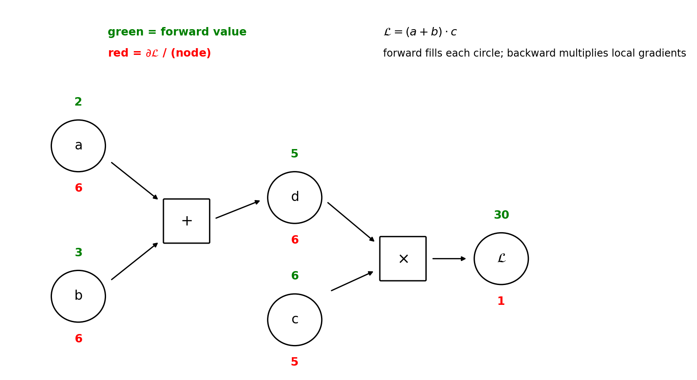

# Chapter 42: Backpropagation, worked end-to-end

Part VI continues. This chapter derives the one piece Chapter 41 borrowed without proof: §41.10's `backward` — how $\partial L/\partial W$ and $\partial L/\partial b$ for *every* weight and bias are computed by flowing one error signal backwards through the network. The shape follows the GenAI Weeks 1–2 deck ("Introduction to ANN," Balaji Srinivasan and Ganapathy Krishnamurthi, slides 59–70) — the general derivation on a computational graph ("any mathematical expression can be decomposed into a graph of basic operations") — and the course's XOR notebook (cells 17–18), which hand-computes the full backward pass for the same 2-2-1 net of §41.9. Cross-checked against the MLT Week-12 ANN slides, which name backprop as the trainer but add no new derivation. One idea, fully worked: **backpropagation is the multivariate chain rule (§9.7) applied to the forward computation graph — one backward sweep yields every parameter's gradient.** Every number below was re-run here in numpy and is marked **[verified-NumPy]**; deck and notebook numbers are transcriptions, marked **[recorded]**.

**Notation.** The deck derives in per-example (column-vector) form, $z^{[l]} = W^{[l]} a^{[l-1]} + b^{[l]}$; this book computes in batch form, $Z^l = A^{l-1} W^l + b^l$ (§41.4's Note — the deck's $W^{[l]}$ is the book's $(W^l)^T$). Both forms appear below, pinned to each other at each step; mix them up and you get the transpose bug.

## 42.1 The question backprop answers

Gradient descent (§10.5, §10.7) needs one number per parameter:
$$\theta := \theta - \eta \frac{\partial L}{\partial \theta} \qquad \text{for every weight and bias.}$$
The forward pass gives $L$; the update needs the *gradient* of $L$ — how much each weight *caused* the loss. With $39{,}760$ parameters (§41.14(ii)), you cannot afford to guess each one separately.

**Def (credit assignment).** Determining, for every weight and bias, how much of the final loss it caused — the sign and size of $\partial L/\partial\theta$ for each parameter. The deck poses it as the chain-rule question: "How does a small change in an early parameter ($w_1$) affect the final loss ($L$) at the end of a long chain of computations?" — and answers: "The Chain Rule provides the answer by multiplying local derivatives."

**Basically, ...** "The network made an error — now who is to blame? Backprop is the blame-assigner: it walks the error signal backwards from the output, asking each layer 'how much of this loss passed through you?', until every weight knows its share of the blame. The tool is the multivariate chain rule (§9.7) — the machinery Chapter 10 assumed."

## 42.2 The computational graph: any expression is a graph of basic ops

The deck's general setup (slides 62–63), in its own words:
- "Any mathematical expression can be decomposed into a graph of basic operations. This makes the flow of derivatives explicit."
- Two passes of automatic differentiation:
  i) **Forward pass:** "We start with input values $(a, b, c)$ and compute the values of all nodes, flowing from left to right, until we get the final output $L$." Every intermediate value is *cached*.
  ii) **Backward pass (backpropagation):** "We start from the end with the gradient $\partial L/\partial L = 1$. We then go backwards (right to left), using the chain rule at each node to compute the gradient of $L$ with respect to every input of that node."
- The slide's rule of thumb: each node's incoming gradient is multiplied by the node's *local* gradient (how the node's output changes w.r.t. each input).

**eg 1 (the deck's scalar example, slides 64–65).** $\mathcal{L} = (a + b) \cdot c$, inputs $a = 2$, $b = 3$, $c = 6$. Break it down: $d = a + b$, $\mathcal{L} = d \cdot c$.

Forward (green):
$$d = a + b = 2 + 3 = 5, \qquad \mathcal{L} = d \cdot c = 5 \cdot 6 = 30.$$
Backward (red), starting $\partial\mathcal{L}/\partial\mathcal{L} = 1$:
\begin{align*}
\frac{\partial \mathcal{L}}{\partial c} &= \frac{\partial \mathcal{L}}{\partial \mathcal{L}} \cdot \frac{\partial \mathcal{L}}{\partial c} = 1 \cdot d = 5, \\
\frac{\partial \mathcal{L}}{\partial d} &= \frac{\partial \mathcal{L}}{\partial \mathcal{L}} \cdot \frac{\partial \mathcal{L}}{\partial d} = 1 \cdot c = 6, \\
\frac{\partial \mathcal{L}}{\partial b} &= \frac{\partial \mathcal{L}}{\partial d} \cdot \frac{\partial d}{\partial b} = 6 \cdot 1 = 6, \\
\frac{\partial \mathcal{L}}{\partial a} &= \frac{\partial \mathcal{L}}{\partial d} \cdot \frac{\partial d}{\partial a} = 6 \cdot 1 = 6.
\end{align*}
The slide's summary table ("Spreadsheet Visualization"): forward values $a=2$, $b=3$, $c=6$, $d=5$, $\mathcal{L}=30$; local gradients $\partial d/\partial a = \partial d/\partial b = 1$, $\partial\mathcal{L}/\partial d = c = 6$, $\partial\mathcal{L}/\partial c = d = 5$ [recorded].

<!-- Original figure drawn for this chapter (not reused from any URL): computational graph of L=(a+b)*c with forward values in green and backward gradients in red, after the deck's slide 64 -->


**Note (deck typo, fixed here).** The slide's forward-pass bullet reads "$\mathcal{L} = d \cdot c = 5 \cdot 4 = 30$." Since $c = 6$, this should be $5 \cdot 6 = 30$ (and $5 \cdot 4 \ne 30$ anyway). The numbers used above and in the figure are the corrected ones; the derivation and all gradients are unaffected.

**Basically, ...** "Write any formula as a chain of tiny steps. Forward: fill in each step's value, left to right, and remember them. Backward: start at the end with 'the loss changes 1-per-1 with itself' and walk right to left, multiplying each step's *local* slope. Every node's gradient is just (gradient from downstream) × (local slope) — four multiplications and all four gradients are done."

## 42.3 The 2-2-1 backward pass, every number by hand

The notebook's §4.3 (cell 17) runs the same two-pass idea on the 2-2-1 XOR net, input $(1, 0)$, target $y = 1$. The forward values it inherits from §41.9 (recomputed here [verified-NumPy]):
$$z_1 = [1.0,\ 0.0], \quad h_1 = [0.73105858,\ 0.5], \quad z_3 = -0.0379, \quad \hat y = 0.4905, \quad L = 0.7123.$$
The notebook's weight names map to the batch layout ($W_1[i,j]$ = weight from input $i$ to hidden neuron $j$):

| hand-calc name | book matrix entry | value |
|---|---|---|
| $w_{11}, w_{12}$ | $W_1[0,0], W_1[0,1]$ (from $x_1$ to $h_1, h_2$) | $1.0,\ -1.0$ |
| $w_{21}, w_{22}$ | $W_1[1,0], W_1[1,1]$ (from $x_2$ to $h_1, h_2$) | $1.0,\ -1.0$ |
| $b_1, b_2$ | $b_1[0], b_1[1]$ | $0.0,\ 1.0$ |
| $w_{31}, w_{32}$ | $W_2[0,0], W_2[1,0]$ (from $h_1, h_2$ to output) | $2.0,\ -1.0$ |
| $b_3$ | $b_2[0]$ | $-1.0$ |

**eg 2 (the notebook's backward pass, re-derived with exact arithmetic).**

Step 1 — output layer. Loss $L = -[y \log\hat y + (1-y)\log(1-\hat y)]$:
$$\frac{\partial L}{\partial \hat y} = -\frac{y}{\hat y} + \frac{1 - y}{1 - \hat y} = -\frac{1}{0.4905} = -2.0387,$$
$$\frac{\partial \hat y}{\partial z_3} = \hat y(1 - \hat y) = 0.4905 \times 0.5095 = 0.2499,$$
$$\frac{\partial L}{\partial z_3} = (-2.0387)(0.2499) = -0.5095.$$
The notebook prints $-2.037$ for $\partial L/\partial\hat y$ — a rounding artifact of writing $\hat y$ as $0.491$ first; the exact value is $-1/0.4905 = -2.0387$. The simplification, exact to all shown digits:
$$\boxed{\frac{\partial L}{\partial z_3} = \hat y - y = 0.4905 - 1 = -0.5095}$$
(the sigmoid's $\hat y(1-\hat y)$ cancels the loss's denominator — §41.11(ii), §31.10). Output-layer parameter gradients (local gradient = the incoming activation):
$$\frac{\partial L}{\partial w_{31}} = (-0.5095)(0.7311) = -0.3725, \qquad \frac{\partial L}{\partial w_{32}} = (-0.5095)(0.5) = -0.2547, \qquad \frac{\partial L}{\partial b_3} = -0.5095.$$

Step 2 — hidden layer. Push the error back through $W_2$ (local gradient = the weight on each path):
$$\frac{\partial L}{\partial h_1} = (-0.5095)(2.0) = -1.0189, \qquad \frac{\partial L}{\partial h_2} = (-0.5095)(-1.0) = 0.5095.$$
Through the sigmoid (local gradient $h(1-h)$):
$$\frac{\partial h_1}{\partial z_1} = 0.7311 \times 0.2689 = 0.1966, \qquad \frac{\partial h_2}{\partial z_2} = 0.5 \times 0.5 = 0.25.$$
The hidden deltas:
$$\boxed{\frac{\partial L}{\partial z_1} = (-1.0189)(0.1966) = -0.2003, \qquad \frac{\partial L}{\partial z_2} = (0.5095)(0.25) = 0.1274.}$$
Hidden-layer parameter gradients (local gradient = the input on each path; $x_2 = 0$):
$$\frac{\partial L}{\partial w_{11}} = (-0.2003)(1) = -0.2003, \quad \frac{\partial L}{\partial w_{12}} = (0.1274)(1) = 0.1274,$$
$$\frac{\partial L}{\partial w_{21}} = (-0.2003)(0) = 0, \quad \frac{\partial L}{\partial w_{22}} = (0.1274)(0) = 0,$$
$$\frac{\partial L}{\partial b_1} = -0.2003, \quad \frac{\partial L}{\partial b_2} = 0.1274.$$
Every rounded value matches the notebook's hand calc ($-0.509$, $-0.200$, $0.127$) [verified-NumPy].

Step 3 — one gradient-descent update at $\alpha = 0.1$ (§10.5: $\theta := \theta - \alpha\,\partial L/\partial\theta$):
\begin{align*}
w_{31} &= 2.0 - 0.1(-0.3725) = 2.0372, & w_{32} &= -1.0 - 0.1(-0.2547) = -0.9745, \\
b_3 &= -1.0 - 0.1(-0.5095) = -0.9491, \\
w_{11} &= 1.0 - 0.1(-0.2003) = 1.0200, & w_{12} &= -1.0 - 0.1(0.1274) = -1.0127, \\
w_{21} &= 1.0 - 0.1(0) = 1.0, & w_{22} &= -1.0 - 0.1(0) = -1.0, \\
b_1 &= 0.0 - 0.1(-0.2003) = 0.0200, & b_2 &= 1.0 - 0.1(0.1274) = 0.9873.
\end{align*}

**Note.** $w_{21}$ and $w_{22}$ do not move: their input $x_2 = 0$, so the chain dies at the local gradient $\partial z/\partial w = x_2 = 0$. This is the credit-assignment logic made visible — a weight whose input is silent gets no blame, because changing it would not have changed $z$ (and the notebook's cell 18 draws the same conclusion: "Zero gradients → no change needed").

**Basically, ...** "The error at the output is $-0.509$ (prediction below truth). It flows back: multiplied by the outgoing weights it becomes hidden errors $-1.0189$ and $0.5095$; multiplied by each sigmoid's local slope it becomes hidden deltas $-0.2003$ and $0.1274$; multiplied by the inputs it becomes each weight's gradient. Every step is (upstream error) × (local slope) — the §42.2 rule, nine times. Then subtract $\alpha$ times each gradient."

## 42.4 The general layer-wise rules (the deck's derivation)

The deck (slides 66–70) derives the update rules for layer $l$ in per-example form. It decomposes each weight's gradient into three components:

$$\underbrace{\frac{\partial L}{\partial W^{[l]}}}_{\text{our goal}} = \underbrace{\frac{\partial L}{\partial a^{[l]}}}_{\text{1. upstream}} \cdot \underbrace{\frac{\partial a^{[l]}}{\partial z^{[l]}}}_{\text{2. activation}} \cdot \underbrace{\frac{\partial z^{[l]}}{\partial W^{[l]}}}_{\text{3. local}}$$
i) **Upstream gradient** $\partial L/\partial a^{[l]}$: "How the final loss changes with this layer's output. This is passed back from layer $l + 1$."
ii) **Activation gradient** $\partial a^{[l]}/\partial z^{[l]} = g'(z^{[l]})$: "The derivative of the activation function."
iii) **Local gradient** $\partial z^{[l]}/\partial W^{[l]}$: "How this layer's pre-activation changes with its weights."

**Step 1 — the error term $\delta$.** The deck defines
$$\boxed{\delta^{[l]} = \frac{\partial L}{\partial z^{[l]}}},$$
"which represents how the loss changes with respect to the pre-activation of layer $l$." Combining (i) and (ii):
$$\delta^{[l]} = \frac{\partial L}{\partial a^{[l]}} \odot g'(z^{[l]}), \qquad \text{where } \frac{\partial L}{\partial a^{[l]}} = (W^{[l+1]})^T \delta^{[l+1]}.$$
The core recursion (the slide's boxed line):
$$\boxed{\delta^{[l]} = \big((W^{[l+1]})^T \delta^{[l+1]}\big) \odot g'(z^{[l]})}.$$
"For the output layer $L$, this is simpler: $\delta^{[L]} = \nabla_{a^{[L]}} L \odot g'(z^{[L]})$."

**Step 2 — the parameter gradients.** "Once we have the error $\delta^{[l]}$ for a layer, finding the gradients for its parameters is straightforward":
$$\boxed{\frac{\partial L}{\partial W^{[l]}} = \delta^{[l]} (a^{[l-1]})^T}, \qquad \boxed{\frac{\partial L}{\partial b^{[l]}} = \delta^{[l]}}.$$

**The same rules in this book's batch form** ($Z^l = A^{l-1} W^l + b^l$, $A^l = g(Z^l)$, mean loss $L = \frac1m \sum_i L_i$). Write $\Delta^l$ for the batch error signal, one row per example: $\Delta^l_i = \frac1m\,\partial L_i/\partial z^l_i$. Then:
$$\boxed{\Delta^l = \big(\Delta^{l+1} (W^{l+1})^T\big) \odot g'(Z^l)}, \qquad \boxed{\frac{\partial L}{\partial W^l} = (A^{l-1})^T \Delta^l}, \qquad \boxed{\frac{\partial L}{\partial b^l} = \sum_{\text{rows}} \Delta^l}.$$
The shapes: $\Delta^{l+1}$ is $n \times S_{l+1}$, $(W^{l+1})^T$ is $S_{l+1} \times S_l$ — the product fans the error back onto the $S_l$ neurons of layer $l$ (§2.10's rule: the transpose is doing the "push the error backwards through the weights" job); $(A^{l-1})^T \Delta^l$ is $S_{l-1} \times S_l$ — the shape of $W^l$ (§41.4).

**Line-by-line map to §41.10's `backward`.** The numpy class is the batch-form rules above, written out:

| `backward` line | the rule it is |
|---|---|
| `dz2 = (self.out - y).reshape(-1, 1) / m` | $\Delta^2$: output-layer error, §42.5's $(\hat y - y)/m$ pairing |
| `dW2 = self.h1.T @ dz2` | $\partial L/\partial W^2 = (A^1)^T \Delta^2$ |
| `db2 = dz2.sum(axis=0)` | $\partial L/\partial b^2$: row sum of $\Delta^2$ (= row mean of per-example $\delta$'s, since $dz2$ already carries $1/m$) |
| `dh1 = dz2 @ self.W2.T` | upstream: $\partial L/\partial A^1 = \Delta^2 (W^2)^T$ |
| `dz1 = dh1 * self.h1 * (1 - self.h1)` | $\Delta^1 = \text{upstream} \odot g'(Z^1)$, $g' = \sigma(1-\sigma)$ |
| `dW1 = X.T @ dz1` | $\partial L/\partial W^1 = (A^0)^T \Delta^1$ |
| `db1 = dz1.sum(axis=0)` | $\partial L/\partial b^1$: row sum |

The notebook's own `backward` (cell 11) differs only in style: it divides by $m$ once at the `dW`/`db` lines (`np.dot(self.h1.T, dL_dz2) / m`, `np.mean(dL_dz2, axis=0)`) instead of at the $\Delta$ line — same gradients, mean loss both ways [recorded].

**Basically, ...** "Every layer does the same three-move dance: 1) take the error passed back from the layer above, push it through this layer's *weights* (transpose — that is the 'backwards through the weights' move); 2) multiply element-wise by the *activation's* local slope $g'(z)$ — that is $\delta$, the layer's error; 3) get the parameter gradients by outer-producting $\delta$ with the layer's *inputs* ($\delta \times$ input for weights, $\delta$ alone for biases). Repeat for every layer. The whole `backward` method is these three moves, twice."

## 42.5 The output-layer special case: the pairing cancellation

The output layer needs no push-through-weights step — its upstream gradient is the loss's own derivative, $\nabla_{a^{[L]}} L$. And for the two classification pairings of §41.11, that derivative times the activation's slope collapses to prediction-minus-truth:

**i) Sigmoid + binary cross-entropy (§41.11(ii)).** $\hat y = \sigma(z)$:
$$\frac{\partial L}{\partial z} = \frac{\partial L}{\partial \hat y} \cdot \frac{\partial \hat y}{\partial z} = \left(-\frac{y}{\hat y} + \frac{1-y}{1-\hat y}\right)\big(\hat y(1-\hat y)\big) = \boxed{\hat y - y}.$$
The notebook's cell-17 note: "For binary cross-entropy + sigmoid: $\partial L/\partial z_3 = \hat y - y$." Numerically at the §42.3 values: $-2.0387 \times 0.2499 = -0.5095$ both ways [verified-NumPy]. For mean loss over $m$ points, each row's $\delta$ carries $1/m$: $\Delta^2_i = (\hat y_i - y_i)/m$ — verified numerically against finite differences (max difference $5.0 \times 10^{-10}$) [verified-NumPy].

**ii) Softmax + categorical cross-entropy (§41.11(iii)).** $\hat y_i = e^{z_i}/\sum_j e^{z_j}$, one-hot $y$, $L = -\sum_k y_k \log \hat y_k$:
$$\frac{\partial \hat y_i}{\partial z_j} = \hat y_i(\delta_{ij} - \hat y_j), \quad \text{so} \quad \frac{\partial L}{\partial z_j} = -\sum_k y_k (\delta_{kj} - \hat y_j) = \boxed{\hat y_j - y_j},$$
using $\sum_k y_k = 1$. Verified numerically on a 4-class example: finite-difference $\partial L/\partial z$ matches $\hat y - y$ to $1.2 \times 10^{-9}$ [verified-NumPy]. The same "prediction minus truth" — this is why the pairings of §41.11 are chosen together: the activation's derivative cancels the loss's.

**iii) Identity + squared error (§41.11(i)).** $g(z) = z$, $L = \tfrac12(\hat y - y)^2$ per example:
$$\frac{\partial L}{\partial z} = \boxed{\hat y - y},$$
the $\tfrac12$ being the convenience that cancels the squared derivative. No cancellation magic needed — the identity's slope is $1$.

**Note.** Pairings (i)–(iii) all end at the same slogan, but for different reasons: in (i) and (ii) the activation's derivative *cancels* the loss's derivative; in (iii) there is no loss derivative to cancel. An unpaired activation (e.g. ReLU output with cross-entropy) gets no such shortcut — §41's problem 7 asked exactly what Chapter 42 must do there: fall back to the general $\delta^{[L]} = \nabla_{a^{[L]}} L \odot g'(z^{[L]})$.

**Basically, ...** "The last layer is special: nothing sits above it, so its error signal comes straight from the loss. And when the loss and the activation are chosen as a pair (the §41.11 pairings), their derivatives cancel into the simplest possible error: prediction minus truth. That is why `backward` opens with `dz2 = (out - y)` — the whole loss-and-sigmoid derivative collapsed into a subtraction."

## 42.6 Gradient checking: trust, then verify

Backprop is a long chain of multiplications — one sign error, one missing transpose, and every gradient is wrong while the code runs without complaint. The fix predates deep learning: compare the analytic gradients against a *finite-difference* approximation (§8.3's derivative-as-limit),
$$\frac{\partial L}{\partial \theta_j} \approx \frac{L(\theta + \varepsilon e_j) - L(\theta - \varepsilon e_j)}{2\varepsilon}, \qquad \varepsilon = 10^{-7},$$
which needs no derivation — only forward passes.

**eg 3 (gradient check on the §42.3 hand-calc net, all 9 parameters).** Analytic gradients from §42.3 vs. centered finite differences:
```
analytic:  [-0.200336,  0.127367,  0.0,  0.0, -0.200336,  0.127367,
            -0.372452, -0.254735, -0.509470]
fin-diff:  [-0.200336,  0.127367,  0.0,  0.0, -0.200336,  0.127367,
            -0.372452, -0.254735, -0.509470]
max |difference| = 8.18e-10
```
[verified-NumPy]. Agreement to $\sim 10^{-9}$: the hand-derived chain in §42.3 is the true gradient.

**Note.** Gradient checking is a *debugging* tool, never a training method — see §42.7 for why. And it follows §40.5(i)'s playbook: when the gradients smell wrong, check the machine on a small net with a fixed seed (§36.6) before trusting a big one.

**Basically, ...** "Don't trust a chain of nine multiplications just because it looks right. Nudge each weight by a hair, measure how the loss actually moves, and compare with what backprop claimed. If they agree to $10^{-9}$, your derivation is the truth. Check once while debugging; never during training."

## 42.7 Why one backward pass beats perturbing every weight

The finite-difference formula above *is* a gradient estimator — so why not train with it? Count the forward passes. A net with $P$ parameters:

- **Finite differences:** $2P$ forward passes per gradient (two per parameter).
- **Backpropagation:** $1$ forward pass (caching the intermediates, §42.2) + $1$ backward pass — each roughly the cost of a forward pass.

**eg 4.** The MLT slides' $784\!-\!50\!-\!10$ net: $P = 39{,}760$ (§41.14(ii)). Finite differences: $2 \times 39{,}760 = 79{,}520$ forward passes per update. Backprop: one forward, one backward. That factor of $\sim 40{,}000$ is the difference between "trains overnight" and "trains before the heat death of the universe" — and it grows with every added parameter.

**Basically, ...** "Finite differences re-run the whole network twice *per weight* to ask 'did the loss move?'. Backprop re-runs it once *backwards* and answers that question for *every* weight at the same time — because the chain rule reuses the intermediates instead of rediscovering them. That reuse is the entire trick."

## 42.8 Where this goes next

i) **Optimization for neural nets (Chapter 43).** This chapter computed the gradients; Chapter 43 decides how to *use* them — SGD variants, Adam, and why §41.14(i)'s zero-init symmetry trap is the entry point to initialization: the scale of the starting weights controls the scale of $g'(z)$ in the $\delta$ recursion, and hence whether the error signal survives the backward trip.

ii) **The vanishing-gradient reading of §42.4.** Look at the recursion: each layer multiplies the error by $g'(z^{[l]})$. For sigmoid, $g'(z) = \sigma(z)(1-\sigma(z)) \le 0.25$ — every backward step through a saturated sigmoid shrinks the error to at most a quarter (§41.7's "flat at both ends... effectively stops learning"). ReLU's $g' = 1$ for $z > 0$ is why "no vanishing gradient (for $z > 0$)" (§41.7) — the error passes through unshrunk. The activation table of §41.7 is, read backwards, a table about backprop.

iii) **PyTorch's `loss.backward()`.** The workflow notebook's step 4 (`loss.backward()`, §41.13) automates §42.4: PyTorch builds the computational graph of §42.2 during the forward pass and multiplies the local gradients for you — autograd *is* this chapter, mechanized.

iv) **The traps ride along.** §41.14's warnings now have derivations behind them: zero-init symmetry (identical weights → identical $\delta$'s → identical updates, forever), the parameter-count overfitting, and the surrogate-loss trade.

## Problem set

1. **The deck's scalar graph, re-derived.** $\mathcal{L} = (a + b) \cdot c$ with $a = 2$, $b = 3$, $c = 6$. (i) Run the forward pass and cache every node value. (ii) Run the backward pass from $\partial\mathcal{L}/\partial\mathcal{L} = 1$; give $\partial\mathcal{L}/\partial a$, $\partial\mathcal{L}/\partial b$, $\partial\mathcal{L}/\partial c$, $\partial\mathcal{L}/\partial d$ with the local gradient used at each step. (iii) Check your $\partial\mathcal{L}/\partial c$ by differentiating $\mathcal{L} = (a+b)c$ directly.
2. **The three components.** For a hidden layer $l$, the deck writes $\partial L/\partial W^{[l]} = (\partial L/\partial a^{[l]}) \cdot (\partial a^{[l]}/\partial z^{[l]}) \cdot (\partial z^{[l]}/\partial W^{[l]})$. (i) Name each factor in the deck's words. (ii) Which factor does the $\delta^{[l]}$ definition absorb, and why is that absorption useful? (iii) Write the recursion that computes $\delta^{[l]}$ from $\delta^{[l+1]}$ (per-example form).
3. **Batch-form translation.** (i) Starting from the deck's $\partial L/\partial W^{[l]} = \delta^{[l]}(a^{[l-1]})^T$ ($S_l \times S_{l-1}$ layout), derive the batch form $\partial L/\partial W^l = (A^{l-1})^T \Delta^l$, stating the shape of every factor for $n$ points. (ii) Explain in one line why the transpose appears on the *other* matrix in the batch form. (iii) For mean loss, explain why `db2 = dz2.sum(axis=0)` in §41.10 equals the row-mean of the per-example $\delta$'s even though it says `sum`.
4. **The XOR backward pass, a second example.** Take the §42.3 net and input $(0, 1)$ (target $y = 1$). (i) Forward pass: $z_1, h_1, z_3, \hat y, L$. (ii) Backward pass: $\partial L/\partial z_3$, both hidden deltas, all weight/bias gradients. (iii) Which input's weights now get zero gradient, and why?
5. **The $(g - y)$ check.** (i) Reproduce §42.5(i)'s cancellation: at $\hat y = 0.4905$, $y = 1$, compute $\partial L/\partial\hat y$ and $\partial\hat y/\partial z$ separately and show their product equals $\hat y - y$. (ii) In §41.10's `backward`, point at the exact line this produces and explain the `/ m`. (iii) Give one line for when this shortcut is *unavailable* (the §42.5 Note case).
6. **Softmax pairing.** (i) For a 3-class net with $z = (1.0, 0.0, -1.0)$, $y = [0, 1, 0]$: compute $\hat y$, $L$, and $\partial L/\partial z$ via $\hat y - y$. (ii) Verify one component with the two-step chain $\partial L/\partial\hat y_k \cdot \partial\hat y_k/\partial z_j$ (use §31.12's softmax Jacobian). (iii) In one line, say what cancels.
7. **Gradient check by hand.** A 1-1 net: $z = wx + b$, $\hat y = \sigma(z)$, BCE loss, $w = 0.5$, $b = 0.1$, $x = 2.0$, $y = 1$. (i) Compute $\partial L/\partial w$ and $\partial L/\partial b$ by backprop. (ii) Approximate both with centered finite differences at $\varepsilon = 10^{-5}$; report the agreement. (iii) In one line: what breaks in this check if you forget to clip $\hat y$ near 0 or 1?
8. **Credit where it's due.** In §42.3, $\partial L/\partial w_{21} = \partial L/\partial w_{22} = 0$ because $x_2 = 0$. (i) Give a one-line chain-rule reason. (ii) After the $\alpha = 0.1$ update, the net sees $(0, 1)$ — do $w_{21}, w_{22}$ move on *this* step? (iii) In two lines, explain what this says about which training examples teach which weights.
9. **Vanishing, read backwards.** A 5-hidden-layer sigmoid net; every hidden neuron sits at $|z| \ge 3$. (i) Bound $g'(z)$ at $|z| = 3$ ($\sigma(3) \approx 0.9526$). (ii) Bound the shrinkage of $\|\delta^{[1]}\|$ relative to $\|\delta^{[5]}\|$ through four backward steps. (iii) In two lines, connect this to §41.7's verdict on sigmoid in deep stacks and its ReLU recommendation.
10. **Map the notebook.** The XOR notebook's `backward` (cell 11) computes `dL_dz2 = dL_dy` then `dL_dW2 = np.dot(self.h1.T, dL_dz2) / m`. (i) Match each of its six gradient lines to a formula in §42.4. (ii) Explain the comment "For sigmoid, dy/dz = y(1-y), but we can simplify" in §42.5 terms. (iii) It divides by $m$ at the `dW`/`db` lines while §41.10 divides inside `dz2` — prove the two give identical gradients.

---

*Sources: GenAI "Introduction to ANN" deck (Balaji Srinivasan, Ganapathy Krishnamurthi), slides 59–70 (chain rule, computational graph, scalar hand example, MLP weight-update derivation); XOR Problem notebook, cells 14/17/18 (hand-calc weights, full backward pass, verification); MLT Week-12 ANN slides (backprop named as trainer, no new derivation); book chapters 2 (§2.10), 9 (§9.7), 10 (§10.5, §10.7), 31 (§31.10, §31.12), 36 (§36.2, §36.6), 41 (§§41.4, 41.9–41.11, 41.13, 41.14).*
